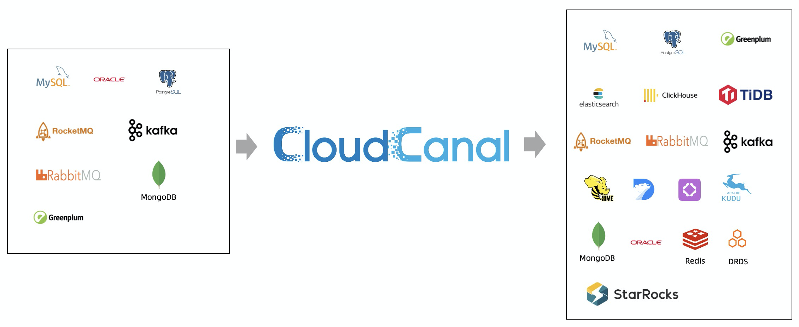
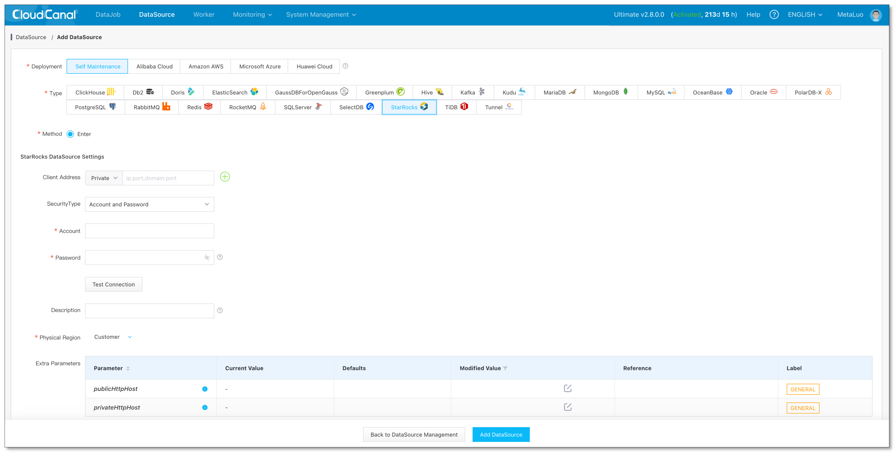
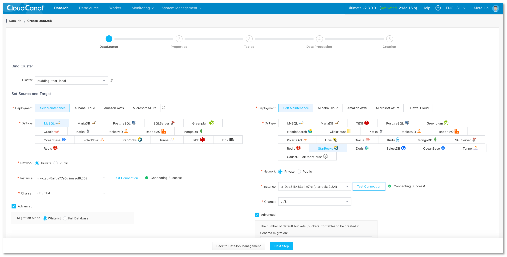
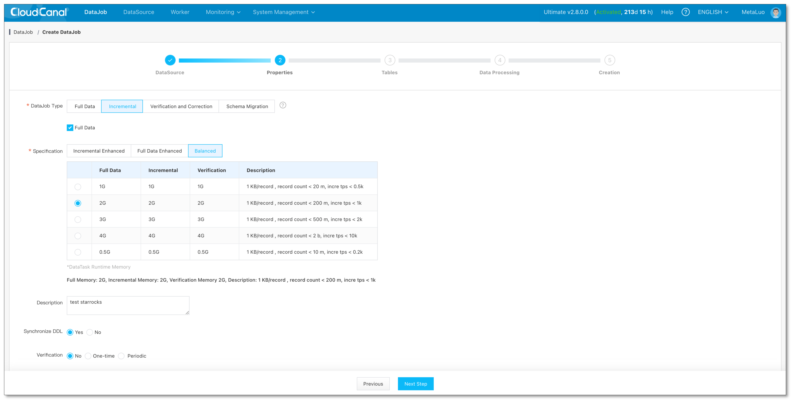
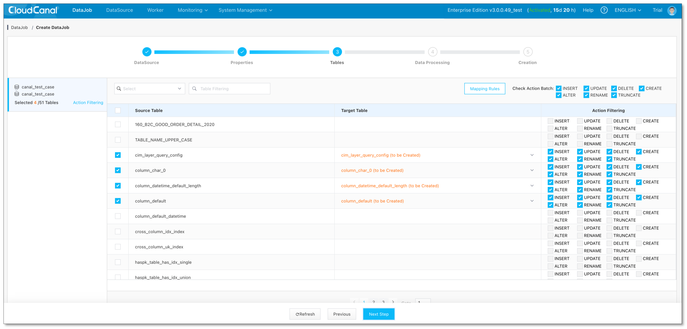
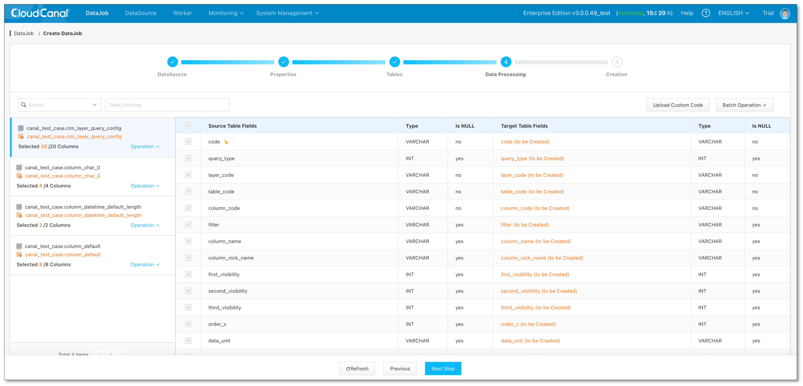
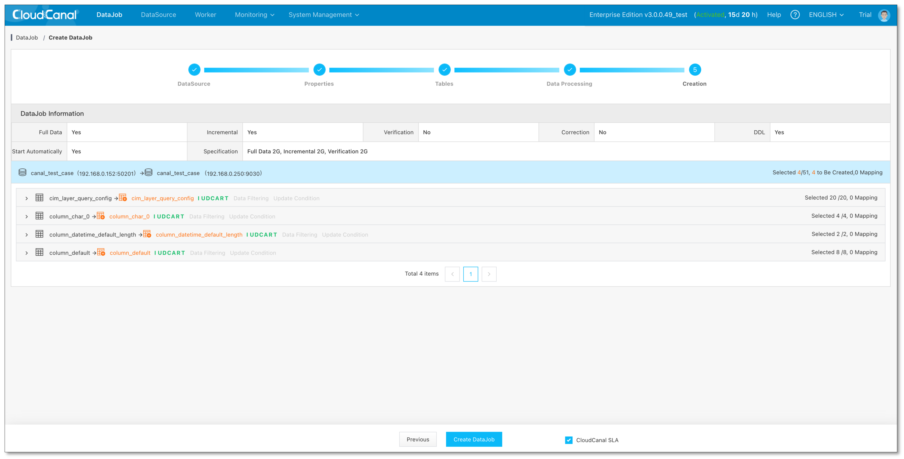

---
---

# Load data using CloudCanal

## Introduction

CloudCanal Community Edition is a free data migration and synchronization platform published by [ClouGence Co., Ltd](https://www.cloudcanalx.com) that integrates Schema Migration, Full Data Migration, verification, Correction, and real-time Incremental Synchronization.
CloudCanal help users build a modern data stack in a simple way.

## Download

[CloudCanal Download Link](https://www.cloudcanalx.com)

[CloudCanal Quick Start](https://www.cloudcanalx.com/us/cc-doc/quick/quick_start)

## Function Description

- It is highly recommended to utilize CloudCanal version 2.2.5.0 or higher for efficient data import into StarRocks.
- It is advisable to exercise control over the ingestion frequency when using CloudCanal to import **incremental data** into StarRocks. The default import frequency for writing data from CloudCanal to StarRocks can be adjusted using the `realFlushPauseSec` parameter, which is set to 10 seconds by default.
- In the current community edition with a maximum memory configuration of 2GB, if DataJobs encounter OOM exceptions or significant GC pauses, it is recommended to reduce the batch size to minimize memory usage.
  - For Full DataTask, you can adjust the `fullBatchSize` and `fullRingBufferSize` parameters.
  - For Incremental DataTask, the `increBatchSize` and `increRingBufferSize` parameters can be adjusted accordingly.
- Supported Source endpoints and features：

  | Source Endpoints \ Feature | Schema Migration | Full Data | Incremental | Verification |
    | --- | --- | --- | --- | --- |
  | Oracle                     | Yes | Yes | Yes | Yes |
  | PostgreSQL                 | Yes | Yes | Yes | Yes |
  | Greenplum                  | Yes | Yes | No | Yes |
  | MySQL                      | Yes | Yes | Yes | Yes |
  | Kafka                      | No | No | Yes | No |
  | OceanBase                  | Yes | Yes | Yes | Yes |
  | PolarDb for MySQL          | Yes | Yes | Yes | Yes |
  | Db2                        | Yes | Yes | Yes | Yes |

## Typical example

CloudCanal allows users to perform operations in a visual interface where users can seamlessly add DataSources and create DataJobs through a visual interface. This enables automated schema migration, full data migration, and real-time incremental synchronization. The following example demonstrates how to migrate and synchronize data from MySQL to StarRocks. The procedures are similar for data synchronization between other data sources and StarRocks.

### Prerequisites

First, refer to the [CloudCanal Quick Start](https://www.cloudcanalx.com/us/cc-doc/quick/quick_start) to complete the installation and deployment of the CloudCanal Community Edition.

### Add DataSource

- Log in to the CloudCanal platform
- Go to **DataSource Management** -> **Add DataSource**
- Select **StarRocks** from the options for self-built databases

> Tips:
>
> - Client Address: The address of the StarRocks server's MySQL client service port. CloudCanal primarily uses this address to query metadata information of the database tables.
>
> - HTTP Address: The HTTP address is mainly used to receive data import requests from CloudCanal.

### Create DataJob

Once the DataSource has been added successfully, you can follow these steps to create data migration and synchronization DataJob.

- Go to **DataJob Management** -> **Create DataJob** in the CloudCanal
- Select the source and target databases for the DataJob
- Click Next Step

- Choose **Incremental** and enable **Full Data**
- Select DDL Sync
- Click Next Step

- Select the source tables you want to subscribe to. Please note that the target StarRocks tables automatically after Schema Migration are Primary Key tables, so source tables without a primary key are not currently supported**

- Click Next Step

- Configure the column mapping
- Click Next Step

- Create DataJob

- Check the status of DataJob. The DataJob will automatically go through the stages of Schema Migration, Full Data, and Incremental after it has been created

