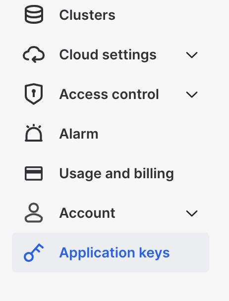

# Application keys

CelerData Cloud Private allows you to generate keys for use with the [CelerData Cloud Private API](../API/access_API.md). The CelerData Cloud Private API helps you automate processes that would otherwise be performed through the user interface.

## Create an application key

1. Sign in to the [CelerData Cloud Private console](https://cloud.celerdata.com/login), and in the left-side navigation tree choose **Application keys**.

   

2. On the **Application keys** page, click **New a secret**.

3. In the dialog box that appears, optionally enter a description, and then click **Generate now** to generate an application key.

   > **NOTE**
   >
   > To facilitate the management of your application key, we recommend that you enter a description when creating a new application key.

4. Copy the **Secret** and **Client ID** for the application key and save them to a location that you can access later.

5. Click **OK, I have copied it** to close the dialog box.

Now, you can use this new application key to access the [CelerData Cloud Private API](../API/access_API.md).

## View an application key

1. Sign in to the [CelerData Cloud Private console](https://cloud.celerdata.com/login), and in the left-side navigation tree choose **Application keys**.

2. On the **Application keys** page, view the following information about the application keys created within your account, sorted by creation time:

   | **Field**   | **Description**                                              |
   | ----------- | ------------------------------------------------------------ |
   | Description | An optional field, which is displayed only if you have specified a description when creating the application key. If you did not specify a description, the description of the key will display as **-**. |
   | Client ID   | A unique identifier generated within your CelerData cloud account to identify the application key. |
   | Created at  | The date and time at which the applicaiton key was created.  |

> **NOTE**
>
> The account currently logged in to the CelerData Cloud Private console can only view the application keys created by that account.

## Delete an application key

1. Sign in to the [CelerData Cloud Private console](https://cloud.celerdata.com/login), and in the left-side navigation tree choose **Application keys**.
2. On the **Application keys** page, find the application key you want to delete, and click the delete icon next to the **Created at** column for the key.
3. In the message that appears, click **Confirm**.

> **CAUTION**
>
> After you delete an application key, you can no longer use it to access the [CelerData Cloud Private API](../API/access_API.md).
