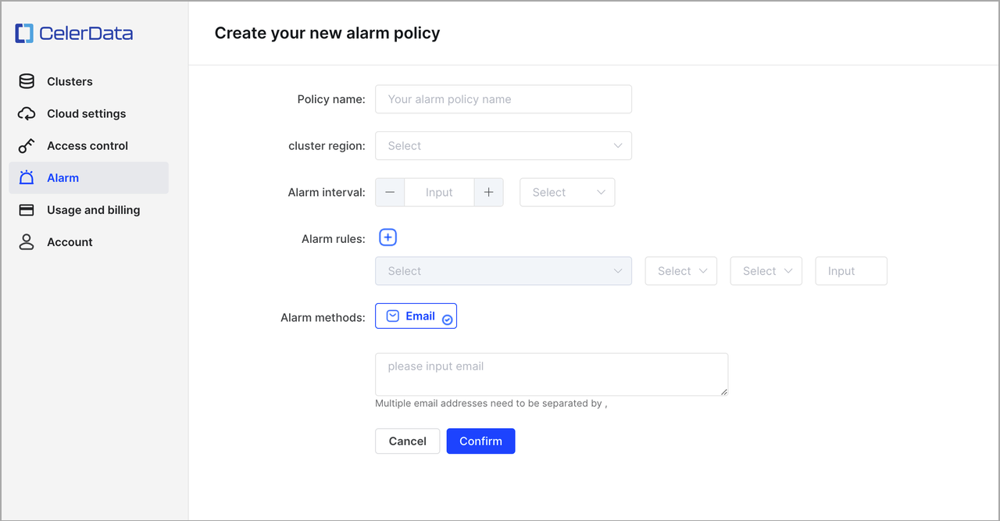
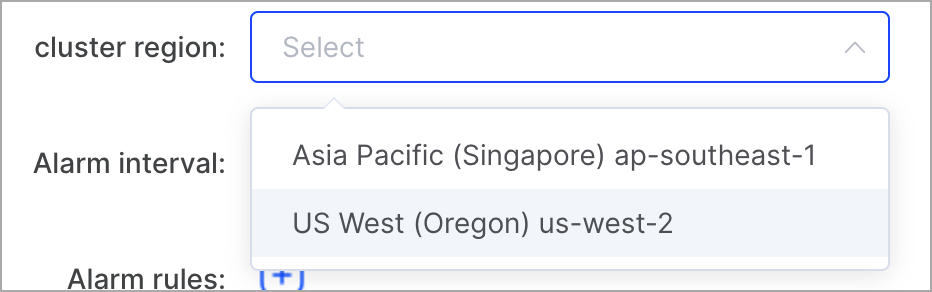
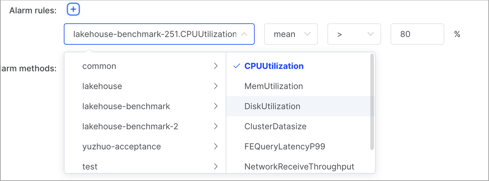
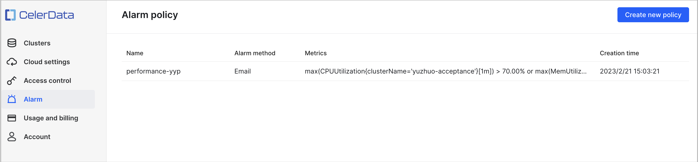
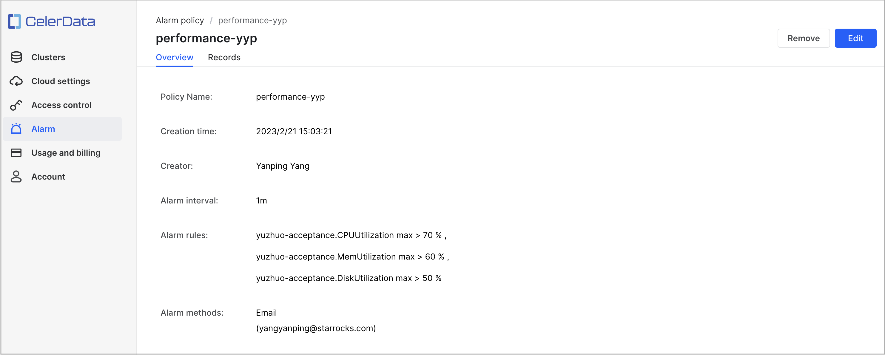
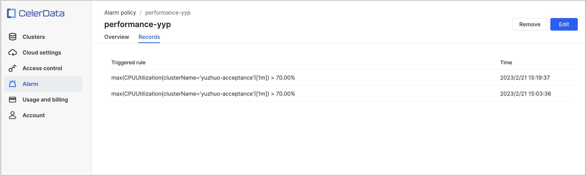

# Alarm

The alarm system of CelerData can monitor clusters' status and send notifications according to the alarm policies that you configure.

Only members that are bound to a role with the **Configure alarm** privilege can configure alarm policies. For information about how to grant a role specific privileges and how to bind a role to a specific member, see [Modify privileges for a role](./security/cloud_access_control/manage_cloud_roles.md) and [Assign a role to a member](./security/cloud_access_control/manage_members.md).

## Create an alarm policy

1. Sign in to the [CelerData Cloud Private console](https://cloud.celerdata.com/login).

2. Choose **Alarm** from the left-side navigation pane.

3. On the **Alarm policy** page, click **Create new policy**.

4. On the **Create your new alarm policy** page, configure the parameters and click **Confirm**.

   

   Follow these steps to configure the parameters:

   a. For **Policy name**, enter a policy name.

   b. For **Cluster region**, select a region.

      

      > **NOTE**
      >
      > The CelerData clusters displayed in the drop-down list below the plus sign (+) in **Alarm rules** vary depending on the region that you select. You can configure alarm rules only for the CelerData clusters that reside in the selected region.

   c. For **Alarm interval**, select an interval at which you want to receive alarms.

      Alarms can be sent at a 15-minute interval at most. If you configure an interval shorter than 15 minutes, emails will be sent at most every 15 minutes even when the alarm policy is triggered more frequently than once every 15 minutes. Additionally, only the alarm records of which you are notified through emails will be recorded.

   d. For **Alarm rules**, click the plus sign (+) to add an alarm rule.

      In the drop-down list right below the plus sign (+), you need to select a CelerData cluster and then a metric to configure an alarm rule.

      

      You can add multiple rules to a policy. These rules are in an OR relationship, meaning that alarms are sent whichever rule is triggered.

      CelerData supports the following metrics.

      | **Metric**                 | **Description**                                              |
      | -------------------------- | ------------------------------------------------------------ |
      | CPUUtilization             | The CPU utilization of the cluster. Unit: percent.           |
      | MemUtilization             | The memory usage of the cluster. Unit: percent.              |
      | DiskUtilization            | The disk usage of the cluster. Unit: percent.                |
      | ClusterDatasize            | The size of occupied storage. Unit: GB.                      |
      | FEQueryLatencyP99          | The 99th percentile of query latencies in FEs. Unit: milliseconds. |
      | NetworkReceiveThroughput   | The rate at which the cluster receives data. Unit: bytes/s.  |
      | NetworkTransmitThroughput: | The rate at which the cluster writes data. Unit: bytes/s. |

   e. For **Alarm methods**, enter your email address below **Email**.

## View alarm policies

1. Sign in to the [CelerData Cloud Private console](https://cloud.celerdata.com/login).
2. Choose **Alarm** from the left-side navigation pane.
3. On the **Alarm policy** page, view the alarm policies that are created within your CelerData cloud account.

   

   You can click an alarm policy to view the details about it. The policy details are displayed on two tabs: **Overview** and **Records**.

   - The **Overview** tab displays the basic information about the policy, such as the name, alarm interval, and alarm rules.

     

   - The **Records** tab displays the information about at which time each rule was triggered.

     

## Edit an alarm policy

1. Sign in to the [CelerData Cloud Private console](https://cloud.celerdata.com/login).

2. Choose **Alarm** from the left-side navigation pane.

3. On the **Alarm policy** page, click the alarm policy that you want to edit.

4. On the policy details page, click **Edit**.

5. Edit the alarm policy and click **Confirm**.

   > **NOTE**
   >
   > The policy name cannot be modified. Additionally, if nothing is changed, you cannot click **Confirm** and can only click **Cancel**. 

## Remove an alarm policy

1. Sign in to the [CelerData Cloud Private console](https://cloud.celerdata.com/login).
2. Choose **Alarm** from the left-side navigation pane.
3. On the **Alarm policy** page, click the alarm policy that you want to edit.
4. On the policy details page, click **Remove**.
5. In the message that appears, click **Delete**.
