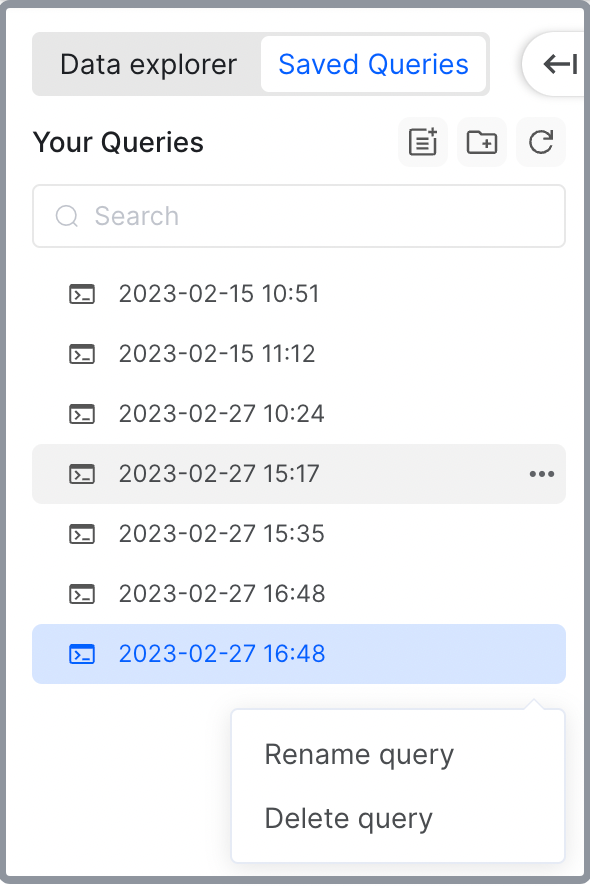

# Open a CelerData cluster

CelerData supports accessing a CelerData cluster on your web browser. By opening a CelerData cluster on your web browser, you can run queries, manage data catalogs, view query history, monitor cluster status, and check audit logs in it.

> **NOTE**
>
> To open a cluster, you must have the **View Cluster** privilege and the username and password to connect to the cluster.

## Open your cluster

1. Sign in to the [CelerData Cloud Private console](https://cloud.celerdata.com/login).
2. In the left-side navigation pane, choose **Clusters**.
3. On the **Clusters** page, click the cluster you want to open.
4. On the cluster details page, click **Open cluster**.
5. On the **Coonect to your Cluster** page, enter your **Username** and **Password** for accessing the cluster, and click **Sign in**.

    

    The browser redirects you to the cluster operation page.

The cluster operation page consists of five tabs:

- **SQL editor**: You can edit and run queries in your CelerData cluster.
- **Data catalog**: You can view and manage data catalogs within your CelerData cluster.
- **Query history**: You can view the history of all queries and analyze the slow queries in your CelerData cluster.
- **Monitor**: You can monitor the status of your CelerData cluster and the instance that hosts it.
- **Audit log**: You can view and search the audit logs of your CelerData cluster.

## Run a query in SQL editor

SQL editor allows you to edit and execute SQL queries on the CelerData platform. It provides an easy-to-use and powerful UI that makes the query-writing more efficient. SQL editor features syntax highlighting and auto-completion. These features provide an intuitive and flexible environment for data analysts, developers, and even business users to quickly work with their data.

The **SQL editor** tab consists of three areas:

- The **Data explorer** and **Saved queries** panels
- The query editor area
- The query result area

### Data explorer and Saved queries panels

On the **Data explorer** panel, you can:

- Select the catalog that hosts your data from the **Select catalog** drop-down list.
- Select the database that you want to use from the **Select database** drop-down list. You can select a database only after its parent catalog is selected.
- View and search for tables in the selected database.
- View the **Details** and **Definition** of a specific table by hovering on the table.

    

    

- Interact with a specific table by clicking the **More** (**...**) button next to the table.

    

- View the columns of a specific table by clicking the table.
- View the details of a specific column by hovering on the column.

    

- Interact with a specific column by clicking the **More** (**...**) button next to the column.

    

On the **Saved queries** panel, you can:

- View and search for saved queries.
- Load a saved query script by clicking the query.
- Create a new query script by clicking the **Create a new query** button.
- Create a folder to manage your queries by clicking the **Create a new folder** button.
- Rename or delete a saved query by clicking the **More** (**...**) button next to the query.

    

> **NOTE**
>
> - Your query script is automatically saved when you edit it.
> - Saved queries can be seen among all database users.

### Query editor area

In the query editor area, you can:

- Edit a query script in the editor.
- Create a new query script by clicking the **+** button.
- Run a query script by clicking the **Run** button.
- Clear the editor by clicking the **Clear** button and clicking **Confirm** in the message that appears.
- Format the SQL in the editor by clicking the **Format your SQL** button.
- Check the keyboard shortcuts the editor supports by clicking the **Hot key** button.

### Query result area

After you run a query script, you can check the details, results, or error message of the query in the query result area.

- You can check the **Query ID**, **Execution time**, **State**, **Rows returned**, and **Rows Total** of the query in the query status section.

    

- You can download the result of the query as an **.xlsx** file by clicking the **Download** button after the query is completed.
- Different information will be displayed in the result section during different phases of the query execution:

  - When the query is running, the result section displays the amount of time that the query has taken.

    

  - When the query is completed, the result section displays the results of the query.

    

  - If the query fails, the result section will display the error message.

    

## View and manage your data catalogs

On the **Data catalog** tab, you can view and manage all data sources of your CelerData cluster, including external catalogs and the internal catalog `default_catalog`, which contains the self-managed tables created in your CelerData cluster.

### Create an external data catalog

On the **Data catalog** tab, click **Add catalog**. Follow the deployment wizard to create an external data catalog.

1. **Step1: Add new data source**

   Select a data source, and click **Next Step**.

   

   > **NOTE**
   >
   > Currently, CelerData only supports Amazon S3 as the external data source.

2. **Step2: Configure the data source configuration**

   Enter the **Catalog name**, optionally add a **Description**, choose the **S3 Region** of your data storage, choose the **Default table format**, choose your **Metastore type**, choose the **AWS Region** of your metastore, and click **Next Step**.

   

3. **Step3: Configure the authentication information**

   You can choose **Instance profile-based authentication** or **Assumed role-based authentication** to access your data source. For detailed instructions, see [Authenticate to AWS resources](../integration/authenticate_to_aws.md).

   

    After configuring the authentication information, click **Create Catalog**.

### View the data statistics of the internal catalog

1. On the **Data catalog** tab, you can view the **Type** and **Comment** of the internal catalog.
2. Click the catalog `default_catalog` to view the information of the databases in the internal catalog, including their names, sizes, and remarks.
3. Click a specific database to view the information of the tables in the database, including their names, sizes, remarks, and creation times.
4. Click a specific table to view the information of the partitions in the table, including their names, visible data versions, states, partition keys, partition ranges, bucket columns, bucket numbers, duplications, and sizes.
5. Click a specific partition to view the information of the BE nodes that host tablets in the partition, including their IDs, tablet counts, row counts, data group counts, and sizes.
6. Click a specific node to further view the information of the tablets in it, including their IDs, hosting nodes, valid data versions, row counts, data group counts, sizes, and states.

### View the data statistics of external catalogs

1. On the **Data catalog** tab, you can view the **Type** and **Comment** of external catalogs.
2. Click a specific external catalog to view the databases in the external catalog.
3. Click a specific database to view the tables in the database.

## View query history

CelerData supports viewing and searching for the records of all queries executed in a CelerData cluster. You can analyze and fine-tune the query performance based on the execution statistics recorded in the query history.

The **Query history** tab consists of two sub-tabs: **All queries** and **Slow queries**. In addition to the **All queries** tab, which stores statistics of all executed queries, CelerData records the queries with an execution time of more than 500 ms in the **Slow queries** sub-tab, allowing you to quickly identify the issues or bottlenecks that may impact the query performance of your CelerData cluster. Both sub-tabs record the **Start time**, **Query ID**, **Status**, **Duration**, **Client IP, Query user**, and **SQL** of the queries.

You can choose a specific FE node of which the query history to view by selecting the IP address of the node.

You can filter specific queries by **Query user**, **Status**, and the time range during which they were executed. To search for query records more precisely, you can enter a filter according to **Query ID** or **SQL**, and click **Search**.

By clicking a specific query record, you can view the **Query user**, **Client IP**, **Status**, **Duration**, **Start time**, and **SQL** of the query on its **Query overview** page.

## Monitor your cluster and instances

The **Monitor** tab provides you with real-time insights into the resource consumption and query performance of your CelerData cluster. With monitoring statistics, you can quickly identify and respond to performance issues before they become critical, and thus guarantee the smooth operation of the cluster.

The **Monitor** tab consists of two sub-tabs: **Cluster** and **Instance**.

- On the **Cluster** sub-tab, you can view the charts of the following monitoring statistics:

  - **Cluster Data Size** (**MAX** and **AVG**)
  - **Query QPS** (**MAX**, **MIN**, and **AVG**)
  - **Ingested Times** (**SUM**)
  - **Ingested Rows** (**SUM**)
  - **Ingested Bytes** (**SUM**)
  - **Query Latency (90 Quantile)** (**MAX**, **MIN**, and **AVG**)
  - **Query Latency (95 Quantile)** (**MAX**, **MIN**, and **AVG**)
  - **Query Latency (99 Quantile)** (**MAX**, **MIN**, and **AVG**)
  
  The **Cluster** metrics provide valuable insights into the overall performance of your CelerData cluster, allowing you to identify the operation trend and spot any performance bottlenecks that may require optimization.

  You can choose a specific time range or choose the start time and end time to search for specific monitoring statistics.

- On the **Instance** sub-tab, you can view the charts of the following information:

  - **CPU Util** (**MAX**, **MIN**, and **AVG**)
  - **Memory Util** (**MAX**, **MIN**, and **AVG**)
  - **Memory Usage** (**MAX**, **MIN**, and **AVG**)
  - **Disk Util** (**MAX**, **MIN**, and **AVG**)
  - **Disk Usage** (**MAX**, **MIN**, and **AVG**)
  - **Network Recv** (**MAX**, **MIN**, and **AVG**)
  - **Network Send** (**MAX**, **MIN**, and **AVG**)
  - **Disk Read IOPS** (**MAX**, **MIN**, and **AVG**)
  - **Disk Write IOPS** (**MAX**, **MIN**, and **AVG**)
  - **Disk Read** (**MAX**, **MIN**, and **AVG**)
  - **Disk Write** (**MAX**, **MIN**, and **AVG**)

  With the **Instance** metrics, you can identify the performance bottlenecks or issues that may be impacting specific instances, and thus take targeted action to resolve them.

  You can choose the node of which statistics to display on the charts by selecting the IP address of the node in the **Node** section. You can also choose a specific time range or choose the start time and end time to search for specific monitoring statistics.

## View audit logs

CelerData clusters keep track of all user activities in their audit logs, which allow cluster administrators to conduct post-incident investigations and troubleshoot any issues that may arise.

On the **Audit log** tab, you can view the audit logs in your CelerData cluster.

Each audit log records the **Start time**, **Query ID**, **Cost**, **User**, **Client Address**, and **SQL** of a query.

You can choose a specific FE node to view the audit logs on it by selecting the IP address of the node.

You can choose the start time and end time to search for specific audit logs.
