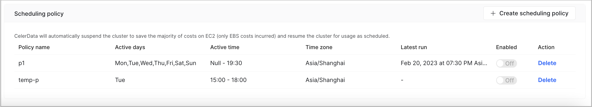
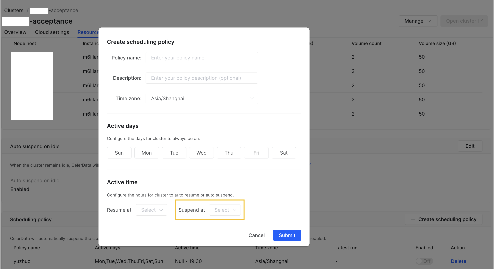
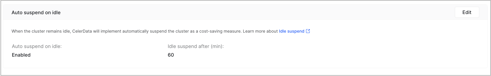
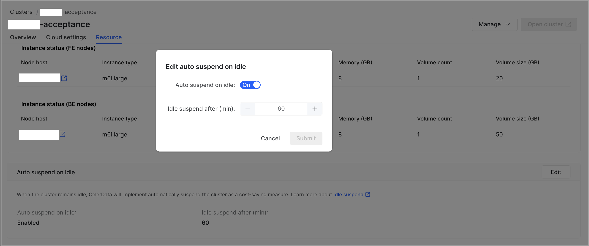
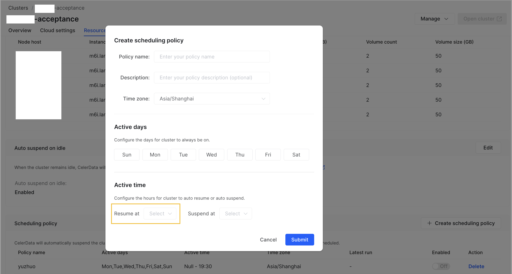

# Suspend and resume a CelerData cluster

CelerData allows suspending a cluster to avoid unnecessary costs during idle time. Once your cluster is suspended, CelerData does not charge you with CCUs for your suspended cluster any more. Also, you no longer need to pay your cloud provider for the virtual machines on which your cluster runs.

You can resume your suspended cluster if you need it again.

## Suspend a cluster

CelerData provides three suspend methods:

- Manual suspend
- Scheduled suspend
- Auto suspend on idle

Note that when CelerData suspends a cluster, it suspends all of the cluster's warehouses (including the default warehouse) together with the cluster.

### Manual suspend

1. Sign in to the [CelerData Cloud Private console](https://cloud.celerdata.com/login).

2. On the **Clusters** page, click the cluster that you want to suspend.

3. On the cluster details page, click **Manage** and choose **Suspend cluster**.

4. In the message that appears, click **Confirm**.

   CelerData immediately starts suspending the cluster. This may take a few minutes, during which the cluster stays in the **Suspending** state. During that period of time, you cannot perform operations such as scaling the cluster, adding warehouses to the cluster, or releasing the cluster. When suspending the cluster is complete, the cluster enters the **Suspended** state.

   > **NOTE**
   >
   > You can only suspend clusters that are in the **Running** state. If a cluster is not in the **Running** state, the **Suspend cluster** menu item is not displayed.

### Scheduled suspend

1. Sign in to the [CelerData Cloud Private console](https://cloud.celerdata.com/login).

2. On the **Clusters** page, click the cluster that you want to periodically suspend.

3. On the cluster details page, click the **Resource Scheduling** tab. Then, click **Create scheduling policy** in the **Scheduling policy** section.

   

4. In the **Create scheduling policy** dialog box, specify the name, description, and time zone of the scheduling policy, select the days on which you want the cluster to be off, select the hour at which you want CelerData to automatically suspend the cluster, and then click **Submit**.

   

5. In the **Scheduling policy** section of the cluster details page, find the scheduling policy you just created, and turn on its switch in the **Enabled** column to make it take effect.

   The cluster will be suspended at the selected hour on every selected day according to the scheduling policy that you created.

### Auto suspend on idle

When the Auto Suspend feature is enabled, CelerData monitors the activity levels of the nodes in the cluster. If the nodes stay idle for a specified amount of time, CelerData automatically suspends the cluster.

With the Auto Suspend feature, resources are allocated only when needed. This delivers efficient resource utilization and further reduces costs.

Follow these steps to configure the Auto Suspend feature:

1. Sign in to the [CelerData Cloud Private console](https://cloud.celerdata.com/login).

2. On the **Clusters** page, click the cluster that you want to suspend when it stays idle.

3. On the cluster details page, click the **Resource Scheduling** tab. Then, click **Edit** in the **Auto suspend on idle** section.

   

4. In the **Edit auto suspend on idle** dialog box, turn on the switch next to **Idle suspend**, select the maximum amount of time during which the cluster can stay idle, and then click **Submit**.

   

   If you want to disable this feature, turn off the switch and click **Submit** in the dialog box.

## Resume a cluster

CelerData provides two resume methods:

- Manual resume
- Scheduled resume

Note that when CelerData resumes a cluster, it resumes only the default warehouse together with the cluster. For the other warehouses created after the cluster deployment, you need to resume them one by one if you need them to run. For more information, see [Suspend and resume a warehouse](../warehouse/manage_warehouses.md#suspend-and-resume-a-warehouse).

### Manual resume

1. Sign in to the [CelerData Cloud Private console](https://cloud.celerdata.com/login).

2. On the **Clusters** page, click the cluster that you want to resume.

3. On the cluster details page, click **Manage** and choose **Resume cluster**.

   If the cluster is a classic cluster, CelerData immediately starts resuming the cluster.

   If the cluster is an elastic cluster deployed on AWS Cloud, CelerData displays a message stating that only the default warehouse will be resumed and asking you whether you want to resume the cluster. CelerData starts resuming the cluster only after you click **Confirm** in the message.

   Resuming the cluster takes a few minutes, during which the cluster stays in the **Resuming** state. During that period of time, you cannot perform operations such as scaling the cluster or adding warehouses to the cluster. When resuming the cluster is complete, the cluster enters the **Running** state.

   > **NOTE**
   >
   > You can only resume clusters that are in the **Suspended** state. If a cluster is not in the **Suspended** state, the **Resume** menu item is not displayed.

### Scheduled resume

1. Sign in to the [CelerData Cloud Private console](https://cloud.celerdata.com/login).

2. On the **Clusters** page, click the cluster that you want to periodically resume.

3. On the cluster details page, click the **Resource Scheduling** tab. Then, click **Create scheduling policy** in the **Scheduling policy** section.

   

4. In the **Create scheduling policy** dialog box, specify the name, description, and time zone of the scheduling policy, select the days on which you want the cluster to be on, select the hour at which you want CelerData to automatically resume the cluster, and then click **Submit**.

   

5. In the **Scheduling policy** section of the cluster details page, find the scheduling policy you just created, and turn on its switch in the **Enabled** column to make it take effect.

   The cluster will be resumed at the selected hour on every selected day according to the scheduling policy that you created.

## What's more

You can configure a single scheduling policy that controls both scheduled resume and scheduled suspend.

You can also delete a scheduling policy. To achieve this, open the cluster details page, navigate to the **Resource Scheduling** tab, find the scheduling policy you want to delete, click **Delete** in its **Action** column, and then click **Delete** in the message that appears.
