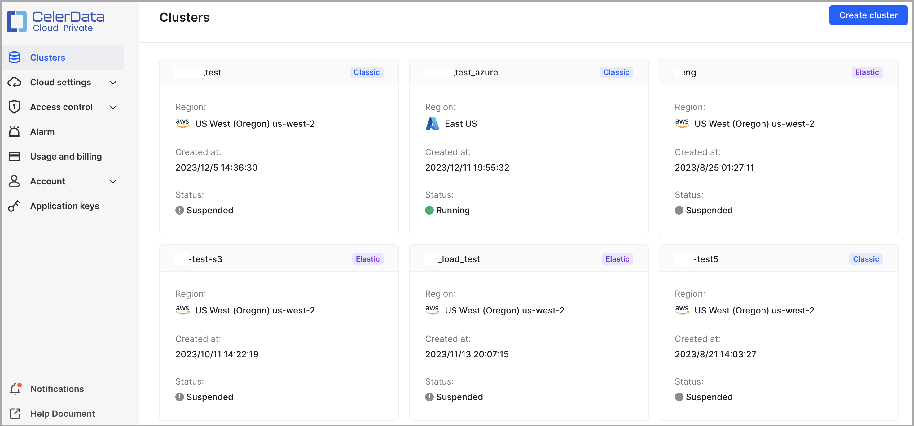
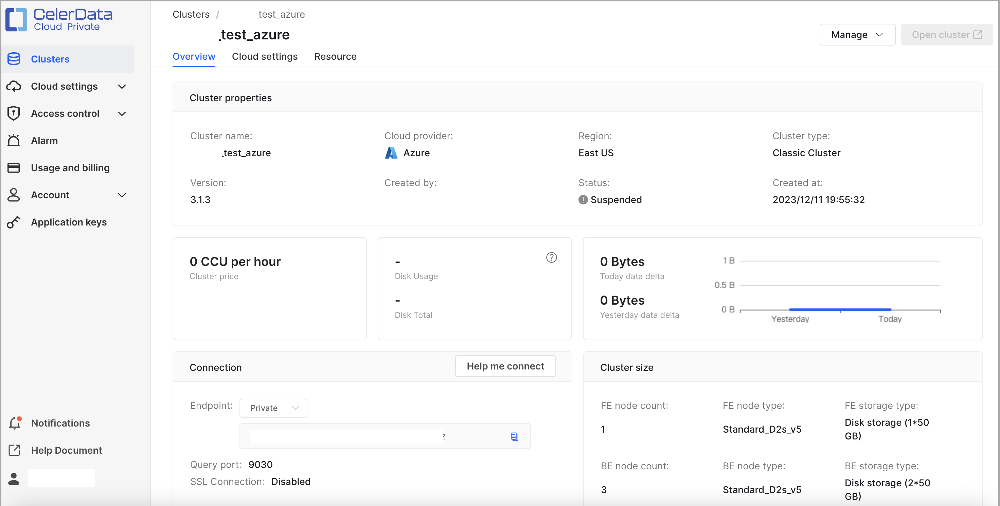
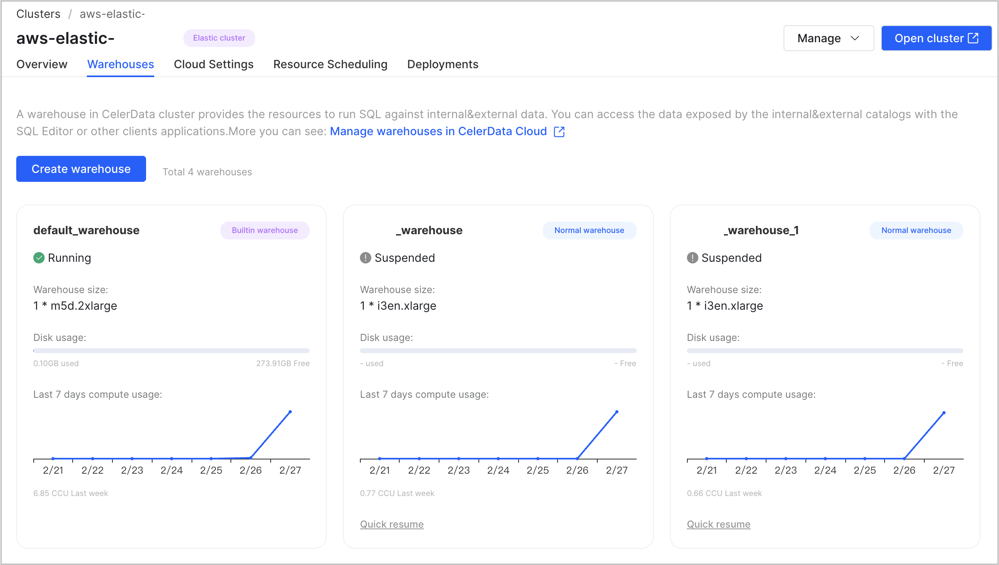
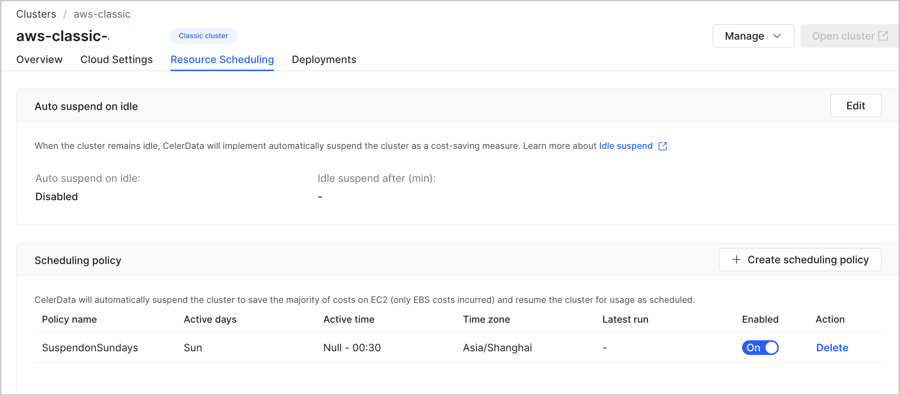
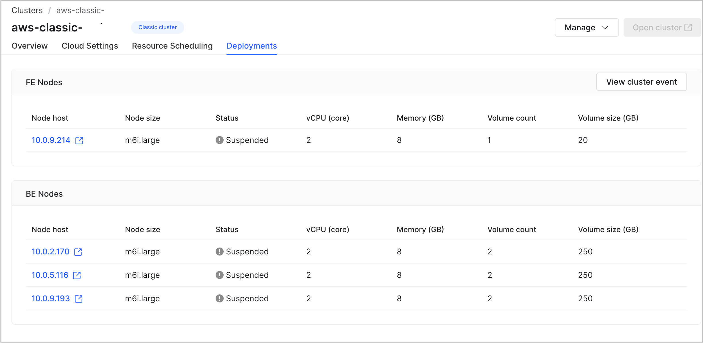
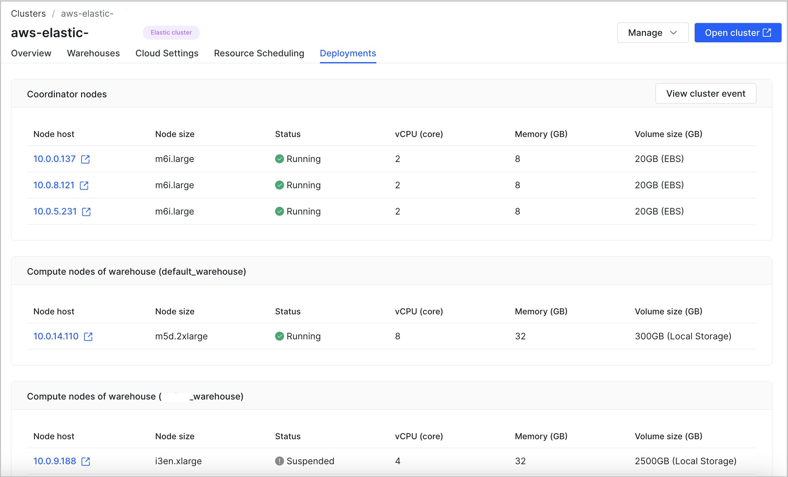

# View CelerData clusters

CelerData displays all of the clusters created within your CelerData cloud account on its console. You can get an overview of all clusters or dive down into the details of each individual cluster.

## Get an overview of all clusters

Sign in to the [CelerData Cloud Private console](https://cloud.celerdata.com/login).

The **Clusters** page appears, presenting an overview of all clusters created within your CelerData cloud account. The overview includes the cloud provider region, creation time, status, and type (classic or elastic) of each individual cluster.

## View the details of a cluster

Sign in to the [CelerData Cloud Private console](https://cloud.celerdata.com/login), and on the **Clusters** page click the cluster that you want to view. Then the cluster details page that consists of the following tabs appears:

- **Overview**
- **Warehouses** (This tab is displayed only for elastic clusters.)
- **Cloud Settings**
- **Resource Scheduling**
- **Deployments**

### Overview

The **Overview** tab consists of three sections: **Cluster properties**, **Connection**, and **Cluster size**.

The **Cluster properties** section displays the basic information of the cluster, including the following properties.

| **Property**   | **Description**                                              |
| -------------- | ------------------------------------------------------------ |
| Cluster name   | The name of the cluster.                                     |
| Cloud provider | The cloud provider that hosts the cluster.                   |
| Region         | The region that hosts the cluster.                       |
| Cluster type   | The type (classic or elastic) of the cluster.         |
| Version        | The version of CelerData that is run by the cluster.         |
| Created by     | The name of the CelerData cloud user who created the cluster.|
| Status         | The status of the cluster. Valid values:<ul><li>**Failed**: The cluster failed to be deployed.</li><li>**Running**: The cluster is running.</li><li>**Stopped**: The cluster has been released.</li><li>**Updating**: The configuration of the cluster is being changed.</li><li>**Deploying**: The cluster is being deployed.</li></ul> |
| Created at     | The time at which the cluster was created.                   |

The **Connection** section displays the information that you can use to connect to the cluster, including the following properties.

| **Property**     | **Description**                                              |
| ---------------- | ------------------------------------------------------------ |
| Endpoint         | The endpoint that is used to connect to the cluster. |
| Query port       | The port that is used to connect to the cluster. The port is the `query_port` of the cluster. |

The **Cluster size** section displays the size information of the cluster, including the following properties.

| **Property**    | **Description**                                   |
| --------------- | ------------------------------------------------- |
| FE node count   | The number of FE nodes in the cluster.            |
| FE node type    | The instance type of the FE nodes in the cluster. |
| FE storage type | The storage type of the FE nodes in the cluster.  |
| BE node count   | The number of BE nodes in the cluster.            |
| BE node type    | The instance type of the BE nodes in the cluster. |
| BE storage type | The storage type of the BE nodes in the cluster.  |

In addition to the preceding three sections, the **Overview** tab also displays the following information:

- The number of CCUs per hour
- The used storage and the total storage
- The size of delta data for today and the size of delta data for yesterday

### Warehouses

The **Warehouses** tab is displayed only for elastic clusters. On this tab, you can:

- Create new warehouses.

- View and manage existing warehouses.

#### Create new warehouses

Follow these steps to create a warehouse:

1. Click **Create warehouse**.

2. In the dialog box that appears, enter a name and optionally a description for the warehouse, select the instance type and number of compute node for the warehouse, and then click **Create**.

   CelerData immediately starts deploying the warehouse, during which the warehouse stays in the **Deploying** state. This may take a few minutes. After deploying the warehouse is complete, the warehouse enters the **Running** state.

#### View and manage existing warehouses

You can view all warehouses created within the cluster. Each warehouse is presented as a card which displays the following warehouse information:

- Status
- Size
- Disk usage
- Compute resource usage over the most recent seven days

You can also manage these warehouses, including:

- Click **Quick suspend** or **Quick resume** in the lower-left corner of the card for a warehouse to suspend or resume the warehouse.

  > **NOTE**
  >
  > The **Quick suspend** or **Quick resume** button is displayed only when the cluster is in the **Running** state. Additionally, you can suspend and resume only the warehouses that you create after the cluster deployment. You cannot suspend or resume the default warehouse that is created along with the cluster.

- Move the cursor to the lower-right corner of the card for a warehouse to display the **View more details** button. Click the button to open the warehouse details page on which you can manage the warehouse as needed. For more information, see [Manage warehouses](../warehouse/manage_warehouses.md#manage-warehouses).

### Cloud Settings

The **Cloud Settings** tab consists of three sections: **Deployment credential**, **Network configuration**, and **Data credential**. The information in these sections varies depending on the cloud provider of the cluster.

#### AWS

The **Deployment credential** section displays the information about the deployment credential that is associated with the cluster, including the following properties.

| **Property**           | **Description**                                              |
| ---------------------- | ------------------------------------------------------------ |
| Credential method      | The type of deployment credential that was used to control the permissions of CelerData to launch and manage resources in your AWS cloud. |
| Trust account ID       | The account ID that you used to create the IAM role associated with the cluster. **NOTE** The trust account ID and the external ID are used together to identify the account that can use the IAM role. |
| External ID            | The external ID that you used to create the IAM role associated with the cluster. **NOTE** The trust account ID and the external ID are used together to identify the account that can use the IAM role. |
| IAM role ARN | The ARN of the IAM role that you created to grant CelerData permission to launch and manage resources in your AWS cloud. |

The **Network configuration** section displays the information about the network configuration that is associated with the cluster, including the following properties.

| **Property**      | **Description**                                              |
| ----------------- | ------------------------------------------------------------ |
| Subnet ID         | The ID of the subnet in which the cluster nodes are deployed for data analysis. |
| Security group ID | The ID of the security group that enables connectivity between cluster nodes within your own VPC and between CelerData's VPC and your own VPC over TLS. |
| VPC endpoint ID   | The ID of the VPC endpoint that you created by using [PrivateLink](https://docs.aws.amazon.com/whitepapers/latest/aws-vpc-connectivity-options/aws-privatelink.html) to allow direct, secure connectivity between CelerData's VPC and your own VPC. The connectivity is for AWS VPCs in the same AWS region. Valid values:<ul><li>For the Asia Pacific (Singapore) region: `com.amazonaws.vpce.ap-southeast-1.vpce-svc-02073213663648027`</li><li>For the US East (N. Virginia) region: `com.amazonaws.vpce.us-east-1.vpce-svc-0d1c58972a96cb283`</li></ul>**NOTE** A VPC endpoint ID is displayed only when you have configured one for the cluster during the deployment process. |

The **Data credential** section displays the information about the data credential that is associated with the cluster, including the following properties.

| **Property**         | **Description**                                              |
| -------------------- | ------------------------------------------------------------ |
| Bucket name          | The name of the bucket that is referenced in the data credential. |
| Instance profile ARN | The instance profile ARN of the service IAM role for EC2 that you created to grant CelerData permission to access the referenced bucket. |

#### Azure

The **Deployment credential** section displays the information about the deployment credential that is associated with the cluster, including the following properties.

| **Property**             | **Description**                                              |
| ------------------------ | ------------------------------------------------------------ |
| Directory (tenant) ID    | The directory (tenant) ID of the registered application. |
| Application (client) ID  | The application (client) ID of the registered application. |
| Client secret value      | The value of the client secret of the registered application. |
| SSH Key resource ID      | The resource ID of the SSH key pair. |
| Updated at               | The most recent date and time when the client secret value in the deployment credential was updated. |

The **Network configuration** section displays the information about the network configuration that is associated with the cluster, including the following properties.

| **Property**                | **Description**                                              |
| --------------------------- | ------------------------------------------------------------ |
| Virtual network resource ID | The resource ID of the virtual network. |
| Subnet name                 | The name of the subnet that hosts the cluster within the virtual network. |

The **Data credential** section displays the information about the data credential that is associated with the cluster, including the following properties.

| **Property**                  | **Description**                                              |
| ----------------------------- | ------------------------------------------------------------ |
| Managed identity resource ID  | The resource ID of the managed identity. |
| Storage account name          | The name of the storage account. |
| Container name                | The name of the container that stores the data of the cluster within the storage account. |

### Resource Scheduling

On the **Resource Scheduling** tab, you can:

- View and manage the Auto Suspend feature.

- View and manage scheduling policies.

#### View and manage the Auto Suspend feature

In the **Auto suspend on idle** section, you can view the setting of the Auto Suspend feature, including the following properties.

| **Property**               | **Description**                                                                 |
| -------------------------- | ------------------------------------------------------------------------------- |
| Auto suspend on idle       | The status of the Auto Suspend feature. Valid values: `Enabled` and `Disabled`.|
| Idle suspend after (min)   | The maximum amount of time during which the cluster can stay idle.              |

You can click **Edit** in the upper-right area of the **Auto suspend on idle** section to edit the setting of the Auto Suspend feature.

For more information about the Auto Suspend feature, see [Auto suspend on idle](../cluster_management/suspend_resume_cluster.md#auto-suspend-on-idle).

#### View and manage scheduling policies

In the **Scheduling policy** section, you can view the information about the scheduling policies that are created on the cluster, including the following properties.

> **NOTE**
>
> Scheduling policies are supported only for classic clusters.

| **Property**  | **Description**                                                                                                |
| ------------- | -------------------------------------------------------------------------------------------------------------- |
| Policy name   | The name of the scheduling policy.                                                                             |
| Active days   | The week days on which you want the cluster to be on.                                                          |
| Active time   | The period of time during which you want the cluster to be on.                                                 |
| Time zone     | The time zone of the scheduling policy.                                                                        |
| Latest run    | The most recent date and time at which the cluster was run according to the scheduling policy.                  |
| Enabled       | The status of the scheduling policy. You can click the switch to enable or disable the policy.                 |
| Action        | The actions that you can take on the scheduling policy. Currently you can only delete the policy.              |

You can click **Create scheduling policy** in the upper-right area of the **Scheduling policy** section to create a scheduling policy. You can also click a scheduling policy to edit it.

For more information about scheduled suspend and scheduled resume, see [Scheduled suspend](../cluster_management/suspend_resume_cluster.md#scheduled-suspend) and [Scheduled resume](../cluster_management/suspend_resume_cluster.md#scheduled-resume).

### Deployments

On the **Deployments** tab, you can:

- Track cluster events.

- View cluster nodes.

#### Track cluster events

Click **View cluster event** in the upper-right area of the tab. A dialog box is displayed, showing all operations that were performed on the cluster. You can click **OK** to close the dialog box.

#### View cluster nodes

The node information displayed varies depending on the type (classic or elastic) of the cluster.

For a classic cluster, the **Deployments** tab displays the information about the FE nodes and BE nodes in the cluster, including the following properties.

| **Property**      | **Description**                                              |
| ----------------- | ------------------------------------------------------------ |
| Node host         | The IP address of the FE or BE node in the cluster.          |
| Node size         | The instance type of the FE or BE node in the cluster.       |
| Status            | The status of the FE or BE node in the cluster. Valid values:<ul><li>**Unknown**: The FE or BE node is disconnected.</li><li>**Running**: The FE or BE node is running.</li><li>**Terminated**: The FE or BE node is manually terminated.</li><li>**Failed**: The FE or BE node failed to start.</li></ul> |
| vCPU (core)       | The number of vCPU cores provided by the FE or BE node in the cluster. |
| Memory (GB)       | The amount of memory provided by the FE or BE node in the cluster. |
| Volume count      | The number of volumes provided by the FE or BE node in the cluster. |
| Volume size (GB)  | The size per volume provided by the FE or BE node in the cluster. |

For an elastic cluster, the **Deployments** tab displays the information about the coordinator nodes and the compute nodes of each warehouse in the cluster, including the following properties.

| **Property**      | **Description**                                              |
| ----------------- | ------------------------------------------------------------ |
| Node host         | The IP address of the coordinator or compute node in the cluster.          |
| Node size         | The instance type of the coordinator or compute node in the cluster.       |
| Status            | The status of the coordinator or compute node in the cluster. Valid values:<ul><li>**Unknown**: The coordinator or compute node is disconnected.</li><li>**Running**: The coordinator or compute node is running.</li><li>**Terminated**: The coordinator or compute node is manually terminated.</li><li>**Failed**: The coordinator or compute node failed to start.</li></ul> |
| vCPU (core)       | The number of vCPU cores provided by the coordinator or compute node in the cluster. |
| Memory (GB)       | The amount of memory provided by the coordinator or compute node in the cluster. |
| Volume size (GB)  | The size per volume provided by the coordinator or compute node in the cluster. |

## What's next

With the connection information you have obtained from the cluster details page, you can connect to the cluster from a JDBC driver or a MySQL client or by using the SQL Editor. For more information, see [Connect to a CelerData cluster](../get_started/connect_cluster.md).

You can also operate the cluster to your needs in the CelerData Cloud Private console:

- [Scale a CelerData cluster.](../cluster_management/scale_cluster.md)
- [Release a CelerData cluster.](../cluster_management/scale_cluster.md)
- [Suspend or resume a CelerData cluster](../cluster_management/suspend_resume_cluster.md)
- [Open a CelerData cluster](../cluster_management/open_cluster.md)
