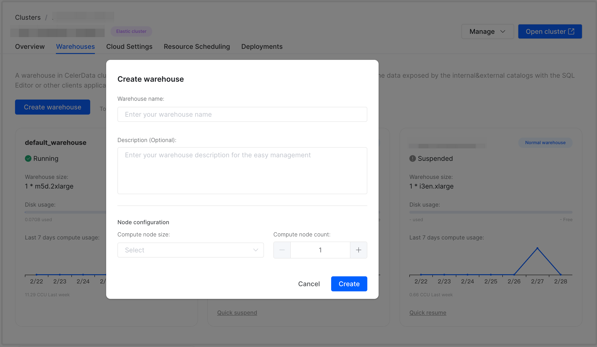
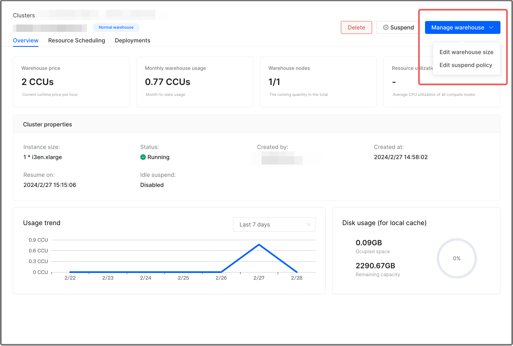
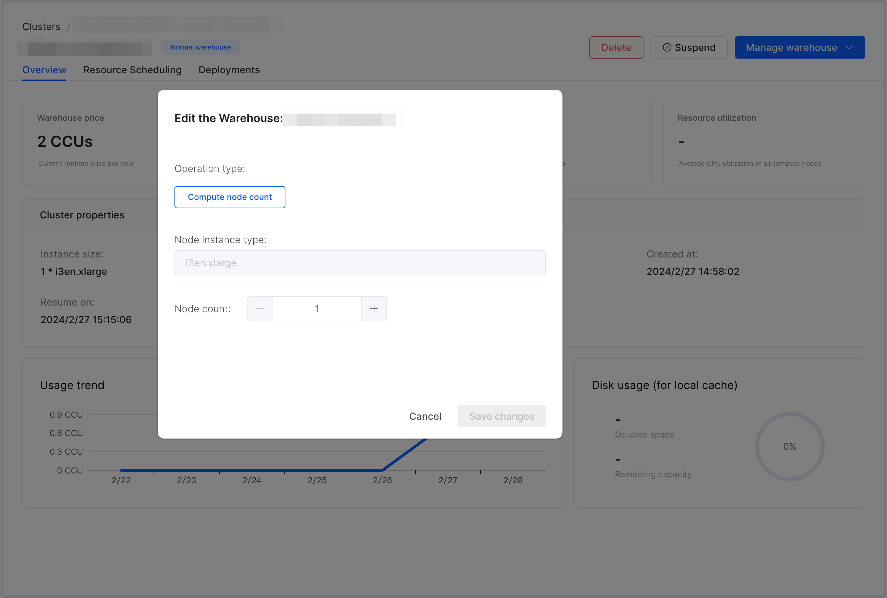
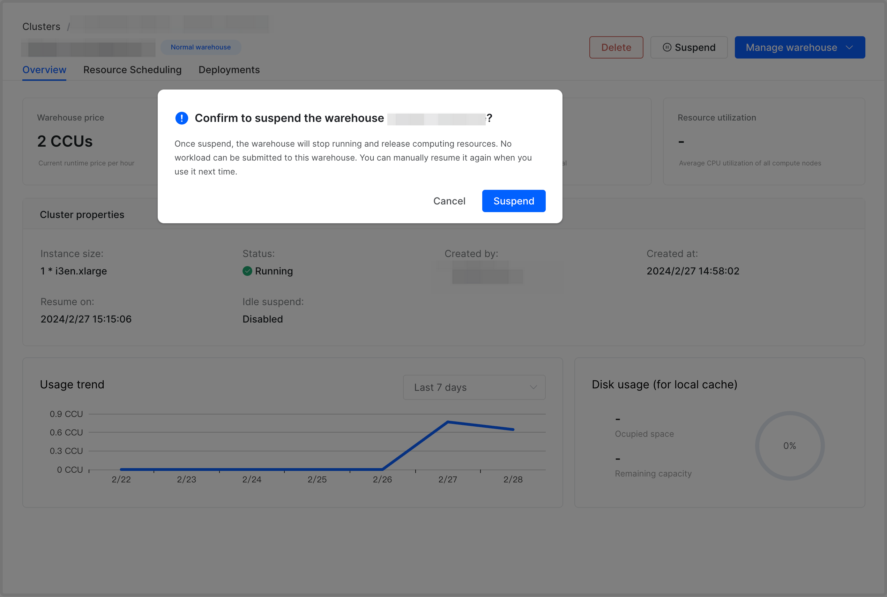
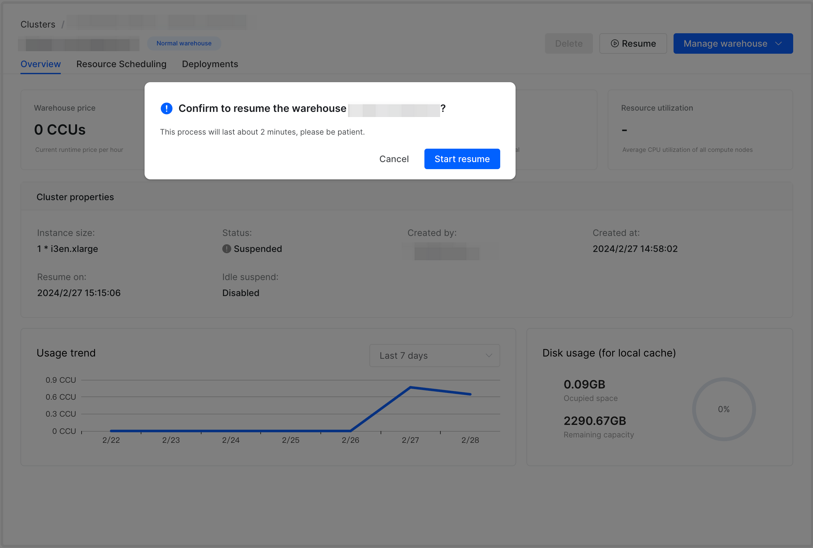
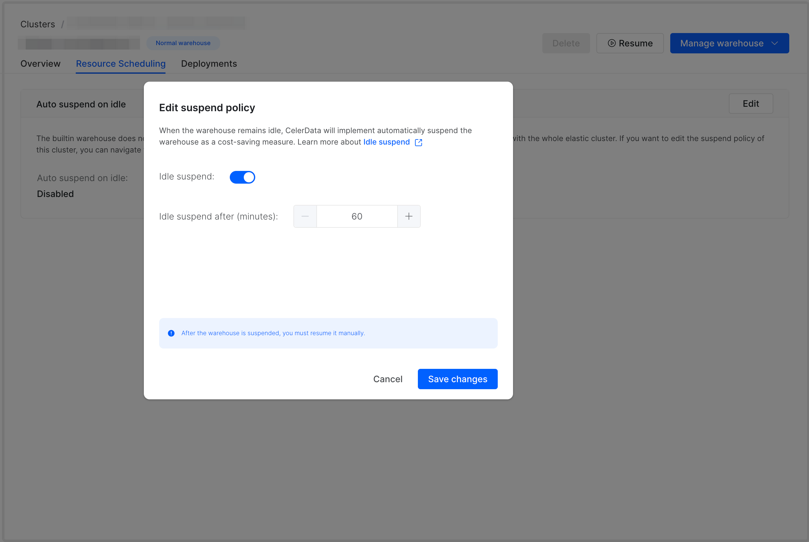
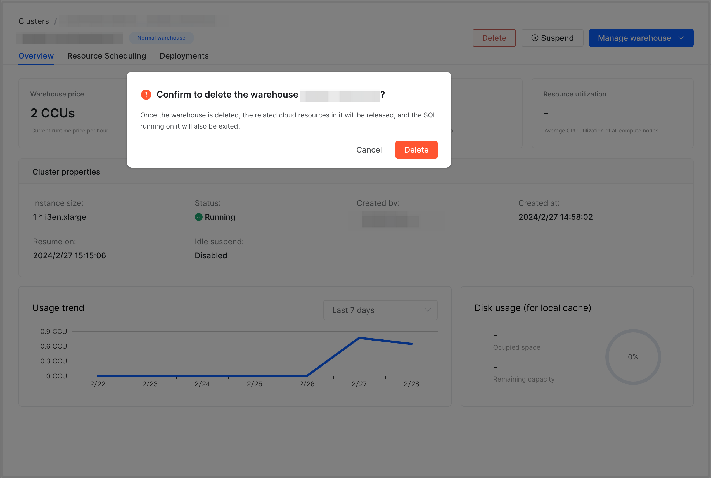
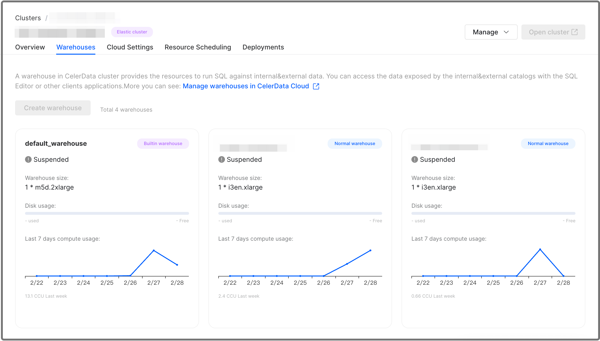
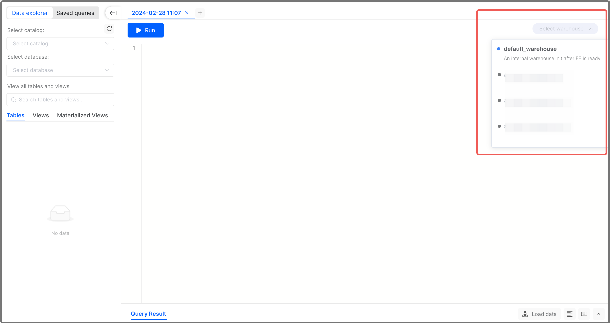

# Manage and use warehouses

## Concept

A warehouse in an elastic CelerData cluster is a physical group of multiple compute nodes that provide you with the required compute resources, such as CPU, memory, and temporary storage, to perform query, ingestion, and data processing tasks on data stored in remote storage. You can resize a warehouse based on your workloads, and use different warehouses to isolate your workloads from different data analysis scenarios.

## Access control

Users with the `cluster_admin` role can create new warehouses and delete, suspend, or resume existing warehouses through the GUI, and can use all warehouses available within the cluster.

By default, users without the `cluster_admin` role can only use the built-in warehouse `default_warehouse` provided and have no access to other warehouses. If they want to use any other warehouse, they must be granted the USAGE privilege on that warehouse through the following SQL command:

```SQL
GRANT USAGE ON WAREHOUSE <WAREHOUSE_NAME to <USER_NAME>;
```

Only users with the `user_admin` role can grant or revoke privileges in the cluster. See [Manage privileges](../../security/data_access_control/manage_users.md#manage-privileges).

## Manage warehouses

### Create a warehouse

Each new elastic cluster has a built-in warehouse named `default_warehouse` which is created along with the cluster. For more information about the default warehouse, see [Overview of warehouses - Usage notes](./warehouse_overview.md#usage-notes).

To create a new warehouse in your elastic cluster, follow these steps:

1. Sign in to the [CelerData Cloud Private console](https://cloud.celerdata.com/login).

2. On the **Clusters** page, click the elastic cluster for which you want to create a warehouse.

3. On the cluster detail page, click **Manage** and choose **Add warehouse**.

   > **NOTE**
   >
   > You can also navigate to the **Warehouses** tab of the cluster detail page and click **Create warehouse** to create a warehouse.

4. In the dialog box that appears, configure the following parameters and click **Create**:

   1. **Warehouse name**: Enter a name for the warehouse. Each warehouse name must be unique within your elastic cluster.
   2. **Description**: Optionally enter a description for the warehouse. The description helps you manage multiple warehouses easily.
   3. **Compute node size**: Select an instance type for the compute nodes of the warehouse. The instance type determines the number of vCPU cores and the memory capacity per compute node.
   4. **Compute node count**: Select the number of compute nodes you want to deploy for the warehouse.



Creating a warehouse takes approximately 2 minutes.

After a warehouse is successfully created, CelerData will start to charge you for the runtime of this warehouse.

### Resize a warehouse

If the size of a warehouse causes a performance bottleneck for your workloads, you can scale out the warehouse as needed. Note that scaling a warehouse takes approximately 2 minutes. During the scaling process, queries submitted to the warehouse will still be run on the original warehouse size until the scaling process is completed.

> **NOTE**
>
> You can only resize a warehouse while it is in the running state.

To resize a warehouse, follow these steps:

1. Sign in to the [CelerData Cloud Private console](https://cloud.celerdata.com/login).
2. On the **Clusters** page, click the elastic cluster for which you want to resize a warehouse.
3. On the **Warehouses** tab of the cluster detail page, move the cursor to the lower-right corner of the card for the warehouse to display the **View more details** button, and then click the button.
4. On the warehouse detail page, click **Manage warehouse** and choose **Edit warehouse size**.

   

5. In the dialog box that appears, select a new compute node count and click **Save changes**.

   

### Suspend and resume a warehouse

Because the continuous runtime of a warehouse will bring you continuous costs. Therefore, if you only run your workloads in a specific warehouse occasionally, you can suspend the warehouse to save unnecessary costs and resume it manually on demand.

> **NOTE**
>
> The default warehouse cannot be suspended separately from the cluster. It will be suspended only when the cluster is suspended.

After you suspend a warehouse, CelerData stops charging you for this warehouse until this warehouse is resumed again.

To suspend or resume a warehouse, follow these steps:

1. Sign in to the [CelerData Cloud Private console](https://cloud.celerdata.com/login).
2. On the **Clusters** page, click the elastic cluster for which you want to suspend or resume a warehouse.
3. On the **Warehouses** tab of the cluster detail page, move the cursor to the lower-right corner of the card for the warehouse to display the **View more details** button, and then click the button.
4. On the warehouse detail page, click **Suspend** or **Resume**.
5. In the message that appears, click **Suspend** or **Start resume**.

   

   

> **NOTE**
>
> You can suspend or resume a warehouse immediately by clicking the **Quick suspend** or **Quick resume** button on the card of the warehouse.

### Enable Auto Suspend for a warehouse

When the Auto Suspend feature is enabled for a warehouse, CelerData monitors the activity levels of the compute nodes in the warehouse. If the nodes stay idle for a specified amount of time, CelerData automatically suspends the warehouse.

To enable the Auto Suspend feature for a warehouse, follow these steps:

1. Sign in to the [CelerData Cloud Private console](https://cloud.celerdata.com/login).
2. On the **Clusters** page, click the elastic cluster where the warehouse that you want to enable Auto Suspend resides.
3. On the **Warehouses** tab of the cluster detail page, move the cursor to the lower-right corner of the card for the warehouse to display the **View more details** button, and then click the button.
4. Click the **Resource Scheduling** tab. Then, click **Edit** in the **Auto suspend on idle** section.
5. In the **Edit suspend policy** dialog box, turn on the switch next to **Idle suspend**, select the maximum amount of time during which the warehouse can stay idle, and then click **Save changes**.

   

### Delete a warehouse

If you no longer need a warehouse, you can delete it. This will release all compute resources provisioned to the warehouse, stop billing, and forcibly terminate any SQL queries running on the warehouse.

> **NOTE**
>
> - You can only delete a warehouse while it is in the running state.
> - The default warehouse cannot be deleted.

To delete a warehouse, follow these steps:

1. Sign in to the [CelerData Cloud Private console](https://cloud.celerdata.com/login).
2. On the **Clusters** page, click the elastic cluster for which you want to delete a warehouse.
3. On the **Warehouses** tab of the cluster detail page, move the cursor to the lower-right corner of the card for the warehouse to display the **View more details** button, and then click the button.
4. On the warehouse detail page, click **Delete**.
5. In the message that appears, click **Delete**.

   

### View a warehouse

To view the details of a warehouse, follow these steps:

1. Sign in to the [CelerData Cloud Private console](https://cloud.celerdata.com/login).
2. On the **Clusters** page, click the elastic cluster you want to view.
3. On the cluster detail page, click the **Warehouses** tab. The **Warehouses** tab provides an overview of all of the warehouses created within your elastic cluster. The overview includes the status, size, disk usage, and CCU usage histogram of each warehouse.

   

Move the cursor to the lower-right corner of the card for the warehouse to display the **View more details** button, and then click the button. The warehouse detail page displays three categories of information on three distinct tabs: **Overview**, **Resource Scheduling**, and **Deployments**.

#### Overview

The **Overview** tab consists of the following sections:

- **Warehouse price**: the current runtime CCU price per hour of the warehouse.
- **Monthly warehouse usage**: the month-to-date CCU usage of the warehouse.
- **Warehouse nodes**: the compute node count within the warehouse (running nodes/all nodes).
- **Resource utilization**: the average CPU utilization of all compute nodes.
- **Cluster properties**
  - **Instance size**: the instance type of the compute nodes in the warehouse.
  - **Status**: the status of the warehouse.
  - **Created by**: the user who created the warehouse.
  - **Created at**: the time when the warehouse was created.
  - **Resume on**: the time when the warehouse was last resumed.
  - **Idle suspend**: whether the Auto Suspend feature is enabled for the warehouse.
  - **Usage trend**: the CCU histogram of the warehouse.
  - **Disk usage (for local cache)**: the disk usage of the warehouse.

#### Resource Scheduling

On the **Resource Scheduling** tab, you can view the setting of the Auto Suspend feature for the warehouse.

#### Deployments

The **Deployments** tab displays the following information of each compute node in the warehouse:

- **Node host**: the IP address of the node.
- **Node size**: the instance type of the node.
- **Status**: the status of the node.
- **vCPU (core)**: the vCPU core count of the node.
- **Memory (GB)**: the memory size of the node.
- **Volume size (GB)**: the disk volume size of the node.

## Use warehouses

### Set warehouse

The way you specify a warehouse varies depending on the method you use to interact with your elastic cluster.

- In **SQL Editor**, select a warehouse that is in the running state as shown below:

  

- In SQL command, specify a warehouse as shown below:

  ```SQL
  SET WAREHOUSE = <WAREHOUSE_NAME>;
  ```

- When logging in to your elastic cluster through JDBC, specify a warehouse by writing the connection string as shown below:

  ```SQL
  jdbc.url=jdbc:mysql://xxxx.xx.xx.xx/dbName?sessionVariables=warehouse=<WAREHOUSE_NAME>
  ```

### View current warehouse

You can run the following SQL command to view the current warehouse:

```SQL
SHOW VARIABLES LIKE "%warehouse%";
```

### View warehouse status

You can run the following SQL command to view the status of all warehouses in your elastic cluster:

```SQL
SHOW WAREHOUSES;
```
