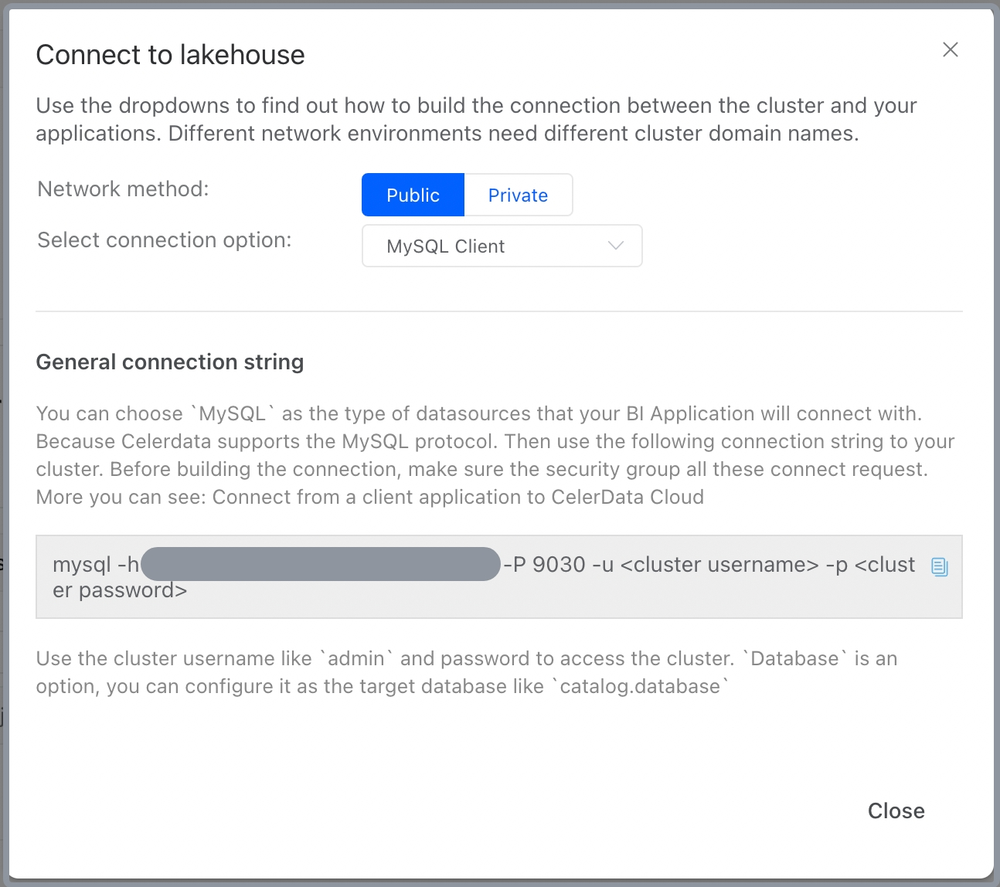
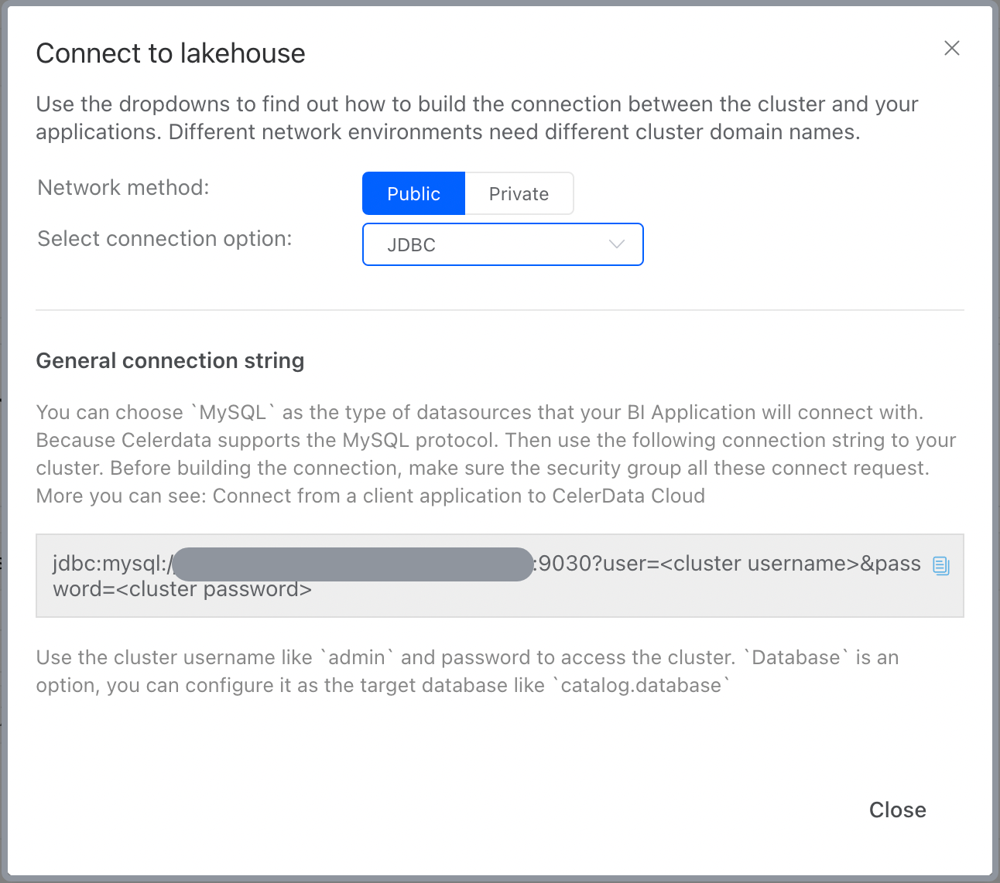

# Connect to a CelerData cluster

You can connect your CelerData cluster via MySQL Client or JDBC URL.

## Prerequisites

- A client with MySQL 5.5 or higher installed is needed for MySQL client connections.
- A database user identity for the cluster is needed for the cluster connection. Ask your cluster administrator to [create a cluster user](../security/data_access_control/manage_users.md) for you if you do not already have one.
- Make sure your cluster is accessible by clients or applications.

> **NOTE**
>
> A default database user `admin` with the ADMIN privilege is created after a CelerData cluster is created. You can connect to a new cluster by using the username `admin` and the corresponding password assigned to the user `admin` during the cluster creation.

## Procedure

1. Sign in to the [CelerData Cloud Private console](https://cloud.celerdata.com/login).
2. On the **Clusters** page, click the cluster that you want to connect to.
3. On the cluster details page, click **Help me connect** in the **Connection properties** section.
4. On the page that appears, choose the appropriate **Network method** and **connection option**.

   - If you connect to the cluster from your MySQL client, choose **MySQL Client** in **Select connection option** to check the **Client command**, and click the copy button to copy the command.

     

   - If you connect to the cluster from your application via JDBC, choose **JDBC** in **Select connection option** to check the **JDBC URL**, and click the copy button to copy the URL.

     

5. Connect to the cluster from your MySQL client or from your application via JDBC URL.

   - If you connect the cluster from your MySQL client, make sure to  replace the `<cluster username>` and `<cluster password>` with the username and password of your database user identity when you paste and run the command.
   - If you connect the cluster from your application via JDBC, make sure to replace the `<cluster username>` and `<cluster password>` with the username and password of your database user identity when you enclose the JDBC URL in your application. You can use the MySQL JDBC driver in your application.
