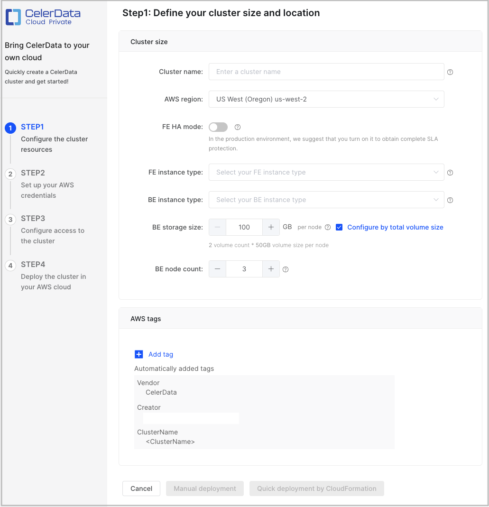
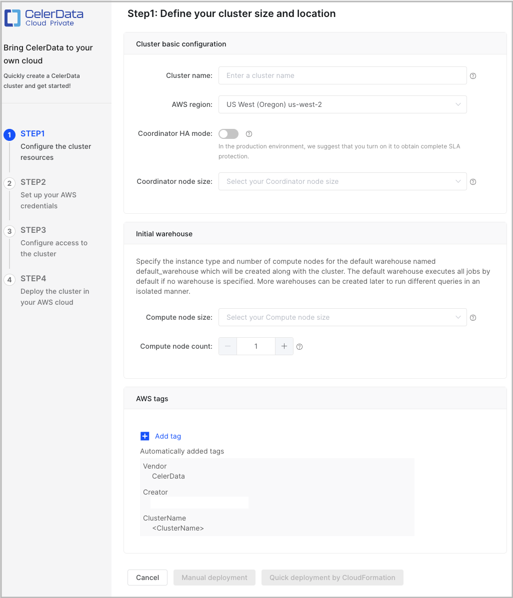
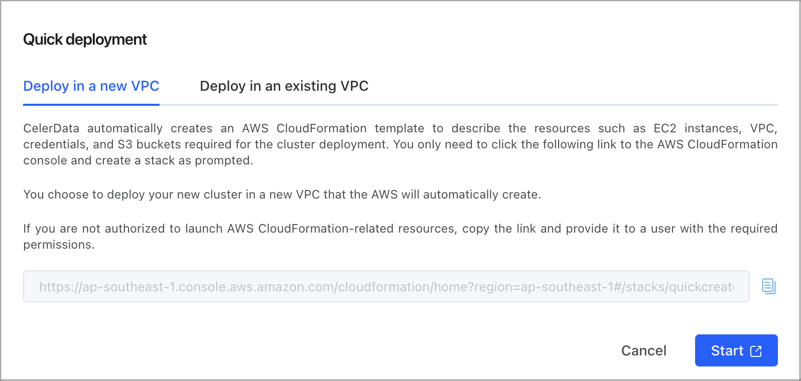
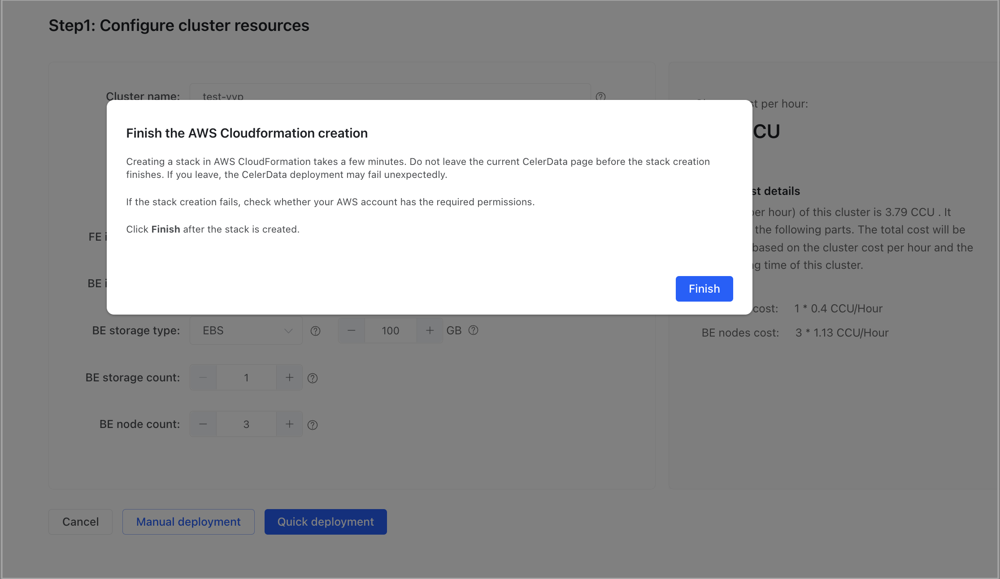
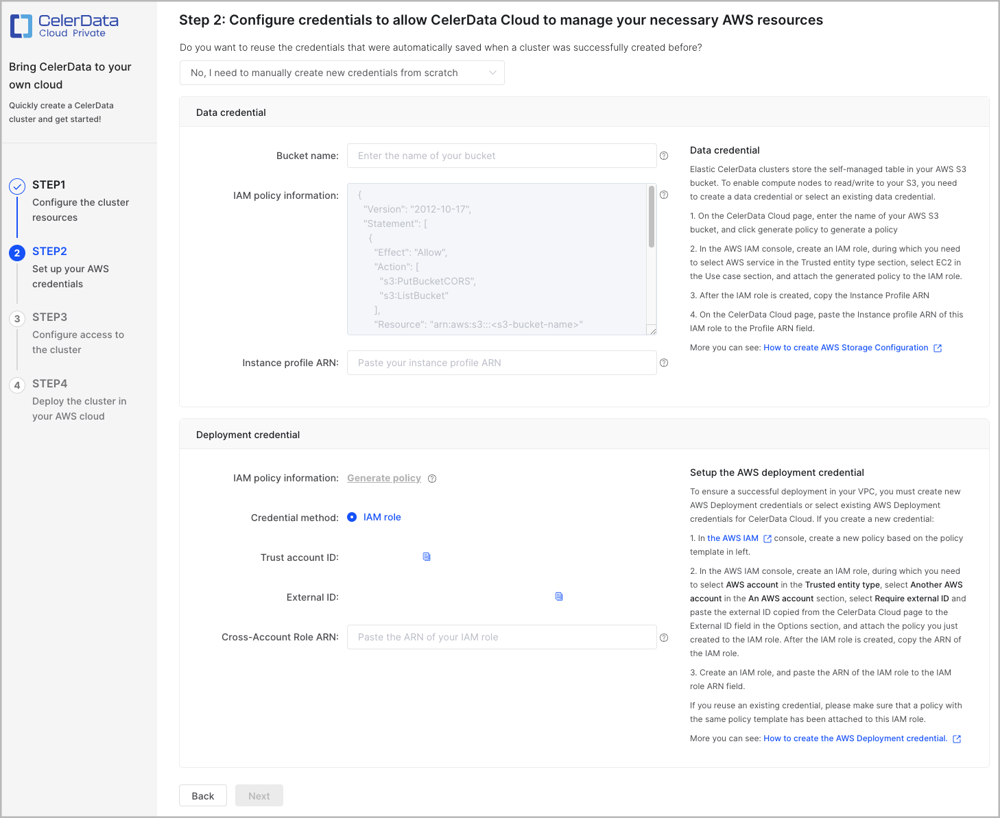
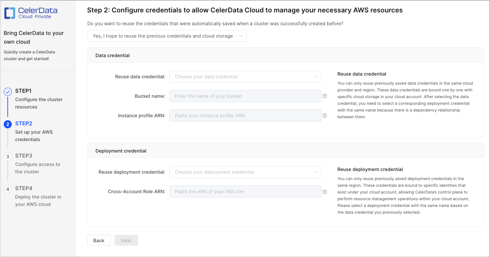
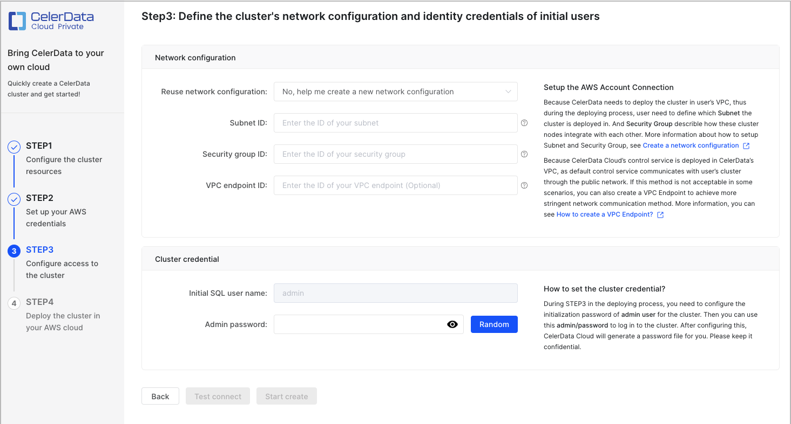
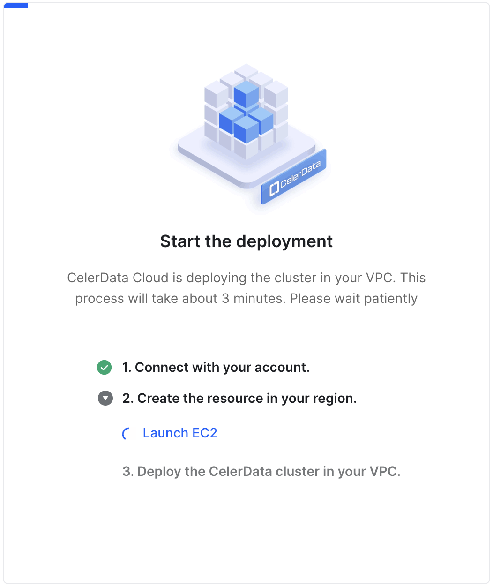
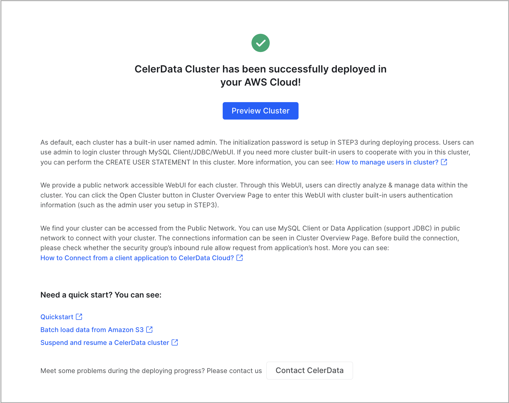

# Deployment on AWS

CelerData provides a user-friendly deployment wizard that simplifies the process of deploying a classic or elastic cluster on AWS into four easy steps:

- STEP1: Configure the cluster resources
- STEP2: Set up your AWS credentials
- STEP3: Configure access to the cluster
- STEP4: Deploy the cluster on your AWS cloud

## Start the deployment wizard

Follow these steps to start the deployment wizard:

1. Sign in to the [CelerData Cloud Private console](https://cloud.celerdata.com/login).
2. On the **Clusters** page, click **Create cluster**.
3. In the dialog box that is displayed, choose **Classic cluster** or **Elastic cluster**, choose **AWS** as your cloud provider, and then click **Next**.

After you start the deployment wizard, you can configure and run a quick deployment or a manual deployment as described below.

> **NOTE**
>
> For AWS, CelerData provides two deployment methods: manual deployment and quick deployment. With manual deployment, you will need to create your own credentials and resources, which can be time-consuming. We recommend that you use quick deployment, which automates the deployment process and saves you time and effort.

## Configure and run a quick deployment

Quick deployment launches a CloudFormation template to help you create the required credentials and provision and configure the following AWS resources, all included in a CloudFormation stack:

- An EC2 security group, which acts as a virtual firewall to control the traffic that is allowed to and from the AWS resources with which the security group is associated. The security group ensures that only traffic from CelerData reaches the AWS resources allocated for your CelerData cluster.
- An S3 bucket, which stores the query profile information for your CelerData cluster.
- IAM roles, which are granted permissions that allow your CelerData cluster to access the related AWS resources.
- A VPC and a subnet, on which your CelerData cluster resides.

To learn more about AWS CloudFormation, see [What is AWS CloudFormation?](https://docs.aws.amazon.com/AWSCloudFormation/latest/UserGuide/Welcome.html)

With similar procedures, you can deploy a CelerData cluster into a new or existing VPC.

After you start the deployment wizard (see the preceding "[Start the deployment wizard](#start-the-deployment-wizard)" section), you only need to finish **STEP1**. CelerData will finish the remaining steps.

1. In **STEP1: Configure the cluster resources**, configure the cluster based on your business requirements, and optionally click **Add tag** to add one or more tags to the cluster. Then, click **Quick deployment by CloudFormation** to continue. The tags you add here will be attached to the AWS cloud resources associated with the cluster.

   > **NOTE**
   >
   > - CelerData provides a [Free Developer Tier](../../get_started/free_developer_tier.md). To use it, you must select FE and BE instance types that provide 4 CPU cores and 16-GB RAM.
   > - 4 CPU cores and 16-GB RAM are also the minimum configuration package for FEs and BEs.

   For a classic cluster, configure the following configuration items.

   | **Parameter**   | **Required** | **Description**                                              |
   | --------------- | ------------ | ------------------------------------------------------------ |
   | Cluster name    | Yes          | Enter the name of the cluster. The name cannot be changed after the cluster is created. We recommend that you enter an informative name that can help you identify the cluster with ease at a later time. |
   | AWS region      | Yes          | Select the AWS region that hosts the cluster. For information about the regions supported by CelerData, see [Supported cloud platforms and regions](../cloud_platforms_and_regions.md). |
   | FE HA mode   | No           | Enable or disable the FE HA mode. The FE HA mode is disabled by default.<ul><li>If the FE HA mode is disabled, only one FE will be deployed. This setting is recommended if you create a proof-of-concept cluster to learn about what CelerData can do for you, or if you create a small cluster just for testing purposes.</li><li>If the FE HA mode is enabled, three FEs will be deployed. This setting is recommended if you create a cluster for a production-ready environment. With three FEs, the cluster can process a lot more highly concurrent queries while ensuring high availability.</li></ul> |
   | FE instance type    | Yes          | Select an instance type for the FE nodes in the cluster.     |
   | BE instance type    | Yes          | Select an instance type for the BE nodes in the cluster.     |
   | BE storage size | Yes | Specify the storage capacity that you want the BE nodes each to provide in the cluster. |
   | BE node count   | Yes          | Specify the number of BE nodes you want to deploy in the cluster. You can determine the number of BEs based on the amount of data to process. The default value is **3**, because CelerData needs to store each table in three replicas on three different BEs. |

   

   For an elastic cluster, configure the following configuration items.

   | **Parameter**   | **Required** | **Description**                                              |
   | --------------- | ------------ | ------------------------------------------------------------ |
   | Cluster name    | Yes          | Enter the name of the cluster. The name cannot be changed after the cluster is created. We recommend that you enter an informative name that can help you identify the cluster with ease at a later time. |
   | AWS region      | Yes          | Select the AWS region that hosts the cluster. For information about the regions supported by CelerData, see [Supported cloud platforms and regions](../cloud_platforms_and_regions.md). |
   | Coordinator HA mode   | No     | Enable or disable the coordinator HA mode. The coordinator HA mode is disabled by default.<ul><li>If the coordinator HA mode is disabled, only one coordinator will be deployed. This setting is recommended if you create a proof-of-concept cluster to learn about what CelerData can do for you, or if you create a small cluster just for testing purposes.</li><li>If the coordinator HA mode is enabled, three coordinators will be deployed. This setting is recommended if you create a cluster for a production-ready environment. With three coordinators, the cluster can process a lot more highly concurrent queries while ensuring high availability.</li></ul> |
   | Coordinator node size | Yes    | Select an instance type for the coordinator nodes in the cluster. |
   | Compute node size     | Yes    | Select an instance type for the compute nodes of the default warehouse in the cluster. |
   | Compute node count    | Yes    | Specify the number of compute nodes for the default warehouse in the cluster. You can determine the number of compute nodes based on the amount of data to process. The default value is **1**. |

   

2. In the **Quick deployment** dialog box, choose **Deploy in a new VPC** or **Deploy in an existing VPC** and click **Start**.

   > **NOTE**
   >
   > If you do not have the permissions on AWS CloudFormation, click the **Copy** icon next to the displayed URL and provide the URL to an authorized user, who can then use the URL to open the AWS CloudFormation console and create a stack for you.

   

3. On the AWS login page, enter your account information and click **Sign in**.

   You are directed to the AWS CloudFormation console.

4. On the **Quick create stack** page, perform the following operations:

   a. In the **Stack name** section, specify the stack name.

   b. In the **Cluster Configuration** section, specify the cluster name. We recommend that you retain the cluster name you have specified in CelerData. Then, enter a password, and confirm the password.

   c. In the **Storage Configuration** section, specify the S3 bucket name.

   d. In the **Network Configuration** section, specify the VPC name (if you choose to deploy the cluster into a new VPC), or select a VPC and then a subnet from that VPC (if you choose to deploy the cluster into an existing VPC).

   e. In the **Capabilities** section, read the message and select **I acknowledge that AWS CloudFormation might create IAM resources with custom names.**

   f. Click **Create stack**.

5. Return to the CelerData Cloud Private console, and click **Finish** in the **Finish the AWS CloudFormation creation** message.

   

6. Refresh the **Clusters** page until you see the cluster you have created.

   - If the cluster is in the **Deploying** state, the cluster deployment has not finished. You can click **Deploying** to view the deployment progress.

     When the cluster deployment is complete, CelerData displays a message that reads "CelerData Cluster has been successfully deployed in your AWS Cloud!" You can click **Preview cluster** below the message to view the cluster.

   - If the cluster is in the **Running** state, the cluster deployment has finished. You can click the cluster to view it.

## Configure and run a manual deployment

To ensure a successful deployment, you must provide a data credential, a deployment credential, and a network configuration:

- Data credential

  A data credential declares read and write permissions on an S3 bucket, which is used to store query profiles. See [Manage data credentials for AWS](../../cloud_settings/aws_cloud_settings/manage_aws_data_credentials.md).

- Deployment credential

  A deployment credential references a cross-account IAM role created within your AWS account. See [Manage deployment credentials for AWS](../../cloud_settings/aws_cloud_settings/manage_aws_deployment_credentials.md). A policy that contains the **Instance profile ARN** of the data credential must be attached to the cross-account IAM role referenced in the deployment credential. Otherwise, the deployment fails.

- Network configuration

  A network configuration enables connectivity between cluster nodes within your own VPC and between CelerData's VPC and your own VPC. See [Manage network configurations for AWS](../../cloud_settings/aws_cloud_settings/manage_aws_network_configurations.md).

After you start the deployment wizard (as explained in the preceding section "[Start the deployment wizard](#start-the-deployment-wizard)"), you will be guided through four required steps (**STEP1** to **STEP4**) for your deployment.

### STEP1: Configure the cluster resources

Configure the cluster based on your business requirements, and optionally click **Add tag** to add one or more tags to the cluster. Then, click **Manual deployment** to continue. The tags you add here will be attached to the AWS cloud resources associated with the cluster.

For information about the cluster configuration items, see Step 1 in the preceding "[Configure and run a quick deployment](#configure-and-run-a-quick-deployment)" section.

> **NOTE**
>
> To use the Free Developer Tier package, you must select FE and BE instance types that provide up to 4 CPU cores and up to 16-GB RAM.

### STEP2: Set up your AWS credentials

In this step, you need to create a new data credential and a new deployment credential or select existing ones that are automatically created by CelerData upon a previous successful deployment. After you complete the configurations, click **Next** to continue.

If you are new to CelerData, we recommend that you create a new data credential and a new deployment credential.

#### Choose to create new credentials

Select **No, I need to manually create new credentials from scratch**, as shown in the following figure. Then, create a data credential and a deployment credential.

##### Create a data credential

1. Sign in to the [AWS IAM console](https://console.aws.amazon.com/iam/), follow the instructions provided in [Create a service IAM role for EC2](../../aws/create_service_iam_role.md) to create a service IAM role for EC2, copy its instance profile ARN, and save the instance profile ARN to a location that you can access later.

2. Return to the CelerData Cloud Private console. In the **Data credential** section, enter the name of your bucket in the **Bucket name** field, and paste the instance profile ARN to the **Instance profile ARN** field.

   The following table describes the fields in the **Data credential** section.

   | **Field**                   | **Required** | **Description**                                              |
   | --------------------------- | ------------ | ------------------------------------------------------------ |
   | Bucket name                 | Yes          | Enter the name of your bucket. **NOTE** When you create a cluster, you can only use a data credential that references a bucket located in the same region as the cluster. This means that your bucket must reside in the same region as the cluster. |
   | IAM policy information      | N/A          | The JSON policy document that you use to create a policy. The policy defines the permissions on your bucket. |
   | Instance profile ARN        | Yes          | Enter the instance profile ARN of the service IAM role for EC2 that you have created to grant CelerData permission to access your bucket. |

##### Create a deployment credential

Note that the deployment credential you create must be attached a policy that contains the **Instance profile ARN** of the data credential.

1. In the CelerData Cloud Private console, click **Generate policy** next to **IAM policy information** to generate a JSON policy document.

2. Sign in to the [AWS IAM console](https://console.aws.amazon.com/iam/), follow the instructions provided in [Create a cross-account IAM role](../../aws/create_iam_role.md) to create a cross-account IAM role, copy its ARN, and save the ARN to a location that you can access later.

3. Return to the CelerData Cloud Private console. In the **Deployment credential** section, paste the ARN to the **Cross-Account Role ARN** field.

   The following table describes the fields in the **Deployment credential** section.

   | **Field**              | **Required** | **Description**                                              |
   | ---------------------- | ------------ | ------------------------------------------------------------ |
   | IAM policy information | N/A          | The JSON policy document that you use to create a policy. The policy defines the permissions on specific resources in your own VPC. You need to click **Generate policy** to generate a JSON policy document as needed. |
   | Credential method      | Yes          | The type of credential that you use to control the permissions of CelerData to launch resources in your AWS cloud. The value is fixed at **IAM role**. **NOTE** CelerData supports only RAM roles as credentials. |
   | Trust account ID       | N/A          | The account ID that you use to create a cross-account IAM role. **NOTE** You cannot edit the trust account ID. The trust account ID and the external ID are used together to identify the account that can use the IAM role. |
   | External ID            | N/A          | The external ID that you use to create a cross-account IAM role. **NOTE** You cannot edit the external ID. The trust account ID and the external ID are used together to identify the account that can use the IAM role. |
   | Cross-Account Role ARN | Yes          | Enter the ARN of the cross-account IAM role that you have created to grant CelerData permission to launch and manage resources in your AWS cloud. |

#### Choose to select existing credentials

Select **Yes, I hope to reuse the previous credentials and cloud storage**, as shown in the following figure. Then, select an existing data credential and an existing deployment credential.

##### Select a data credential

In the **Data credential** section, expand the **Reuse data credential** drop-down list and select a data credential that belongs to the same AWS region (namely, the one you selected in **STEP1**) as the cluster.

> **NOTE**
>
> The drop-down list displays all data credentials that you have manually created and those that are automatically created by CelerData upon previous successful deployments.

After you select a data credential, CelerData automatically fills in the **Bucket name** and **Instance profile ARN** fields.

The following table describes the fields in the **Data credential** section.

| **Field**                   | **Required** | **Description**                                              |
| --------------------------- | ------------ | ------------------------------------------------------------ |
| Bucket name                 | Yes          | Enter the name of your bucket. **NOTE** When you create a cluster, you can only use a data credential that references a bucket located in the same AWS region as the cluster. This means that your bucket must reside in the same AWS region as the cluster. |
| Instance profile ARN        | Yes          | Enter the instance profile ARN of the service IAM role for EC2 that you have created to grant CelerData permission to access your bucket. |

##### Select a deployment credential

In the **Deployment credential** section, expand the **Reuse deployment credential** drop-down list and select a deployment credential that belongs to the same AWS region (namely, the one you selected in **STEP1**) as the cluster and is attached a policy that contains the **Instance profile ARN** of the data credential you have configured.

> **NOTE**
>
> The drop-down list displays all deployment credentials that you have manually created and those that are automatically created by CelerData upon previous successful deployments.

After you select a deployment credential, CelerData automatically fills in the **Cross-Account Role ARN** field.

The following table describes the field in the **Deployment credential** section.

| **Field**              | **Required** | **Description**                                              |
| ---------------------- | ------------ | ------------------------------------------------------------ |
| Cross-Account Role ARN | Yes          | Enter the ARN of the cross-account IAM role that you have created to grant CelerData permission to launch and manage resources in your AWS cloud. |

### STEP3: Configure access to the cluster

In this step, you need to:

- Configure a network configuration. You can create a new network configuration or select an existing one that is automatically created by CelerData upon a previous successful deployment.

  > **NOTE**
  >
  > CelerData allows you to reuse the same network configuration among multiple clusters, meaning that multiple clusters can share the same VPC, subnet, and security group.

- Configure the cluster credential.
- Test connectivity.

#### Configure a network configuration

In the **Network configuration** section, create a new network configuration or select an existing one.

If you are new to CelerData, we recommend that you create a new network configuration.

##### Create a new network configuration

1. Sign in to the [AWS IAM console](https://console.aws.amazon.com/iam/).

2. See the region picker in the upper-right corner of the page, and switch to the AWS region that you have selected in **STEP1** if needed.

3. In the left-side navigation pane, choose **Virtual private cloud** > **Your VPCs**. On the **Your VPCs** page, find a VPC that meets [CelerData deployment requirements](../../aws/create_vpc.md).

   > **NOTE**
   >
   > If you do not have a qualified VPC in the AWS region that you have selected, create one in that AWS region by following the instructions provided in [Create a VPC and related resources](../../aws/create_vpc.md).

4. In the left-side navigation pane, choose **Virtual private cloud** > **Subnets**. On the **Subnets** page, select a subnet within the VPC that you have selected, copy the ID of the subnet, and save the ID to a location that you can access later.

5. Follow the instructions provided in [Create a security group](../../aws/create_security_group.md) to create a security group, copy the ID of the security group, and save the ID to a location that you can access later.

6. Return to the CelerData Cloud Private console. In the **Network Configuration** section, paste the subnet ID to the **Subnet ID** field and the security group ID to the **Security group ID** field.

   The following table describes the fields in the **Network Configuration** section.

   | **Field**                    | **Required** | **Description**                                              |
   | ---------------------------- | ------------ | ------------------------------------------------------------ |
   | Subnet ID                    | Yes          | The ID of the subnet that you use to deploy cluster nodes for data analysis. |
   | Security group ID            | Yes          | The ID of the security group that you use to enable connectivity between cluster nodes within your own VPC and between CelerData's VPC and your own VPC over TLS. |
   | VPC endpoint ID              | No           | The ID of the VPC endpoint that you create by using [PrivateLink](https://docs.aws.amazon.com/whitepapers/latest/aws-vpc-connectivity-options/aws-privatelink.html) to allow direct, secure connectivity between CelerData's VPC and your own VPC. The connectivity is for AWS VPCs in the same AWS region. For information about how to create a VPC endpoint, see [Create a VPC endpoint](../../aws/create_vpc_endpoint.md). **NOTE** If you do not specify a VPC endpoint ID, CelerData's VPC communicates with your own VPC over the Internet. |

##### Select an existing network configuration

Expand the **Reuse network configuration** drop-down list and select a network configuration that belongs to the same AWS region (namely, the one you selected in **STEP1**) as the cluster.

> **NOTE**
>
> The drop-down list displays all network configurations that you have manually created and those that are automatically created by CelerData upon previous successful deployments.

After you select a network configuration, CelerData automatically fills in the **Subnet ID**, **Security group ID**, and (optional) **VPC endpoint ID** fields.

The following table describes the fields in the **Network Configuration** section.

| **Field**                    | **Required** | **Description**                                              |
| ---------------------------- | ------------ | ------------------------------------------------------------ |
| Subnet ID                    | Yes          | The ID of the subnet that you use to deploy cluster nodes for data analysis. |
| Security group ID            | Yes          | The ID of the security group that you use to enable connectivity between cluster nodes within your own VPC and between CelerData's VPC and your own VPC over TLS. |
| VPC endpoint ID              | No           | The ID of the VPC endpoint that you create by using [PrivateLink](https://docs.aws.amazon.com/whitepapers/latest/aws-vpc-connectivity-options/aws-privatelink.html) to allow direct, secure connectivity between CelerData's VPC and your own VPC. The connectivity is for AWS VPCs in the same AWS region. For information about how to create a VPC endpoint, see [Create a VPC endpoint](../../aws/create_vpc_endpoint.md). **NOTE** If you do not specify a VPC endpoint ID, CelerData's VPC communicates with your own VPC over the Internet. |

#### Configure the cluster credential

In the **Cluster credential** section, enter a password for the **admin** account in the **Admin password** field or click **Random** next to the **Admin password** field to obtain a password that is generated by CelerData.

> **NOTE**
>
> - The **admin** account is the administrator of the cluster and has all privileges enabled within your CelerData cloud account.
> - After the cluster is created, you can navigate to the cluster details page and in the upper-right corner of the page choose **Manage** > **Reset password** to reset the password of the **admin** account. Note that you can reset the password of the **admin** account only when the cluster is in the **Running** state.

#### Test connectivity

1. Click **Test connect** to verify that CelerData's VPC can connect with your own VPC.

   After the connection passes the test, the **Start create** button is enabled.

2. Click **Start create** to continue.

### STEP4: Deploy the cluster on your AWS cloud

After you complete the preceding three steps, CelerData automatically launches cloud resources and deploys the cluster in your own VPC. This takes a few minutes.

When the deployment is complete, a message shown in the following figure appears.

You can click **Preview Cluster** in the message to view the cluster. You can also return to the **Clusters** page to view the cluster, which is in the **Running** state, upon successful deployment.

## What's next

At any time, you can connect to the cluster from a JDBC driver or a MySQL client or by using the SQL Editor. For more information, see [Connect to a CelerData cluster](../connect_cluster.md).

You can also view and manage the cluster to your needs in the CelerData Cloud Private console:

- [View a CelerData cluster](../../cluster_management/view_cluster.md).
- [Scale a CelerData cluster](../../cluster_management/scale_cluster.md).
- [Release a CelerData cluster](../../cluster_management/release_cluster.md).
- [Suspend and resume a CelerData cluster](../../cluster_management/suspend_resume_cluster.md).
- [Open a CelerData cluster](../../cluster_management/open_cluster.md).
