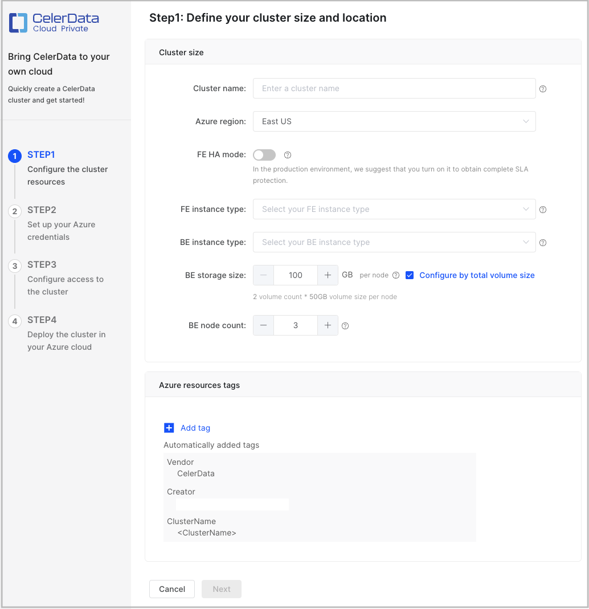
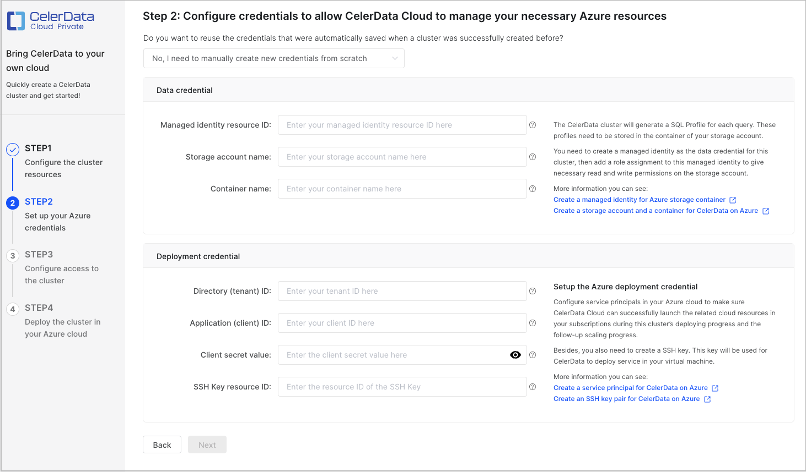
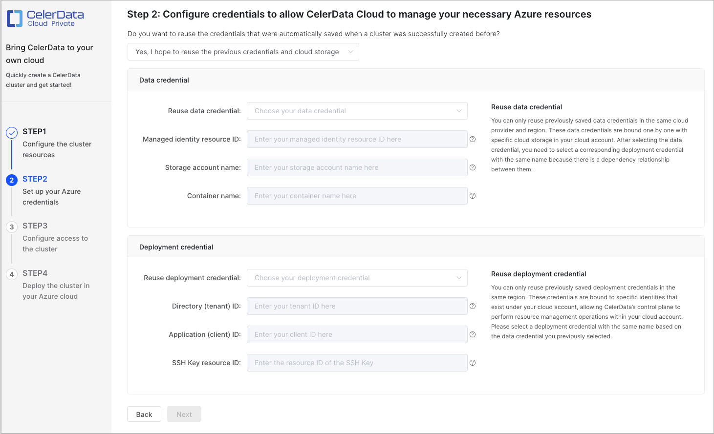
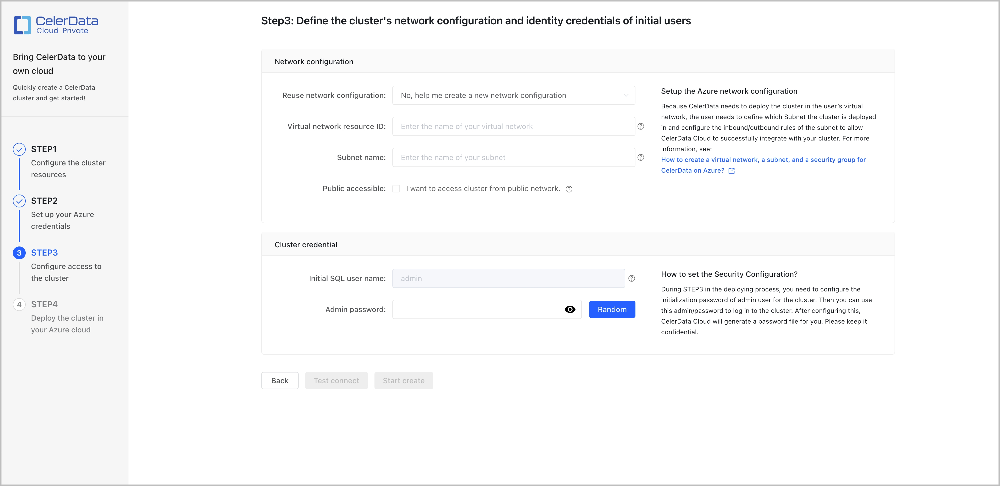
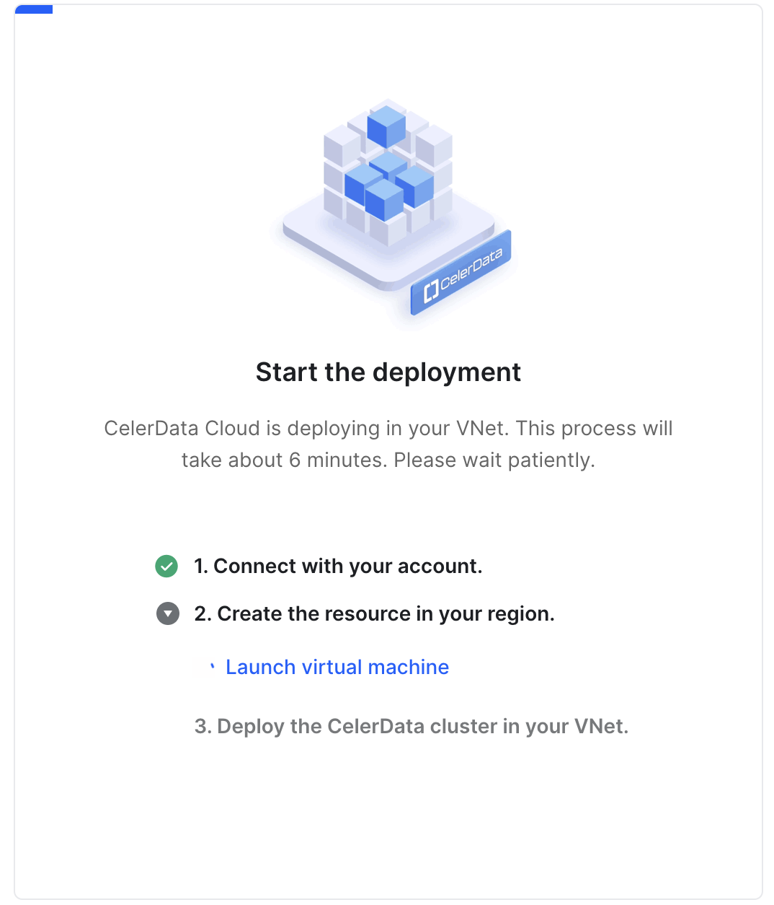
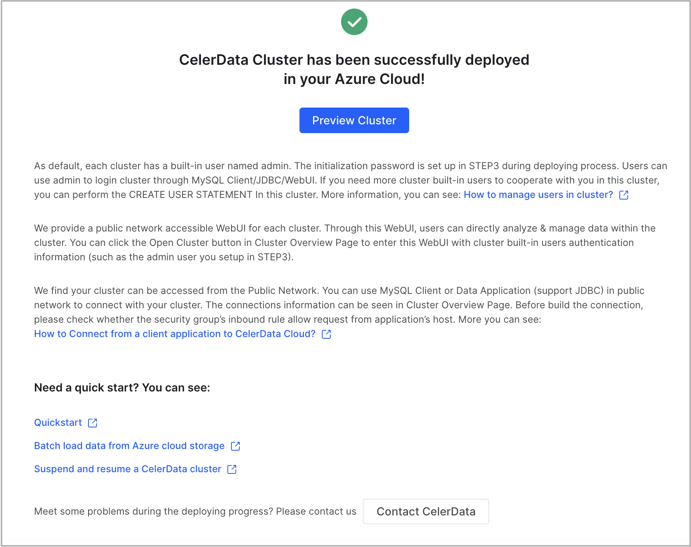

# Deployment on Azure

CelerData provides a user-friendly deployment wizard that simplifies the process of deploying a classic cluster on Azure into four easy steps:

- STEP1: Configure the cluster resources
- STEP2: Set up your Azure credentials
- STEP3: Configure access to the cluster
- STEP4: Deploy the cluster on your Azure cloud

> **NOTE**
>
> Currently, CelerData supports deploying only classic clusters on Azure. Classic clusters can store the data within them persistently onto their associated VMs' local disks.

## Limits

Deploying a CelerData cluster requires a variety of Azure resources, including [a storage account](../../azure/create_storage_account_container.md), [a managed identity](../../azure/create_managed_identity.md), [a virtual network](../../azure/create_virtual_network_subnet_security_group.md), [a security group](../../azure/create_managed_identity.md), and [an SSH key pair](../../azure/create_ssh_key_pair.md). These resources must belong to the same subscription and the same resource group, and must belong to the same Azure region which is also the region for your CelerData cluster deployment.

## Start the deployment wizard

Follow these steps to start the deployment wizard:

1. Sign in to the [CelerData Cloud Private console](https://cloud.celerdata.com/login).
2. On the **Clusters** page, click **Create cluster**.
3. In the dialog box that is displayed, choose **Classic cluster**, choose **Azure** as your cloud provider, and then click **Next**.

After you start the deployment wizard, you can configure and run a manual deployment as described below.

> **NOTE**
>
> For Azure, CelerData supports only manual deployments.

## Configure and run a manual deployment

To ensure a successful deployment, you must provide a data credential, a deployment credential, and a network configuration:

- Data credential

  A data credential for Azure in CelerData references a managed identity, which declares read and write permissions on a container in an Azure storage account. Through a managed identity, the VMs within an Azure virtual network can gain read and write permissions on specific storage. After you create a CelerData cluster by using a specific data credential, all profiles generated by CelerData for SQL queries within the cluster will be stored to the Azure storage account and container referenced in the data credential.

- Deployment credential

  A deployment credential for Azure in CelerData includes a service principal and an SSH key pair. The service principal allows CelerData to launch the necessary resources required for your deployment and follow-up scaling, while the SSH key pair provides CelerData the necessary access to deploy services on your Azure virtual network.

- Network configuration

  A network configuration for Azure in CelerData defines the network infrastructure such as the virtual network and subnet that hosts your CelerData cluster deployment, as well as the security rules that control the incoming and outgoing traffic of the CelerData cluster.

After you start the deployment wizard (as explained in the preceding section "[Start the deployment wizard](#start-the-deployment-wizard)"), you will be guided through four required steps (**STEP1** to **STEP4**) for your deployment.

### STEP1: Configure the cluster resources

Configure the cluster based on your business requirements, and optionally click **Add tag** to add one or more tags to the cluster. Then, click **Next** to continue. The tags you add here will be attached to the Azure resources associated with the cluster.

> **NOTE**
>
> - CelerData provides a [Free Developer Tier](../../get_started/free_developer_tier.md). To use it, you must select FE and BE instance types that provide 4 CPU cores and 16-GB RAM.
> - 4 CPU cores and 16-GB RAM are also the minimum configuration package for FEs and BEs.

The following table describes the cluster configuration items.

| Parameter        | Required | Description                                                  |
| ---------------- | -------- | ------------------------------------------------------------ |
| Cluster name     | Yes      | Enter the name of the cluster. The name cannot be changed after the cluster is created. We recommend that you enter an informative name that can help you identify the cluster with ease at a later time. |
| Azure region     | Yes      | Select the Azure region that hosts the cluster. For information about the regions supported by CelerData, see [Supported cloud platforms and regions](../../get_started/cloud_platforms_and_regions.md). |
| FE HA mode       | No       | Enable or disable the FE HA mode. The FE HA mode is disabled by default.<ul><li>If the FE HA mode is disabled, only one FE will be deployed. This setting is recommended if you create a proof-of-concept cluster to learn about what CelerData can do for you, or if you create a small cluster just for testing purposes.</li><li>If the FE HA mode is enabled, three FEs will be deployed. This setting is recommended if you create a cluster for a production-ready environment. With three FEs, the cluster can process a lot more highly concurrent queries while ensuring high availability.</li></ul> |
| FE instance type | Yes      | Select an instance type for the FE nodes in the cluster.     |
| BE instance type | Yes      | Select an instance type for the BE nodes in the cluster.     |
| BE storage size  | Yes      | Specify the storage capacity that you want the BE nodes each to provide in the cluster. |
| BE node count    | Yes      | Specify the number of BE nodes you want to deploy in the cluster. You can determine the number of BEs based on the amount of data to process. The default value is **3**, because CelerData needs to store each table in three replicas on three different BEs. |

### STEP2: Set up your Azure credentials

In this step, you need to create a new data credential and a new deployment credential or select existing ones that are automatically created by CelerData upon a previous successful deployment. After you complete the configurations, click **Next** to continue.

If you are new to CelerData, we recommend that you create a new data credential and a new deployment credential.

#### Choose to create new credentials

Select **No, I need to manually create new credentials from scratch**, as shown in the following figure. Then, create a data credential and a deployment credential.

##### Create a data credential

1. Sign in to the [Microsoft Azure portal](https://portal.azure.com/#home). Follow the instructions provided in [Create a managed identity for your Azure storage account](../../azure/create_managed_identity.md) to create a managed identity that can access your storage account and obtain the **Id** of the managed identity from the managed identity's **Properties** page. Then, save the information that you have obtained to a location that you can access later.

2. Return to the CelerData Cloud Private console:

   - In the **Managed identity resource ID** field, paste the ID of the managed identity.

   - In the **Storage account name** field, specify the name of your storage account.

   - In the **Container name** field, specify the name of your container.

   The following table describes the fields in the **Data credential** section.

   | **Field**                    | **Required** | **Description**                                              |
   | ---------------------------- | ------------ | ------------------------------------------------------------ |
   | Managed identity resource ID | Yes          | Enter the ID of the managed identity. Format: `/subscriptions/xxxxxxxxxxx/resourcegroups/yyyyyy/providers/Microsoft.ManagedIdentity/userAssignedIdentities/zzzz`. |
   | Storage account name         | Yes          | Enter the name of your storage account. **NOTICE** The storage account must belong to the Azure region you selected in **STEP1.** |
   | Container name               | Yes          | Enter the name of a container within your storage account. **NOTICE** The container must belong to the storage account and have its **Public access level** set to **Private (no anonymous access)**. Additionally, the managed identity you use must have permissions on the container. For more information, see [Create a storage account and a container for CelerData in Azure](../../azure/create_storage_account_container.md). |

##### Create a deployment credential

1. Sign in to the [Microsoft Azure portal](https://portal.azure.com/#home). Follow the instructions provided in [Create a service principal for CelerData on Azure](../../azure/create_service_principal.md) to create an App registration and obtain the **Directory (tenant) ID** and **Application (client) ID** from the registered application's **Overview** page and the **Value** of the client secret from the registered application's **Certificates & secrets** page. Follow the instructions provided in [Create an SSH key pair for CelerData on Azure](../../azure/create_ssh_key_pair.md) to create an SSH key pair and obtain the **Id** of the SSH Key pair from the SSH key pair's **Properties** page. Then, save the information that you have obtained to a location that you can access later.

2. Return to the CelerData Cloud Private console:

   - In the **Directory (tenant) ID** field, paste the directory (tenant) ID of the registered application.
   - In the **Application (client) ID** field, paste the application (client) ID of the registered application.
   - In the **Client secret value** field, paste the value of the client secret of the registered application.
   - In the **SSH Key resource ID** field, paste the ID of the SSH key pair.

   The following table describes the fields in the **Deployment credential** section.

   | **Field**                   | **Required** | **Description**                                              |
   | --------------------------- | ------------ | ------------------------------------------------------------ |
   | Directory (tenant) ID       | Yes          | Enter the directory (tenant) ID of the registered application. |
   | Application (client) ID     | Yes          | Enter the application (client) ID of the registered application. |
   | Client secret value         |  Yes          | Enter the value of the client secret of the registered application. **CAUTION** Client secret values cannot be viewed, except for immediately after creation. Be sure to save the Secret value when created before leaving the page. |
   | SSH Key resource ID         | Yes          | Enter the ID of the SSH key pair. Format: `/subscriptions/xxxxxxxxx/resourceGroups/yyyyyy/providers/Microsoft.Compute/sshPublicKeys/zzzzz`. **NOTICE** The SSH key pair must belong to the same [resource group](../../azure/create_managed_identity.md) as the managed identity referenced in the data credential that you have selected or created in **STEP2** and to the Azure region you selected in **STEP1**. |

#### Choose to select existing credentials

Select **Yes, I hope to reuse the previous credentials and cloud storage**, as shown in the following figure. Then, select an existing data credential and an existing deployment credential.

##### Select a data credential

In the **Data credential** section, expand the **Reuse data credential** drop-down list and select a data credential that belongs to the same Azure region (namely, the one you selected in **STEP1**) as the cluster.

> **NOTE**
>
> The drop-down list displays all data credentials that are automatically created by CelerData upon previous successful deployments.

After you select a data credential, CelerData automatically fills in the **Managed identity resource ID**, **Storage account name**, and **Container name** fields.

The following table describes the fields in the **Data credential** section.

| **Field**                    | **Required** | **Description**                                              |
| ---------------------------- | ------------ | ------------------------------------------------------------ |
| Managed identity resource ID | Yes          | Enter the ID of the managed identity. Format: `/subscriptions/xxxxxxxxxxx/resourcegroups/yyyyyy/providers/Microsoft.ManagedIdentity/userAssignedIdentities/zzzz`. |
| Storage account name         | Yes          | Enter the name of your storage account. **NOTICE** The storage account must belong to the Azure region you selected in **STEP1.** |
| Container name               | Yes          | Enter the name of a container within your storage account. **NOTICE** The container must belong to the storage account and have its **Public access level** set to **Private (no anonymous access)**. Additionally, the managed identity you use must have permissions on the container. For more information, see [Create a storage account and a container for CelerData in Azure](../../azure/create_storage_account_container.md). |

##### Select a deployment credential

In the **Deployment credential** section, expand the **Reuse deployment credential** drop-down list and select a deployment credential that belongs to the same Azure region (namely, the one you selected in **STEP1**) as the cluster.

> **NOTE**
>
> The drop-down list displays all deployment credentials that are automatically created by CelerData upon previous successful deployments.

After you select a deployment credential, CelerData automatically fills in the **Directory (tenant) ID**, **Application (client) ID**, and **SSH Key resource ID** fields.

The following table describes the fields in the **Deployment credential** section.

| **Field**                   | **Required** | **Description**                                              |
| --------------------------- | ------------ | ------------------------------------------------------------ |
| Directory (tenant) ID       | Yes          | Enter the directory (tenant) ID of the registered application. |
| Application (client) ID     | Yes          | Enter the application (client) ID of the registered application. |
| SSH Key resource ID         | Yes          | Enter the ID of the SSH key pair. Format: `/subscriptions/xxxxxxxxx/resourceGroups/yyyyyy/providers/Microsoft.Compute/sshPublicKeys/zzzzz`. **NOTICE** The SSH key pair must belong to the same [resource group](../../azure/create_managed_identity.md) as the managed identity referenced in the data credential that you have selected or created in **STEP2** and to the Azure region you selected in **STEP1**. |

### STEP3: Configure access to the cluster

In this step, you need to:

- Configure a network configuration. You can create a new network configuration or select an existing one that is automatically created by CelerData upon a previous successful deployment.

  > **NOTE**
  >
  > CelerData allows you to reuse the same network configuration among multiple clusters, meaning that multiple clusters can share the same Azure virtual network, subnet, and security group.

- Configure the cluster credential.
- Test connectivity.

#### Configure a network configuration

In the **Network configuration** section, create a new network configuration or select an existing one.

If you are new to CelerData, we recommend that you create a new network configuration.

##### Create a new network configuration

1. Sign in to the [Microsoft Azure portal](https://portal.azure.com/#home). Follow the instructions provided in [Create a virtual network, a subnet, and a security group for CelerData on Azure](../../azure/create_virtual_network_subnet_security_group.md) to create an Azure virtual network and a subnet and obtain the **Resource ID** of the virtual network from the virtual network's **Properties** page and the name of the subnet on which you want to deploy the cluster within the virtual network. Then, save the information that you have obtained to a location that you can access later.

2. Return to the CelerData Cloud Private console. In the **Network Configuration** section, paste the resource ID of your Azure virtual network to the **Virtual network resource ID** field, and the name of the subnet to the **Subnet name** field.

   You can optionally specify whether the cluster can be accessed from public networks by selecting or clearing the check box next to **Public accessible**. If you select **Public accessible**, CelerData will attach a load balancer to the cluster to distribute incoming queries, and will assign a public domain name to the cluster so you can access the cluster over a public network. If you do not select **Public** **accessible**, the cluster is accessible only through a private domain name.

   The following table describes the fields in the **Network Configuration** section.

   | **Field**                   | **Required** | **Description**                                              |
   | --------------------------- | ------------ | ------------------------------------------------------------ |
   | Virtual network resource ID | Yes          | Enter the resource ID of the Azure virtual network. Format: `/subscriptions/xxxxxx/resourceGroups/yyyyyy/providers/Microsoft.Network/virtualNetworks/zzzzz`. |
   | Subnet name                 | Yes          | Enter the name of the subnet.                                |
   | Public accessible           | No           | Specify whether the cluster can be accessed from public networks. |

##### Select an existing network configuration

Expand the **Reuse network configuration** drop-down list and select a network configuration that belongs to the same Azure region (namely, the one you selected in **STEP1**) as the cluster.

> **NOTE**
>
> The drop-down list displays all network configurations that are automatically created by CelerData upon previous successful deployments.

After you select a network configuration, CelerData automatically fills in the **Virtual network resource ID** and **Subnet name** fields.

The following table describes the fields in the **Network Configuration** section.

| **Field**                   | **Required** | **Description**                                              |
| --------------------------- | ------------ | ------------------------------------------------------------ |
| Virtual network resource ID | Yes          | Enter the resource ID of the Azure virtual network. Format: `/subscriptions/xxxxxx/resourceGroups/yyyyyy/providers/Microsoft.Network/virtualNetworks/zzzzz`. |
| Subnet name                 | Yes          | Enter the name of the subnet.                                |

#### Configure the cluster credential

In the **Cluster credential** section, enter a password for the **admin** account in the **Admin password** field or click **Random** next to the **Admin password** field to obtain a password that is generated by CelerData.

> **NOTE**
>
> - The **admin** account is the administrator of the cluster and has all privileges enabled within your CelerData cloud account.
> - After the cluster is created, you can navigate to the cluster details page and in the upper-right corner of the page choose **Manage** > **Reset password** to reset the password of the **admin** account. Note that you can reset the password of the **admin** account only when the cluster is in the **Running** state.

#### Test connectivity

1. Click **Test** **connect** to verify connectivity between CelerData's Azure virtual network and your own Azure virtual network.

   After the connection passes the test, the **Start create** button is enabled.

2. Click **Start create** to continue.

### STEP4: Deploy the cluster on your Azure cloud

After you complete the preceding three steps, CelerData automatically launches cloud resources and deploys the cluster in your own Azure virtual network. This takes a few minutes.

When the deployment is complete, a message shown in the following figure appears.

You can click **Preview Cluster** in the message to view the cluster. You can also return to the **Clusters** page to view the cluster, which is in the **Running** state, upon successful deployment.

## What's next

At any time, you can connect to the cluster from a JDBC driver or a MySQL client or by using the SQL Editor. For more information, see [Connect to a CelerData cluster](https://docs-sandbox.celerdata.com/en-us/main/get_started/connect_cluster).

You can also view and manage the cluster to your needs in the CelerData Cloud Private console:

- [View a CelerData cluster](../../cluster_management/view_cluster.md).
- [Scale a CelerData cluster](../../cluster_management/scale_cluster.md).
- [Release a CelerData cluster](../../cluster_management/release_cluster.md).
- [Suspend and resume a CelerData cluster](../../cluster_management/suspend_resume_cluster.md).
- [Open a CelerData cluster](../../cluster_management/open_cluster.md).
