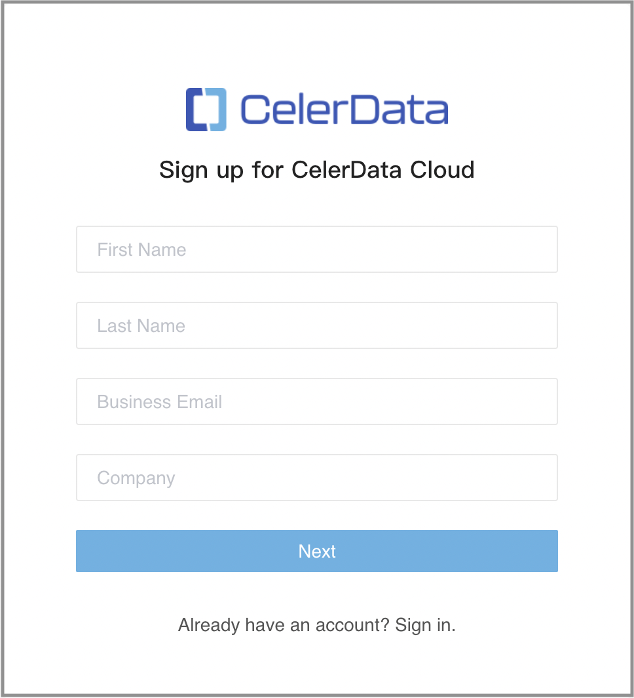
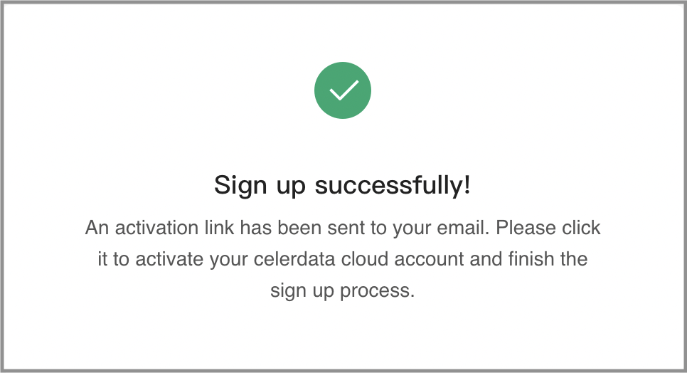
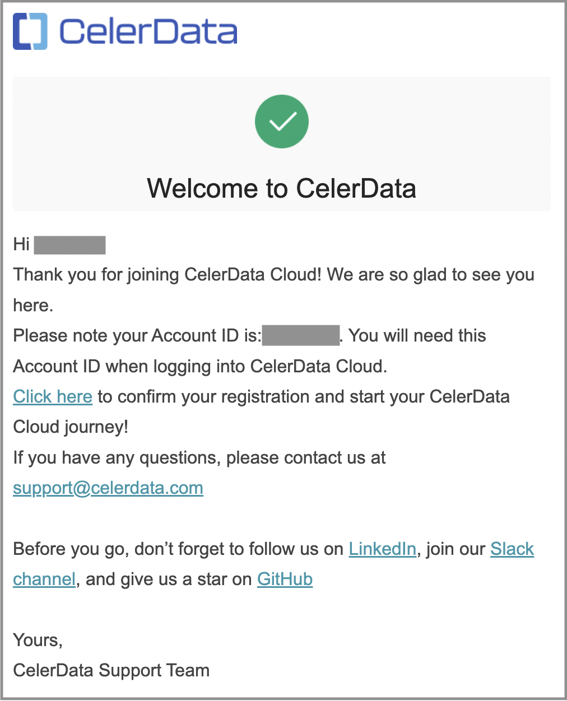
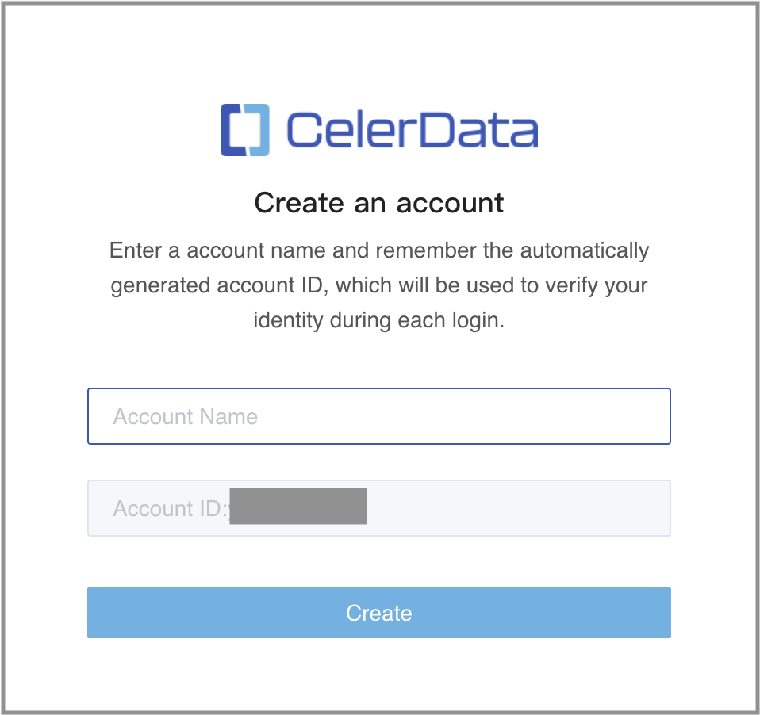
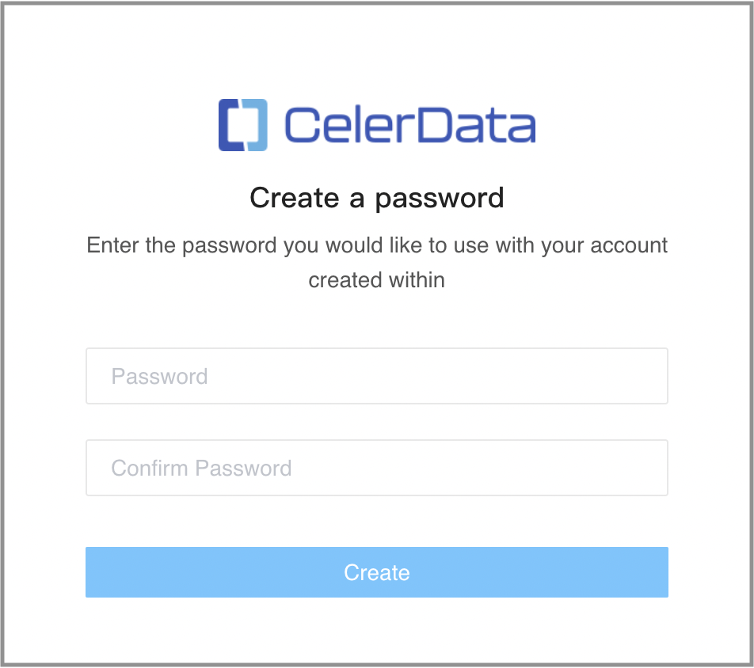
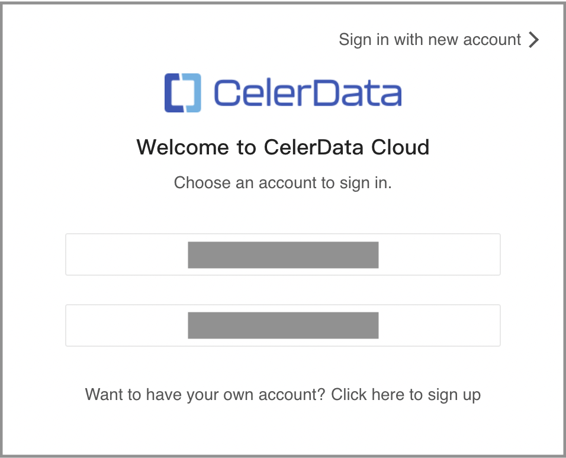
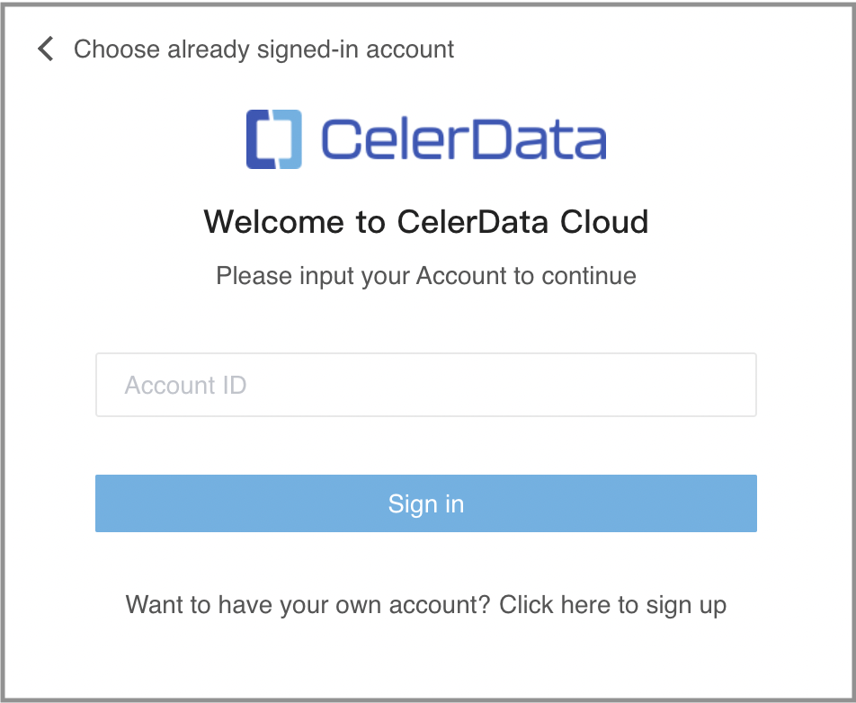
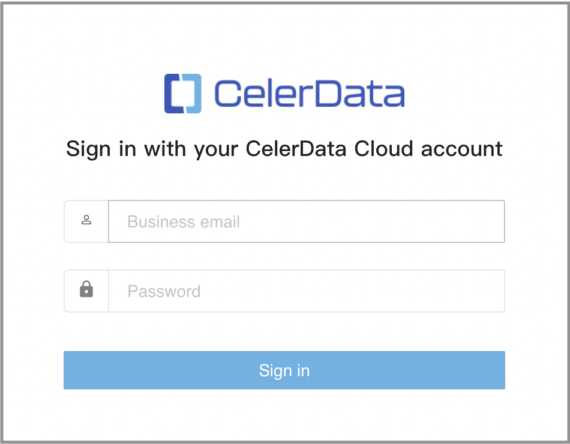

# Sign up or sign in to CelerData

Sign up for a CelerData cloud account with your email account.

## Sign up for CelerData

Follow these steps to sign up with your email account:

1. Open the [CelerData sign-up page](https://cloud.celerdata.com/login) in a browser.

   

2. Enter your first name, last name, business email address, and your company name. Then, click **Next**.

   A message will inform you that you have signed up successfully. We will then send a confirmation email with an activation link and your **Account ID** to this email address, so make sure this email address is valid and you have access to it.

   

3. Launch your email client and find the confirmation email. Take note of the **Account ID**, which is necessary when you log in to your CelerData cloud account. Then, click the activation link to confirm your registration.

   

   > **NOTE**
   >
   > If you cannot find the email in the inbox, check your Spam folder.

4. On the **Create an account** page, enter your **Account Name** and click **Create**.

   

5. On the **Create a password** page, enter a password, confirm the password, and then click **Create**.

   For information about the password requirements, see [Password requirements for members](../reference/System_limit.md).

   

   The browser redirects you to the Celerdata Cloud Private console. You can then enjoy your journey with CelerData.

## Sign in to your CelerData cloud account

To sign in to your CelerData cloud account, you will need the **Account ID** that we sent you via the confirmation email during account creation.

1. Open the [CelerData sign-in page](https://cloud.celerdata.com/login?step=account) in a browser.

2. Confirm your **Account ID**:

   - If you sign in from a browser that you have used to sign in before, you can choose the ID of your account and click it.

     The browser redirects you to a new page.

     

   - If you sign in from a browser that you have never used to sign in before, you must enter your **Account ID** and click **Sign in**.

     The browser redirects you to a new page.

     

3. Enter your business email and password, and click **Sign in** to log in to the CelerData Cloud Private console.

   
