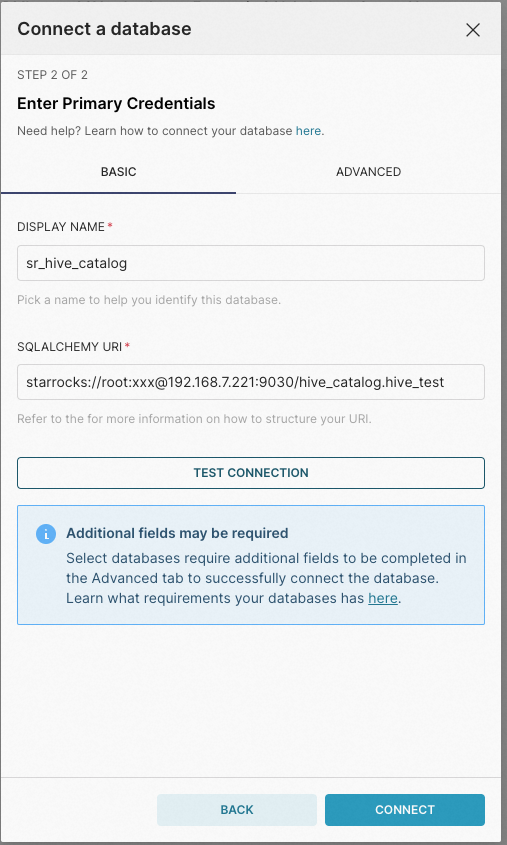

# Apache Superset

Apache Superset supports querying and visualizing both internal data and external data in CelerData.

## Prerequisites

### Installation

Make sure that you have finished the following installations:

1. Install the Python client for StarRocks on your Apache Superset server.

   ```SQL
   pip install starrocks
   ```

2. Install the latest version of Apache Superset. For more information, see [Installing Superset from Scratch](https://superset.apache.org/docs/installation/installing-superset-from-scratch/).

### Connectivity

Make sure that your CelerData cluster's inbound rules allow query requests from your Apache Superset server.

## Integration

Create a database in Apache Superset:




Take note of the following points:

- For **SUPPORTED DATABASES**, select **StarRocks**, which will be used as the data source.
- For **SQLALCHEMY** **URI**, enter a URI in the StarRocks SQLAlchemy URI format as below:

  ```SQL
  starrocks://<User>:<Password>@<Host>:<Port>/<Catalog>.<Database>
  ```

  The parameters in the URI are described as follows:

  - `User`: the username that is used to log in to your CelerData cluster, for example, `admin`.
  - `Password`: the password that is used to log in to your CelerData cluster.
  - `Host`: the endpoint of your CelerData cluster.
  - `Port`: the query port of your CelerData cluster, for example, `9030`.
  - `Catalog`: the target catalog in your CelerData cluster. Both internal and external catalogs are supported.
  - `Database`: the target database in your CelerData cluster. Both internal and external databases are supported.
