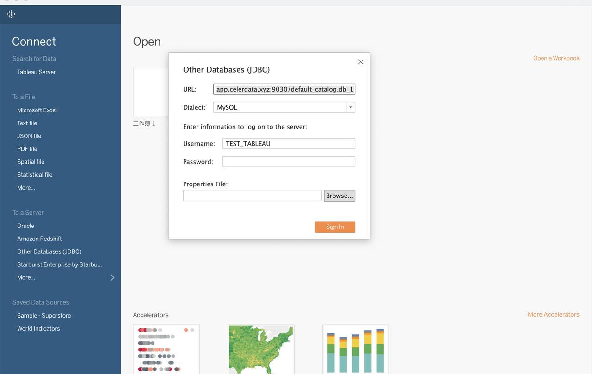

# Tableau Desktop

Tableau Desktop supports querying and visualizing both internal data and external data in CelerData.

## Prerequisites

Make sure that your CelerData cluster's inbound rules allow query requests from your Tableau server.

## Integration

Create a database in Tableau:



Take note of the following points:

- Select **Other Databases(****JDBC****)** as the data source.
- For **Dialect**, select **MySQL**.
- For **URL**, enter a URL in the MySQL URI format as below:

  ```SQL
  jdbc:mysql://<Host>:<Port>/<Catalog>.<Databases>
  ```

  The URL parameters are described as follows:

  - `Host`: the endpoint of your CelerData cluster.
  - `Port`: the query port of your CelerData cluster, for example, `9030`.
  - `Catalog`: the target catalog in your CelerData cluster. Both internal and external catalogs are supported.
  - `Database`: the target database in your CelerData cluster. Both internal and external databases are supported.
- Configure **Username** and **Password**.
  - **Username**: the username that is used to log in to your CelerData cluster, for example, `admin`.
  - **Password**: the password that is used to log in to your CelerData cluster.
