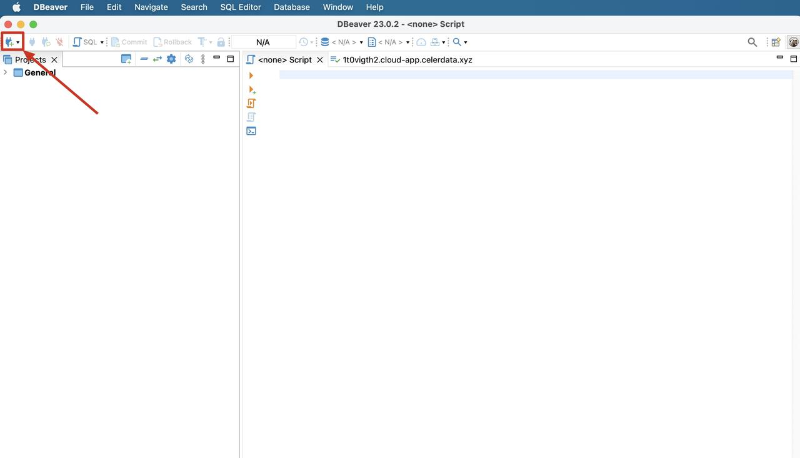
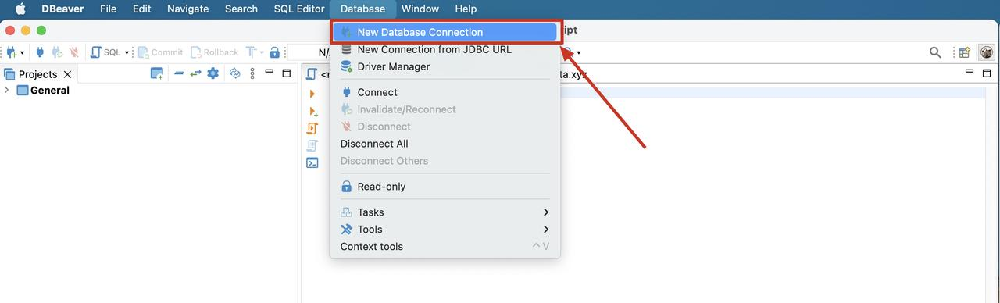
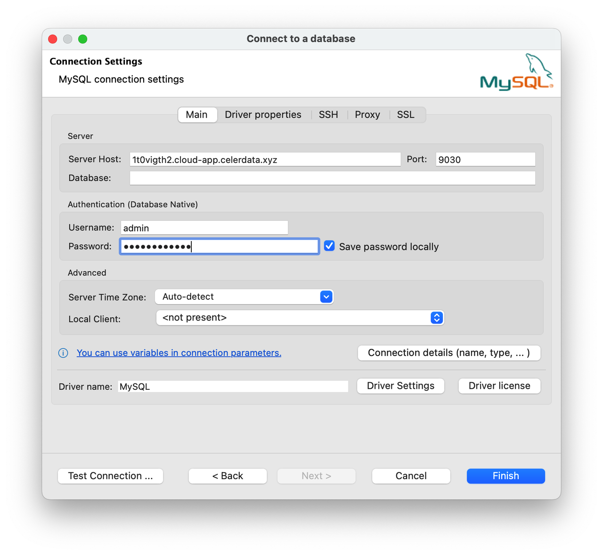
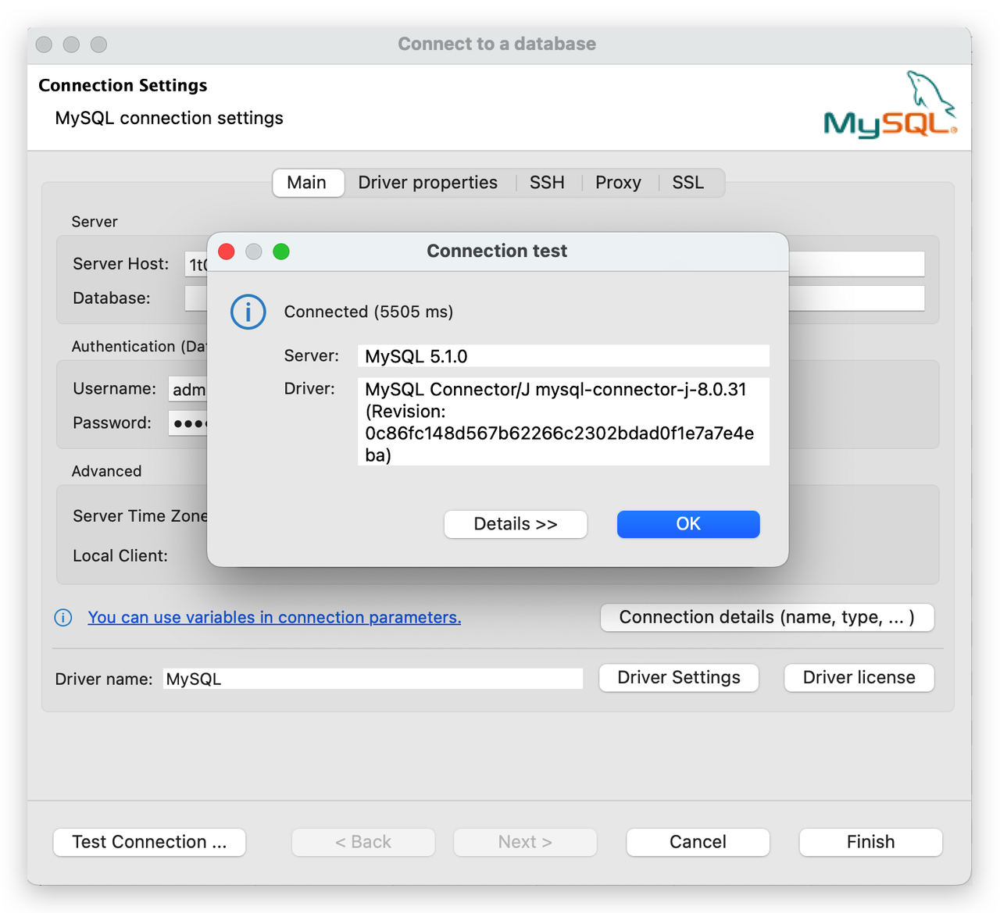
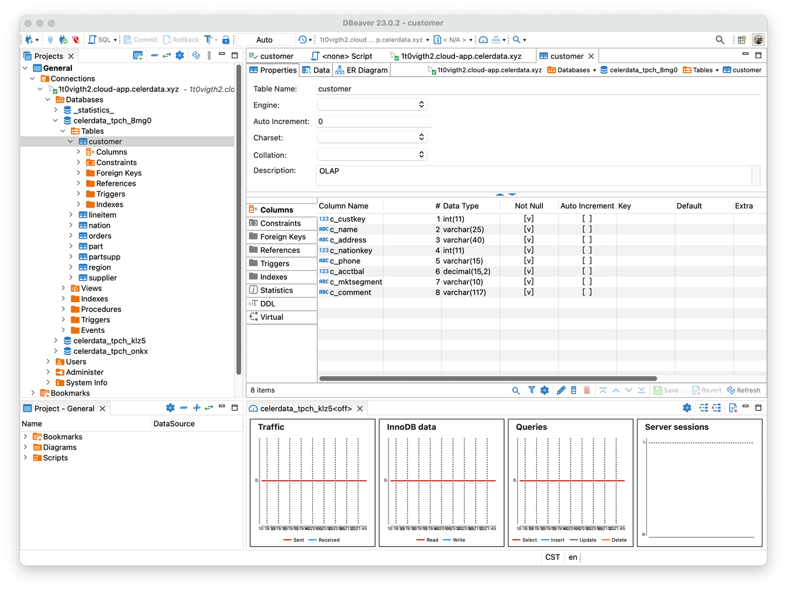

# DBeaver

DBeaver is a SQL client software application and a database administration tool, which offers a helpful assistant that walks you through the process of connecting to a database.

## Prerequisites

### Installation

Make sure that you have installed DBeaver.

You can download the DBeaver Community Edition at [https://dbeaver.io](https://dbeaver.io/) or the DBeaver PRO edition at [https://dbeaver.com](https://dbeaver.com/).

### Connectivity

Make sure that your CelerData cluster's inbound rules allow query requests from the DBeaver client.

## Integration

Follow these steps to connect to a database:

1. Launch DBeaver.
2. Click the plus sign (**+**) icon in the upper-left corner of the DBeaver window or choose **Database** > **New Database Connection** in the menu bar to access the assistant.

   

   

3. Select the MySQL driver.

   In the **Select your database** step, you are presented with a list of available drivers. Click **Analytical** in the left-side pane to quickly locate the MySQL driver. Then, double-click the **MySQL** icon.

   

4. Configure the connection to the database.

   In the **Connection Settings** step, go to the **Main** tab and configure the following essential connection settings:

   - **Server Host**: the endpoint of your CelerData cluster.
   - **Port**: the query port of your CelerData cluster, for example, `9030`.
   - **Database**: the target database in your CelerData cluster. Both internal and external databases are supported, but external databases may not fully function in DBeaver.
   - **Username**: the username that is used to log in to your CelerData cluster, for example, `admin`.
   - **Password**: the password that is used to log in to your CelerData cluster.

   

   You can also view and edit the properties of the MySQL driver on the **Driver properties** tab if necessary. To edit a specific property, click the row in the **Value** column for that property.

   

5. Test the connection to the database.

   Click **Test Connection** to verify the accuracy of the connection settings. A dialog box displaying the MySQL driver's information appears. Click **OK** in the dialog box to confirm the information. After you have successfully configured the connection settings, click **Finish** to complete the process.

   

6. Connect to the database.

   After the connection is established, you can view it in the left-side database connection tree and DBeaver can effectively connect to the database.

   
