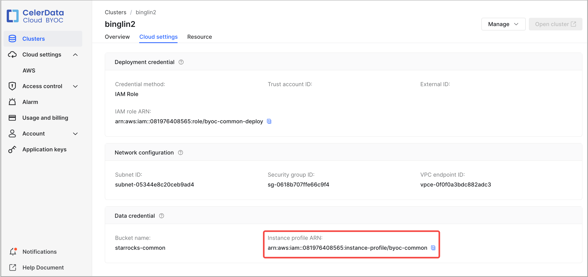
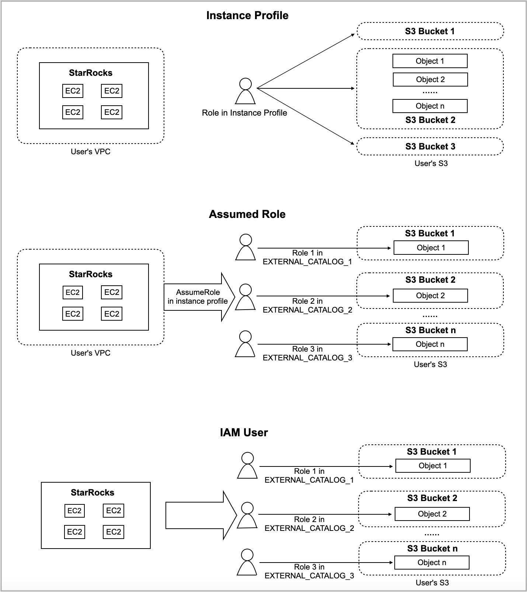

# Authenticate to AWS resources

CelerData supports using three authentication methods to integrate with AWS resources: instance profile-based authentication, assumed role-based authentication, and IAM user-based authentication. This topic describes how to configure AWS credentials by using these authentication methods.

## Authentication methods

### Instance profile-based authentication

The instance profile-based authentication method allows you to directly grant privileges on AWS resources to your CelerData cluster. In theory, any cluster user who can log in to the cluster can perform permitted actions on your AWS resources according to the access policies you have configured. The typical scenario for this use case is that you do not need any AWS resource access control between multiple cluster users in the cluster. This authentication method means no isolation is required within the same cluster.

However, this authentication method still can be seen as a cluster-level safe access control solution, because whoever can log in to the cluster is controlled by the cluster administrator.

### Assumed role-based authentication

Unlike instance profile-based authentication, the assumed role-based authentication method supports assuming an AWS IAM role to gain access to your AWS resources. For more information, see [Assuming a role](https://docs.aws.amazon.com/awscloudtrail/latest/userguide/cloudtrail-sharing-logs-assume-role.html).

<!--Specifically, you can create different catalogs which can access different AWS S3 resources, such as S3 buckets `S3-BUCKET-1` and `S3-BUCKET-2`. This means you can access a different data source by changing the catalog of the current SQL session.

Further, if the cluster administrator grants privileges on different catalogs to different users, this will achieve an access control solution just like allowing different users within the same cluster to access different data sources.-->

### IAM user-based authentication

The IAM user-based authentication method supports using IAM user credentials to gain access to your AWS resources. For more information, see [IAM users](https://docs.aws.amazon.com/IAM/latest/UserGuide/id_users.html).

<!--You can configure different catalogs to assume different IAM users.-->

## Preparations

First, make sure you have successfully launched a CelerData cluster. If you have not finished this step, see [Create a CelerData cluster](../get_started/create_cluster/create_cluster_aws.md).

Next step, navigate to **Data credential** as shown below to obtain the **Instance profile ARN** of the IAM role referenced in the data credential of the cluster (that role is referred to as the data credential role hereinafter in this topic) and then infer the name of the data credential role based on the instance profile ARN you have obtained. In the following example, the instance profile ARN is `arn:aws:iam::081976408565:instance-profile/byoc_common`, and you can infer that the name of the data credential role is `byoc_common`.



Then, obtain the ARN of the data credential role. For this example, do as follows:

1. Log in to the [IAM console](https://us-east-1.console.aws.amazon.com/iamv2/home?region=us-west-2#/home).

2. Navigate to the **Roles** page and enter **byoc_common** in the search box to search for the data credential role. Then, click the data credential role you have found.

3. On the role details page, copy the data credential role's **ARN** (for example, `arn:aws:iam::081976408565:role/byoc-common`) and save it to a location that you can access later.

You will need the data credential role for instance profile-based authentication and need the data credential role and its ARN for assumed role-based authentication.

The third step, create an IAM policy based on the type of AWS resource you want to access and the specific operation scenario within CelerData. A policy in AWS IAM declares a set of permissions on a specific AWS resource. After creating a policy, you need to attach it to an IAM role or user. As such, the IAM role or user is assigned the permissions declared in the policy to access the specified AWS resource.

> **NOTICE**
>
> To make these preparations in the second and third steps, you must have permission to sign in to the [AWS IAM console](https://us-east-1.console.aws.amazon.com/iamv2/home#/home) and edit IAM users and roles.

For the IAM policy you will need to access a specific AWS resource, see the following sections:

- [Batch load data from AWS S3](../aws/aws_iam_policies.md#batch-load-data-from-aws-s3)
- [Read/write AWS S3](../aws/aws_iam_policies.md#readwrite-aws-s3)
- [Integrate with AWS Glue](../aws/aws_iam_policies.md#integrate-with-aws-glue)

### Preparation for instance profile-based authentication

Attach the [IAM policies](../aws/aws_iam_policies.md) for accessing the required AWS resources to the data credential role (for example, `byoc-common`) of the CelerData cluster.

### Preparation for assumed role-based authentication

#### Create IAM roles and attach policies to them

Create one or more IAM roles, depending on the AWS resources you want to access. See [Creating IAM roles](https://docs.aws.amazon.com/IAM/latest/UserGuide/id_roles_create.html). Then, attach the [IAM policies](../aws/aws_iam_policies.md) for accessing the required AWS resources to the IAM roles you create.

For example, you want your CelerData cluster to access AWS S3 and AWS Glue. In this situation, you can choose to create one IAM role (for example, `s3_assumed_role`), and attach the policy for accessing AWS S3 and the policy for accessing AWS Glue both to that role. Alternatively, you can choose to create two different IAM roles (for example, `s3_assumed_role` and `glue_assumed_role`), and attach these policies to the two different roles respectively (that is, attach the policy for accessing AWS S3 to `s3_assumed_role` and the policy for accessing AWS Glue to `glue_assumed_role`).

The IAM roles you create will be assumed by the data credential role (for example, `byoc-common`) of the CelerData cluster to access the specified AWS resources.

This section assumes that you have created only one assumed role, `s3_assumed_role`, and have added the policy for accessing AWS S3 and the policy for accessing AWS Glue both to that role.

#### Configure a trust relationship

Configure your assumed role as follows:

1. Sign in to the [AWS IAM console](https://us-east-1.console.aws.amazon.com/iamv2/home#/home).
2. In the left-side navigation pane, choose **Access management** > **Roles**.
3. Find the assumed role (`s3_assumed_role`) and click its name.
4. On the role's details page, click the **Trust relationships** tab, and on the **Trust relationships** tab click **Edit trust policy**.
5. On the **Edit trust policy** page, delete the existing JSON policy document, and paste the following IAM policy, in which you must replace `<data_credential_role_ARN>` with your data credential role's ARN (for example, `arn:aws:iam::081976408565:role/byoc-common`) you have obtained above. Then, click **Update policy**.

   ```JSON
   {
       "Version": "2012-10-17",
       "Statement": [
           {
               "Effect": "Allow",
               "Principal": {
                   "AWS": "<data_credential_role_ARN>"
               },
               "Action": "sts:AssumeRole"
           }
       ]
   }
   ```

   If you have created different assumed roles for accessing different AWS resources, you need to repeat the preceding steps to configure your other assumed roles. For example, you have created `s3_assumed_role` and `glue_assumed_role` for accessing AWS S3 and AWS Glue respectively. In this situation, you need to repeat the preceding steps to configure `glue_assumed_role`.

Configure your data credential role as follows:

1. Sign in to the [AWS IAM console](https://us-east-1.console.aws.amazon.com/iamv2/home#/home).
2. In the left-side navigation pane, choose **Access management** > **Roles**.
3. Find the data credential role (`byoc-common`) and click its name.
4. In the **Permissions policies** section of the page that appears, click **Add permissions** and choose **Create inline policy**.
5. In the **Specify permissions** step, click the **JSON** tab, delete the existing JSON policy document, and paste the following IAM policy, in which you must replace `<s3_assumed_role_ARN>` with the ARN of the assumed role `s3_assumed_role`. Then, click **Review policy**.

   ```JSON
   {
     "Version": "2012-10-17",
     "Statement": [
       {
         "Effect": "Allow",
         "Action": ["sts:AssumeRole"],
         "Resource": ["<s3_assumed_role_ARN>"]
       }
     ]
   }
   ```

   If you have created different assumed roles for accessing different AWS resources, you need to fill the ARNs of all these assumed roles in the **Resource** element of the preceding IAM policy and separate them with a comma (,). For example, you have created`s3_assumed_role` and `glue_assumed_role` for accessing AWS S3 and AWS Glue respectively. In this situation, you need to fill in the **Resource** element by using the following format: `"<s3_assumed_role_ARN>","<glue_assumed_role_ARN>"`.

6. In the **Review Policy** step, enter a policy name and click **Create policy**.

### Preparation for IAM user-based authentication

Create an IAM user. See [Creating an IAM user in your AWS account](https://docs.aws.amazon.com/IAM/latest/UserGuide/id_users_create.html).

Then, attach the [IAM policies](../aws/aws_iam_policies.md) for accessing the required AWS resources to the IAM user you create.

## Comparison between authentication methods

The following figure provides a high-level explanation of the differences in mechanism between instance profile-based authentication and assumed role-based authentication in CelerData.



## Configure AWS credentials in SQL commands

### Authentication parameters for accessing AWS S3

In various scenarios in which CelerData needs to integrate with AWS S3, for example, when you create external catalogs or file external tables or when you ingest, back up, or restore data from AWS S3, configure the authentication parameters for accessing AWS S3 as follows:

- For instance profile-based authentication, set `aws.s3.use_instance_profile` to `true`.
- For assumed role-based authentication, set `aws.s3.use_instance_profile` to `true` and configure `aws.s3.iam_role_arn` as the ARN of the assumed role (for example, `s3_assumed_role` as you have created above) that can be used to access AWS S3.
- For IAM user-based authentication, set `aws.s3.use_instance_profile` to `false` and configure `aws.s3.access_key` and `aws.s3.secret_key` as the access key and secret key of your AWS IAM user.

The following table describes the parameters.

| Parameter                   | Required | Description                                                  |
| --------------------------- | -------- | ------------------------------------------------------------ |
| aws.s3.use_instance_profile | Yes      | Specifies whether to enable the instance profile-based authentication method and the assumed role-based authentication method. Valid values: `true` and `false`. Default value: `false`. |
| aws.s3.iam_role_arn         | No       | The ARN of the IAM role that has privileges on your AWS S3 bucket. If you use the assumed role-based authentication method to access AWS S3, you must specify this parameter.  |
| aws.s3.access_key           | No       | The access key of your IAM user. If you use the IAM user-based authentication method to access AWS S3, you must specify this parameter. |
| aws.s3.secret_key           | No       | The secret key of your IAM user. If you use the IAM user-based authentication method to access AWS S3, you must specify this parameter. |

### Authentication parameters for accessing AWS Glue

In various scenarios in which CelerData needs to integrate with AWS Glue, for example, when you create external catalogs, configure the authentication parameters for accessing AWS Glue as follows:

- For instance profile-based authentication, set `aws.glue.use_instance_profile` to `true`.
- For assumed role-based authentication, set `aws.glue.use_instance_profile` to `true` and configure `aws.glue.iam_role_arn` as the ARN of the assumed role (for example, glue_assumed_role as you have created above) that can be used to access AWS Glue.
- For IAM user-based authentication, set `aws.glue.use_instance_profile` to `false` and configure `aws.glue.access_key` and `aws.glue.secret_key` as the access key and secret key of your AWS IAM user.

The following table describes the parameters.

| Parameter                     | Required | Description                                                  |
| ----------------------------- | -------- | ------------------------------------------------------------ |
| aws.glue.use_instance_profile | Yes      | Specifies whether to enable the instance profile-based authentication method and the assumed role-based authentication. Valid values: `true` and `false`. Default value: `false`. |
| aws.glue.iam_role_arn         | No       | The ARN of the IAM role that has privileges on your AWS Glue Data Catalog. If you use the assumed role-based authentication method to access AWS Glue, you must specify this parameter. |
| aws.glue.access_key           | No       | The access key of your AWS IAM user. If you use the IAM user-based authentication method to access AWS Glue, you must specify this parameter. |
| aws.glue.secret_key           | No       | The secret key of your AWS IAM user. If you use the IAM user-based authentication method to access AWS Glue, you must specify this parameter. |

## Integration examples

### External catalog

Creating an external catalog in the CelerData cluster means building integration with the target data lake system, which is composed of two key components:

- **File storage** like **AWS S3** to store table files

- **Metastore** like **Hive metastore** or **AWS Glue** to store the metadata and locations of table files

  > **NOTICE**
  >
  > If you choose Hive metastore, check that the CelerData cluster can access the host of your Hive metastore before you create an external catalog. In normal cases, you can take one of the following actions to enable integration between your CelerData cluster and your Hive metastore:
  >
  > - Deploy your CelerData cluster and your Hive metastore on the same VPC.
  > - Configure a VPC peering connection between the VPC of your CelerData cluster and the VPC of your Hive metastore.
  >
  > Then, check the configurations of the security group of your Hive metastore to ensure that its inbound rules allow inbound traffic from your CelerData cluster's security group and that its port range covers the default port 9083.

CelerData supports the following types of catalogs:

- [Hive catalog](../query_data/hive_catalog.md)
- [Iceberg catalog](../query_data/iceberg_catalog.md)
- [Hudi catalog](../query_data/hudi_catalog.md)
- [Delta Lake catalog](../query_data/deltalake_catalog.md)

The following examples create a Hive catalog named `hive_catalog_hms` or `hive_catalog_glue`, depending on the type of metastore you use, to query data from your Hive cluster. For detailed syntax and parameters, see [Hive catalog](../query_data/hive_catalog.md).

#### Instance profile-based authentication

- If you use Hive metastore in your Amazon EMR Hive cluster, run a command like below:

  ```SQL
  CREATE EXTERNAL CATALOG hive_catalog_hms
  PROPERTIES
  (
      "type" = "hive",
      "aws.s3.use_instance_profile" = "true",
      "aws.s3.region" = "us-west-2",
      "hive.metastore.uris" = "thrift://xx.xx.xx.xx:9083"
  );
  ```

- If you use AWS Glue in your Amazon EMR Hive cluster, run a command like below:

  ```SQL
  CREATE EXTERNAL CATALOG hive_catalog_glue
  PROPERTIES
  (
      "type" = "hive",
      "aws.s3.use_instance_profile" = "true",
      "aws.s3.region" = "us-west-2",
      "hive.metastore.type" = "glue",
      "aws.glue.use_instance_profile" = "true",
      "aws.glue.region" = "us-west-2"
  );
  ```

#### Assumed role-based authentication

- If you use Hive metastore in your Amazon EMR Hive cluster, run a command like below:

  ```SQL
  CREATE EXTERNAL CATALOG hive_catalog_hms
  PROPERTIES
  (
      "type" = "hive",
      "aws.s3.use_instance_profile" = "true",
      "aws.s3.iam_role_arn" = "arn:aws:iam::081976408565:role/s3_assumed_role",
      "aws.s3.region" = "us-west-2",
      "hive.metastore.uris" = "thrift://xx.xx.xx.xx:9083"
  );
  ```

- If you use AWS Glue in your Amazon EMR Hive cluster, run a command like below:

  ```SQL
  CREATE EXTERNAL CATALOG hive_catalog_glue
  PROPERTIES
  (
      "type" = "hive",
      "aws.s3.use_instance_profile" = "true",
      "aws.s3.iam_role_arn" = "arn:aws:iam::081976408565:role/s3_assumed_role",
      "aws.s3.region" = "us-west-2",
      "hive.metastore.type" = "glue",
      "aws.glue.use_instance_profile" = "true",
      "aws.glue.iam_role_arn" = "arn:aws:iam::081976408565:role/glue_assumed_role",
      "aws.glue.region" = "us-west-2"
  );
  ```

#### IAM user-based authentication

- If you use Hive metastore in your Hive cluster, run a command like below:

  ```SQL
  CREATE EXTERNAL CATALOG hive_catalog_hms
  PROPERTIES
  (
      "type" = "hive",
      "aws.s3.use_instance_profile" = "false",
      "aws.s3.access_key" = "<iam_user_access_key>",
      "aws.s3.secret_key" = "<iam_user_access_key>",
      "aws.s3.region" = "us-west-2",
      "hive.metastore.uris" = "thrift://xx.xx.xx.xx:9083"
  );
  ```

- If you use AWS Glue in your Amazon EMR Hive cluster, run a command like below:

  ```SQL
  CREATE EXTERNAL CATALOG hive_catalog_glue
  PROPERTIES
  (
      "type" = "hive",
      "aws.s3.use_instance_profile" = "false",
      "aws.s3.access_key" = "<iam_user_access_key>",
      "aws.s3.secret_key" = "<iam_user_secret_key>",
      "aws.s3.region" = "us-west-2",
      "hive.metastore.type" = "glue",
      "aws.glue.use_instance_profile" = "false",
      "aws.glue.access_key" = "<iam_user_access_key>",
      "aws.glue.secret_key" = "<iam_user_secret_key>",
      "aws.glue.region" = "us-west-2"
  );
  ```

### File external table

File external tables must be created in your internal catalog named `default_catalog`.

The following examples create a file external table named `file_table` on an existing database named `test_s3_db`. For detailed syntax and parameters, see [File external table](../query_data/file_external_table.md).

#### Instance profile-based authentication

Run a command like below:

```SQL
CREATE EXTERNAL TABLE test_s3_db.file_table
(
    id varchar(65500),
    attributes map<varchar(100), varchar(2000)>
) 
ENGINE=FILE
PROPERTIES
(
    "path" = "s3://celerdata-test/",
    "format" = "ORC",
    "aws.s3.use_instance_profile" = "true",
    "aws.s3.region" = "us-west-2"
);
```

#### Assumed role-based authentication

Run a command like below:

```SQL
CREATE EXTERNAL TABLE test_s3_db.file_table
(
    id varchar(65500),
    attributes map<varchar(100), varchar(2000)>
) 
ENGINE=FILE
PROPERTIES
(
    "path" = "s3://celerdata-test/",
    "format" = "ORC",
    "aws.s3.use_instance_profile" = "true",
    "aws.s3.iam_role_arn" = "arn:aws:iam::081976408565:role/s3_assumed_role",
    "aws.s3.region" = "us-west-2"
);
```

#### IAM user-based authentication

Run a command like below:

```SQL
CREATE EXTERNAL TABLE test_s3_db.file_table
(
    id varchar(65500),
    attributes map<varchar(100), varchar(2000)>
) 
ENGINE=FILE
PROPERTIES
(
    "path" = "s3://starrocks-test/",
    "format" = "ORC",
    "aws.s3.use_instance_profile" = "false",
    "aws.s3.access_key" = "<iam_user_access_key>",
    "aws.s3.secret_key" = "<iam_user_secret_key>",
    "aws.s3.region" = "us-west-2"
);
```

### Ingestion

You can use LOAD LABEL to load data from AWS S3.

The following examples load the data from all Parquet data files stored in the `s3a://test-bucket/test_brokerload_ingestion` path into the `test_ingestion_2` table in an existing database named `test_s3_db`. For detailed syntax and parameters, see [BROKER LOAD](../../celerdata-cloud-docs/sql-reference/sql-statements/data-manipulation/BROKER_LOAD.md).

#### Instance profile-based authentication

Run a command like below:

```SQL
LOAD LABEL test_s3_db.test_credential_instanceprofile_7
(
    DATA INFILE("s3a://test-bucket/test_brokerload_ingestion/*")
    INTO TABLE test_ingestion_2
    FORMAT AS "parquet"
)
WITH BROKER
(
    "aws.s3.use_instance_profile" = "true",
    "aws.s3.region" = "us-west-1"
)
PROPERTIES
(
    "timeout" = "1200"
);
```

#### Assumed role-based authentication

Run a command like below:

```SQL
LOAD LABEL test_s3_db.test_credential_instanceprofile_7
(
    DATA INFILE("s3a://test-bucket/test_brokerload_ingestion/*")
    INTO TABLE test_ingestion_2
    FORMAT AS "parquet"
)
WITH BROKER
(
    "aws.s3.use_instance_profile" = "true",
    "aws.s3.iam_role_arn" = "arn:aws:iam::081976408565:role/s3_assumed_role",
    "aws.s3.region" = "us-west-1"
)
PROPERTIES
(
"timeout"="1200"
);
```

#### IAM user-based authentication

Run a command like below:

```SQL
LOAD LABEL test_s3_db.test_credential_instanceprofile_7
(
    DATA INFILE("s3a://test-bucket/test_brokerload_ingestion/*")
    INTO TABLE test_ingestion_2
    FORMAT AS "parquet"
)
WITH BROKER
(
    "aws.s3.use_instance_profile" = "false",
    "aws.s3.access_key" = "<iam_user_access_key>",
    "aws.s3.secret_key" = "<iam_user_secret_key>",
    "aws.s3.region" = "us-west-1"
)
PROPERTIES
(
    "timeout" = "1200"
);
```
