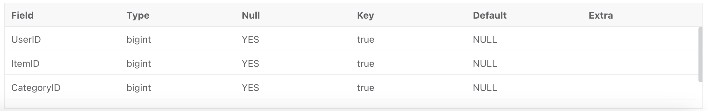

# Batch load data from Azure cloud storage

CelerData provides two options for loading data from Microsoft Azure Storage:

- Synchronous loading using [INSERT](../sql-reference/sql-statements/data-manipulation/INSERT.md)+[`FILES()`](../sql-reference/sql-functions/table-functions/files.md)
- Asynchronous loading using [Broker Load](../sql-reference/sql-statements/data-manipulation/BROKER_LOAD.md)

Each of these options has its own advantages, which are detailed in the following sections.

In most cases, we recommend that you use the INSERT+`FILES()` method, which is much easier to use.

However, the INSERT+`FILES()` method currently supports only the Parquet and ORC file formats. Therefore, if you need to load data of other file formats such as CSV, or perform data changes such as DELETE during data loading, you can resort to Broker Load.

## Before you begin

### Make source data ready

Make sure that the source data you want to load into CelerData is properly stored in a container within your Azure storage account.

In this topic, suppose you want to load the data of a Parquet-formatted sample dataset (`user_behavior_ten_million_rows.parquet`) stored in the root directory of a container (`celerdata-container`) within an Azure Data Lake Storage Gen2 (ADLS Gen2) storage account (`cerlerdata`).

### Check privileges

You can load data into tables within your CelerData cluster only as a user who has the INSERT privilege on those tables. If you do not have the INSERT privilege, follow the instructions provided in [GRANT](../sql-reference/sql-statements/account-management/GRANT.md) to grant the INSERT privilege to the user that you use to connect to your CelerData cluster.

### Gather connection details

The examples in this topic use the Shared Key authentication method. To ensure that you have permission to read data from ADLS Gen2, we recommend that you read [Azure Data Lake Storage Gen2 > Shared Key (access key of storage account)](../integration/authenticate_to_azure_storage.md#shared-key-access-key-of-storage-account-1) to understand the authentication parameters that you need to configure.

In a nutshell, if you practice Shared Key authentication, you need to gather the following information:

- The name of your ADLS Gen2 storage account
- The shared key (access key) of your ADLS Gen2 storage account

For information about all the authentication methods available, see [Authenticate to Azure cloud storage](../integration/authenticate_to_azure_storage.md).

## Use INSERT+FILES()

This method supports only the Parquet and ORC file formats.

### Advantages of INSERT+FILES()

`FILES()` can read the file stored in cloud storage based on the path-related properties you specify, infer the table schema of the data in the file, and then return the data from the file as data rows.

With `FILES()`, you can:

- Query the data directly from Azure using [SELECT](../sql-reference/sql-statements/data-manipulation/SELECT.md).
- Create and load a table using [CREATE TABLE AS SELECT](../sql-reference/sql-statements/data-definition/CREATE_TABLE_AS_SELECT.md) (CTAS).
- Load the data into an existing table using [INSERT](../sql-reference/sql-statements/data-manipulation/SELECT.md).

### Typical examples

#### Querying directly from Azure using SELECT

Querying directly from Azure using SELECT+`FILES()` can give a good preview of the content of a dataset before you create a table. For example:

- Get a preview of the dataset without storing the data.
- Query for the min and max values and decide what data types to use.
- Check for `NULL` values.

The following example queries the sample dataset `user_behavior_ten_million_rows.parquet` stored in the container `celerdata-container` within your storage account `celerdata`:

```SQL
SELECT * FROM FILES
(
    "path" = "abfss://celerdata-container@celerdata.dfs.core.windows.net/user_behavior_ten_million_rows.parquet",
    "format" = "parquet",
    "azure.adls2.storage_account" = "celerdata",
    "azure.adls2.shared_key" = "xxxxxxxxxxxxxxxxxx"
)
LIMIT 3;
```

The system returns a query result similar to the following:


> **NOTE**
>
> Notice that the column names as returned above are provided by the Parquet file.

#### Creating and loading a table using CTAS

This is a continuation of the previous example. The previous query is wrapped in CREATE TABLE AS SELECT (CTAS) to automate the table creation using schema inference. This means CelerData will infer the table schema, create the table you want, and then load the data into the table. The column names and types are not required to create a table when using the `FILES()` table function with Parquet files as the Parquet format includes the column names.

> **NOTE**
>
> The syntax of CREATE TABLE when using schema inference does not allow setting the number of replicas. If you are using a CelerData classic cluster, set the number of replicas before creating the table. The example below is for a system with a single replica:
>
> ```SQL
> ADMIN SET FRONTEND CONFIG ('default_replication_num' = "1");
> ```

Create a database and switch to it:

```SQL
CREATE DATABASE IF NOT EXISTS mydatabase;
USE mydatabase;
```

Use CTAS to create a table and load the data of the sample dataset `user_behavior_ten_million_rows.parquet`, which is stored in the container `celerdata-container` within your storage account `celerdata`, into the table:

```SQL
CREATE TABLE user_behavior_inferred AS
SELECT * FROM FILES
(
    "path" = "abfss://celerdata-container@celerdata.dfs.core.windows.net/user_behavior_ten_million_rows.parquet",
    "format" = "parquet",
    "azure.adls2.storage_account" = "celerdata",
    "azure.adls2.shared_key" = "xxxxxxxxxxxxxxxxxx"
);
```

After creating the table, you can view its schema by using [DESCRIBE](../sql-reference/sql-statements/Utility/DESCRIBE.md):

```SQL
DESCRIBE user_behavior_inferred;
```

The system returns the following query result:



Compare the inferred schema with the schema created by hand:

- data types
- nullable
- key fields

To better control the schema of the destination table and for better query performance, we recommend that you specify the table schema by hand in production environments.

Query the table to verify that the data has been loaded into it. Example:

```SQL
SELECT * from user_behavior_inferred LIMIT 3;
```

The system returns a query result similar to the following, indicating that the data has been successfully loaded:


#### Loading into an existing table using INSERT

You may want to customize the table that you are inserting into, for example, the:

- column data type, nullable setting, or default values
- key types and columns
- data partitioning and bucketing

> **NOTE**
>
> Creating the most efficient table structure requires knowledge of how the data will be used and the content of the columns. This topic does not cover table design. For information about table design, see [Table types](../table_types/table_types.md).

In this example, we are creating a table based on knowledge of how the table will be queried and the data in the Parquet file. The knowledge of the data in the Parquet file can be gained by querying the file directly in Azure.

- Since a query of the dataset in Azure indicates that the `Timestamp` column contains data that matches a `datetime` data type, the column type is specified in the following DDL.
- By querying the data in Azure, you can find that there are no `NULL` values in the dataset, so the DDL does not set any columns as nullable.
- Based on knowledge of the expected query types, the sort key and bucketing column are set to the column `UserID`. Your use case might be different for this data, so you might decide to use `ItemID` in addition to or instead of `UserID` for the sort key.

Create a database and switch to it:

```SQL
CREATE DATABASE IF NOT EXISTS mydatabase;
USE mydatabase;
```

Create a table by hand (we recommend that the table have the same schema as the Parquet file you want to load from Azure):

```SQL
CREATE TABLE user_behavior_declared
(
    UserID int(11),
    ItemID int(11),
    CategoryID int(11),
    BehaviorType varchar(65533),
    Timestamp datetime
);
```

After creating the table, you can load it with INSERT INTO SELECT FROM FILES():

```SQL
INSERT INTO user_behavior_declared
SELECT * FROM FILES
(
    "path" = "abfss://celerdata-container@celerdata.dfs.core.windows.net/user_behavior_ten_million_rows.parquet",
    "format" = "parquet",
    "azure.adls2.storage_account" = "celerdata",
    "azure.adls2.shared_key" = "xxxxxxxxxxxxxxxxxx"
)
```

After the load is complete, you can query the table to verify that the data has been loaded into it. Example:

```SQL
SELECT * from user_behavior_declared LIMIT 3;
```

The system returns a query result similar to the following, indicating that the data has been successfully loaded:


#### Check load progress

You can query the progress of INSERT jobs from the `information_schema.loads` view. This feature is supported from v3.1 onwards. Example:

```SQL
SELECT * FROM information_schema.loads ORDER BY JOB_ID DESC;
```

If you have submitted multiple load jobs, you can filter on the `LABEL` associated with the job. Example:

```SQL
SELECT * FROM information_schema.loads WHERE LABEL = 'insert_659411dd-a560-11ee-af93-000d3a544fa3';
```

For information about the fields provided in the `loads` view, see [Information Schema](../reference/information_schema/loads.md).

> **NOTE**
>
> INSERT is a synchronous command. If an INSERT job is still running, you need to open another session to check its execution status.

## Use Broker Load

An asynchronous Broker Load process handles making the connection to Azure, pulling the data, and storing the data in CelerData.

This method supports the Parquet, ORC, CSV, and JSON file formats.

### Advantages of Broker Load

- Broker Load supports data transformation and data changes such as UPSERT and DELETE operations during loading.
- Broker Load runs in the background and clients do not need to stay connected for the job to continue.
- Broker Load is preferred for long-running jobs, with the default timeout spanning 4 hours.
- In addition to Parquet and ORC file formats, Broker Load supports CSV and JSON file formats.

### Typical example

Create a database and a table, start a load process that pulls the sample dataset `user_behavior_ten_million_rows.parquet` from Azure, and verify the progress and success of the data loading.

#### Create a database and a table

Connect to your CelerData cluster. Then, create a database and switch to it:

```SQL
CREATE DATABASE IF NOT EXISTS mydatabase;
USE mydatabase;
```

Create a table by hand (we recommend that the table have the same schema as the Parquet file you want to load from Azure):

```SQL
CREATE TABLE user_behavior
(
    UserID int(11),
    ItemID int(11),
    CategoryID int(11),
    BehaviorType varchar(65533),
    Timestamp datetime
);
```

#### Start a Broker Load

Run the following command to start a Broker Load job that loads data from the sample dataset `user_behavior_ten_million_rows.parquet` to the `user_behavior` table:

```SQL
LOAD LABEL user_behavior
(
    DATA INFILE("abfss://celerdata-container@celerdata.dfs.core.windows.net/user_behavior_ten_million_rows.parquet")
    INTO TABLE user_behavior
    FORMAT AS "parquet"
)
WITH BROKER
(
    "azure.adls2.storage_account" = "celerdata",
    "azure.adls2.shared_key" = "xxxxxxxxxxxxxxxxxx"
)
PROPERTIES
(
    "timeout" = "3600"
);
```

This job has four main sections:

- `LABEL`: A string used when querying the state of the load job.
- `LOAD` declaration: The source URI, source data format, and destination table name.
- `BROKER`: The connection details for the source.
- `PROPERTIES`: The timeout value and any other properties to apply to the load job.

For detailed syntax and parameter descriptions, see [BROKER LOAD](../sql-reference/sql-statements/data-manipulation/BROKER_LOAD.md).

#### Check load progress

Query the `information_schema.loads` view to track the load progress:

```SQL
SELECT * FROM information_schema.loads;
```

If you have submitted multiple load jobs, you can filter on the `LABEL` associated with the job:

```SQL
SELECT * FROM information_schema.loads WHERE LABEL = 'user_behavior';
```

For information about the fields provided in the `loads` view, see [Information Schema](../reference/information_schema/loads.md).

After you confirm that the load job has finished, you can check a subset of the destination table to see if the data has been successfully loaded. Example:

```SQL
SELECT * from user_behavior LIMIT 3;
```

The system returns a query result similar to the following, indicating that the data has been successfully loaded:


