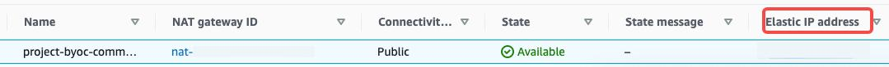

# Load data from Confluent Cloud through Routine Load

This topic introduces how to create a Routine Load job to stream messages (events) from Confluent into CelerData, and familiarizes you with some basic concepts about Routine Load.

To continuously load messages of a stream into CelerData, you can store the message stream in a Confluent topic, and create a Routine Load job to consume the messages. The Routine Load job persists in CelerData, generates a series of load tasks to consume the messages in all or part of the partitions in the topic, and loads the messages into CelerData.

A Routine Load job supports exactly-once delivery semantics to ensure the data loaded into CelerData is neither lost nor duplicated.

## Supported data file formats

Routine Load now supports consuming CSV and JSON format data from a Confluent cluster.

> **NOTE**
>
> As for data in CSV format, CelerData supports UTF-8 encoded strings within 50 bytes as column separators. Commonly used column separators include comma (,), tab and pipe (|).

## How it works


## Before you begin

### Configuring networks for CelerData to access Confluent Cloud cluster

1. Make sure the subnet for CelerData in your VPC can connect to the Internet.

   - If CelerData is in a private subnet, make sure that a NAT gateway is configured for the private subnet so that CelerData can connect to the internet.
   - If CelerData is in a public subnet, CelerData can connect to the internet by default.

2. For security purposes, please add the following outbound rule to the security group for your VPC, so that CelerData in your VPC can access Confluent cloud.

   

   - Set **Port range** to `9092`.

       > **Note**
       >
       > Make sure the port is the port of your **Bootstrap server** on Confluent cloud.

   - Set **Destination**. You can find Confluent Cloud cluster Egress IPs through `Cluster Overview > Networking > Egress IPs` on Confluent Cloud according to [Get started with Static Egress IP Addresses](https://docs.confluent.io/cloud/current/connectors/static-egress-ip.html#static-egress-ip-addresses). Remember that you should set all the Confluent Cloud cluster Egress IPs.

    

3. (Optional) If Confluent enables some firewall mechanism, add the following IP address of your CelerData cluster ( FE and BE) to the Access Control List of the Confluent cluster.
   - If CelerData is in a private subnet for your VPC on AWS
     Add the Elastic IP addresses of your NAT gateway for your CelerData cluster ( FEs and BEs ) into your Confluent Cloud cluster's ACL. You can find the Elastic IP address through `VPC > NAT Gateways`. You need to select the NAT gateway for your private subnet. And then you can find the Elastic IP address as below.
    

   - If CelerData is in a pubic subnet for your VPC on AWS
     Add the Public IP addresses of your CelerData cluster ( FEs and BEs ) into your Confluent Cloud Cluster's ACL allowlist. You can find the Public IPs on AWS through `EC2 > Instances`.
     

## Basic operations

### Create a Routine Load job

The following two examples show how to consume CSV-formatted and JSON-formatted data in a Confluent Cloud cluster, and load the data into CelerData by creating a Routine Load job. For more information, see [CREATE ROUTINE LOAD](../sql-reference/sql-statements/data-manipulation/CREATE_ROUTINE_LOAD.md).

#### Load CSV-format data

This section describes how to create a Routine Load job to consume CSV-format data in a Confluent Cloud cluster, and load the data into CelerData.

##### Prepare a dataset

Suppose there is a CSV-format dataset in the topic `ordertest1` in a Confluent Cloud cluster Every message in the dataset includes six fields, which represent order ID, payment date, customer name, nationality, gender, and price.

```Plaintext
2020050802,2020-05-08,Johann Georg Faust,Deutschland,male,895
2020050802,2020-05-08,Julien Sorel,France,male,893
2020050803,2020-05-08,Dorian Grey,UK,male,1262
2020050901,2020-05-09,Anna Karenina",Russia,female,175
2020051001,2020-05-10,Tess Durbeyfield,US,female,986
2020051101,2020-05-11,Edogawa Conan,japan,male,8924
```

##### Create a table

According to the fields of CSV-format data, create the table `example_tbl1` in the database `example_db`. The following example creates a table with five fields excluding the field that represents customer gender in the CSV-format data.

```SQL
CREATE TABLE example_db.example_tbl1
( 
    `order_id` bigint NOT NULL COMMENT "Order ID",
    `pay_dt` date NOT NULL COMMENT "Payment date", 
    `customer_name` varchar(26) NULL COMMENT "Customer name", 
    `nationality` varchar(26) NULL COMMENT "Nationality", 
    `price`double NULL COMMENT "Price"
)
ENGINE=OLAP 
PRIMARY KEY (order_id,pay_dt) 
DISTRIBUTED BY HASH(`order_id`); 
```

##### Submit a Routine Load job

Execute the following statement to submit a Routine Load job named `example_tbl1_ordertest1` to consume the messages in the topic `ordertest1` and load the data into the table `example_tbl1`. The load job consumes the messages from the initial offset in the specified partitions of the topic.

```SQL
CREATE ROUTINE LOAD example_db.example_tbl1_ordertest1 ON example_tbl1
COLUMNS TERMINATED BY ",",
COLUMNS (order_id, pay_dt, customer_name, nationality, temp_gender, price)
PROPERTIES
(
    "desired_concurrent_number" = "5"
)
FROM KAFKA
(
    "kafka_broker_list" ="<kafka_broker1_ip>:<kafka_broker1_port>,<kafka_broker2_ip>:<kafka_broker2_port>",
    "kafka_topic" = "ordertest1",
    "kafka_partitions" ="0,1,2,3,4",
    "property.kafka_default_offsets" = "OFFSET_BEGINNING",
    "property.security.protocol"="SASL_SSL",
    "property.sasl.mechanism"="PLAIN",
    "property.sasl.username"="***",
    "property.sasl.password"="***"
);
```

After submitting the load job, you can execute the [SHOW ROUTINE LOAD](../sql-reference/sql-statements/data-manipulation/SHOW_ROUTINE_LOAD.md) statement to check the status of the load job.

- **Load job name**

  There could be multiple load jobs on a table. Therefore, we recommend you name a load job with the corresponding topic and the time when the load job is submitted. This helps you distinguish the load job on each table.
  
- **Column separator**

  The property `COLUMN TERMINATED BY` defines the column separator of the CSV-format data. The default is `\t`.
  
- **Kafka broker list**

  ```SQL
  "kafka_broker_list" ="<kafka_broker1_ip>:<kafka_broker1_port>,<kafka_broker2_ip>:<kafka_broker2_port>",
  ```

    A list of host and port pairs for establishing the connection to the Confluent Cloud cluster. You can find it in `Cluster Overview > Cluster Settings`.

    

- **Topic partition and offset**

  You can specify the properties `kafka_partitions` and `kafka_offsets` to specify the partitions and offsets to consume the messages. For example, if you want the load job to consume messages from the partitions `"0,1,2,3,4"` of the topic `ordertest1` all with the initial offsets, you can specify the properties as follows:

  ```SQL
  "kafka_partitions" ="0,1,2,3,4",
  "kafka_offsets" ="OFFSET_BEGINNING,OFFSET_BEGINNING,OFFSET_BEGINNING,OFFSET_END,OFFSET_END"
  ```

  You can also set the default offsets of all partitions with the property `property.kafka_default_offsets`.

  ```SQL
  "kafka_partitions" ="0,1,2,3,4",
  "property.kafka_default_offsets" = "OFFSET_BEGINNING"
  ```

  For more information, see [CREATE ROUTINE LOAD](../sql-reference/sql-statements/data-manipulation/CREATE_ROUTINE_LOAD.md).
  
- **Data mapping and transformation**

  To specify the mapping and transformation relationship between the CSV-format data, and the CelerData table, you need to use the `COLUMNS` parameter.

  - **Data mapping**
  
    CelerData extracts the columns in the CSV-format data and maps them **in sequence** onto the fields declared in the `COLUMNS` parameter.
    CelerData extracts the fields declared in the `COLUMNS` parameter and maps them **by name** onto the columns of the CelerData table.

  - **Data transformation**
  
    The example excludes the column that represents customer gender from the CSV-format data. Therefore, the field `temp_gender` in the `COLUMNS` parameter is used as a placeholder for this field. The other fields are mapped to the columns of the CelerData table `example_tbl1` directly.

    > **NOTE**
    >
    > You do not need to specify the `COLUMNS` parameter if the names, number, and order of the columns in the CSV-format data completely correspond to those of the CelerData table.

- **Task concurrency**

  When there are many topic partitions and enough BE nodes, you can accelerate the loading by increasing task concurrency.

  To increase the actual load task concurrency, you can increase the value of `desired_concurrent_number` when you [create a routine load job](./RoutineLoad#Create a Routine_Load_job). You can also set the dynamic FE configuration item `max_routine_load_task_concurrent_num` to a larger value. This FE configuration item specifies the default maximum load task currency. For more information about this FE configuration item, see [FE configuration items](../administration/Configuration#fe-configuration-items).

  The actual task concurrency is defined by the minimum value among the number of BE nodes that are alive, the number of the pre-specified topic partitions, and the values of `desired_concurrent_number` and `max_routine_load_task_concurrent_num`.

  In the example, the number of BE nodes that are alive is `5`, the number of the pre-specified topic partitions is `5`, and the value of `max_routine_load_task_concurrent_num` is `5`. To increase the actual load task concurrency, you can increase the value of `desired_concurrent_number` from the default value `3` to `5`.

  For more information about the properties, see [CREATE ROUTINE LOAD](../sql-reference/sql-statements/data-manipulation/CREATE_ROUTINE_LOAD.md).
- **Encryption and authentication**

  ```SQL
  "property.security.protocol"="SASL_SSL",
  "property.sasl.mechanism"="PLAIN",
  "property.sasl.username"="***",
  "property.sasl.password"="***"
  ```

  - `property.security.protocol`: You can use `SASL_SSL`, because Confluent Cloud uses `SASL_SSL` as the default security protocol.

      > **Notice**
      >
      > We do not recommend using `SASL_PLAINTEXT` in production environment.

  - `property.sasl.mechanism`: You can use `PLAIN` which is a simple username/password authentication mechanism.

  - `property.sasl.username`:  API key for the Confluent Cloud cluster. You can find it in `Cluster Overview > API Keys`.

    

  - `property.sasl.password`: API secret for the Confluent Cloud cluster. You can find it in the txt file that you download when creating the cluster.

#### Load JSON-format data

This section describes how to create a Routine Load job to consume JSON-format data in a Confluent Cloud cluster, and load the data into CelerData.

##### Prepare a dataset

Suppose there is a JSON-format dataset in the topic `ordertest2` in a Confluent Cloud cluster. The dataset includes six keys that represent commodity ID, customer name, nationality, payment time, and price. Besides, you want to transform the payment time key into the DATE type, and load it into the `pay_dt` column in the CelerData table.

```SQL
{"commodity_id": "1", "customer_name": "Mark Twain", "country": "US","pay_time": 1589191487,"price": 875}
{"commodity_id": "2", "customer_name": "Oscar Wilde", "country": "UK","pay_time": 1589191487,"price": 895}
{"commodity_id": "3", "customer_name": "Antoine de Saint-Exupéry","country": "France","pay_time": 1589191487,"price": 895}
```

> **CAUTION**
>
> Each JSON object in a row must be in one message, otherwise a JSON parsing error is returned.

##### Create a table

According to the keys of the JSON-format data, create the table `example_tbl2` in the database `example_db`.

```SQL
CREATE TABLE `example_tbl2`
( 
    `commodity_id` varchar(26) NULL COMMENT "Commodity ID", 
    `customer_name` varchar(26) NULL COMMENT "Customer name", 
    `country` varchar(26) NULL COMMENT "Country", 
    `pay_time` bigint(20) NULL COMMENT "Payment time", 
    `pay_dt` date NULL COMMENT "Payment date", 
    `price`double SUM NULL COMMENT "Price"
) 
ENGINE=OLAP
PRIMARY KEY(`commodity_id`,`customer_name`,`country`,`pay_time`,`pay_dt`) 
DISTRIBUTED BY HASH(`commodity_id`); 
```

##### Submit a Routine Load job

Execute the following statement to submit a Routine Load job named `example_tbl2_ordertest2` to consume the messages in the topic `ordertest2` and load the data into the table `example_tbl2`. The load task consumes the messages from the initial offset in the specified partitions of the topic.

```SQL
CREATE ROUTINE LOAD example_db.example_tbl2_ordertest2 ON example_tbl2
COLUMNS(commodity_id, customer_name, country, pay_time, price, pay_dt=from_unixtime(pay_time, '%Y%m%d'))
PROPERTIES
(
    "desired_concurrent_number"="5",
    "format" ="json",
    "jsonpaths" ="[\"$.commodity_id\",\"$.customer_name\",\"$.country\",\"$.pay_time\",\"$.price\"]"
 )
FROM KAFKA
(
    "kafka_broker_list" ="<kafka_broker1_ip>:<kafka_broker1_port>,<kafka_broker2_ip>:<kafka_broker2_port>",
    "kafka_topic" = "ordertest2",
    "kafka_partitions" ="0,1,2,3,4",
    "property.kafka_default_offsets" = "OFFSET_BEGINNING",
    "property.security.protocol"="SASL_SSL",
    "property.sasl.mechanism"="PLAIN",
    "property.sasl.username"="***",
    "property.sasl.password"="***"
);
```

After submitting the load job, you can execute the [SHOW ROUTINE LOAD](../sql-reference/sql-statements/data-manipulation/SHOW_ROUTINE_LOAD.md) statement to check the status of the load job.

- **Data format**

You need to specify `"format"="json"` in the clause `PROPERTIES` to define that the data format is JSON.

- **Data mapping and transformation**

  To specify the mapping and transformation relationship between the JSON-format data, and the CelerData table, you need to specify the paramter `COLUMNS` and property`jsonpaths`. The order of fields specified in the `COLUMNS` parameter must match that of the JSON-format data, and the name of fields must match that of the CelerData table. The property `jsonpaths` is used to extract the required fields from the JSON data. These fields are then named by the property `COLUMNS`.

  Because the example needs to transform the payment time field to the DATE data type, and load the data into the `pay_dt` column in the CelerData table, you need to use the from_unixtime function. The other fields are mapped to fields of the table `example_tbl2` directly.

  - **Data mapping**
  
    CelerData extracts the `name` and `code` keys of JSON-format data and maps them onto the keys declared in the `jsonpaths` property.
    CelerData extracts the keys declared in the `jsonpaths` property and maps them **in sequence** onto the fields declared in the `COLUMNS` parameter.
    CelerData extracts the fields declared in the `COLUMNS` parameter and maps them **by name** onto the columns of the CelerData table.
  
  - **Data transformation**
  
    Because the example needs to transform the key `pay_time` to the DATE data type, and load the data into the `pay_dt` column in the CelerData table, you need to use the from_unixtime function in the `COLUMNS` parameter. The other fields are mapped to the fields of the table `example_tbl2` directly.
    Therefore the example excludes the column of customer gender from the JSON-format data, the field `temp_gender` in the `COLUMNS` parameter is used as a placeholder for this field. The other fields are mapped to columns of the CelerData table `example_tbl1` directly.

    > **NOTE**
    >
    > You do not need to specify the `COLUMNS` parameter if the names and number of the keys in the JSON object completely match those of fields in the CelerData table.

### Check a load job and task

#### Check a load job

Execute the [SHOW ROUTINE LOAD](../sql-reference/sql-statements/data-manipulation/SHOW_ROUTINE_LOAD.md) statement to check the status of the load job `example_tbl2_ordertest2`. CelerData returns the execution state `State`, the statistical information (including the total rows consumed and the total rows loaded) `Statistics`, and the progress of the load job `progress`.

If the state of the load job is automatically changed to **PAUSED**, it is possibly because the number of error rows has exceeded the threshold. For detailed instructions on setting this threshold, see [CREATE ROUTINE LOAD](../sql-reference/sql-statements/data-manipulation/CREATE_ROUTINE_LOAD.md). You can check the files `ReasonOfStateChanged` and `ErrorLogUrls` to identify and troubleshoot the problem. Having fixed the problem, you can then execute the [RESUME ROUTINE LOAD](../sql-reference/sql-statements/data-manipulation/RESUME_ROUTINE_LOAD.md) statement to resume the **PAUSED** load job.

If the state of the load job is **CANCELLED**, it is possibly because the load job encounters an exception (such as the table has been dropped). You can check the files `ReasonOfStateChanged` and `ErrorLogUrls` to identify and troubleshoot the problem. However, you cannot resume a **CANCELLED** load job.

```SQL
MySQL [example_db]> SHOW ROUTINE LOAD FOR example_tbl2_ordertest2 \G
*************************** 1. row ***************************
                  Id: 63013
                Name: example_tbl2_ordertest2
          CreateTime: 2022-08-10 17:09:00
           PauseTime: NULL
             EndTime: NULL
              DbName: default_cluster:example_db
           TableName: example_tbl2
               State: RUNNING
      DataSourceType: KAFKA
      CurrentTaskNum: 3
       JobProperties: {"partitions":"*","partial_update":"false","columnToColumnExpr":"commodity_id,customer_name,country,pay_time,pay_dt=from_unixtime(`pay_time`, '%Y%m%d'),price","maxBatchIntervalS":"20","whereExpr":"*","dataFormat":"json","timezone":"Asia/Shanghai","format":"json","json_root":"","strict_mode":"false","jsonpaths":"[\"$.commodity_id\",\"$.customer_name\",\"$.country\",\"$.pay_time\",\"$.price\"]","desireTaskConcurrentNum":"3","maxErrorNum":"0","strip_outer_array":"false","currentTaskConcurrentNum":"3","maxBatchRows":"200000"}
DataSourceProperties: {"topic":"ordertest2","currentKafkaPartitions":"0,1,2,3,4","brokerList":"<kafka_broker1_ip>:<kafka_broker1_port>,<kafka_broker2_ip>:<kafka_broker2_port>"}
    CustomProperties: {"security.protocol":"SASL_SSL","sasl.username":"******","sasl.mechanism":"PLAIN","kafka_default_offsets":"OFFSET_BEGINNING","sasl.password":"******"}
           Statistic: {"receivedBytes":230,"errorRows":0,"committedTaskNum":1,"loadedRows":2,"loadRowsRate":0,"abortedTaskNum":0,"totalRows":2,"unselectedRows":0,"receivedBytesRate":0,"taskExecuteTimeMs":522}
            Progress: {"0":"1","1":"OFFSET_ZERO","2":"OFFSET_ZERO","3":"OFFSET_ZERO","4":"OFFSET_ZERO"}
ReasonOfStateChanged: 
        ErrorLogUrls: 
            OtherMsg: 
```

> **CAUTION**
>
> You cannot check a load job that has stopped or has not yet started.

#### Check a load task

Execute the [SHOW ROUTINE LOAD TASK](../sql-reference/sql-statements/data-manipulation/SHOW_ROUTINE_LOAD.md) statement to check the load tasks of the load job `example_tbl2_ordertest2`, such as how many tasks are currently running, the topic partitions that are consumed and the consumption progress `DataSourceProperties`, and the corresponding Coordinator BE node `BeId`.

```SQL
MySQL [example_db]> SHOW ROUTINE LOAD TASK WHERE JobName = "example_tbl2_ordertest2" \G
*************************** 1. row ***************************
              TaskId: 18c3a823-d73e-4a64-b9cb-b9eced026753
               TxnId: -1
           TxnStatus: UNKNOWN
               JobId: 63013
          CreateTime: 2022-08-10 17:09:05
   LastScheduledTime: 2022-08-10 17:47:27
    ExecuteStartTime: NULL
             Timeout: 60
                BeId: -1
DataSourceProperties: {"1":0,"4":0}
             Message: there is no new data in kafka, wait for 20 seconds to schedule again
*************************** 2. row ***************************
              TaskId: f76c97ac-26aa-4b41-8194-a8ba2063eb00
               TxnId: -1
           TxnStatus: UNKNOWN
               JobId: 63013
          CreateTime: 2022-08-10 17:09:05
   LastScheduledTime: 2022-08-10 17:47:26
    ExecuteStartTime: NULL
             Timeout: 60
                BeId: -1
DataSourceProperties: {"2":0}
             Message: there is no new data in kafka, wait for 20 seconds to schedule again
*************************** 3. row ***************************
              TaskId: 1a327a34-99f4-4f8d-8014-3cd38db99ec6
               TxnId: -1
           TxnStatus: UNKNOWN
               JobId: 63013
          CreateTime: 2022-08-10 17:09:26
   LastScheduledTime: 2022-08-10 17:47:27
    ExecuteStartTime: NULL
             Timeout: 60
                BeId: -1
DataSourceProperties: {"0":2,"3":0}
             Message: there is no new data in kafka, wait for 20 seconds to schedule again
```

### Pause a load job

You can execute the [PAUSE ROUTINE LOAD](../sql-reference/sql-statements/data-manipulation/PAUSE_ROUTINE_LOAD.md) statement to pause a load job. The state of the load job will be **PAUSED** after the statement is executed. However, it has not stopped. You can execute the [RESUME ROUTINE LOAD](../sql-reference/sql-statements/data-manipulation/RESUME_ROUTINE_LOAD.md) statement to resume it. You can also check its status with the [SHOW ROUTINE LOAD](../sql-reference/sql-statements/data-manipulation/SHOW_ROUTINE_LOAD.md) statement.

The following example pauses the load job `example_tbl2_ordertest2`:

```SQL
PAUSE ROUTINE LOAD FOR example_tbl2_ordertest2;
```

### Resume a load job

You can execute the [RESUME ROUTINE LOAD](../sql-reference/sql-statements/data-manipulation/RESUME_ROUTINE_LOAD.md) statement to resume a paused load job. The state of the load job will be **NEED_SCHEDULE** temporarily (because the load job is being re-scheduled), and then become **RUNNING**. You can check its status with the [SHOW ROUTINE LOAD](../sql-reference/sql-statements/data-manipulation/SHOW_ROUTINE_LOAD.md) statement.

The following example resumes the paused load job `example_tbl2_ordertest2`:

```SQL
RESUME ROUTINE LOAD FOR example_tbl2_ordertest2;
```

### Alter a load job

Before altering a load job, you must pause it with the [PAUSE ROUTINE LOAD](../sql-reference/sql-statements/data-manipulation/PAUSE_ROUTINE_LOAD.md) statement. Then you can execute the [ALTER ROUTINE LOAD](../sql-reference/sql-statements/data-manipulation/alter-routine-load.md). After altering it, you can execute the [RESUME ROUTINE LOAD](../sql-reference/sql-statements/data-manipulation/RESUME_ROUTINE_LOAD.md) statement to resume it, and check its status with the [SHOW ROUTINE LOAD](../sql-reference/sql-statements/data-manipulation/SHOW_ROUTINE_LOAD.md) statement.

Suppose the number of the BE nodes that are alive increases to `6` and the topic partitions to be consumed is `"0,1,2,3,4,5,6,7"`. If you want to increase the actual load task concurrency, you can execute the following statement to increase the number of desired task concurrency `desired_concurrent_number` to `6` (greater than or equal to the number of BE nodes that are alive), and specify the topic partitions and initial offsets.

> **NOTE**
>
> Because the actual task concurrency is determined by the minimum value of multiple parameters, you must make sure that the value of the FE dynamic parameter `max_routine_load_task_concurrent_num` is greater than or equal to `6`.

```SQL
ALTER ROUTINE LOAD FOR example_tbl2_ordertest2
PROPERTIES
(
    "desired_concurrent_number" = "6"
)
FROM kafka
(
    "kafka_partitions" = "0,1,2,3,4,5,6,7",
    "kafka_offsets" = "OFFSET_BEGINNING,OFFSET_BEGINNING,OFFSET_BEGINNING,OFFSET_BEGINNING,OFFSET_END,OFFSET_END,OFFSET_END,OFFSET_END"
);
```

### Stop a load job

You can execute the [STOP ROUTINE LOAD](../sql-reference/sql-statements/data-manipulation/STOP_ROUTINE_LOAD.md) statement to stop a load job. The state of the load job will be **STOPPED** after the statement is executed, and you cannot resume a stopped load job. You cannot check the status of a stopped load job with the [SHOW ROUTINE LOAD](../sql-reference/sql-statements/data-manipulation/SHOW_ROUTINE_LOAD.md) statement.

The following example stops the load job `example_tbl2_ordertest2`:

```SQL
STOP ROUTINE LOAD FOR example_tbl2_ordertest2;
```

### FAQ

- **Issue description:** The Routine Load job reports an error like `no partition in this topic` in `ReasonOfStateChanged` field when running SQL statement `show routine load <my_job>`.

  ```plaintext
    ErrorReason{errCode = 4, msg='Job failed to fetch all current partition with error [failed to send proxy request to TNetworkAddress(hostname:10.0.1.2, port:8060) err failed to send proxy request to TNetworkAddress(hostname:10.0.1.2, port:8060) err [no partition in this topic]]'}
  ```

  **Possible causes**: The`kafka_topic` property is not correct. For example, the topic does not exist, or the `kafka_partitions` property is not set correctly.

- **Issue description:** The Routine Load job reports an error like `failed to get partition meta: Local: Broker transport failure` in `ReasonOfStateChanged` field when running SQL statement `SHOW ROUTINE LOAD <my_job>`.

  ```plaintext
  ErrorReason{errCode = 4, msg='Job failed to fetch all current partition with error [failed to send proxy request to TNetworkAddress(hostname:10.0.1.2, port:8060) err failed to send proxy request to TNetworkAddress(hostname:10.0.1.2, port:8060) err [failed to get partition meta: Local: Broker transport failure]]'}
  ```

  **Possible causes**: SSL channel cannot be established.

  **Solutions:** You can perform troubleshooting by disabling the SSL certificate verification from CelerData to Confluent cloud.

  ```plaintext
  "property.enable.ssl.certificate.verification"="false"
  ```

  > **Notice**
  >
  > - **It is not safe, you must turn it off in your production environment.**
  > - You should generate a new pair of **temporary API keys** on Confluent Cloud as the `username/password` properties for security purposes, because the username/password are not safe through the internet when the SSL certificate verification is disabled.

   If the Routine Load job then successfully loads data into CelerData, it means that there might be some problems with the SSL certificate. For example, CelerData cannot find the CA root certificate automatically. So you can manually specify the CA root certificate for CelerData by adding the property below. For more information about the CA root certificate, see [librdkafka - INTRODUCTION.md # SSL](https://github.com/edenhill/librdkafka/blob/master/INTRODUCTION.md#SSL).

  ```plaintext
  "property.ssl.ca.location"="/etc/ssl/certs/ca-bundle.crt"
  ```
