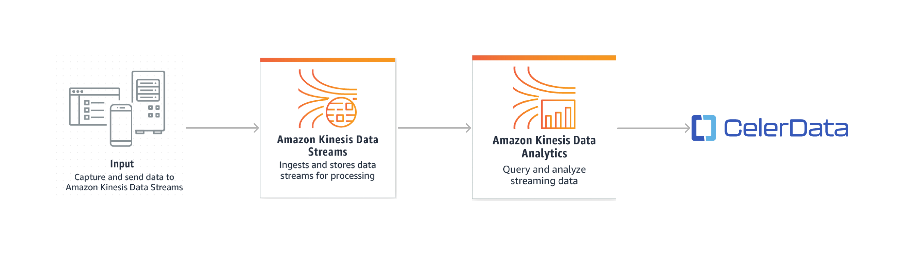
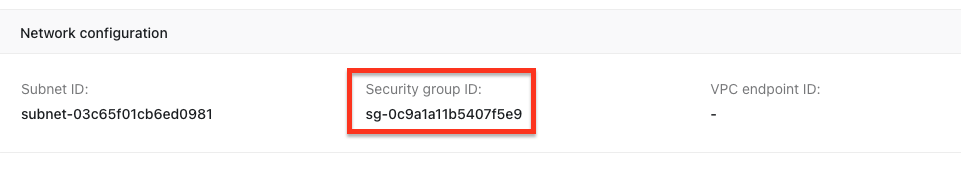
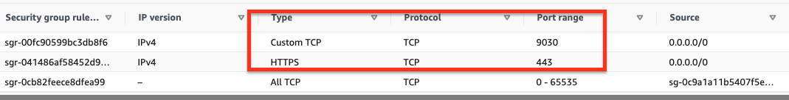
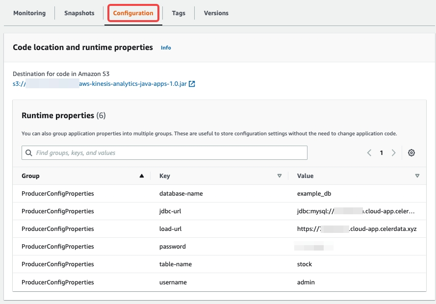
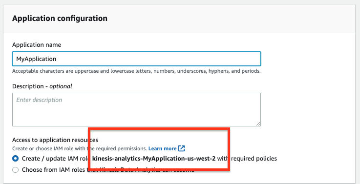
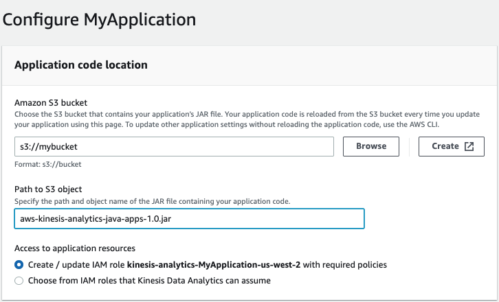
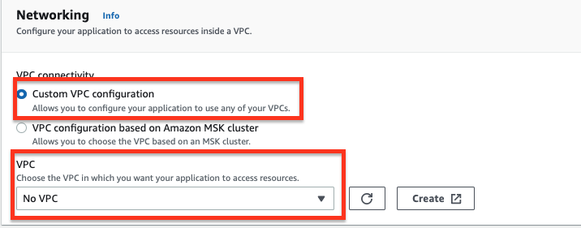
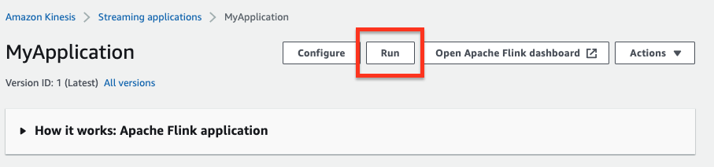
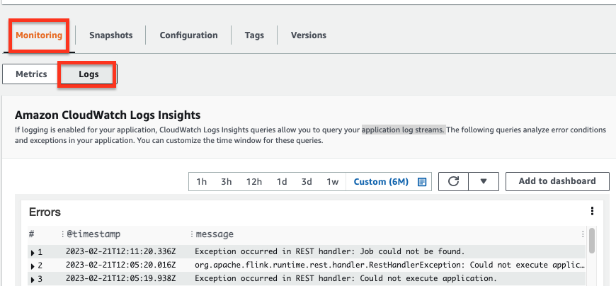
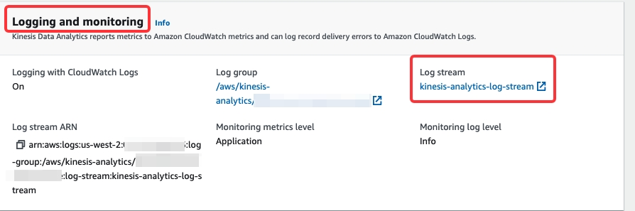

# Load data from Amazon Kinesis

This topic describes how to load data from Amazon Kinesis into CelerData.

## How it works

The overall solution is as follows:



1. Your business application writes streaming data into a Kinesis data stream.
2. You create a Kinesis Data Analytics application to read the input data from the Kinesis data stream.
3. The Kinesis Data Analytics application writes data into a CelerData cluster by using the flink-connector-starrocks SDK.

## Precautions

- We **HIGHLY RECOMMEND** you first to take the [get started](https://docs.aws.amazon.com/kinesisanalytics/latest/java/get-started-exercise.html) exercise to create a Kinesis Data Analytics application with Kinesis data streams as a source and a sink. As such, you can quickly familiarize yourself with Kinesis and solve the problems you may encounter before writing data into a CelerData cluster.
- To ensure a smooth loading operation, we recommend you to use the AWS Management Console to create Kinesis data streams and the Kinesis Data Analytics application, and use the names given in the [get started](https://docs.aws.amazon.com/kinesisanalytics/latest/java/get-started-exercise.html) exercise.
- When you **configure the Kinesis Data Analytics application**, pay attention to the following configurations:
  - When you [edit the IAM policy](#configure-iam-policy), make sure that you add the permissions to access the Kinesis data streams.
  - When you configure the networking for your Data Analytics application, you **MUST** make sure the **Kinesis Data Analytics application has access to the Internet** by **STRICTLY** following the instructions in [Configure the application networking](#configure-the-networking-for-the-kinesis-data-analytics-application).
- When you create a CelerData cluster, you need to enable SSL connection.
- After you successfully run the application and start to load data into the data stream, you can view the data in the data stream by [using the Data Viewer](https://docs.aws.amazon.com/streams/latest/dev/data-viewer.html) and then check whether data is loaded into the target CelerData table.

## Before you begin

Make sure the Kinesis Data Analytics application can connect to the CelerData cluster over the Internet.

### Configure the networking for the CelerData cluster

1. Make sure the CelerData cluster can be connected from the Internet, especially when the CelerData cluster is in a private subnet. If the CelerData cluster is in a public subnet, the CelerData cluster can be connected over the Internet by default. This topic uses a CelerData cluster in a public subnet as an example.

2. Make sure that the security group with which the CelerData cluster resources are associated allows  traffic from the Kinesis Analytics application.

   1. Sign in to the [CelerData Cloud Private console](https://cloud.celerdata.com/login?step=choose) and find the **Security Group ID** with which the CelerData cluster is associated:
   

   2. Sign in to the [Amazon VPC console](https://console.aws.amazon.com/vpc/).

   3. In the left-side navigation pane, choose **Security Groups**. Find the security group with which the CelerData cluster resources are associated.

   4. On the **Inbound Rules** tab, choose **Edit inbound rules**.

   5. Add the following rules highlighted in the red box:

      You must add ports `443` and `9030`.
      
      > **Note**
      >
      > When you create a CelerData cluster, you need to enable SSL connection.

### Configure the networking for the Kinesis Data Analytics application

Make sure the **Kinesis Data Analytics application has access to the Internet** when you  [configure the Kinesis Data Analytics application](#configure-the-networking-for-the-kinesis-data-analytics-application).

- If you customize the VPC for your application, the networking for the application must meet the following requirements:
  - The Kinesis Data Analytics application must run in a private subnet.
  - The VPC must contain a NAT gateway or instance in a public subnet.
  - A route is configured for outbound traffic from the private subnet that hosts the Kinesis Data Analytics application to the public subnet that hosts the NAT gateway or instance.
  For more information, refer to [Internet and Service Access for a VPC-connected Kinesis Data Analytics application](https://docs.aws.amazon.com/kinesisanalytics/latest/java/vpc-internet.html).
- Or you can just configure the application networking as No VPC.

## Basic operations

## Write streaming data into Kinesis Data Stream

You can use a Kinesis Data Stream to store large streams of data records in real time.

1. [Create a Kinesis data stream](https://docs.aws.amazon.com/streams/latest/dev/working-with-streams.html).  If you use Kinesis for the first time, we recommend you to use the same name `ExampleInputStream` as in the [get started](https://docs.aws.amazon.com/kinesisanalytics/latest/java/get-started-exercise.html) exercise.
2. After you successfully run the Kinesis Data Analytics application, [write data to the Kinesis data stream](https://docs.aws.amazon.com/streams/latest/dev/building-producers.html).

## Create a database and table in CelerData cluster

Create a database and a table in the CelerData cluster according to the data records in the Kinesis data stream.

```SQL
CREATE DATABASE IF NOT EXISTS example_db;

USE example_db;
CREATE TABLE stock (
    `EVENT_TIME` datetime NOT NULL,
    `TICKER` varchar(65533) NOT NULL,
    `PRICE` float NULL
) ENGINE=OLAP 
DUPLICATE KEY(`EVENT_TIME`)
DISTRIBUTED BY HASH(`EVENT_TIME`) BUCKETS 2
PROPERTIES (
    "replication_num" = "1"
);
```

## Use Kinesis Data Analytics application to read data from Kinesis Data Stream and write data into CelerData

You can use a Kinesis Data Analytics application to continuously read from a data stream, process and analyze streaming data, and write into a CelerData cluster.

### Edit demo code and build Kinesis Data Analytics application

The Kinesis Data Analytics application reads data from a Kinesis Data Stream and uses the flink-connector-starrocks SDK to encapsulate data into multiple parallel Stream Load jobs to load data into your CelerData cluster.

The demo code for the application mainly configures Flink job properties of a source data stream and a target CelerData cluster. Compared to the original AWS code, the demo code uses the flink-connector-starrocks dependency in the **pom.xml** file and configures job properties of the target CelerData cluster in the sink function.

Follow these steps to edit the demo code and build the Kinesis Data Analytics application:

1. Make sure that the environment meets the [prerequites](https://docs.aws.amazon.com/kinesisanalytics/latest/java/getting-started.html#setting-up-prerequisites) for developing the Kinesis Data Analytics application.

2. Clone the remote repository.

    ```Bash
    git clone git@github.com:StarRocks/demo.git
    ```

3. Navigate to the directory that contains **BasicStreamingJob.java** file. This topic uses Flink version 1.15 as an example, so you need to navigate to the directory **GettingStarted**.

    ```Bash
    cd ./demo/AwsDemo/amazon-kinesis-data-analytics-java-examples/GettingStarted/src/main/java/com/amazonaws/services/kinesisanalytics
    ```

4. Edit the demo code and configure source and sink properties in the **BasicStreamingJob.java** file.

   > **Note**
   >
   > The following shows only part of code in the **BasicStreamingJob.java** file. For the overall codes and codes diff, see this [pull request](https://github.com/StarRocks/demo/pull/21/files).

    ```Java
    public class BasicStreamingJob {
        private static final Log log = LogFactory.getLog(BasicStreamingJob.class);

        private static final String region = "us-west-2"; // The region of the source data stream
        private static final String inputStreamName = "ExampleInputStream"; // The name of the source data stream
        private static final String outputStreamName = "ExampleOutputStream";

        private static DataStream<String> createSourceFromStaticConfig(StreamExecutionEnvironment env) {
            Properties inputProperties = new Properties();
            inputProperties.setProperty(ConsumerConfigConstants.AWS_REGION, region);
            inputProperties.setProperty(ConsumerConfigConstants.STREAM_INITIAL_POSITION, "LATEST");

            return env.addSource(new FlinkKinesisConsumer<>(inputStreamName, new SimpleStringSchema(), inputProperties));
        }

    ......

        public static void main(String[] args) throws Exception {
            // Set up the streaming execution environment
            final StreamExecutionEnvironment env = StreamExecutionEnvironment.getExecutionEnvironment();

            /* If you want to use runtime configuration properties, uncomment the lines below
            * DataStream<String> input = createSourceFromapplicationProperties(env);
            */
            log.info("Create an input");
            DataStream<String> input = createSourceFromStaticConfig(env);

            /* If you want to use runtime configuration properties, uncomment the lines below
            * input.sinkTo(createSinkFromapplicationProperties())
            */
            log.info("Start to create an sink");
            // input.sinkTo(createSinkFromStaticConfig());
            input.addSink(createCelerDataSinkFromapplicationProperties());
            log.info("Success to add a CelerData sink");

            env.execute("Flink Streaming Java API Skeleton");
        }

        private static SinkFunction<String> createCelerDataSinkFromapplicationProperties() throws IOException {
                Map<String, Properties> applicationProperties = KinesisAnalyticsRuntime.getapplicationProperties();
                Properties outputProperties = applicationProperties.get("ProducerConfigProperties");
                if (outputProperties == null) {
                    outputProperties = new Properties();
                    log.info("ProducerConfigProperties is not set. It will use default config");
                }
                else {
                    log.info("ProducerConfigProperties: " + outputProperties.toString());
                }
        
                StarRocksSinkOptions.Builder builder = StarRocksSinkOptions.builder()
                        .withProperty("jdbc-url", outputProperties.getProperty("jdbc-url", "jdbc:mysql://xxxxxxxx.cloud-app.celerdata.com:9030"))
                        .withProperty("load-url", outputProperties.getProperty("load-url", "https://xxxxxxxx.cloud-app.celerdata.com"))
                        .withProperty("username", outputProperties.getProperty("username", "admin"))
                        .withProperty("password", outputProperties.getProperty("password", "123456"))
                        .withProperty("database-name", outputProperties.getProperty("database-name", "example_db"))
                        .withProperty("table-name", outputProperties.getProperty("table-name", "stock"))
                        /**
                        * The connector can encapsulate the data into two formats: CSV and JSON
                        * For CSV data:
                        * .withProperty("sink.properties.format", "csv")
                        * For JSON data:
                        */
                        .withProperty("sink.properties.format", "json")
                        .withProperty("sink.properties.jsonpaths", "[\"event_time\", \"ticker\", \"price\"]")
                        // .withProperty("sink.properties.columns", "event_time, ticker, price")
                        .withProperty("sink.properties.strip_outer_array", "true");
                for (Map.Entry<Object, Object> property : outputProperties.entrySet()) {
                    if (StringUtils.startsWith(property.getKey().toString(), "sink.")) {
                        builder.withProperty(property.getKey().toString(), property.getValue().toString());
                    }
                }
                return StarRocksSink.sink(builder.build());
            }
    ```

#### **Source** **and sink  properties**

- Source properties

    | **Property**    | **Required** | **Description**                              |
    | --------------- | ------------ | -------------------------------------------- |
    | region          | Yes          | The region of the input Kinesis Data Stream. |
    | inputStreamName | Yes          | The name of the input Kinesis Data Stream.   |

- Sink properties

    | **Property**                      | **Required** | **Description**                                              |
    | --------------------------------- | ------------ | ------------------------------------------------------------ |
    | jdbc-url                          | Yes          | This URL used to access the CelerData cluster through the MySQL server. The format is `jdbc:mysql://xxxxxxxxx.cloud-app.celerdata.com:9030`. |
    | load-url                          | Yes          | The URL used to access the CelerData cluster through the HTTP server. This URL is an HTTPS URL with the domain name assigned to your CelerData cluster, such as `https://xxxxxxxxx.cloud-app.celerdata.com`. |
    | database-name                     | Yes          | The name of the CelerData database.                          |
    | table-name                        | Yes          | The name of the CelerData table.                             |
    | username                          | Yes          | The username of the account that has write permissions on the target database and table. |
    | password                          | Yes          | The password of the username of the preceding account.       |
    | sink.properties.*                 | No           | The Stream Load properties. For more information, see [data_desc](../sql-reference/sql-statements/data-manipulation/STREAM_LOAD.md#data_desc) and [opt_properties](../sql-reference/sql-statements/data-manipulation/STREAM_LOAD.md#opt_properties). |
    | sink.properties.format            | No           | The data format. Valid values: `CSV` and `JSON`. Default value: `CSV`. |
    | sink.properties.jsonpaths         | No           | The names of the fields that you want to load from the JSON data. The value of this parameter is in JSON format. |
    | sink.properties.strip_outer_array | No           | When you want flink-connector-starrocks to capsulate data into JSON format and then load the data into the CelerData cluster, you must set this parameter to `true`, because flink-connector-starrocks groups messages to perform Stream Load jobs. Valid values: `true` and `false`. Default value: `false`. |

    If later you want to update the properties or configure more properties, you can modify the configurations in the **Runtime properties** section of the **Configuration** tab.

    

5. Add the flink-connector-starrocks dependency into the **pom.xml** file.

    ```XML
    <dependency>
        <groupId>com.starrocks</groupId>
        <artifactId>flink-connector-starrocks</artifactId>
        <version>1.2.6_flink-1.15</version>
    </dependency>  
    ```

    The flink-connector-starrocks version is in the format `${flink-connector-starrocks.version}_flink-${fink.version}_${scala.version}`. And also, if the Flink version is 1.15.x, you do not need to specify the Scala version. For all the supported versions, see the [github repo](https://github.com/StarRocks/starrocks-connector-for-apache-flink#prerequisites) of flink-connector-starrocks.

6. Compile and package the demo code into a JAR file. For more information, see [Compile the application Code](https://docs.aws.amazon.com/kinesisanalytics/latest/java/get-started-exercise.html#get-started-exercise-5.5).

    ```Bash
    mvn package -Dflink.version=1.15.2
    ```

7. Upload **aws-kinesis-analytics-java-apps-1.0.jar** file to an Amazon S3 bucket. For more information, see [Upload the Apache Flink Streaming Java Code](https://docs.aws.amazon.com/kinesisanalytics/latest/java/get-started-exercise.html#get-started-exercise-6).

### Create and configure Kinesis Data Analytics application

Create and configure the Kinesis Data Analytics application according to the [Create and Run the Kinesis Data Analytics application](https://docs.aws.amazon.com/kinesisanalytics/latest/java/get-started-exercise.html#get-started-exercise-7).  Pay attention to the following configurations.

#### **Configure IAM policy**

Configure an IAM role that includes permissions required for the Kinesis Data Analytics application to read the data stream.

1. When you create a Kinesis Data Analytics application, create an IAM role with required policies by default.
   

2. After you create the application, edit the IAM policies and make sure that the policy attached to the application is edited as follows: for the application. Note that you must replace the sample account ID `012345678901` with your account ID.

      ```JSON
      {
          "Sid": "ReadInputStream",
          "Effect": "Allow",
          "Action": "kinesis:*",
          "Resource": "arn:aws:kinesis:us-west-2:012345678901:stream/ExampleInputStream"
      }
      ```

#### **Configure application code location**

When you configure the application, you need to provide the location of the application code:

- For **Amazon S3 bucket**, specify the S3 bucket that contains the application JAR file.
- For **Path to Amazon S3 object**, specify the name of the application JAR file. The default name is **aws-kinesis-analytics-java-apps-1.0.jar**.

  

#### **Configure application networking**

- When you configure the application, you need to configure networking to make sure the application has access to the Internet:

  - Option 1: Select **Custome VPC** **configuration** for **VPC connectivity** and select **No VPC** from the VPC drop-down list.
    

  - Option 2: Specify the networking by **STRICTLY** following the instructions provided in the [Internet and Service Access for a VPC-Connected Kinesis Data Analytics application](https://docs.aws.amazon.com/kinesisanalytics/latest/java/vpc-internet.html). In a nutshell, the application networking must meet the following requirements:
    - The Kinesis Data Analytics application must run in a private subnet.
    - The VPC must contain a NAT gateway or instance in a public subnet.
    - A route is configured for outbound traffic from the private subnet that hosts the Kinesis Data Analytics application to the public subnet that hosts the NAT gateway or instance.

### Run Kinesis Data Analytics application

1. On the **MyApplication** page, choose **Run**. In the message that appears, click **Confirm**.
   

2. In the **Logs** section of the **Monitoring** tab, view the running information. , such as **Errors**, **Exceptions**, **Job status exceptions** of the application to analyze errors and exceptions.
   

   In the **Logging and monitoring** section of the **Configuration** tab, you can also view the application's `INFO` or `WARN` logs. You need to open the log stream **kinesis-analytics-log-stream** to search detailed logs by using event filters such as `BasicStreamingJob` and `starrocks`.
    

## FAQ

1. **Issue description:**  What do I do if the field **throwableInformation** shows  `org.apache.flink.kinesis.shaded.com.amazonaws.SdkClientException: Unable to execute HTTP request : Connect to kinesis.us-west-2.amazonaws.com:443 [kinesis.us-west-2.amazonaws.com/34.223.45.1] failed: connect timed out` in the **Exceptions** part of  the **Logs** section of the **Monitoring** tab.<br />
   **Possible causes:** The Kinesis Analytics application is launched into a public subnet, instead of a private subnet.<br />
   **Solutions:**
   - If you customize the VPC for your application, check that the networking for the application must meet the following requirements:
        - The Kinesis Data Analytics application must run in a private subnet.
        - The VPC must contain a NAT gateway or instance in a public subnet.
        - A route is configured for outbound traffic from the private subnet that hosts the Kinesis Data Analytics application to the public subnet that hosts the NAT gateway or instance.
    For more information, refer to [Internet and Service Access for a VPC-connected Kinesis Data Analytics application](https://docs.aws.amazon.com/kinesisanalytics/latest/java/vpc-internet.html).
   - Or you can just configure the application networking as No VPC.
2. **Issue description**: What do I do if the field **message** shows `Error occurred when trying to start the job` and the field **throwableInformation** shows that `Failed to get StarRocks version` in the **Error** part of  the **Logs** section of the **Monitoring** tab.<br />
   **Possible causes**: The `jdbc-url` of your CelerData cluster is not correct.<br />
   **Solutions**: Use `mysql -u <celerdata_domain_name> -P 9030 -uadmin` to test the connection to your CelerData cluster.
3. **Issue description:** What do I do if the field **message** shows `"message": "Failed to connect to address:``xxxxxxxxx.cloud-app.celerdata.com``”` in the **Exceptions** part of  the **Logs** section of the **Monitoring** tab.<br />
   **Possible causes:** Your application cannot access the domain of the CelerData cluster via the HTTPS protocol.<br />
   **Solutions:**<br />
   Check the following CelerData configuration:
   - The CelerData cluster has enabled the SSL connection.
   - The security group associated with the celerdata cluster adds an inbound rule to open the port `443`.
