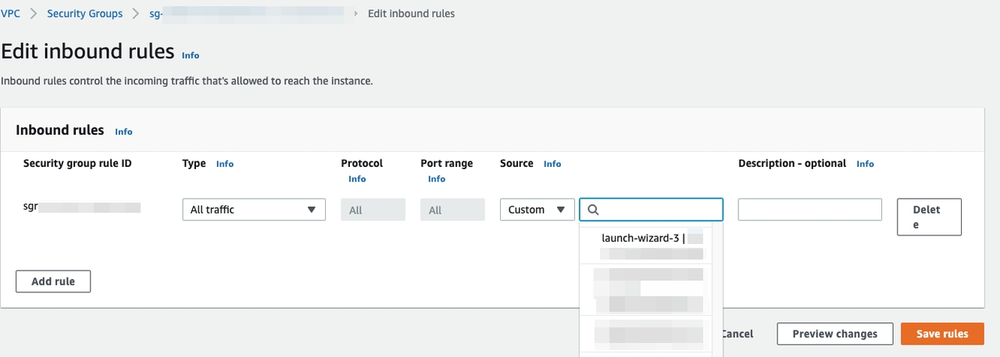
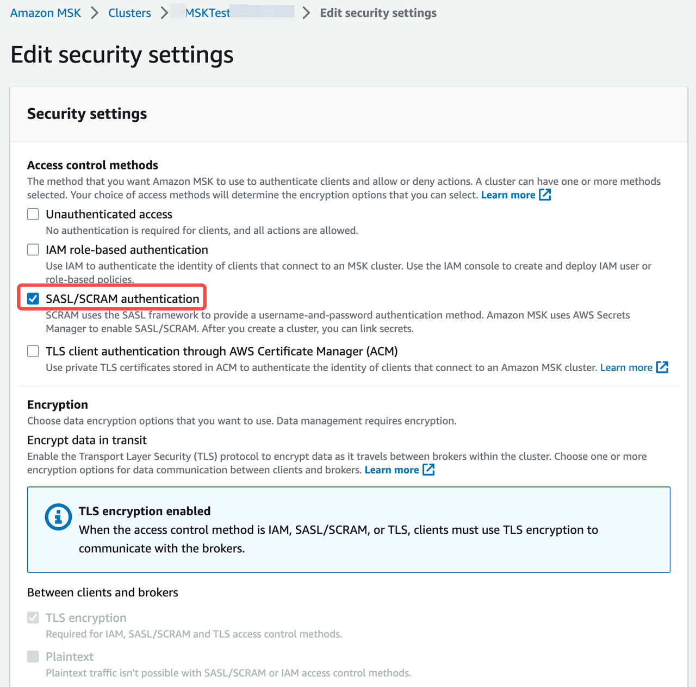
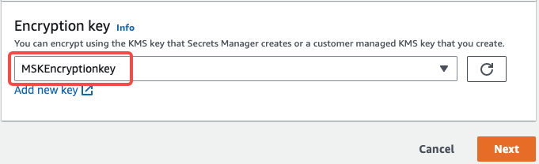
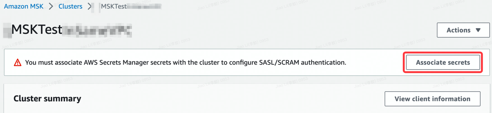
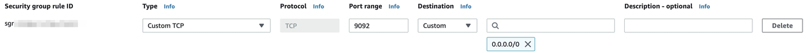

# Load data from Amazon MSK

This topic introduces how to create a Routine Load job to stream messages (events) from Amazon Managed Streaming for Apache Kafka (Amazon MSK) into CelerData.

To continuously load messages of a stream from an Amazon MSK cluster into CelerData, you can store the message stream in a Kafka topic on the Amazon MSK cluster and create a Routine Load job to consume the messages. The Routine Load job persists in CelerData, generates a series of load tasks to consume the messages in all or some of the partitions in the topic, and loads the messages into CelerData.

A Routine Load job supports exactly-once delivery semantics to ensure the data loaded into CelerData is neither lost nor duplicated.

## Supported data file formats

Routine Load now supports consuming CSV and JSON formatted data from an MSK cluster.

> NOTE
>
> As for data in CSV format, CelerData supports UTF-8 encoded strings within 50 bytes as column separators. Commonly used column separators include comma (,), tab, and pipe (|).

## How it works

Loading data from an MSK cluster and a Confluent Cloud cluster both use Routine Load. For basic concepts and principals about Routine Load, see [Load data from Confluent Cloud through Routine Load](./loading_from_confluent.md).

## Before you begin

1. Prepare an MSK cluster. You can quickly create an MSK cluster by following the instructions provided in [MSK getting started](https://docs.aws.amazon.com/msk/latest/developerguide/getting-started.html). You can also use an existing MSK cluster.

    > **Notice**
    >
    >  **The VPC and subnets  of an MSK cannot be changed after the cluster is created.**

2. If the MSK cluster and CelerData cluster are in the same VPC:

   1. Make sure that the security group to which the CelerData cluster resources belong can accept traffic that comes from the security group to which the MSK cluster resources belong.

      1. Sign in to the [Amazon VPC console](https://console.aws.amazon.com/vpc/).
      2. In the left-side navigation pane, choose **Security Groups**. Find the security group to which the CelerData cluster resources belong.
      3. On the **Inbound Rules** tab, choose **Edit inbound rules**.
      4. Choose **Add rule**.
         1. Set **Type** to **All traffic**.
         2. For **Source**, select **Custom** and then select the security group to which the MSK cluster resources belong.
            
      5. Click **Save rules**.

   2. Configure the authentication and encryption for the CelerData cluster to access the MSK cluster:

      1. Configure the security settings for the MSK cluster.

         1. Choose the MSK cluster.
         
         2. Select **Actions** > **Edit security settings**.
         
         3. In the **Edit security settings** dialog box, select **SASL/SCRAM** for **Access control method**.
         
            > **Note**
            >
            > - If you select **SASL/SCRAM** for the **Access control method**, Amazon MSK turns on TLS encryption for all traffic between clients and brokers.
            > - You can also select **Unauthenticated access** for **Access control method** and **PLAINTEXT** for **Encryption** method to have a simple test. Because these security settings don't use any authentication and encryption,**these are not safe for production environments**.

            

      2. Create a customer managed key and a secret for authetication and encryption for the MSK cluster.

         1. Create a customer managed key on [Key Management Service (KMS)](https://us-west-2.console.aws.amazon.com/kms/home?region=us-west-2#/kms/keys) by following the instructions provided in [Creating keys](https://docs.aws.amazon.com/kms/latest/developerguide/create-keys.html).

         2. Create a secret on [AWS secrets Manager](https://us-west-2.console.aws.amazon.com/secretsmanager/listsecrets?region=us-west-2) by following the instructions provided in [Set up SASL/SCRAM authentication](https://docs.aws.amazon.com/msk/latest/developerguide/msk-password.html). Take note of the following configurations:

            1. In the **Choose secret type** section, configure the parameters as follows:

                

                - **Secret type**: Select **Other type of secrets**.

                - **Key/value pairs**: Enter your secret. The secret is used as the **property.sasl.username** and **property.sasl.password** for SASL/SCRAM authentication when you create a Routine Load job.

                - **Encryption Key**: Associate the secret with the customer managed key created above for encryption.

                > **Notice**
                >
                > Don't select **aws/secretsmanager** as **Encryption Key**. Because Secrets Manager uses the default AWS KMS key for a secret by default, and a secret created with the default AWS KMS key cannot be associated with an Amazon MSK cluster.
                >
                > 

            2. In the **Configure secret** section, check that **Secret name** begins with the prefix **AmazonMSK_**.

            3. After you create the secret, copy the **Secret ARN** of the secret. You need to use the **Secret ARN** when associating the secret with the MSK cluster.

      3. Associate the secret with the MSK cluster.

         1. Choose the MSK cluster.

         2. Select **Actions** > **Edit security settings**.

         3. Click **Associate secrets**, and paste the **Secret ARN** copied above.
            

3. If the MSK cluster and CelerData are in the different VPCs, configure the networking, authentication, and encryption for the CelerData cluster to access the MSK cluster as follows:

   - **Networking**
      - Option 1: The CelerData cluster connects to the MSK cluster within AWS
        You can use [AWS VPC peering](https://docs.aws.amazon.com/vpc/latest/peering/what-is-vpc-peering.html). For other connection options within AWS,  see [other methods](https://docs.aws.amazon.com/msk/latest/developerguide/aws-access.html).
      - Option 2: The CelerData cluster connects to the MSK cluster over the Internet
        - Configure the MSK networking
          Turn on [public access](https://docs.aws.amazon.com/msk/latest/developerguide/public-access.html).

          > **Notice**
          >
          > make sure that the MSK cluster meets all of the conditions listed in the [public access](https://docs.aws.amazon.com/msk/latest/developerguide/public-access.html).
        - Configure the CelerData networking
          - Make sure the subnet of the CelerData cluster can connect to the Internet.
            1. If the CelerData cluster is in a private subnet, make sure that a NAT gateway is configured for the private subnet so that the CelerData cluster can connect to the internet.
            2. If the CelerData cluster is in a public subnet, the CelerData cluster can connect to the Internet by default.
          - For security purposes, add the following outbound rule to the security group for the CelerData cluster, so that the CelerData cluster can access the MSK cluster.
            

            1. Set **Port range**. You can find the port range in the **Public endpoint** in the **Bootstrap servers** section from the MSK cluster's **View client information** page. The port range can be **9092** or **9096** according to MSK cluster's authentication.
            2. For **Destination**, select **Custom** and then set the public IP address of the MSK cluster which can be found in the **Public endpoint**. You can also use **0.0.0.0/0**.
   - **Authentication and encryption**

      The authentication and encryption configuration when the MSK cluster and CelerData cluster are in different VPCs are the same as the configuration when the two clusters are in the same VPC.

## Basic operations

Becasue loading data from an MSK cluster and a Confluent Cloud cluster both use Routine Load, the following only introduces the information you need to pay special attention to when you load data from the MSK cluster. For more details about Routine Load, see [Load data from Confluent Cloud](./loading_from_confluent.md).

### Create a Routine Load job

#### Load CSV-formatted data

This section describes how to create a Routine Load job to consume CSV-formatted data from an MSK cluster, and load the data into CelerData.

> **Notice**
>
> Before create a Routine Load job, you need to prepare a dataset as source data and create a table in the CelerData cluster.

Execute the following statement to create a Routine Load job named `example_tbl1_ordertest1` to consume the messages from the topic `ordertest1` and load the data into the table `example_tbl1`. The load job consumes the messages from the initial offset in the specified partitions of the topic.

**Pay attention to the properties in bold fonts.**

```SQL
CREATE ROUTINE LOAD example_db.example_tbl1_ordertest1 ON example_tbl1
    COLUMNS TERMINATED BY ",",
    COLUMNS (order_id, pay_dt, customer_name, nationality, temp_gender, price)
    FROM KAFKA
    (
        "kafka_broker_list" ="<kafka_broker1_ip>:<kafka_broker1_port>,<kafka_broker2_ip>:<kafka_broker2_port>",
        "kafka_topic" = "ordertest1",
        "kafka_partitions" ="0,1,2,3,4",
        "property.kafka_default_offsets" = "OFFSET_BEGINNING",
        "property.security.protocol"="SASL_SSL",
        "property.sasl.mechanism"="SCRAM-SHA-512",
        "property.sasl.username"="<username>",
        "property.sasl.password"="<password>"
    );
```

- **Kafka broker list**

     ```plaintext
     "kafka_broker_list" ="<kafka_broker1_ip>:<kafka_broker1_port>,<kafka_broker2_ip>:<kafka_broker2_port>",
     ```

    You need to use the property `kafka_broker_list` to specify a list of host and port pairs ts for establishing the connection to the MSK cluster. You can find the list of host and port pairs in **Private endpoint** in the **Bootstrap servers** section from the MSK cluster's **View client information** page.

    > **Notice**
    >
    > If the CelerData cluster accesses the MSK cluster through the Internet, you need to use the `Public endpoint` in the `Bootstrap servers` section from the MSK cluster's **View client information** page.

- **Authentication and encryption**

   ```SQL
   "property.security.protocol"="SASL_SSL",
   "property.sasl.mechanism"="SCRAM-SHA-512",
   "property.sasl.username"="***",
   "property.sasl.password"="***",
    ```

  - `property.security.protocol`: You can use `SASL_SSL`.

     > **Notice**
     >
     > We do not recommend using `SASL_PLAINTEXT` in production environments.

  - `property.sasl.mechanism`: You can use `SCRAM-SHA-512`.

  - `property.sasl.username` and `property.sasl.password`: the secret created above which is associated with the MSK cluster.

#### Load JSON-formatted data

This section describes how to create a Routine Load job to consume JSON-formatted data in an MSK cluster, and load the data into CelerData.

> **Notice**
>
> Before create a Routine Load job, you need to prepare a dataset as source data and create a table in the CelerData cluster.

Execute the following statement to create a Routine Load job named `example_tbl2_ordertest2` to consume the messages from the topic `ordertest2` and load the data into the table `example_tbl2`. The load task consumes the messages from the initial offset in the specified partitions of the topic.

```SQL
CREATE ROUTINE LOAD example_db.example_tbl2_ordertest2 ON example_tbl2
COLUMNS(commodity_id, customer_name, country, pay_time, price, pay_dt=from_unixtime(pay_time, '%Y%m%d'))
PROPERTIES
(
    "format" ="json",
    "jsonpaths" ="[\"$.commodity_id\",\"$.customer_name\",\"$.country\",\"$.pay_time\",\"$.price\"]"
)
FROM KAFKA
(
    "kafka_broker_list" ="<kafka_broker1_ip>:<kafka_broker1_port>,<kafka_broker2_ip>:<kafka_broker2_port>",
    "kafka_topic" = "ordertest2",
    "kafka_partitions" ="0,1,2,3,4",
    "property.kafka_default_offsets" = "OFFSET_BEGINNING",
    "property.security.protocol"="SASL_SSL",
    "property.sasl.mechanism"="SCRAM-SHA-512",
    "property.sasl.username"="<username>",
    "property.sasl.password"="<password>"
);
```

### Check a load job and task

#### Check a load job

Execute the [SHOW ROUTINE LOAD](../sql-reference/sql-statements/data-manipulation/SHOW_ROUTINE_LOAD.md) statement to check the status of the load job.

#### Check a load task

Execute the [SHOW ROUTINE LOAD TASK](../sql-reference/sql-statements/data-manipulation/SHOW_ROUTINE_LOAD_TASK.md) statement to check the load tasks of the load job.

### Pause a load job

You can execute the [PAUSE ROUTINE LOAD](../sql-reference/sql-statements/data-manipulation/PAUSE_ROUTINE_LOAD.md) statement to pause a load job.

```SQL
PAUSE ROUTINE LOAD FOR example_tbl2_ordertest2;
```

### Resume a load job

You can execute the [RESUME ROUTINE LOAD](../sql-reference/sql-statements/data-manipulation/RESUME_ROUTINE_LOAD.md) statement to resume a paused load job.

```SQL
RESUME ROUTINE LOAD FOR example_tbl2_ordertest2;
```

### Alter a load job

Before altering a load job, you must pause it with the [PAUSE ROUTINE LOAD](../sql-reference/sql-statements/data-manipulation/PAUSE_ROUTINE_LOAD.md) statement. Then you can execute the [ALTER ROUTINE LOAD](../sql-reference/sql-statements/data-manipulation/alter-routine-load.md) to alter the load job. After altering the load job, you can execute the [RESUME ROUTINE LOAD](../sql-reference/sql-statements/data-manipulation/RESUME_ROUTINE_LOAD.md) statement to resume it, and check the status of the load job by using the [SHOW ROUTINE LOAD](../sql-reference/sql-statements/data-manipulation/SHOW_ROUTINE_LOAD.md) statement.

```SQL
ALTER ROUTINE LOAD FOR example_tbl2_ordertest2
PROPERTIES
(
    "desired_concurrent_number" = "6"
)
FROM kafka
(
    "kafka_partitions" = "0,1,2,3,4,5,6,7",
    "kafka_offsets" = "OFFSET_BEGINNING,OFFSET_BEGINNING,OFFSET_BEGINNING,OFFSET_BEGINNING,OFFSET_END,OFFSET_END,OFFSET_END,OFFSET_END"
);
```

### Stop a load job

You can execute the  [STOP ROUTINE LOAD](../sql-reference/sql-statements/data-manipulation/STOP_ROUTINE_LOAD.md) statement to stop a load job.

```SQL
STOP ROUTINE LOAD FOR example_tbl2_ordertest2;
```

## FAQ

- **Issue description:** When you run the SHOW ROUTINE LOAD statement on a Routine Load job, the job reports an error `failed to create kafka consumer: sasl.username and sasl.password must be set` in the `ReasonOfStateChanged` field.
  **Solutions:** You should set the `property.sasl.username` and `property.sasl.password` properties when using SASL/SCRAM as the authentication mechanism.
- **Issue description:** When you run the SHOW ROUTINE LOAD statement on a Routine Load job, the job reports an error `failed to get partition meta: Local: Broker transport failure` in the `ReasonOfStateChanged` field.

    ```plaintext
    Error 1064: failed to send proxy request to TNetworkAddress(hostname:10.0.1.2, port:8060) err failed to send proxy request to TNetworkAddress(hostname:10.0.1.2, port:8060) err [failed to get partition meta: Local: Broker transport failure]
    ```

   **Possible causes**: TLS channel cannot be established.

   **Solutions:** You can perform troubleshooting by disabling the SSL certificate verification from the CelerData cluster to the MSK cluster.

  1. Make sure the Kafka broker list is correct.
  2. Shut down the TLS channel temporarily by disabling the SSL certificate verification from CelerData to the MSK cluster.

     ```Plain
     "property.enable.ssl.certificate.verification"="false"
     ```

    > **Notice**
    >
    > - **Disabling the SSL certificate verification is not safe, you must turn it off in your production environments.**
    > - You should generate a **temporary secret** for the MSK cluster as the `property.sasl.username` and `property.sasl.password` properties for security purposes, because the information like `property.sasl.username` and `property.sasl.password`  is not secure when the CelerData cluster connects to the MSK cluster without using the SSL certificate verification.

    If the Routine Load job then successfully loads data into CelerData, there may be some problems with the SSL certificate. For example, CelerData cannot find the CA root certificate automatically. In this situation, you can manually specify the CA root certificate for CelerData by adding the property below. For more information about the CA root certificate, see [librdkafka - INTRODUCTION.md # SSL](https://github.com/edenhill/librdkafka/blob/master/INTRODUCTION.md#SSL).

    ```plaintext
    "property.ssl.ca.location"="/etc/ssl/certs/ca-bundle.crt"
    ```
