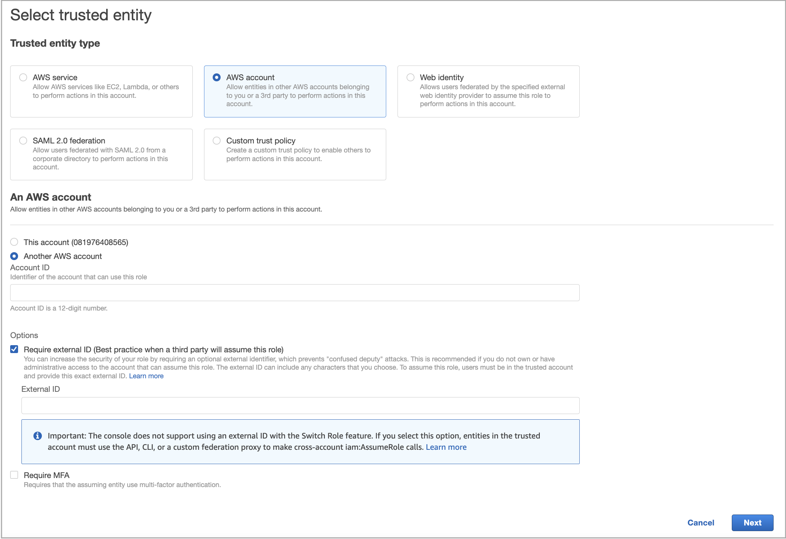
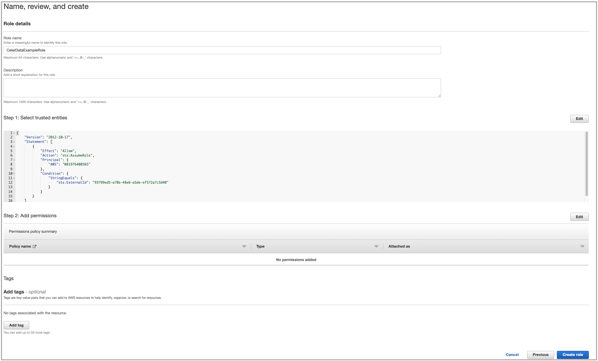
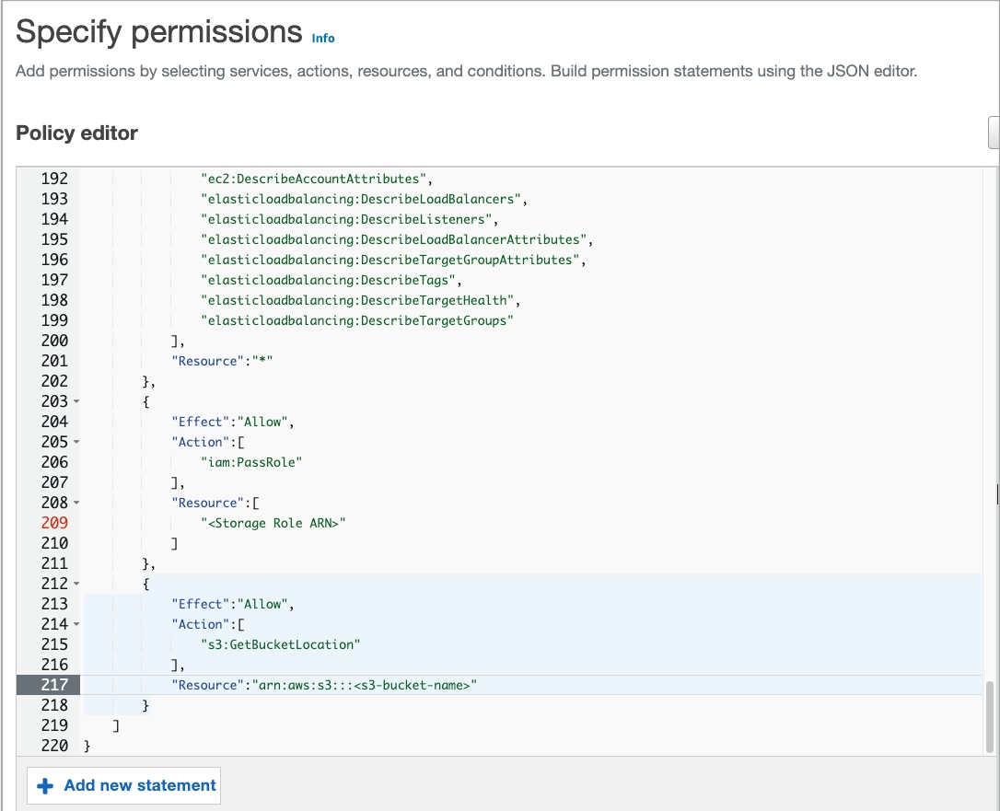
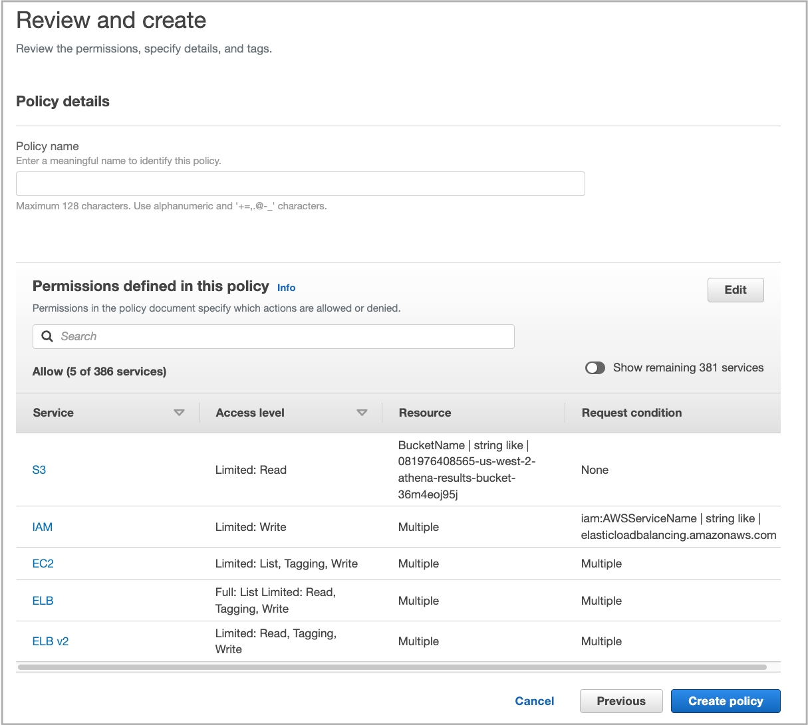
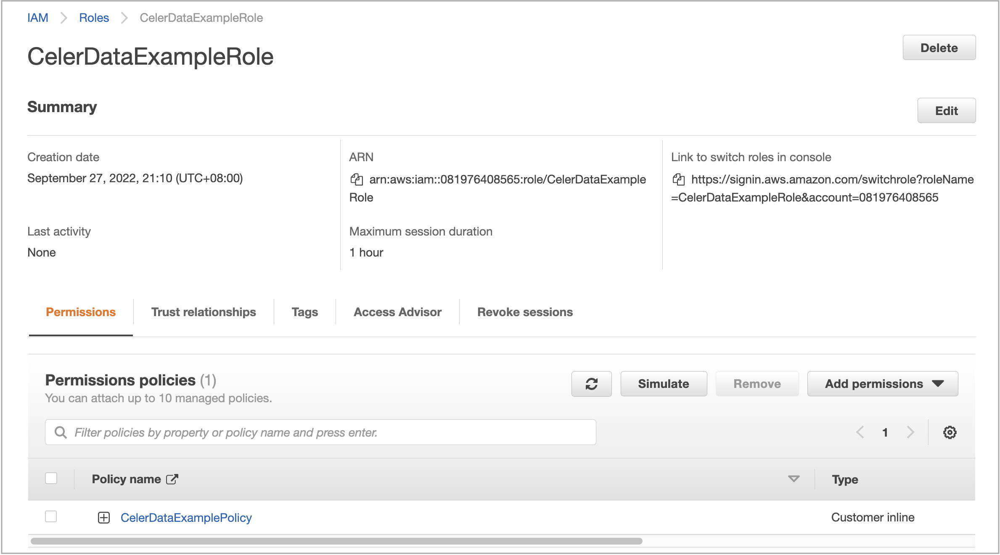

# Create a cross-account IAM role

You need to create a cross-account IAM role, which will be referenced in a deployment credential, either from the **Cloud settings** page in the CelerData Cloud Private console before you create a deployment or as part of the workflow of creating a deployment.

## Prerequisites

You have created a [data credential](../../../cloud_settings/aws_cloud_settings/manage_aws_data_credentials.md#create-a-data-credential) and obtained the ARN of the data credential role and the name of the data credential bucket.

> **NOTE**
>
> The IAM role and bucket referenced in the data credential are referred to as the data credential role and the data credential bucket in this topic.

You can follow these steps to obtain the ARN of the data credential role and the name of the data credential bucket:

1. Sign in to the [CelerData Cloud Private console](https://cloud.celerdata.com/login).

2. In the left-side navigation pane, choose **Cloud settings** > **AWS**.

3. On the **Data credentials** tab of the **AWS Cloud** page, click the data credential that you want to associate with the deployment credential to be created.

4. In the right-side pane that appears, copy the **Bucket name** and save it to a location that you can access later. Also, find the **Instance profile ARN**, for example, `arn:aws:iam::081976408565:instance-profile/byoc-common`, based on which you can infer that the name of the data credential role is `byoc-common`.

   

5. Log in to the [IAM console](https://us-east-1.console.aws.amazon.com/iamv2/home?region=us-west-2#/home).

6. Navigate to the **Roles** page and enter **byoc-common** in the search box to search for the data credential role. Then, click the data credential role you have found.

7. On the role details page, copy the data credential role's **ARN** (for example, `arn:aws:iam::081976408565:role/byoc-common`) and save it to a location that you can access later.

## Before you begin

To create a cross-account IAM role before deployment, follow these steps:

1. Sign in to the [CelerData Cloud Private console](https://cloud.celerdata.com/login).

2. In the left-side navigation pane, choose **Cloud settings** > **AWS**.

3. On the **Deployment credentials** tab of the **AWS Cloud** page, click **Create deployment credential**.

4. In the **Create deployment credential** dialog box, copy the JSON policy template in **IAM policy information**, the **Trust account ID**, and the **External ID**, and save the information you have obtained to a location that you can access later.

To create a cross-account IAM role during deployment, follow these steps:

1. Sign in to the [CelerData Cloud Private console](https://cloud.celerdata.com/login).

2. [Start the deployment wizard](../../../get_started/create_cluster/create_cluster_aws.md#start-the-deployment-wizard) and proceed to [**STEP2: Configure cloud credentials**](../../../get_started/create_cluster/create_cluster_aws.md#step2-configure-cloud-credentials).

3. In the **Deployment credential** section, select or create a deployment credential, click **Generate policy** next to **IAM policy information**, copy the JSON policy template generated in **IAM policy information**, the **Trust account ID**, and the **External ID**, and then save the information you have obtained to a location that you can access later.

## Step 1: Create a cross-account IAM role

1. Sign in to the [AWS IAM console](https://console.aws.amazon.com/iam/) as a user with administrator privileges.

2. In the left-side navigation pane, choose **Access management** > **Roles**.

3. On the **Roles** page, click **Create role**.

   The **Create role** wizard appears, helping you create an IAM role with three steps.

4. In the **Select trusted entity** step, do as follows:

   a. In the **Trusted entity type** section, select **AWS account**.

   b. In the **An AWS account** section, select the check box next to **Another AWS account** and then paste the **Trust account ID** that you have obtained in [Before you begin](#before-you-begin) to the **Account ID** field.

   c. In the **Options** section, select the check box next to **Require external ID** and then paste the **External ID** that you have obtained in [Before you begin](#before-you-begin) to the **External ID** field.

   d. Click **Next**.

   

5. In the **Add permissions** step, click **Next**.

6. In the **Name, review, and create** step, enter a role name, optionally enter a description or add tags, and then click **Create role**.

   

## Step 2: Add an inline policy to the cross-account IAM role

1. In the left-side navigation pane, choose **Access management** > **Roles**.

2. On the **Roles** page, find the IAM role that you just created and click its name.

3. In the **Permissions policies** section of the page that appears, click **Add permissions** and choose **Create inline policy**.

4. In the **Specify permissions** step, perform either of the following operations depending on whether you create the cross-account IAM role before or during deployment:

   - If you create the cross-account IAM role before deployment:

     Click the **JSON** tab, delete the existing JSON policy document, and paste the **Policy template** that you have obtained in [Before you begin](#before-you-begin). In the policy template, replace `<Storage Role ARN>` with the ARN of the data credential role and `<s3-bucket-name>` with the name of the data credential bucket. Then, click **Review policy**.

     

   - If you create the cross-account IAM role during deployment:

     Click the **JSON** tab, delete the existing JSON policy document, and paste the **Policy template** that you have obtained in [Before you begin](#before-you-begin). Then, click **Review policy**.

5. In the **Review Policy** step, enter a policy name and click **Create policy**.

   

## Step 3: Obtain the ARN of the cross-account IAM role

In the **Summary** section of the role details page that appears, copy the **ARN** of the cross-account IAM role and save the ARN to a location that you can access later. You will need to provide the ARN when you create a deployment credential.

