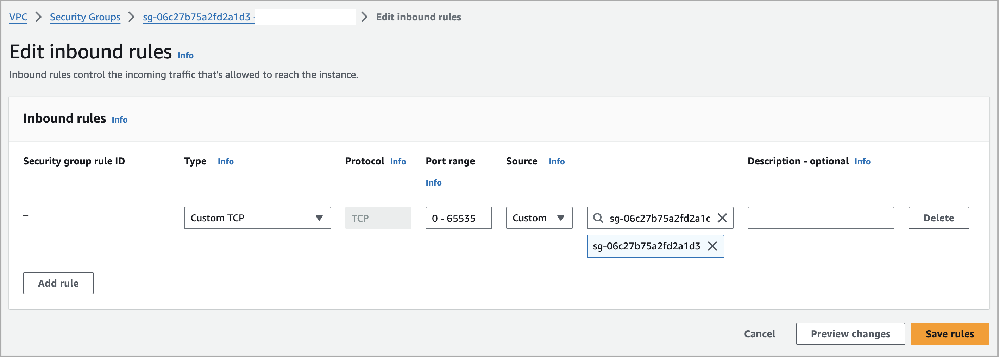
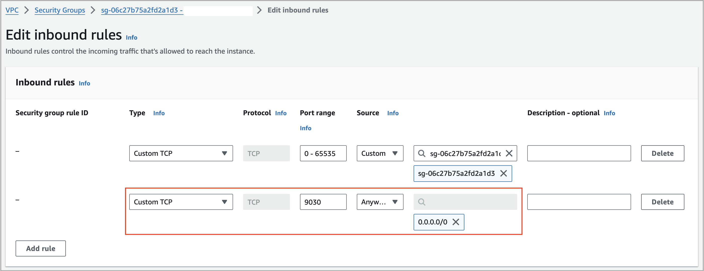
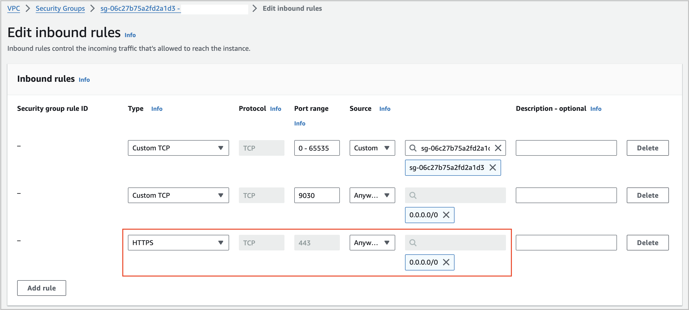
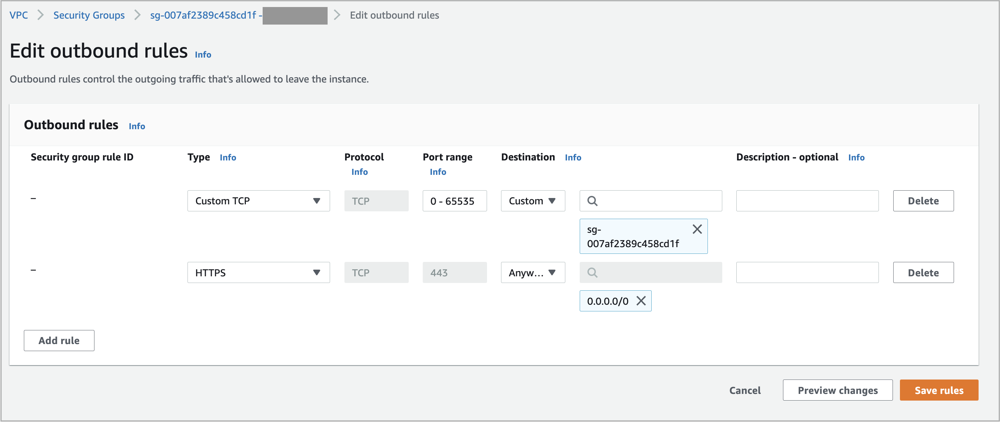

# Create a security group

You need to create a security group, which will be referenced in a network configuration, either from the **Cloud Settings** page in the CelerData Cloud Private console before you create a deployment or as part of the workflow of creating a deployment.

To create a security group, follow these steps:

1. Sign in to the [AWS VPC console](https://console.aws.amazon.com/vpc/) as a user with administrator privileges.

2. In the upper-right corner of the page, select your AWS region.

3. In the left-side navigation pane, choose **Security** > **Security groups**.

4. On the **Security groups** page, click **Create security group**.

5. On the **Create security group** page, do as follows:

   a. For **Security group name**, enter a name for the security group.

      > **NOTE**
      >
      > A name can be up to 255 characters in length. Allowed characters are lowercase letters (a-z), uppercase letters (A-Z), digits (0-9), spaces, and the following special characters: `._-:/()#,@[]+=;{}!$*`. If the name contains trailing spaces, we trim the spaces when we save the name. For example, if you enter "Test Security Group " for the name, we store it as "Test Security Group".

   b. For **Description**, enter a description for the security group.

      > **NOTE**
      >
      > A description can be up to 255 characters in length. Allowed characters are lowercase letters (a-z), uppercase letters (A-Z), digits (0-9), spaces, and the following special characters: `._-:/()#,@[]+=;{}!$*`.

   c. For **VPC**, select the VPC with which you want to associate the security group.

   d. Click **Create security group**.

   > **NOTICE**
   >
   > Do not create inbound or outbound rules in this step. Create inbound and outbound rules after the security group is created.

   You are directed to the details page of the security group that you just created.

6. Create inbound and outbound rules for the security group.

   **Create inbound rules as follows:**

   a. On the **Inbound rules** tab, click **Edit inbound rules**.

   b. On the **Edit inbound rules** page, click **Add rule** to add an inbound rule.

   c. Edit the inbound rule as follows:

      - Set **Type** to **Custom TCP**.
      - Set **Port range** to **0-65535**.
      - Select the security group you just created from the **Source** drop-down list.

   d. Click **Save rules**.

   

   e. (Optional) If you will need to access your CelerData cluster by using an endpoint, add an inbound rule as below:

   

   f. (Optional) If you will need to use Stream Load to [load data from your local file system](../../../loading/StreamLoad.md), add an inbound rule as below:

   

   **Create outbound rules as follows:**

   a. On the **Outbound rules** tab, click **Edit outbound rules**.

   b. On the **Edit outbound rules** page, delete the default outbound rule and click **Add rule** twice to add two outbound rules.

   c. Edit the two outbound rules as follows:

      - For one outbound rule, set **Type** to **Custom TCP**, set **Port range** to **0-65535**, and then select the security group you just created from the **Destination** drop-down list.
      - For the other outbound rule, set **Type** to **HTTPS** and select **0.0.0.0/0** from the **Destination** drop-down list.

   d. Click **Save rules**.
   

7. Copy the ID of the security group and save the ID to a location that you can access later.
