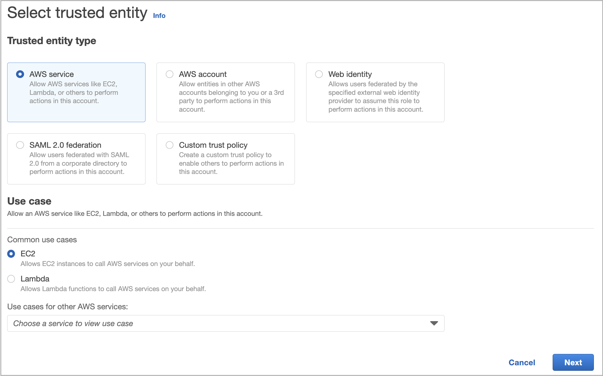
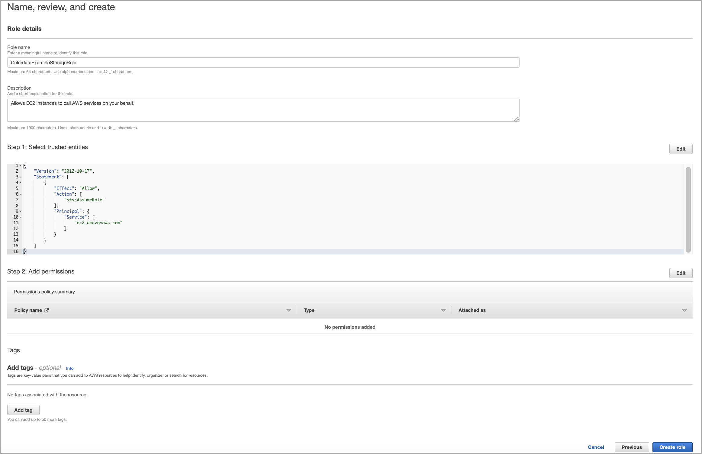
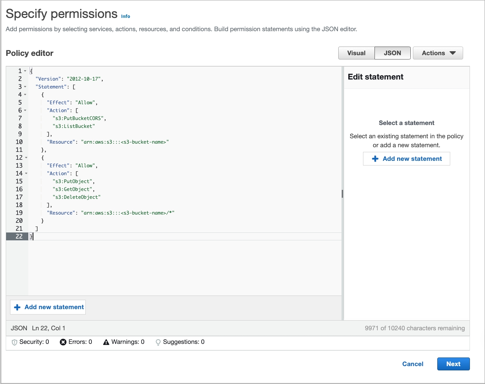
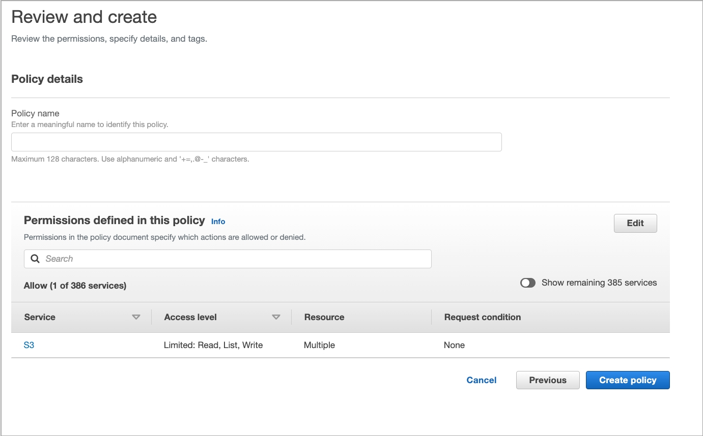
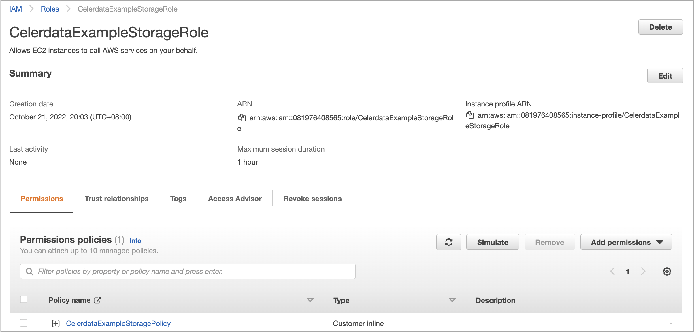

# Create a service IAM role for EC2

You need to create a service IAM role for EC2, which will be referenced in a data credential, either from the **Cloud settings** page in the CelerData Cloud Private console before you create a deployment or as part of the workflow of creating a deployment.

## Before you begin

To create a service IAM role for EC2 before deployment, follow these steps:

1. Sign in to the [CelerData Cloud Private console](https://cloud.celerdata.com/login).

2. In the left-side navigation pane, choose **Cloud settings** > **AWS**.

3. On the **Data credentials** tab of the **AWS Cloud** page, click **Create data credential**.

4. In the **Create data credential** dialog box, copy the JSON policy template in **IAM policy information**, and then save the JSON policy template to a location that you can access later.

To create a service IAM role for EC2 during deployment, follow these steps:

1. Sign in to the [CelerData Cloud Private console](https://cloud.celerdata.com/login).

2. [Start the deployment wizard](../../../get_started/create_cluster/create_cluster_aws.md#start-the-deployment-wizard) and proceed to [**STEP2: Configure cloud credentials**](../../../get_started/create_cluster/create_cluster_aws.md#step2-configure-cloud-credentials).

3. In the **Data credential** section, select or create a data credential, copy the JSON policy template in **IAM policy information**, and then save the JSON policy template to a location that you can access later.

## Step 1: Create an IAM role for EC2

1. Sign in to the [AWS IAM console](https://console.aws.amazon.com/iam/) as a user with administrator privileges.

2. In the left-side navigation pane, choose **Access management** > **Roles**.

3. On the **Roles** page, click **Create role**.

   The **Create role** wizard appears, helping you create an IAM role with three steps.

4. In the **Select trusted entity** step, do as follows:

   a. In the **Trusted entity type** section, select **AWS service**.

   b. In the **Use case** section, select **EC2**.

   c. Click **Next**.

   

5. In the **Add permissions** step, click **Next**.

6. In the **Name, review, and create** step, enter a role name, optionally enter a description or add tags, and then click **Create role**.

   

## Step 2: Add an inline policy to the IAM role for EC2

1. In the left-side navigation pane, choose **Access management** > **Roles**.

2. On the **Roles** page, find the IAM role that you just created and click its name.

3. In the **Permissions policies** section of the page that appears, click **Add permissions** and choose **Create inline policy**.

4. In the **Specify permissions** step, click the **JSON** tab, delete the existing JSON policy document, and paste the **Policy template** that you have obtained in [Before you begin](#before-you-begin). In the policy template, replace `<s3-bucket-name>` with the name of your bucket, which must reside in the AWS region in which you want to create deployments. Then, click **Review policy**.

   

5. In the **Review Policy** step, enter a policy name and click **Create policy**.

   

## (Optional) Step 3: Attach a policy for SSM Agent to the IAM role for EC2

This step is required if you want to connect to your CelerData cluster by using AWS Systems Manager Agent (SSM Agent).

> **NOTE**
>
> You cannot connect to an existing CelerData cluster by using AWS Systems Manager Agent (SSM Agent) even after you perform this step on the IAM role for EC2 referenced in the data credential that was used to deploy the cluster.

1. In the left-side navigation pane, choose **Access management** > **Roles**.

2. On the **Roles** page, find the IAM role that you just created and click its name.

3. In the **Permissions policies** section of the page that appears, click **Add permissions** and choose **Attach policies**.

4. On the page that appears, find and select **AmazonSSMManagedInstanceCore**. Then, click **Add permissions**.

   You are directed back to the IAM role's details page, and in the **Permissions policies** section you can find the **AmazonSSMManagedInstanceCore** policy you just attached.

## Step 4: Obtain the instance profile ARN of the IAM role for EC2

In the **Summary** section of the role details page that appears, copy the **Instance profile ARN** of the IAM role for EC2 and save the instance profile ARN to a location that you can access later. You will need to provide the instance profile ARN when you create a data credential.

