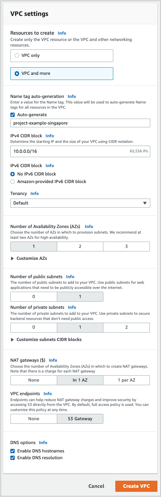
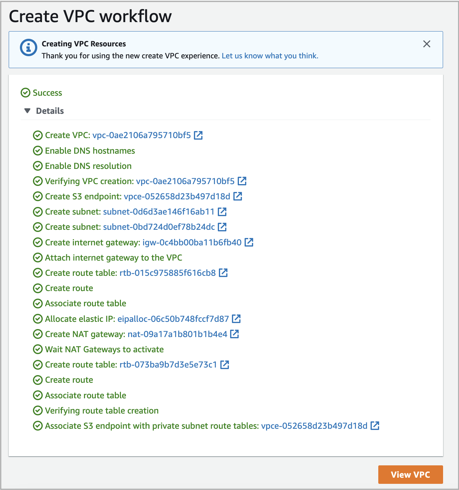

# Create a VPC and related resources

You can attach an existing VPC to your deployment or create a new one, either from the **Cloud Settings** page in the CelerData Cloud Private console before you create a deployment or as part of the workflow of creating a deployment.

To create a VPC and its related resources, follow these steps:

1. Sign in to the [AWS VPC console](https://console.aws.amazon.com/vpc/) as a user with administrator privileges.

2. In the upper-right corner of the page, select your AWS region.

3. In the left-side navigation pane, choose **Your VPCs** to display the **Your VPCs** page.

4. Click **Create VPC** to display the **VPC settings** page.

5. In the **Resources to create** section, select **VPC and more**.

6. Modify the following options as instructed and retain the default settings for the others:

   - For **Name tag auto-generation**, enter an informative name tag.
   - For **Number of Availability Zones**, choose **1**.
   - For **Number of public subnets**, choose **1**.
   - For **Number of private subnets**, choose **1**.
   - For **NAT gateways**, choose **In 1 AZ**.

   The following figure shows the VPC settings.

   

7. Click **Create** **VPC**.

   The **Create VPC workflow** page appears, showing the VPC creation progress.

   When the workflow is finished, similar information as shown in the following figure appears.

   

   The VPC that you just created is shown on the **Your VPCs** page.
