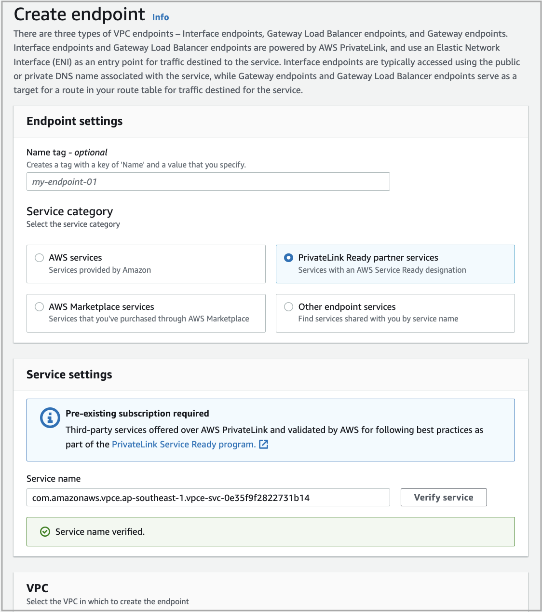
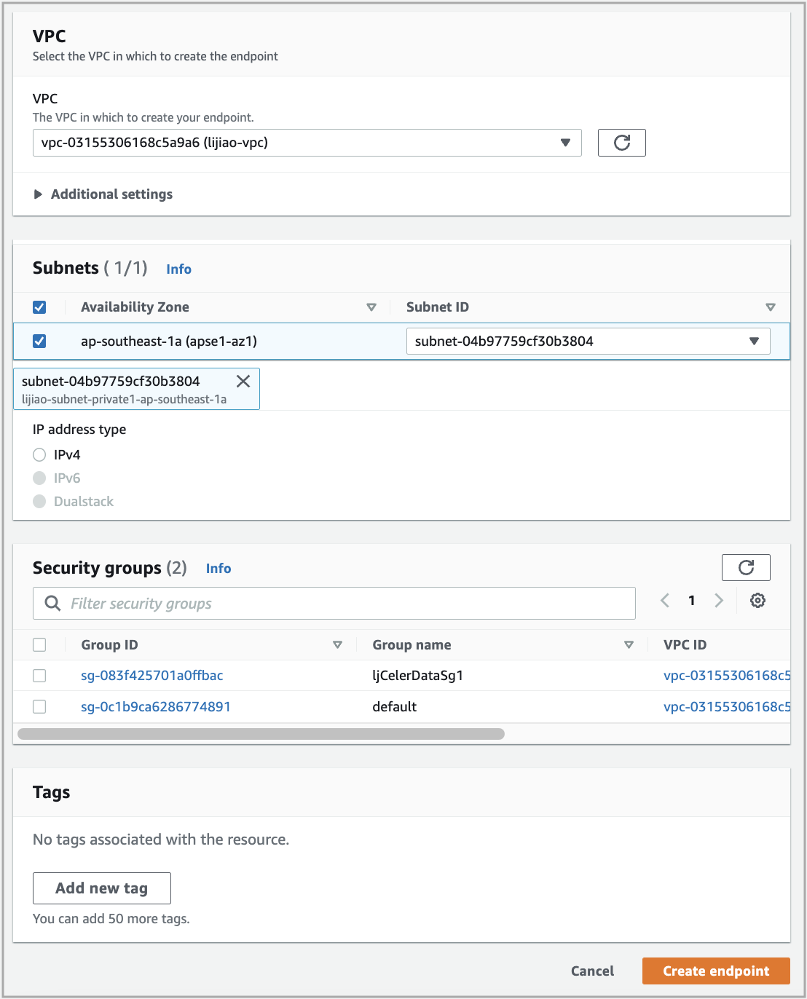
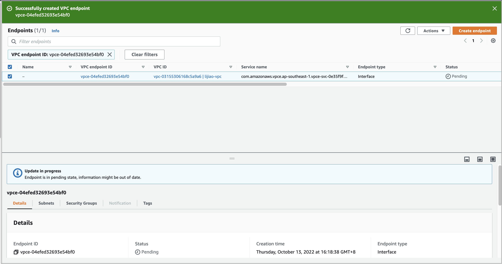
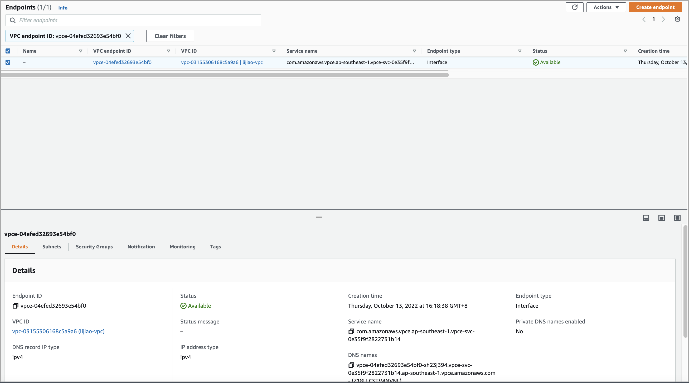

# Create a VPC endpoint

You can optionally create your own service powered by AWS PrivateLink, known as an endpoint service, to enable direct, secure connectivity between CelerData's VPC and your own VPC.

To create a VPC endpoint, follow these steps:

1. Sign in to the [Amazon VPC console](https://console.aws.amazon.com/vpc/home) as a user with administrator privileges.

2. In the upper-right corner of the page, select your AWS region.

3. In the left-side navigation pane, choose **Endpoints**.

4. On the **Endpoints** page, click **Create endpoint**.

   

5. On the **Create endpoint** page, configure parameters as follows:

   a. For **Service category**, select **PrivateLink Ready partner services**.

   b. For **Service name**, enter the name of the service and click **Verify service**.

      If the service passes the verification, a message "Service name verified." appears below the **Service name** field.

      The service name varies depending on your selected AWS region. The following table lists the mapping between the supported AWS regions and service names.

      | AWS region               | Service name                                                 |
      | ------------------------ | ------------------------------------------------------------ |
      | Asia Pacific (Singapore) | com.amazonaws.vpce.ap-southeast-1.vpce-svc-02073213663648027 |
      | Europe (Ireland)         | com.amazonaws.vpce.eu-west-1.vpce-svc-0f9762378a10cb070      |
      | US East (N. Virginia)    | com.amazonaws.vpce.us-east-1.vpce-svc-0d1c58972a96cb283      |
      | US West (Oregon)         | com.amazonaws.vpce.us-west-2.vpce-svc-0ebb0a9d5920299ad      |
      | Europe (Frankfurt)       | com.amazonaws.vpce.eu-central-1.vpce-svc-0801f72f69ecce8f6      |

      

   c. For **VPC**, select the VPC that you have selected in the previous steps.

      After you select a VPC, **Subnets** and **Security groups** appear.

   d. For **Subnets**, select the availability zone, and then select the private subnet that you have selected from your selected VPC.

   e. For **Security** **groups**, select the security group that you have created in your selected VPC.

6. After all the preceding parameters are configured, click **Create endpoint**.

   You are directed to the **Endpoints** page, which displays the VPC endpoint you just created.

   

   Wait until the **Status** of the VPC endpoint changes to **Available**.

   
