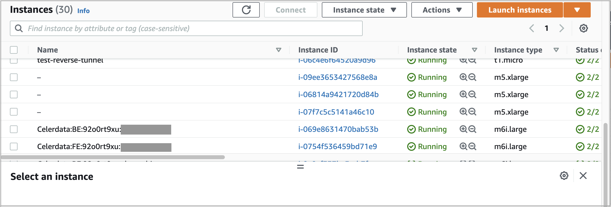
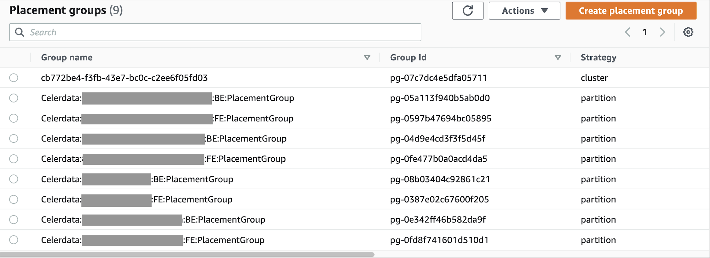

# View associated AWS Cloud resources

CelerData launches AWS Cloud resources, namely, EC2 instances and placement groups, that you must pay for, during deployment.

If you no longer need a CelerData cluster, we recommend that you release the cluster to save costs. CelerData provides an option **Release associated AWS Cloud resources along with the cluster**, which is enabled by default. If you disable the option, the AWS Cloud resources associated with the cluster remain and continue to incur fees. In this case, we recommend that you log in to the [AWS EC2 Console](https://console.aws.amazon.com/ec2/home) to identify and release these resources.

To identify the EC2 instances and placement groups associated with a cluster, follow these steps:

1. Sign in to the [Amazon EC2 console](https://console.aws.amazon.com/ec2/home) as a user with administrator privileges.

2. In the upper-right corner of the page, select your AWS region.

3. In the left-side navigation pane, choose **Instances** > **Instances**.

4. On the **Instances** page, enter the name of the cluster that you want to release in the search box, and press **Enter**.

   The console displays all of the associated EC2 instances, whose names are in the following format:

   `Celerdata:<ProcessType>:<AccountID>:<ClusterName>`

   The following figure shows a few examples.

   

5. In the left-side navigation pane, choose **Network & Security** > **Placement Groups**.

6. On the **Placement Groups** page, enter the name of the cluster that you want to release in the search box, and press **Enter**.

   The console displays all of the associated placement groups, whose names are in the following format:

   `Celerdata:<AccountID>:<ClusterName>:<ProcessType>:PlacementGroup`

   The following figure shows a few examples.

   

The following table describes the parameters in EC2 instance or placement group names.

| **Parameter**  | **Description**                                              |
| -------------- | ------------------------------------------------------------ |
| Celerdata      | A label that CelerData automatically adds at the beginning of the name of the EC2 instance or placement group. |
| ProcessType    | The type of cluster node that the EC2 instance or placement group serves.<ul><li>If the value of **ProcessType** is **FE**, the EC2 instance or placement group serves an FE node.</li><li>If the value of **ProcessType** is **BE**, the EC2 instance or placement group serves a BE node.</li></ul> |
| AccountID      | The account ID of the CelerData cloud account that is used to create the cluster. |
| ClusterName    | The name of the cluster with which the EC2 instance or placement group is associated. |
| PlacementGroup | A label that CelerData automatically adds at the end of the name of the placement group. |
