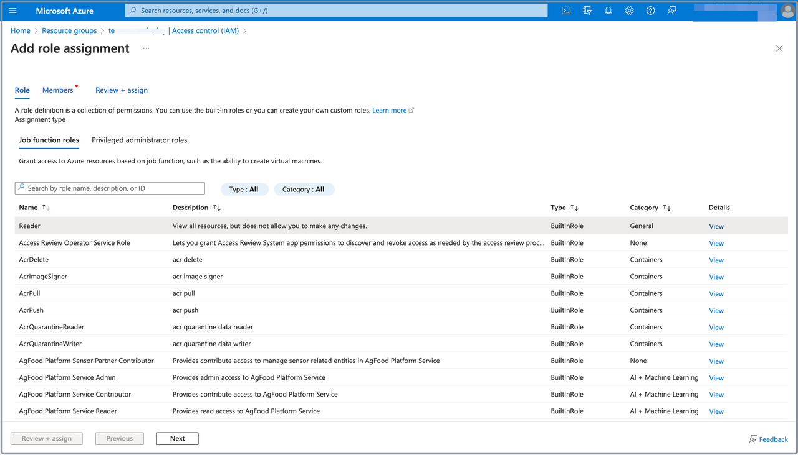

# Create a managed identity for Azure storage container

For classic clusters, CelerData generates a profile for each query during query execution, and stores it in storage for ease of your reference. The profile is generated by the virtual machines on which your CelerData cluster is deployed, and is stored in an Azure storage container.

This topic will guide you on how to create a managed identity in Azure, and grant it the read permission on virtual machines and the write permission on your storage container. Once these steps are completed, CelerData will automatically attach the managed identity to the virtual machines, ensuring that the cluster can store query profiles in the container.

## Step 1: Create a managed identity

Follow these steps to create a managed identity:

1. Navigate to the [**Managed Identities**](https://portal.azure.com/#view/HubsExtension/BrowseResource/resourceType/Microsoft.ManagedIdentity%2FuserAssignedIdentities) service page, and click **Create**.
2. On the **Basics** tab of the **Create User Assigned Managed Identity** page:

   1. Select your Microsoft subscription from the **Subscription** drop-down list.
   2. Select the resource group you want to use from the **Resource group** drop-down list.
   3. Select the region of the managed identity from the **Region** drop-down list.
   4. Enter a name for the managed identity in the **Name** field.

   

3. Click **Review + create**, and, on the **Review + create** tab, review the information you have filled. Then, click **Create** to create the managed identity.

To obtain the **Managed identity resource ID** for the CelerData cluster deployment, you need to navigate to the [**Managed Identities**](https://portal.azure.com/#view/HubsExtension/BrowseResource/resourceType/Microsoft.ManagedIdentity%2FuserAssignedIdentities) service page, and click the managed identity you created. On the page that appears, choose **Properties** in the left-side pane, and in the right-side pane click the **Copy** button next to the **Id** field to save it.

## Step 2: Add role assignments to the managed identity

In this section, you are guided to complete the following goals:

- Grant the read permission on virtual machines to the managed identity.
- Grant the write permission on the storage container to the managed identity.

### Grant read permission to managed identity

Follow these steps to grant the read permission on virtual machines to the managed identity:

1. Navigate to the [**Resource groups**](https://portal.azure.com/#view/HubsExtension/BrowseResourceGroups) service page, and click the resource group you want to use.
2. In the left-side pane of the page that appears, choose **Access control (IAM).**
3. On the page that appears, click **Add**, and then click **Add role assignment**.

   

4. On the **Job function roles** tab of the **Add role assignment** page, select **Reader**, and click **Next** to continue.

   

5. On the **Members** tab, select **Managed identity** for **Assign access to**.
6. For **Members**, click **Select members**. In the right-side pane that appears, select your Microsoft subscription from the **Subscription** drop-down list, select **User Assigned Managed Identity** from the **Managed identity** drop-down list, search for and select the managed identity you created in [Step 1](#step-1-create-a-managed-identity) from the **Select** section, and click **Select**.

   

7. Click **Review + assign**, and, on the **Review + assign** tab, review the information you have filled. Then, click **Review + assign** to add the assignment.

### Grant write permission to managed identity

Follow these steps to grant the write permission on the storage container to the managed identity:

1. Navigate to the [**Storage accounts**](https://portal.azure.com/#view/HubsExtension/BrowseResource/resourceType/Microsoft.Storage%2FStorageAccounts) service page, and click the storage account in which you want to store the query profiles of your CelerData cluster.
2. On the page that appears, choose **Containers** in the left-side pane, and click the storage container in which you want to store the query profiles of your CelerData cluster.

   

3. On the page that appears, choose **Access control (IAM)** in the left-side pane. Then, click **Add**, and choose **Add role assignment**.

   

4. On the **Job function roles** tab of the **Add role assignment** page, select **Storage Account Contributor**, and click **Next** to continue.

   

5. On the **Members** tab, select **Managed identity** for **Assign access to**.
6. For **Members**, click **Select members**. On the right-side pane that appears, select your Microsoft subscription from the **Subscription** drop-down list, select **User Assigned Managed Identity** from the **Managed identity** drop-down list, search for and select the managed identity you created in [Step 1](#step-1-create-a-managed-identity) from the **Select** section, and click **Select**.

   

7. Click **Review + assign**, and, on the **Review + assign** tab, review the information you have filled. Then, click **Review + assign** to add the assignment.
