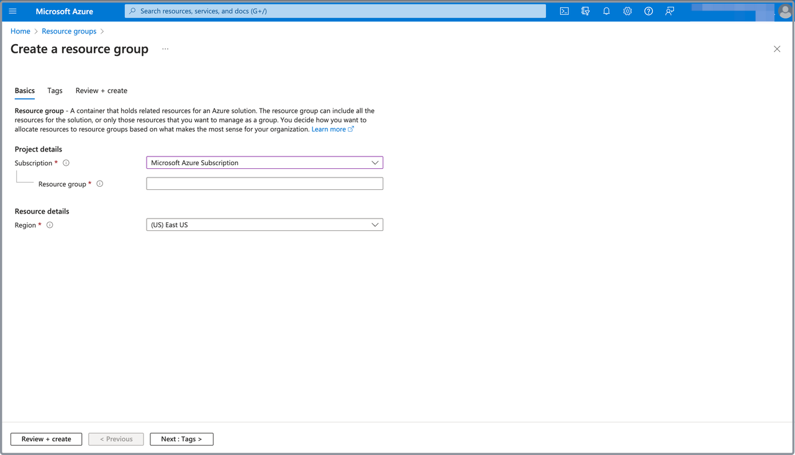

# Create a resource group for CelerData in Azure

A resource group in Azure is a collection of resources related to an Azure solution. Deploying a CelerData cluster requires a variety of Azure resources, including a storage account, a managed identity, a virtual network, a security group, and an SSH key pair. You must manage all these resources in one resource group.

You can skip this step if you want to use an existing resource group.

> **NOTE**
>
> All the resources you use for deploying a CelerData cluster must be located in the same region and Microsoft subscription.

Follow these steps to create a resource group:

1. Sign in to the [Microsoft Azure portal](https://portal.azure.com/#home).
2. Navigate to the [**Resource groups**](https://portal.azure.com/#view/HubsExtension/BrowseResourceGroups) service page, and click **Create**.
3. On the **Basics** tab of the **Create a resource group** page:

   1. Select your Microsoft subscription from the **Subscription** drop-down list.
   2. Enter a name for the resource group in the **Resource group** field
   3. Select the region of the resource group from the **Region** drop-down list.

      For information about the Azure regions supported by CelerData, see [Supported cloud platforms and regions](/get_started/cloud_platforms_and_regions.md).

   

4. Click **Review + create**, and, on the **Review + create** tab, review the information you have filled. Then, click **Create** to create the resource group.
