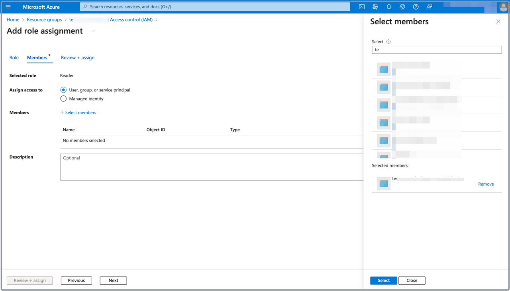

# Create a service principal for CelerData on Azure

Applications in Azure require restricted access and non-interactive authentication for automation. This can be achieved by using service principals that allow applications to sign in with specific permissions. While deploying a CelerData cluster, CelerData requires a series of permissions to launch necessary resources in your Azure account. Therefore, you must create a service principal for CelerData to declare the necessary permissions.

## Step 1: Create an App registration

Follow these steps to create an App registration: 

1. Sign in to the [Microsoft Azure portal](https://portal.azure.com/#home).
2. Navigate to the [**App registrations**](https://portal.azure.com/#view/Microsoft_AAD_RegisteredApps/ApplicationsListBlade) service page, and click **New registration**.
3. On the **Register an application** page:

   1. Enter a name for the application in the **Name** field.
   2. Select **Accounts in this organizational directory only (Default only - Single tenant)** in the **Supported account types** section.
   3. Click **Register**.

   

To obtain the **Application (client) ID** and the **Directory (tenant) ID** for the CelerData cluster deployment, you need to navigate to the [**App registrations**](https://portal.azure.com/#view/Microsoft_AAD_RegisteredApps/ApplicationsListBlade) service page, find and click the application you just registered, and click the **Copy** buttons next to the **Application (client) ID** and the **Directory (tenant) ID** fields to save them.

## Step 2: Create a client secret for the application

Follow these steps to create a client secret for the application you have registered with Azure in [Step 1](#step-1-create-an-app-registration):

1. Navigate to the [**App registrations**](https://portal.azure.com/#view/Microsoft_AAD_RegisteredApps/ApplicationsListBlade) service page, and click the application.
2. On the new page that appears, choose **Certificates & secrets** in the left-side pane, and click **New client secret** on the **Client secrets** tab.
3. In the **Add a client secret** pane that appears, enter a description for the client secret in the **Description** field, select or customize a validity period from the **Expires** drop-down list, and click **Add**.

   

4. Click the **Copy** button to copy the **Value** of the client secret you created, and save it for the CelerData cluster deployment process.

> **CAUTION**
>
> - Client secret values cannot be viewed, except for immediately after creation. Be sure to save the secret when created before leaving the page.
> - Because the client secret value of each registered application has a fixed lifecycle in Azure, you can update it within the [CelerData Cloud Private console](https://cloud.celerdata.com/login) in the event of the expiration of the client secret. For detailed instructions, see [Rotate secret value](../../../cloud_settings/azure_cloud_settings/manage_azure_deployment_credentials.md#rotate-secret-value).

## Step 3: Add role assignments to the application

In this section, you need to add the following role assignments to the application you have registered with Azure in [Step 1](#step-1-create-an-app-registration):

- **Reader**
- **Virtual Machine Contributor**
- **Network Contributor**
- **Managed Identity Operator**

The following procedures add **Reader** role assignment to the application as an example. Repeat these procedures until you have added all role assignments listed above.

1. Navigate to the [**Resource groups**](https://portal.azure.com/#view/HubsExtension/BrowseResourceGroups) service page, and click the resource group you created for the CelerData cluster deployment.
2. On the page that appears, choose **Access control (IAM)** in the left-side pane.
3. On the page that appears, click **Add**, and then click **Add role assignment**.

   

4. In the **Job function roles** tab of the **Add role assignment** page, select **Reader**, and click **Next** to continue.

   

5. On the **Members** tab, select **User, group, or service principal** for **Assign access to**.
6. For **Members**, click **Select members**. In the right-side pane that appears, search for and select the application you registered in [Step 1](#step-1-create-an-app-registration), and click **Select**.

   

7. Click **Review + assign**, and, on the **Review + assign** tab, review the information you have filled. Then, click **Review + assign** to add the assignment.
