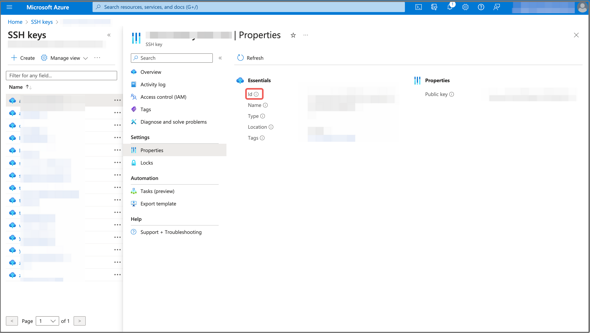

# Create an SSH key pair for CelerData on Azure

To deploy a CelerData cluster on Azure, you must create an SSH key pair to give CelerData access to your virtual machines for automatic deployment so that CelerData can deploy StarRocks-related service processes on your virtual machine.

Follow these steps to create an SSH key pair for CelerData on Azure:

1. Sign in to the [Microsoft Azure portal](https://portal.azure.com/#home).
2. Navigate to the [**SSH keys**](https://portal.azure.com/#view/HubsExtension/BrowseResource/resourceType/Microsoft.Compute%2FsshPublicKeys) service page, and click **Create**.

   

3. Expand the **Subscription** drop-down list and select your Azure subscription. Expand the **Resource group** drop-down list and select the resource group that hosts the resources for the CelerData cluster deployment. Enter a name for the SSH key pair in the **Key pair name** field. You can choose to generate a new key pair or upload an existing public key in the **SSH public key source** section.

   > **NOTE**
   >
   > You do not need to select the Azure region of the SSH key because the SSH key region will be in the same region as the resource group you selected above.

   

4. Click **Review + create**, and, on the **Review + create** tab, review the information you have filled. Then, click **Create** to generate the SSH key pair.
5. In the message that appears, click **Download private key and create resource** to download the private key.

   

   > **NOTE**
   >
   > - You can download the private key only once when you create the SSH key resource. After the SSH key resource is created, you will not be able to download the private key again. Please store the private key properly after downloading it.
   > - CelerData does not require you to provide the private key. You can keep it on your own.

To obtain the **SSH Key resource ID** for the CelerData cluster deployment, you need to navigate to the [**SSH keys**](https://portal.azure.com/#view/HubsExtension/BrowseResource/resourceType/Microsoft.Compute%2FsshPublicKeys) service page, click the SSH key pair you created, choose **Properties** in the left-side pane, and click the **Copy** button next to the **Id** field to save it.

