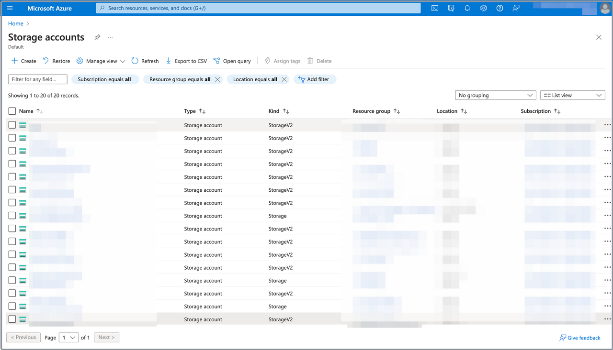
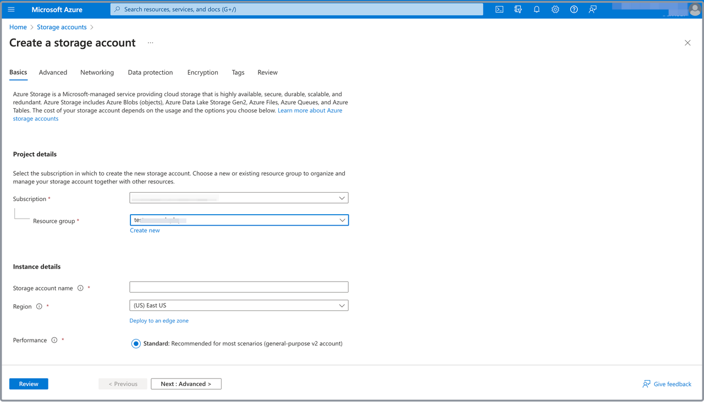
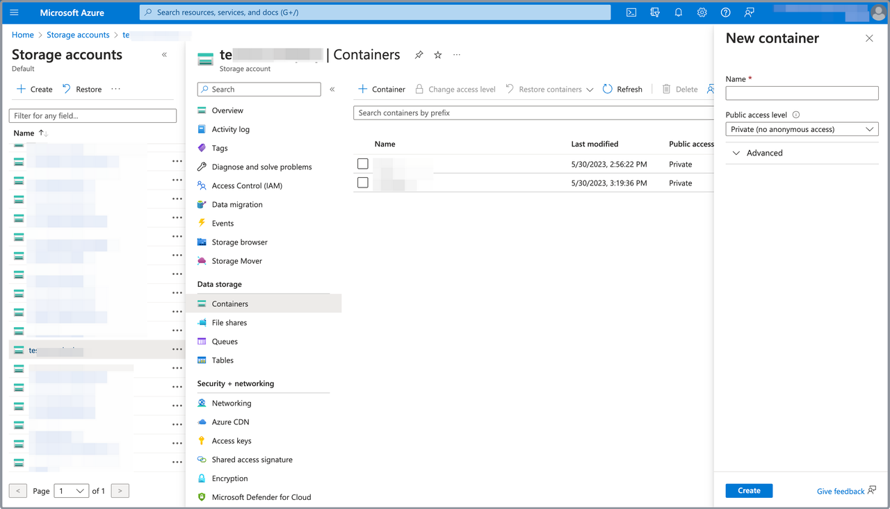

# Create a storage account and a container for CelerData in Azure

To deploy a CelerData cluster on Azure, you must assign a storage account and a container to store your data.

You can use existing storage accounts and containers, or create new ones by following these steps.

## Step 1: Create a storage account

Follow these steps to create a storage account for CelerData in Azure:

1. Sign in to the [Microsoft Azure portal](https://portal.azure.com/#home).
2. Navigate to the [**Storage accounts**](https://portal.azure.com/#view/HubsExtension/BrowseResource/resourceType/Microsoft.Storage%2FStorageAccounts) service page, and click **Create**.

   

3. On the **Basics** tab of the **Create a storage account** page:

   1. Select your Microsoft subscription from the **Subscription** drop-down list.
   2. Select your resource group from the **Resource group** drop-down list.

      > **NOTE**
      >
      > We recommend that you select the resource group you created for the CelerData cluster deployment.

   3. Enter a name for the storage account in the **Storage account name** field.
   4. Select the region of the storage account from the **Region** drop-down list.

      > **NOTE**
      >
      > Your storage account must be in the same Azure region as the other resources you created for the CelerData cluster deployment.

   5. For the **Performance** section, you can choose **Standard**, which can perfectly suit the needs of your CelerData cluster. For other sections, you can use the default settings.

   

4. Click **Review**, and on the **Review** tab, review the information you have filled. Then, click **Create** to create the storage account.

## Step 2: Create a storage container

Follow these steps to create a storage container to store the metadata of your CelerData cluster:

1. Navigate to the [**Storage accounts**](https://portal.azure.com/#view/HubsExtension/BrowseResource/resourceType/Microsoft.Storage%2FStorageAccounts) service page, click the storage account you want to use, choose **Containers** in the left-side pane, and click **Container**.

   

2. In the right-side pane that appears:

   1. Enter a name for the storage container in the **Name** field.
   2. Select **Private (no anonymous access)** from the **Public access level** drop-down list.
   3. Click **Create**.
