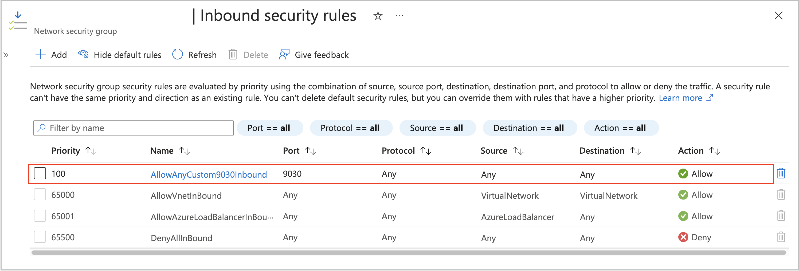

# Create a virtual network, a subnet, and a security group for CelerData on Azure

To deploy a CelerData cluster on Azure, you must specify a virtual network and a subnet for the virtual machines on which the cluster depends, and assign a security group to the subnet to define the inbound and outbound traffic rules that the cluster nodes must adhere to for cross-node communication and external communication.

You can use existing virtual networks, subnets, and security groups, or create new ones by following these steps.

## Step 1: (Optional) Create a virtual network

Follow these steps to create a virtual network:

1. Sign in to the [Microsoft Azure portal](https://portal.azure.com/#home).
2. Navigate to the [**Virtual networks**](https://portal.azure.com/#view/HubsExtension/BrowseResource/resourceType/Microsoft.Network%2FvirtualNetworks) service page, and click **Create**.
3. On the **Basics** tab of the **Create virtual network** page:

   1. Select your Microsoft subscription from the **Subscription** drop-down list.
   2. Select the resource group you created for the CelerData cluster deployment from the **Resource group** drop-down list.
   3. Enter a name for the virtual network in the **Name** field.
   4. Select a region for the virtual network from the **Region** drop-down list.

   

4. Click **Review + create**, and, on the **Review + create** tab, review the information you have filled. Then, click **Create** to create the virtual network.

To obtain the **Virtual network resource ID** for the CelerData cluster deployment, you need to navigate to the [**Virtual networks**](https://portal.azure.com/#view/HubsExtension/BrowseResource/resourceType/Microsoft.Network%2FvirtualNetworks) service page, and click the virtual network you created. On the page that appears, choose **Properties** in the left-side pane, and click the **Copy** button next to the **Resource ID** field to save it.

## Step 2: (Optional) Create a subnet

When you create a virtual network, Azure automatically creates a subnet named `default` within the virtual network. If you want to use the `default` subnet for your CelerData cluster deployment, you can skip this step. If you do not want to use the `default` subnet, you can follow these steps to create a dedicated subnet for your CelerData cluster:

1. Navigate to the [**Virtual networks**](https://portal.azure.com/#view/HubsExtension/BrowseResource/resourceType/Microsoft.Network%2FvirtualNetworks) service page, and click the virtual network you want to use.
2. On the page that appears, choose **Subnets** in the left-side pane, and click **Subnet**.
3. In the **Add subnet** pane, enter a name for the subnet in the **Name** field, specify the IP address range of the subnet in the **Subnet address range** field, and click **Save** to add the subnet.

   

## Step 3: (Optional) Create a security group

Follow these steps to create a security group:

1. Navigate to the [**Network security groups**](https://portal.azure.com/#view/HubsExtension/BrowseResource/resourceType/Microsoft.Network%2FNetworkSecurityGroups) service page, and click **Create**.

2. On the **Basics** tab of the **Create network security group** page:

   1. Select your Microsoft subscription from the **Subscription** drop-down list.
   2. Select the resource group you created for the CelerData cluster deployment from the **Resource group** drop-down list.
   3. Enter a name for the security group in the **Name** field.
   4. Select a region for the security group from the **Region** drop-down list.

   

3. Click **Review + create**, and, on the **Review + create** tab, review the information you have filled. Then, click **Create** to create the security group.

   Azure creates default inbound and outbound security rules for each new security group at the security group creation. You can directly use these default security rules.

   Just note that for normal communication between CelerData and Azure, you must make sure that the default inbound and outbound security rules shown in the following figure take effect:

   

4. (Optional) Add inbound security rules to the security group if you will need to use specific features.

   - If you will need to access your CelerData cluster by using an endpoint, add an inbound security rule as below:

     

   - If you will need to use Stream Load to [load data from your local file system](../../../loading/StreamLoad.md), add an inbound security rule as below:

     

## Step 4: Assign the security group to the subnet

Follow these steps to assign the security group you created in [Step 3](#step-3-optional-create-a-security-group) to the subnet in which you want to deploy your CelerData cluster:

1. Navigate to the [**Virtual networks**](https://portal.azure.com/#view/HubsExtension/BrowseResource/resourceType/Microsoft.Network%2FvirtualNetworks) service page, and click the virtual network you want to use.
2. On the page that appears, choose **Subnets** in the left-side pane, and click the **default** subnet or the subnet you want to use.
3. In the right-side pane that appears, select the security group you created in [Step 3](#step-3-optional-create-a-security-group) from the **Network security group** drop-down list, and click **Save**.

   
