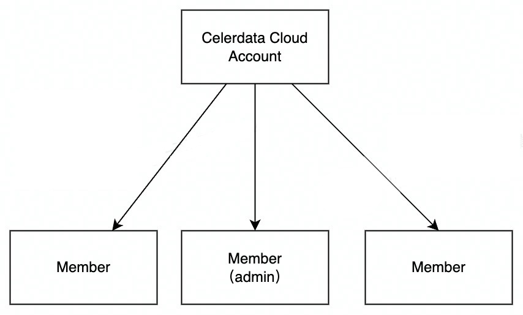
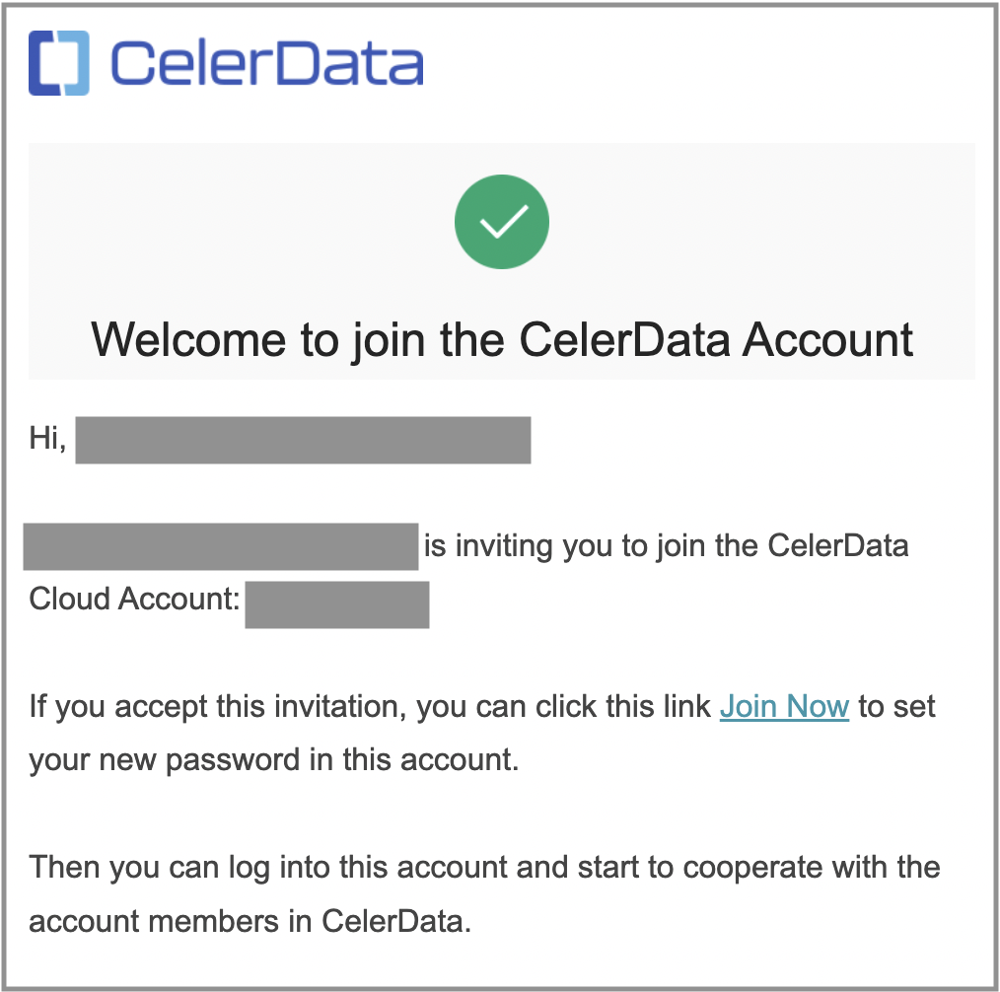
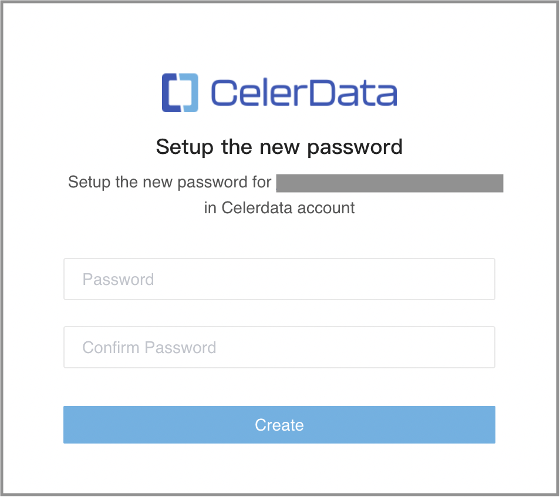
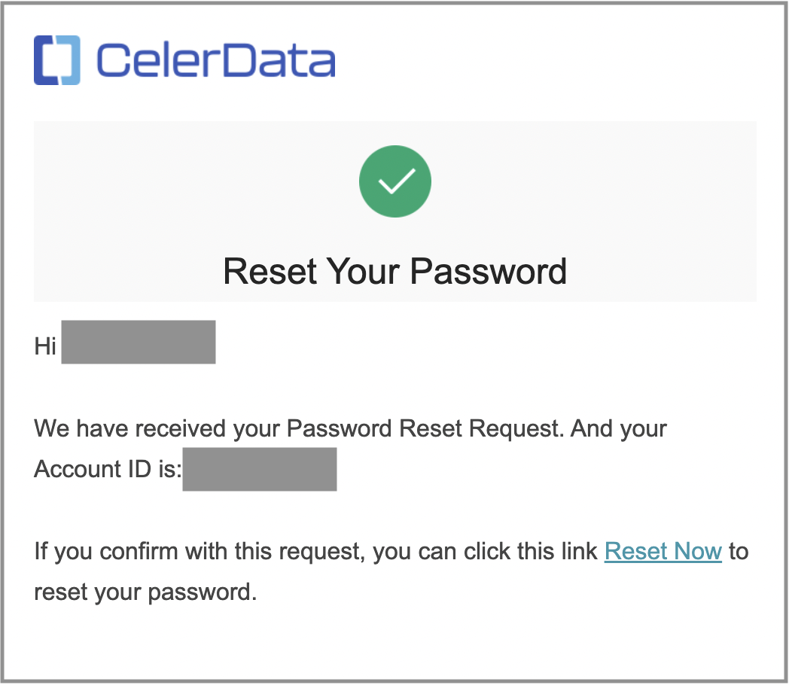
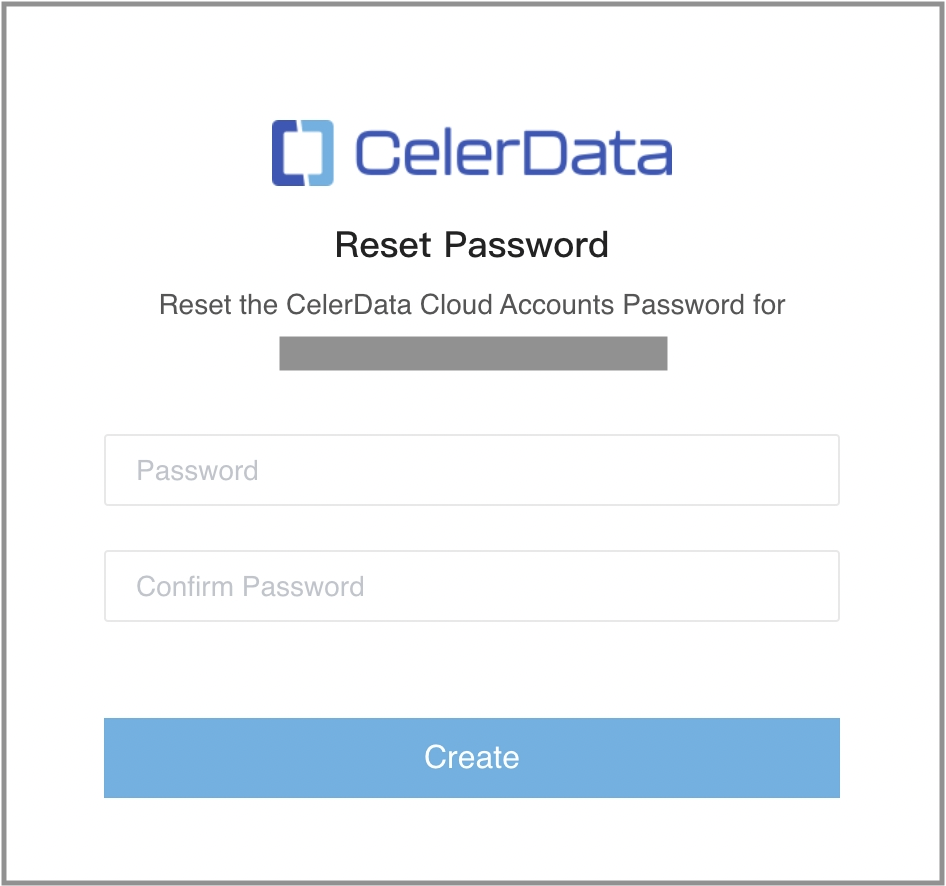

# Manage members in an account

After you [create a CelerData cloud account](../../get_started/sign-up_or_sign-in.md), you are delegated as the creator of the account. You can share your account with your team members by inviting them to your account. Your account serves as the billing entity, and all members within the account share the equivalent administrative role to manage clusters, billing, network configuration, and more.

You can invite a member to your account, assign a role to a member, initiate a password reset for a member, and remove a member from your account.

> **NOTE**
>
> Only CelerData members with the **Member Management** privilege can manage the members within their account.

## Invite a member to your account

You can invite your team members to join your account via their email accounts, regardless of whether they already have their own accounts or not.

1. Sign in to the [CelerData Cloud Private console](https://cloud.celerdata.com/login).
2. In the left-side navigation pane, choose **Access Control > Member**.
3. On the **Account members** page, click **Invite member**.
4. In the **Invite member** dialog box, enter the first name, last name, the business email address of the member, the role they are assigned to, and then, click **Invite**.
5. In the message that appears, click **OK**.

> **NOTE**
>
> When SSO is enabled, you need to invite a new member both to your IdP and to CelerData. The email address you used for both invitations must be the same. For further detail about SSO, see [Use SAML SSO](../cloud_access_control/use_sso.md).

**About accepting an invitation**:

Members who are invited to an account can follow these steps to accept the invitation:

1. Find the invitation email in the email account used for invitation. They need to take note of the **Account ID**, which is necessary when they log in to their account, and then, click **Join Now** to accept the invitation.

   

2. On the **Setup the new password** page, they need to enter a password for their member account, confirm the password, and then click **Create**.

   For information about the password requirements, see [Password requirements for members](../../reference/System_limit.md).

   

   The browser redirects the member to the CelerData Cloud Private console. They can then enjoy the journey with CelerData.

> **NOTE**
>
> - If they cannot find the invitation email in the inbox, check the Spam folder.
> - If the member to be invited already have an account, they will be requested to reset the password.
> - When SSO is enabled, the member to be invited will receive invitation emails from both the IdP and CelerData. they need first set up a login credential on the IdP, and then sign in to their account with SSO. For further detail about SSO, see [Use SAML SSO](../cloud_access_control/use_sso.md).

## Assign a role to a member

You can assign one or more roles to a member.

1. Sign in to the [CelerData Cloud Private console](https://cloud.celerdata.com/login).
2. In the left-side navigation pane, choose **Access Control > Member**.
3. Click the name of the member that you want to assign a role to.
4. On the **Details** page, click **Privileges** to enter the **Privileges** tab.
5. Choose the roles that you want to assign to the member in the **Assign roles** drop-down list, and click **Assign**.

## Unassign a role from a member

You can unassign one or more roles from a member.

1. Sign in to the [CelerData Cloud Private console](https://cloud.celerdata.com/login).
2. In the left-side navigation pane, choose **Access Control > Member**.
3. Click the name of the member that you want to unassign a role from.
4. On the **Details** page, click **Privileges** to enter the **Privileges** tab.
5. From the **Current role** list, find the role you want to unassign from the member, and click **unassign** in the **Operation** field.
6. In the message that appears, click **Unassign**.

## Reset the password for a member

You can initiate a password reset for a member.

1. Sign in to the [CelerData Cloud Private console](https://cloud.celerdata.com/login).
2. In the left-side navigation pane, choose **Access Control > Member**.
3. Click the name of the member that you want to initiate a password reset for.
4. On the **Details** page, click **Reset password**.
5. In the message that appears, click **Reset**.

For information about the password requirements, see [Password requirements for members](../../reference/System_limit.md).

**About resetting the password**:

An email that contains a link to reset password is sent to the corresponding member's email account. They need to do as follows to reset their password:

1. Find the email in their email account and click **Reset Now**.

   

2.  On the **Reset Password** page, set a new password for their account, confirm the password, and then click **Create**.

   

## Remove a member from your account

You can remove a member from your account.

1. Sign in to the [CelerData Cloud Private console](https://cloud.celerdata.com/login).
2. In the left-side navigation pane, choose **Access Control > Member**.
3. Click the name of the member that you want to remove from your account.
4. On the **Details** page, click **Remove member**.
5. In the message that appears, click **Remove**.
