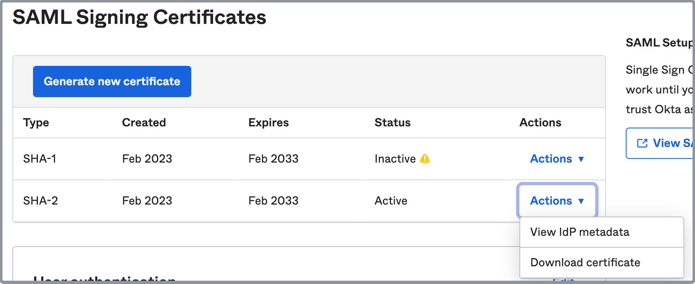

# Use SAML SSO

CelerData supports user authentication using Security Assertion Markup Language (SAML) single sign-on (SSO). SSO enables account administrators to authenticate CelerData members via a specific identity provider (IdP). This allows members to sign in to their CelerData cloud account without further login credentials after they log in to the IdP.

You can integrate CelerData with any generic IdP that supports the SAML 2.0 protocol.

> **NOTE**
>
> - Only account administrators can configure SSO.
> - After SSO is enabled, the creator of an account can sign in to that account by using both their login credentials and SSO. The other members within that account can only sign in to that account by using SSO.
> - Currently, CelerData clusters does not support integration with SSO. You need to create users within the cluster using SQL command. For more details, see [Manage database users in a CelerData cluster](../data_access_control/manage_users.md).

## Enable SSO

The following example uses [Okta](https://www.okta.com/) as the IdP. The setup procedure is the same for any other generic IdP that supports the SAML 2.0 protocol.

### Step 1: Prepare CelerData Redirect URL

1. Sign in to the [CelerData Cloud Private console](https://cloud.celerdata.com/login) as the account administrator.
2. In the left-side navigation pane, choose **Account** > **Account settings**.
3. In the **Single sign-on** section of the **Account settings** page, click **Configure** to display the **Configure Single Sign-On(SSO)** dialog box.
4. In the **Configure Single Sign-On(SSO)** dialog box, select an SSO protocol that your IdP supports. Currently, only SAML 2.0 is supported.
5. Click the **Copy** icon next to the displayed URL in the **CelerData redirect URL** field and save the URL properly.

> **NOTE**
>
> Do not close the CelerData Cloud Private console. You will need to complete further configurations on the console in the following steps.

### Step 2: Set up your IdP

Follow these steps to set up your IdP:

1. Sign in to the [Okta Administration console](https://login.okta.com/signin/) as a member with administrator privileges.
2. In the left-side navigation pane, choose **Applications** > **Applications**.
3. On the **Applications** page, click **Create App Integration** to display the **Create a new app integration** dialog box.
4. In the **Create a new app integration** dialog box, choose your suitable sign-in method. Currently, CelerData supports only SAML 2.0.

    

5. Click **Next**.
6. On the **General Settings** tab of the **Create SAML Integration** page, enter a name for your application, optionally upload an application logo, specify whether to enable application visibility, and click **Next**.

    

7. On the **Configure SAML** tab of the **Create SAML Integration** page, configure the SAML settings as follows:

   a. Paste the CelerData redirect URL you have copied to the **Single sign-on URL** field.

   b. Enter an **Audience** **URI**. An audience URI is the application-defined unique identifier that is the intended audience of the SAML assertion. This is most often the SP Entity ID of your application, for example, `urn:celerdata`.

   c. Choose **EmailAddress** from the **Name ID format** drop-down list.

   d. Choose **Email** from the **Application username** drop-down list.

   e. Choose **Create and update** from the **Update application username on** drop-down list.

   f. Click **Show Advanced Settings**, and enter an **SAML Issuer ID**. It is a URL that starts with `http://www.okta.com/` plus an identifier at the end, for example, `http://www.okta.com/celerdata`.

   g. You can leave the items that are not mentioned here unchanged, and click **Next**.

    

8. On the **Feedback** tab of the **Create SAML Integration** page, choose **I'm an Okta customer adding an internal app**, and click **Finish**.

### Step 3: Prepare IdP settings

1. In the left-side navigation pane of the Okta console, choose **Applications** > **Applications**.
2. On the **Applications** page, click the application you have created to enter the application detail page.
3. In the **SAML Settings** section of the **General** tab, copy the **SAML Issuer ID** and save it properly.

    

4. In the **App Embed Link** section of the **General** tab, copy the embed link and save it properly.

    

5. In the **SAML Signing Certificates** section of the **Sign On** tab, choose an active certificate, and choose **Download certificate** from the **Actions** drop-down list to download the certificate file.

    

### Step 4: Configure and enable SSO on CelerData

1. Return to the **Configure Single Sign-On(SSO)** dialog box on your CelerData Cloud Private console.
2. Paste the embed link you have copied from your IdP to the **Single Sign-On URL** field.
3. Paste the SAML Issuer ID you have copied from your IdP to the **Entity ID** field.
4. Paste the content of the certificate file you have downloaded from your IdP to the **x.509 Certificate** field. The content should be a string that starts with `-----BEGIN CERTIFICATE-----` and ends with `-----END CERTIFICATE-----`.
5. Click **Save**.
6. On the **Single Sign-On (SSO)** tab of the **Account settings** page, find the SSO configuration you have created, and click **Enable**.

The following table shows the correspondence of information you need across CelerData and Okta:

| **Copy from**  Okta console > **Applications** > **Applications** > choose your application > | **Paste to**  CelerData Cloud Private console > **Account** > **Account settings** > **Single sign-on** > **Configure** > **Configure Single Sign-On(SSO)** > |
| ------------------------------------------------------------ | ------------------------------------------------------------ |
| **General** > **SAML Settings** > **SAML Issuer ID**         | **Entity ID**                                                |
| **General** > **App Embed Link** > **Embed Link**            | **Single Sign-On URL**                                       |
| **Sign On** > **SAML Signing Certificates** > choose an active certificate > **Actions** > **Download certificate** | **x.509 Certificate**                                        |

## Disable SSO

1. Sign in to the [CelerData Cloud Private console](https://cloud.celerdata.com/login) as the account administrator.
2. In the left-side navigation pane, choose **Account** > **Account settings**.
3. On the **Single Sign-On (SSO)** tab of the **Account settings** page, click **Disable**.

> **NOTE**
>
> Enabling or disabling SSO will not remove members' passwords to CelerData. After SSO is disabled, members who already have their passwords can still sign in to CelerData with their passwords. However, members who were invited while SSO is enabled do not have passwords. They must rest their passwords by clicking **Forget Password** when signing in to CelerData.

## Modify SSO settings

1. Sign in to the [CelerData Cloud Private console](https://cloud.celerdata.com/login) as the account administrator.
2. In the left-side navigation pane, choose **Account** > **Account settings**.
3. On the **Single Sign-On (SSO)** tab of the **Account settings** page, click **Configure**.
4. After you have modified the SSO settings, click **Save**.

> **NOTE**
>
> If you want to remove your SSO settings, you can delete all the settings and click **Save**. After that, SSO is automatically disabled.

## Invite a new member to your account when SSO is enabled

When SSO is enabled, you need to invite a new member both to your IdP and to CelerData. The email address you used for both invitations must be the same.

The member to be invited will receive invitation emails from both the IdP and CelerData. they need first set up a login credential on the IdP, and then sign in to their account with SSO.

## Monitor audit logs when using SSO

Enabling, disabling, and edit SSO produce audit logs as follows:

