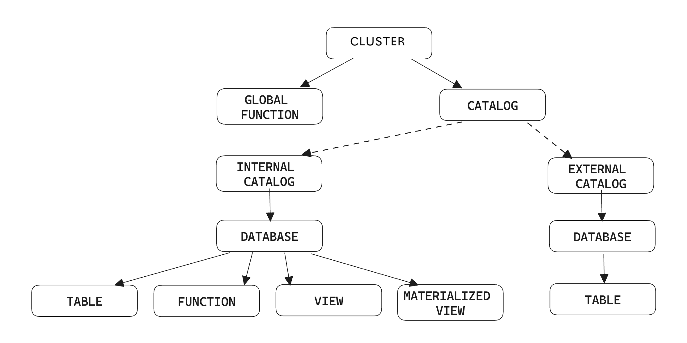
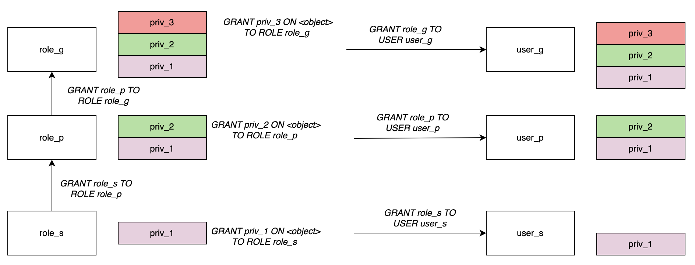

# Overview of data access control

CelerData employs a role-based access control (RBAC) framework, which allows cluster administrators to precisely manage and regulate access to objects or data in their CelerData clusters.

The RBAC framework of CelerData is built on the following key concepts:

- **Object:** An entity whose access can be granted, such as a catalog, a database, or a table. Unauthorized access is prohibited.
- **Privilege:** A defined level of access to an object. Several different privileges can be used to control the granularity of the access granted.
- **User:** A user identity recognized by CelerData. Authenticated users can directly log in to CelerData.
- **Role:** An entity to which privileges can be granted. Roles can be assigned to other roles as well as to users.

## Objects and privileges

Objects in CelerData have a logical hierarchy, which is related to the concept they represent. For example, Database is contained in Catalog, whereas Table, View, Materialized View, and Function are contained in Database.

The following figure shows the complete hierarchy of objects in a CelerData cluster:

Each object has a set of privilege items that can be granted. These privileges define which operations can be performed on these objects. You can grant and revoke privileges from roles or users through the [GRANT](../../sql-reference/sql-statements/account-management/GRANT.md) and [REVOKE](../../sql-reference/sql-statements/account-management/REVOKE.md) commands.

## Users

In a CelerData cluster, each user is identified by a unique username, which is the only identifier of the user.

### Grant privileges to users

Users are entities to which privileges can be granted. Both privileges and roles can be assigned to users. The maximum privilege scope of each user identity is the union of its own privileges and the privileges of the roles assigned to this user identity. CelerData ensures that each user can only perform authorized operations.

We recommend that you **use roles to pass privileges** in most cases. For example, after you create a role, you can grant privileges to the role and then assign the role to users. If you want to grant temporary or special privileges, you can directly grant them to users. This simplifies privilege management and offers flexibility.

## Roles

Roles are the entities to which privileges can be granted and revoked. Roles can be seen as a collection of privileges that can be assigned to users, to allow them to perform required actions. A user can be assigned multiple roles so they can perform different actions using separate sets of privileges. To simplify management, CelerData recommends that you **manage privileges through roles**. Special and temporary privileges can be directly granted to users.

To facilitate management, CelerData provides several **system-defined roles** with specific privileges, which helps you meet daily management and maintenance requirements. You can also flexibly **customize roles** to meet specific business needs and security needs. Note that the privilege scope of system-defined roles cannot be modified.

After a role is activated, users can perform operations that are authorized by the role. You can set default roles that are automatically activated when the user logs in.

### System-defined roles

CelerData provides several types of system-defined roles:

- `db_admin`: has database management privileges, including the privileges to perform all operations on catalog, database, table, view, materialized view, function, and global function.
- `user_admin`: has administrative privileges on users and roles, including the privileges to create users and roles and to grant and revoke privileges.
- `public`: This role is owned by any user and activated by default in any session, including adding new users. The `public` role does not have any privileges by default. You can modify the privilege scope of this role.

### Custom roles

You can create custom roles to meet specific business requirements and modify their privilege scope. At the same time, for the convenience of management, you can assign roles to other roles to create privilege hierarchy and inheritance. Then, the privileges associated with a role are inherited by another role.

#### Role hierarchy and privilege inheritance

The following figure shows an example of privilege inheritance.

> **NOTE**
>
> The maximum number of inheritance levels for a role is 16. The inheritance relationship can not be bidirectional.

As shown in the figure:

- `role_s` is assigned to `role_p`. `role_p` implicitly inherits `priv_1` of `role_s`.
- `role_p` is assigned to `role_g`. `role_g` implicitly inherits `priv_2` of `role_p` and `priv_1` of `role_s`.
- After a role is assigned to a user, the user also has the privileges of this role.

### Active roles

In CelerData, all the roles of a user will always be activated. You can use `SELECT CURRENT_ROLE();` to view all the active roles in the current session.

## See also

- For more information on the privileges supported by CelerData, see [Privileges](./privilege_item.md).
- For more instructions on managing privileges, see [Manage user privileges](./manage_users.md).
