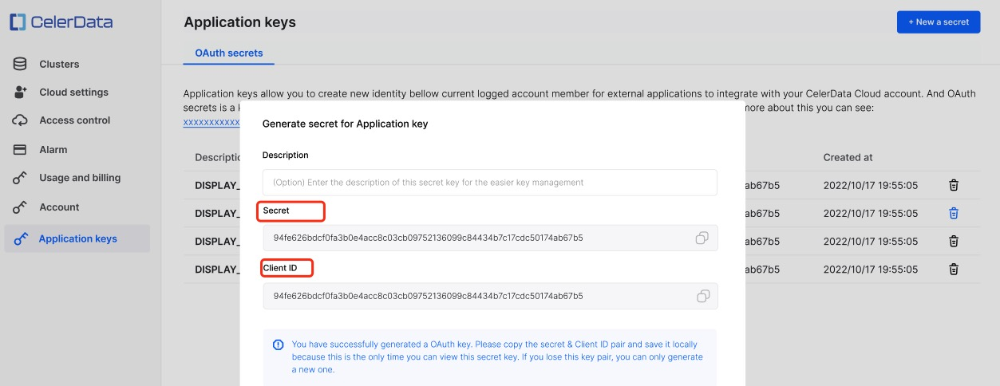
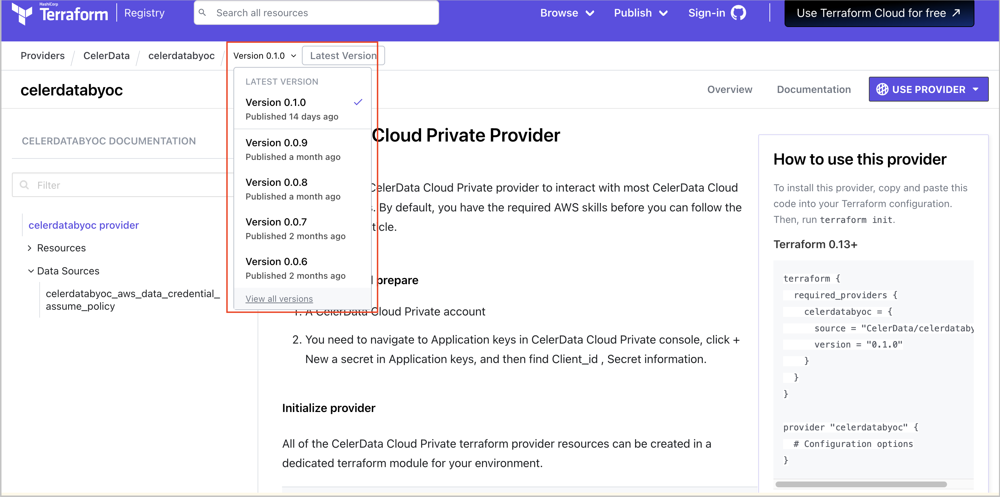

# Terraform provider for CelerData

HashiCorp Terraform is an open-source Infrastructure as Code (IaC) tool used across multiple cloud providers to help create secure cloud infrastructure. You can use the [Terraform provider for CelerData](https://registry.terraform.io/providers/CelerData/celerdatabyoc/latest/docs) to manage your CelerData cluster and associated cloud infrastructure. The Terraform provider uses the [CelerData Cloud Private API](/API/access_API.md) to support the automated deployment of CelerData clusters, including the management of clusters and jobs and the configuration of data access permissions.

In short, with infrastructure management fully automated by code and integrated into continuous delivery workflows, teams can securely accelerate data flow initiatives in the cloud.

## Resources available to the Terraform provider

The most important element in the Terraform language is **Resources**. Every Terraform resource describes one or more infrastructure objects, such as a credential, a CelerData cluster, or a network. You can manage the following CelerData resources in Terraform:

- [celerdatabyoc_aws_data_credential](https://registry.terraform.io/providers/CelerData/celerdatabyoc/latest/docs/resources/aws_data_credential)
- [celerdatabyoc_aws_data_credential_policy](https://registry.terraform.io/providers/CelerData/celerdatabyoc/latest/docs/resources/aws_data_credential_policy)
- [celerdatabyoc_aws_deployment_credential_assume_policy](https://registry.terraform.io/providers/CelerData/celerdatabyoc/latest/docs/resources/aws_deployment_credential_assume_policy)
- [celerdatabyoc_aws_deployment_credential_policy](https://registry.terraform.io/providers/CelerData/celerdatabyoc/latest/docs/resources/aws_deployment_credential_policy)
- [celerdatabyoc_aws_deployment_role_credential](https://registry.terraform.io/providers/CelerData/celerdatabyoc/latest/docs/resources/aws_deployment_role_credential)
- [celerdatabyoc_aws_network](https://registry.terraform.io/providers/CelerData/celerdatabyoc/latest/docs/resources/aws_network)
- [celerdatabyoc_classic_cluster](https://registry.terraform.io/providers/CelerData/celerdatabyoc/latest/docs/resources/classic_cluster)
- [celerdatabyoc_elastic_cluster](https://registry.terraform.io/providers/CelerData/celerdatabyoc/latest/docs/resources/elastic_cluster)

**Data sources** enable querying or calculating data for utilization elsewhere. They allow Terraform code to use information that is beyond the scope of Terraform management or to read state stored by other Terraform code. Each provider can define data sources along with resource types:

- [celerdatabyoc_aws_data_credential_assume_policy](https://registry.terraform.io/providers/CelerData/celerdatabyoc/latest/docs/data-sources/aws_data_credential_assume_policy)

## Before you begin

Before using Terraform and the Terraform provider for CelerData to create resources at the AWS account level, you need to:

1. Have an AWS account and set CelerData on AWS.
2. Install and configure [Terraform CLI](https://developer.hashicorp.com/terraform/downloads), the command-line tool for Terraform.
3. Obtain CelerData credentials.

   The Terraform provider will use the **Secret** and **Client ID** of your application key to provision and manage CelerData resources. Follow these steps to obtain these credentials:

   a. Log in to the CelerData Cloud Private console.

   b. In the left-side navigation pane, choose **Application keys**.

   c. On the page that appears, click **New secret**.

   d. In the dialog box that appears, enter a description for the application key. Then, copy the **Secret** and **Client ID** before you close the dialog box.

   

## A sample configuration on Terraform

This sample creates a classic CelerData cluster configuration using the Terraform provider for CelerData.

### Step 1: Install and configure Terraform provider

Copy and paste the following code snippet into your Terraform configuration to install the Terraform provider. Then, run `terraform init`.

```Plain
terraform {
  required_providers {
    celerdatabyoc = {
      source = "CelerData/celerdatabyoc"
      version = "<provider_version>"
    }
  }
}
provider "celerdatabyoc" {
  client_id = "<client_id>"
  client_secret = "<client_secret>"
}
```

For `provider_version`, enter the provider version of your choice. We recommend that you select the latest provider version. You can view the provider versions offered by CelerData from the [CelerData Cloud Private Provider](https://registry.terraform.io/providers/CelerData/celerdatabyoc/latest/docs) page, as shown in the following figure:



For `client_id` and `client_secret`, enter the **Client ID** and **Secret** you obtained as instructed in the above "Before you begin" section.

### Step 2: Configure Terraform resources in main.tf file

The **main.tf** file contains Terraform resources that represent the infrastructure to be built, including the environment and classic CelerData cluster. Declare variables for these resources in the **main.tf** file before creating a classic CelerData cluster.

#### Data credential-related resources

```Shell
data "celerdatabyoc_aws_data_credential_assume_policy" "assume_role" {}

resource "celerdatabyoc_aws_data_credential_policy" "role_policy" {
  bucket = <s3_bucket_name>
}

resource "aws_iam_role" "celerdata_data_cred_role" {
  name               = "<celerdata_data_credential_role_name>"
  assume_role_policy = data.celerdatabyoc_aws_data_credential_assume_policy.assume_role.json
  description        = "<celerdata_data_credential_role_description>"
  inline_policy {
    name   = "<celerdata_data_credential_role_policy_name>"
    policy = celerdatabyoc_aws_data_credential_policy.role_policy.json
  }
}

resource "celerdatabyoc_aws_data_credential" "data_credential" {
  name = "<celerdata_data_credential_name>"
  role_arn = aws_iam_role.celerdata_data_cred_role.arn
  instance_profile_arn = aws_iam_instance_profile.celerdata_data_cred_profile.arn
  bucket_name = <s3_bucket_name>
  policy_version = celerdatabyoc_aws_data_credential_policy.role_policy.version
}
```

##### celerdatabyoc_aws_data_credential_policy

This resource contains only the following required variable:

- `bucket`: (Forces new resource) The name of the AWS S3 bucket for which to generate the JSON policy document and that stores the profile.

##### aws_iam_role (celerdata_data_cred_role)

This resource contains required variables and optional variables.

Required variables are as follows:

- `assume_role_policy`: The policy that grants an entity permission to assume the IAM role referenced in the data credential. Set the value to `data.celerdatabyoc_aws_data_credential_assume_policy.assume_role.json`.

Optional variables are as follows:

- `name`: (Forces new resource) The name of the IAM role referenced in the data credential. If omitted, Terraform will assign a random, unique name. See [IAM Identifiers](https://docs.aws.amazon.com/IAM/latest/UserGuide/Using_Identifiers.html) for more information.
- `description`: The description of the IAM role.
- `inline_policy`: The configuration block that defines an exclusive set of IAM inline policies associated with the IAM role. See below. If no blocks are configured, Terraform will not manage any inline policies in this resource. Configuring one empty block (namely, `inline_policy {}`) will cause Terraform to remove all inline policies added out of band on `apply`.
  - `name`: The name of the IAM policy that will be attached to the IAM role referenced in the data credential.
  - `policy`: The IAM policy that will be attached to the IAM role. Set the value to `celerdatabyoc_aws_data_credential_policy.role_policy.json`.

##### celerdatabyoc_aws_data_credential

This resource contains required variables and optional variables.

Required variables are as follows:

- `role_arn`: (Forces new resource) The ARN of the IAM role referenced in the data credential. Set the value to `aws_iam_role.celerdata_data_cred_role.arn`.
- `instance_profile_arn`: (Forces new resource) The instance profile ARN of the IAM role referenced in the data credential. Set the value to `aws_iam_instance_profile.celerdata_data_cred_profile.arn`.
- `bucket_name`: (Forces new resource) The name of the AWS S3 bucket for which to generate the policy document and that stores the profile.
- `policy_version`: (Forces new resource) Set the value to `celerdatabyoc_aws_data_credential_policy.role_policy.version`.

Optional variables are as follows:

- `name`: (Forces new resource) The name of the data credential.

#### Deployment credential-related resources

```Shell
resource "aws_iam_instance_profile" "celerdata_data_cred_profile" {
  name = "<celerdata_data_credential_profile_name>"
  role = aws_iam_role.celerdata_data_cred_role.name
}

resource "celerdatabyoc_aws_deployment_credential_policy" "role_policy" {
  bucket = <s3_bucket_name>
  data_role_arn = aws_iam_role.celerdata_data_cred_role.arn
}

resource "celerdatabyoc_aws_deployment_credential_assume_policy" "role_policy" {}

resource "aws_iam_role" "deploy_cred_role" {
  name               = "<celerdata_deployment_credential_role_name>"
  assume_role_policy = celerdatabyoc_aws_deployment_credential_assume_policy.role_policy.json
  description        = "<celerdata_deployment_credential_role_description>"
  inline_policy {
    name   = "<celerdata_deployment_credential_role_policy_name>"
    policy = celerdatabyoc_aws_deployment_credential_policy.role_policy.json
  }
}

resource "celerdatabyoc_aws_deployment_role_credential" "deployment_role_credential" {
  name = "<celerdata_deployment_credential_name>"
  role_arn = aws_iam_role.deploy_cred_role.arn
  external_id = celerdatabyoc_aws_deployment_credential_assume_policy.role_policy.external_id
  policy_version = celerdatabyoc_aws_deployment_credential_policy.role_policy.version
}
```

##### aws_iam_instance_profile

This resource contains only the following optional variables:

- `name`: (Forces new resource) The name of the instance profile. If omitted, Terraform will assign a random, unique name. This variable conflicts with `name_prefix`. The value of this variable can be a string of characters consisting of upper and lowercase alphanumeric characters and these special characters: `_`, `+`, `=`, `,`, `.`, `@`, `-`. Spaces are not allowed.
- `role`: The name of the IAM role to add to the instance profile. Set the value to `aws_iam_role.celerdata_data_cred_role.name`.

##### celerdatabyoc_aws_deployment_credential_policy

This resource contains only the following required variables:

- `bucket`: The name of the AWS S3 bucket.
- `data_role_arn`: (Forces new resource) The ARN of the IAM role referenced in the deployment credential. Set the value to `aws_iam_role.celerdata_data_cred_role.arn`.

##### aws_iam_role (deploy_cred_role)

This resource contains required variables and optional variables.

Required variables are as follows:

- `assume_role_policy`: The policy that grants an entity permission to assume the IAM role referenced in the deployment credential. Set the value to `celerdatabyoc_aws_deployment_credential_assume_policy.role_policy.json`.

Optional variables are as follows:

- `name`: (Forces new resource) The name of the IAM role referenced in the deployment credential. If omitted, Terraform will assign a random, unique name. See [IAM Identifiers](https://docs.aws.amazon.com/IAM/latest/UserGuide/Using_Identifiers.html) for more information.
- `description`: The description of the IAM role.
- `inline_policy`: The configuration block that defines an exclusive set of IAM inline policies associated with the IAM role. See below. If no blocks are configured, Terraform will not manage any inline policies in this resource. Configuring one empty block (namely, `inline_policy {}`) will cause Terraform to remove all inline policies added out of band on `apply`.
  - `name`: The name of the IAM policy that will be attached to the IAM role.
  - `policy`: The IAM policy that will be attached to the IAM role referenced in the deployment credential. Set the value to `celerdatabyoc_aws_deployment_credential_policy.role_policy.json`.

##### celerdatabyoc_aws_deployment_role_credential

This resource contains required variables and optional variables.

Required variables are as follows:

- `role_arn`: (Forces new resource) Set the value to `aws_iam_role.deploy_cred_role.arn`.
- `external_id`: (Forces new resource) Set the value to `celerdatabyoc_aws_deployment_credential_assume_policy.role_policy.external_id`.
- `policy_version`: (Forces new resource) Set the value to `celerdatabyoc_aws_deployment_credential_policy.role_policy.version`.

Optional variables are as follows:

- `name`: (Forces new resource) The name of the deployment credential.

#### Network configuration-related resources

```Shell
resource "celerdatabyoc_aws_network" "network" {
  name = "<VPC_name>"
  subnet_id = "<subnet_id>"
  security_group_id = "<security_group_id>"
  region = "<AWS_VPC_region>"
  deployment_credential_id = celerdatabyoc_aws_deployment_role_credential.deployment_role_credential.id
  #vpc_endpoint_id = "<vpc_endpoint_id>"
}
```

The `celerdatabyoc_aws_network` resource contains required variables and optional variables.

Required variables are as follows:

- `name`: (Forces new resource) The name of the AWS VPC hosting the cluster.

- `subnet_id`: (Forces new resource) The ID of the subnet within the AWS VPC.

- `security_group_id`: (Forces new resource) The ID of the security group within the AWS VPC.

- `region`: (Forces new resource) The code of the AWS region to which the AWS VPC belongs. The following AWS regions are supported.

  | Region name              | Region code    |
  | ------------------------ | -------------- |
  | Asia Pacific (Singapore) | ap-southeast-1 |
  | US East (N. Virginia)    | us-east-1      |
  | US West (Oregon)         | us-west-2      |
  | Europe (Ireland)         | eu-west-1      |

- `deployment_credential_id`: (Forces new resource) Set the value to `celerdatabyoc_aws_deployment_role_credential.deployment_role_credential.id`.

Optional variables are as follows:

- `vpc_endpoint_id`: (Optional) The ID of your endpoint within your VPC. Set this variable if you need to achieve a more stringent network communication method.

#### CelerData cluster-related resources

```Plain
resource "celerdatabyoc_classic_cluster" "demo_cluster" {
  cluster_name = "<cluster_name>"
  fe_instance_type = "<fe_instance_type>"
  fe_node_count = 1
  deployment_credential_id = celerdatabyoc_aws_deployment_role_credential.deployment_role_credential.id
  data_credential_id = celerdatabyoc_aws_data_credential.data_credential.id
  network_id = celerdatabyoc_aws_network.network.id
  be_instance_type = "<be_instance_type>"
  be_node_count = 1
  be_disk_number = 2
  be_disk_per_size = 100
  default_admin_password = "<SQL_user_initial_password>"

  expected_cluster_state = "{Suspended | Running}"
  resource_tags = {
    celerdata = "<tag_name>"
  }
  csp = "aws"
  region = "<AWS_VPC_region>"

  init_scripts {
      logs_dir    = "<log-s3-path/>"
      script_path = "<script-s3-path/test1.sh>"
  }
  run_scripts_parallel = false
}
```

The `celerdatabyoc_classic_cluster` resource contains required variables and optional variables:

Required variables are as follows:

- `cluster_name`: (Forces new resource) The desired name for the cluster.

- `fe_instance_type`: The instance type for FE nodes in the cluster. Select an FE instance type from the table "[Supported Instance type](https://registry.terraform.io/providers/CelerData/celerdatabyoc/latest/docs/resources/classic_cluster#supported-instance-type)". For example, you can set this variable to `m6i.4xlarge`.

- `deployment_credential_id`: (Forces new resource) Set the value to `celerdatabyoc_aws_deployment_role_credential.deployment_role_credential.id`.

- `data_credential_id`: (Forces new resource) Set the value to `celerdatabyoc_aws_data_credential.data_credential.id`.

- `network_id`: (Forces new resource) Set the value to `celerdatabyoc_aws_network.network.id`.

- `be_instance_type`: The instance type for BE nodes in the cluster. Select a BE instance type from the table "[Supported Instance type](https://registry.terraform.io/providers/CelerData/celerdatabyoc/latest/docs/resources/classic_cluster#supported-instance-type)". For example, you can set this variable to `m5.xlarge`.

- `default_admin_password`: The initial password of the cluster `admin` user.

- `expected_cluster_state`: When creating a cluster, you need to declare the status of the cluster you are creating. Cluster states are categorized as `Suspended` and `Running`. If you want the cluster to start after provisioning, set this variable to `Running`. If you do not do so, the cluster will be suspended after provisioning.

- `csp`: The cloud service provider of the cluster. Only AWS is supported.

- `region`: The code of the AWS region to which the AWS VPC hosting the cluster belongs. The following AWS regions are supported.

  | Region name              | Region code    |
  | ------------------------ | -------------- |
  | Asia Pacific (Singapore) | ap-southeast-1 |
  | US East (N. Virginia)    | us-east-1      |
  | US West (Oregon)         | us-west-2      |
  | Europe (Ireland)         | eu-west-1      |

Optional variables are as follows:

- `fe_node_count`: The number of FE nodes in the cluster. Valid values: `1`, `3`, and `5`. Default value: `1`.
- `be_node_count`: The number of BE nodes. Valid values: any non-zero positive integer. Default value: `3`.
- `be_disk_number`: (Forces new resource) The maximum number of disks that are allowed for each BE. Valid values: [1,24]. Default value: `2`.
- `be_disk_per_size`: The size per disk for each BE. Unit: GB. Maximum value: `16000`. Default value: `100`. You can only increase the value of this parameter, and the time interval between two value changes must be greater than 6 hours.
- `resource_tags`: The tags to be attached to the cluster.
- `init_scripts`: The configuration block to customize the location to which scripts are uploaded. The maximum number of executable scripts is 20. For more information about executable scripts, see [Run scripts](/run_scripts.md).
  - `logs_dir`: (Forces new resource) The path to which script execution results are stored.
  - `script_path`: (Forces new resource) The URI of the AWS S3 bucket that stores the scripts.
- `run_scripts_parallel`: Whether to execute the scripts in parallel. Valid values: `true` and `false`. Default value: `false`.

## Apply the Terraform configurations

1. Initialize the Terraform provider defined in the configuration:

   ```Plain
   terraform init
   ```

2. Check whether your project has been configured. If there are any errors, edit the configuration and re-run the following command:

   ```Plain
   terraform plan
   ```

3. Apply the configuration:

   ```Plain
   terraform apply
   ```

## Delete a cluster configuration

Destroy all the resources created by the Terraform provider for CelerData:

```Plain
terraform destroy
```

## In the future

The CelerData team will continue to spend time on Terraform to help customers reduce the complexity and risk of their data streaming infrastructure deployments. Stay tuned to the [Terraform Provider for CelerData changelog on Github ](https://github.com/CelerData/terraform-provider-celerdatabyoc)for the publishing of new resources, data sources as well as the optimizations and bug fixes.
