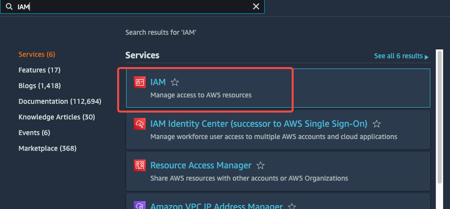
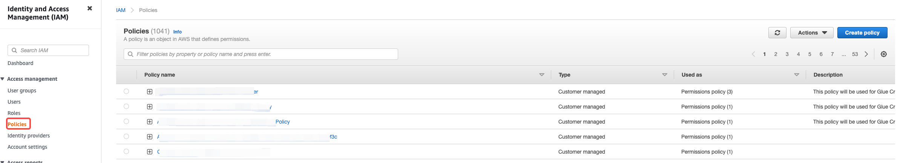
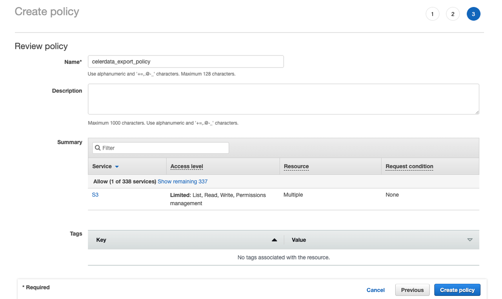
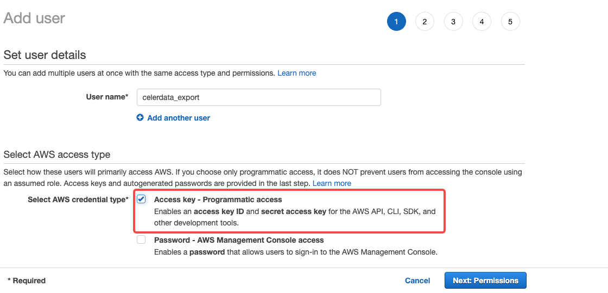
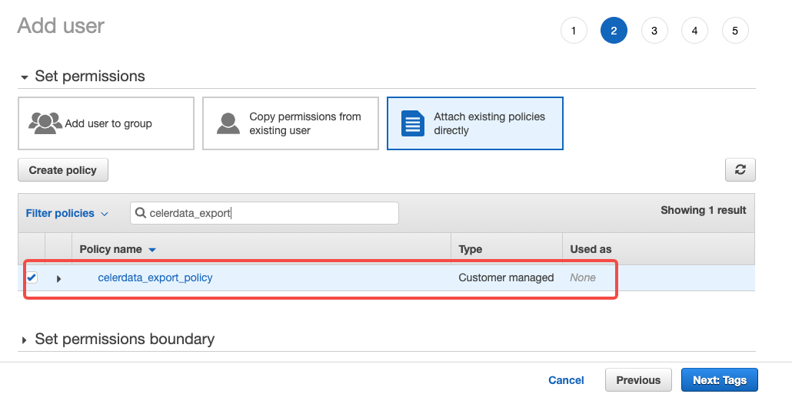
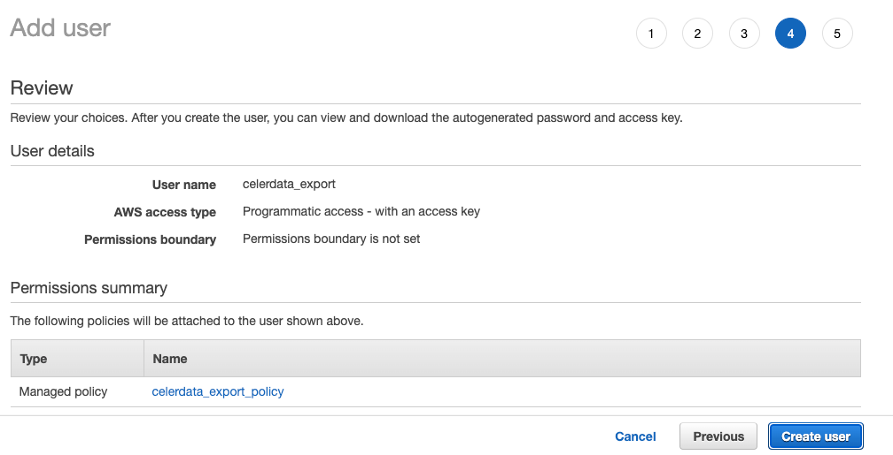
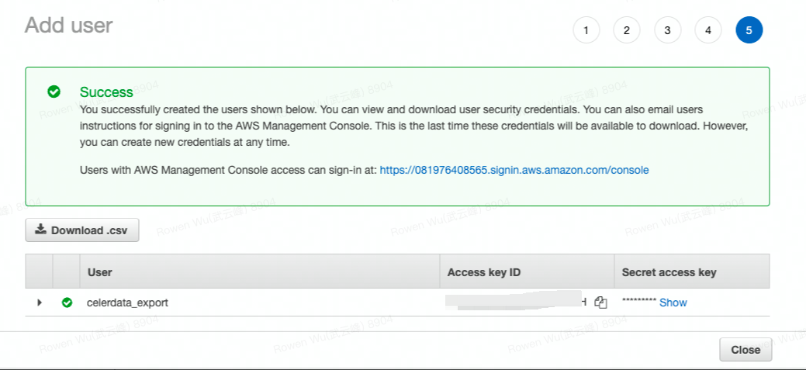

# Unload data into AWS S3

This topic describes how to unload CSV-formatted data from CelerData into an AWS S3 bucket in three steps.

## Step 1: Configure an S3 bucket access policy

### AWS access control requirements

CelerData requires the following permissions on an S3 bucket and folder to be able to access files in the folder and its sub-folders:

- `s3:GetObject`
- `s3:PutObject`
- `s3:DeleteObject`
- `s3:ListBucket`

### Creating an IAM policy

The following step-by-step instructions describe how to configure access permissions for CelerData in your AWS Management Console so that you can use an S3 bucket to unload data:

1. Log in to the [AWS Management Console](https://console.aws.amazon.com/console/home?nc2=h_ct&src=header-signin).

2. From the home dashboard, choose **Identity & Access Management (IAM)**.

   

3. Choose **Account settings** from the left-hand navigation pane.

4. Expand the **Security Token Service Regions** list, find the AWS region in which your CelerData cluster is deployed, and choose **Activate** if the status is **Inactive**.

5. Choose **Policies** from the left-hand navigation pane.

6. Click **Create Policy**.

   

7. Click the **JSON** tab.

8. Add the policy document that will allow CelerData to access the S3 bucket and folder.

   The following policy in JSON format provides CelerData with the required access permissions for the specified bucket and folder path. You can copy and paste the text into the policy editor:

   ```SQL
   {
       "Version": "2012-10-17",
       "Statement": [
            {
               "Effect": "Allow",
               "Action": [
                   "s3:ListBucket"
               ],
               "Resource": [
                   "arn:aws:s3:::<bucket_name>"
               ]
           },
           {
               "Effect": "Allow",
               "Action": [
                   "s3:PutObject",
                   "s3:GetObject",
                   "s3:DeleteObject",
               ],
               "Resource": [
                   "arn:aws:s3:::<bucket_name>/*"
               ]
           }
       ]
   }
   ```

   > **NOTE**
   >
   > Replace `<bucket_name>` with the name of the S3 bucket that you want to access. For example, if your S3 bucket is named `bucket_s3`, replace `<bucket_name>` with `bucket_s3`.

9. Click **Review policy**.

10. Enter the policy name (for example, `celerdata_export_policy`) and optionally a policy description. Then, click **Create policy** to create the policy.

    

## Step 2: Create an IAM user

1. Choose **Users** from the left-hand navigation pane and click **Add user**.

2. On the **Add user** page, enter a new user name (for example, `celerdata_export`), select **Access key - Programmatic access** as the access type, and then click **Next: Permissions**.

   

3. Click **Attach existing policies directly**, select the policy you created earlier, and then click **Next: Tags**.

   

4. Review the user details. Then, click **Create user**.

   

5. Record the access credentials. The easiest way to record them is to click **Download Credentials** to write them to a file (for example, `credentials.csv`).

   

   > **NOTICE**
   >
   > Once you leave this page, the Secret Access Key will **no longer be available** anywhere in the AWS Management Console. If you lose the key, you must generate a **new** set of credentials for the user.

You have now:

- Created an IAM policy for an S3 bucket.
- Created an IAM user and generated access credentials for the user.
- Attached the policy to the user.

With the AWS access key (AK) and secret key (SK) for the S3 bucket, you have the credentials necessary to access the bucket in CelerData using a broker load.

```SQL
{
    "Version": "2012-10-17",
    "Statement": [
        {
            "Effect": "Allow",
            "Action": [
                "s3:ListBucket"
            ],
            "Resource": [
                "arn:aws:s3:::<bucket_name>"
            ]
        },
        {
            "Effect": "Allow",
            "Action": [
                "s3:PutObject",
                "s3:GetObject",
                "s3:DeleteObject"
            ],
            "Resource": [
                "arn:aws:s3:::<bucket_name>/*"
            ]
        }
    ]
}
```

## Step 3:  Unload data into AWS S3

### Unload table data into Amazon S3

You can use the EXPORT statement to unload all data from a table or only the data from specific partitions of a table into an S3 bucket.

```SQL
EXPORT TABLE <table_name>
[PARTITION (<partition_name>[, <partition_name>, ...])]
TO "s3a://<bucket_name>/path/to"
WITH BROKER
(
    "aws.s3.access_key" =  <your_access_key_id>,
    "aws.s3.secret_key" = <your_secret_access_key>,
    "aws.s3.endpoint" = "s3.<region_id>.amazonaws.com"
);
```

The following table describes the parameters.

| **Parameter**     | **Description**                                              |
| ----------------- | ------------------------------------------------------------ |
| table_name        | The name of the table from which you want to unload data.    |
| partition_name    | The name of the partition from which you want to unload data. If you specify multiple partitions, separate the partition names with a comma (,) and a space. |
| bucket_name       | The name of the S3 bucket into which you want to unload data. |
| aws.s3.access_key | The Access Key ID that you can use to access the S3 bucket.  |
| aws.s3.secret_key | The Secret Access Key that you can use to access the S3 bucket. |
| aws.s3.endpoint   | The endpoint that you can use to access the S3 bucket. `region_id` in the endpoint is the ID of the AWS region to which the S3 bucket belongs. |

> **NOTE**
>
> The S3A protocol is used for data unloads from Amazon S3. Therefore, the file path that you specify must start with the prefix `s3a://`.

For more information, see [EXPORT](../sql-reference/sql-statements/data-manipulation/EXPORT.md).

### Unload query results into Amazon S3

You can use the SELECT statement to unload the result of a query into one or more text files stored in an S3 bucket.

Unload data using the SELECT statement:

```SQL
SELECT * FROM <xxx>
INTO OUTFILE "s3a://<bucket_name>/path/to/<filename_prefix>"
FORMAT AS CSV
PROPERTIES
(
    "broker.name" = "",
    "aws.s3.access_key" = <your_access_key_id>,
    "aws.s3.secret_key" = <your_secret_access_key>,
    "aws.s3.endpoint" = "s3.<region_id>.amazonaws.com",
    "column_separator" = ",",
    "line_delimiter" = "\n",
    "max_file_size" = "1024MB"
)
```

The following table describes the parameters.

| **Parameter**     | **Description**                                              |
| ----------------- | ------------------------------------------------------------ |
| bucket_name       | The name of the S3 bucket into which you want to unload data. |
| FORMAT AS         | The format of the table. Valid values: `CSV`.                |
| broker.name       | Leave this parameter unspecified.                            |
| aws.s3.access_key | The Access Key ID that you can use to access the S3 bucket.  |
| aws.s3.secret_key | The Secret Access Key that you can use to access the S3 bucket. |
| aws.s3.endpoint   | The endpoint that you can use to access the S3 bucket. `region_id` in the endpoint is the ID of the AWS region to which the S3 bucket belongs. |
| column_separator  | The column separator used in the table.                      |
| line_delimiter    | The row separator used in the table.                         |
| max_file_size     | The maximum amount of data that can be unloaded into the S3 bucket. Unit: MB. |

> **NOTE**
>
> The S3A protocol is used for data unloads from Amazon S3. Therefore, the file path that you specify must start with the prefix `s3a://`.

If the `filename_prefix` that you specify already exists, an error message "Error 1064: Cannot truncate a file by broker" is returned.

## Limits

- Only the CSV format is supported.
- The AWS AK and SK used as credentials are necessary.
