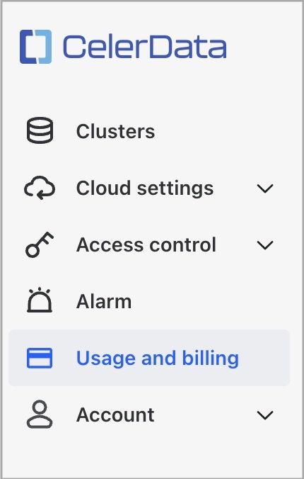
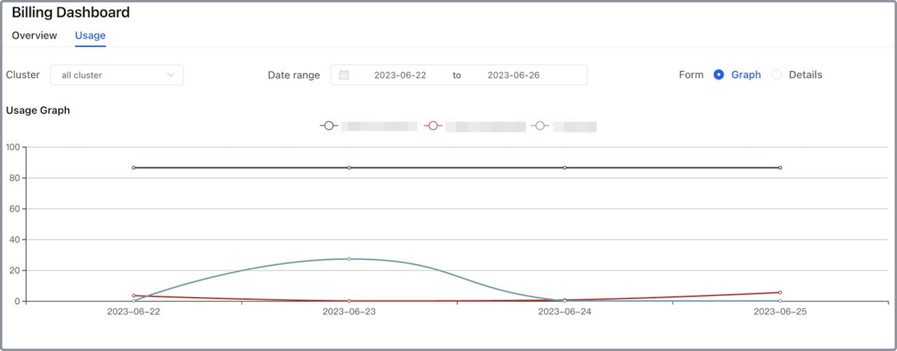
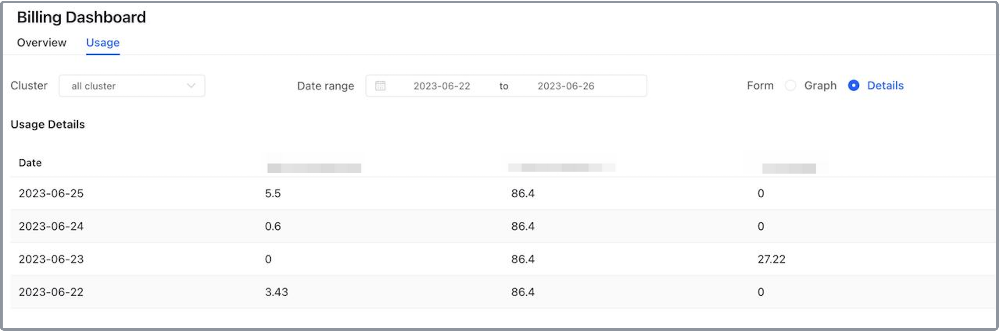

# Understand your usage

Usage within a CelerData cloud account is measured in CelerData Cloud Units (CCUs). CCUs are consumed only when CelerData clusters are running.

## How usage is measured

The CCU usage of your account is measured by the total CCU usage of all clusters hosted in your account.

The CCU usage of a cluster is calculated as follows:

```Plain
[(FE node count * FE consumption rate) + (BE node count * BE consumption rate)] * Total uptime of the cluster
```

The cluster uptime is measured in hours.

The consumption rates indicate the CCU consumption per hour for nodes of different types and instance sizes.

## View the usage of your account

Follow these steps to view the usage information of your account:

1. Sign in to the [CelerData Cloud Private console](https://cloud.celerdata.com/login).
2. In the left-side navigation pane, choose **Usage and billing**.

   

3. On the **Usage** tab of the **Billing Dashboard** page, view the following usage information of your account:

   - **Cluster**

     From the **Cluster** drop-down list, you can select **all cluster** to view the CCU usage of all clusters hosted in your account or select a specific cluster to view its CCU usage.

   - **Date range**

     In the **Date range** section, you can select a time range over which you want to view the CCU usage.

   - **Form**

     In the **Form** section, you can select the following two forms to display the CCU usage:

     - **Graph**

       Visualize the CCU usage trend in a line chart within the selected time range. You can hover over a date to view the CCU usage at the specific date. You can also filter the displayed clusters by clicking on the above legends.

       

     - **Details**

       List the daily CCU usage records within the selected time range. These records can help you analyze and plan the CCU usage within your account.

       
