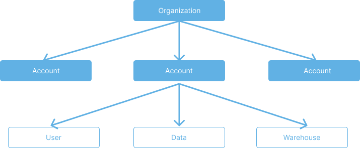

# Organization and account

This topic introduces the concepts of organization and account in CelerData Cloud and describes how administrator users can manage their organization and the accounts within their organization.

After signing up for a CelerData Cloud account, you can navigate to **Account&Org - Organization** to view your organization details.

A CelerData Cloud **organization** is the parent object that links the accounts owned by your company. It simplifies the management of accounts, facilitates the billing for your company's use of CelerData Cloud, and also makes other account administration tasks easier. Each individual CelerData Cloud **account** is used to manage specific data, warehouses, and users.

When you first sign up for CelerData Cloud, CelerData Cloud creates an account for you and launches an organization with which the new account is bound. The new account serves as the root account of your organization and is granted all privileges as an administrator user. You can also create additional accounts that belong to your organization after it is created with the initial root account. Different accounts within the same organization can be created in different regions that belong to the same cloud provider.

The resource usage of each account within an organization is calculated separately, but only the root account in the organization can pay for all accounts' usage.

In most business scenarios such as when you are working as a data analyst in a small group and the group needs only one account with which the group members can run some data analytics workloads, you do not need to use this multi-account feature.

In some other scenarios such as when you are working in a big company that consists of multiple departments and these departments each require an individual account so they can do their own data analytics workloads without sharing resources with the other departments, you can create and maintain multiple accounts, one for each department, within an organization. Every time when the company receives the monthly bill which includes the resource usage consumed by all accounts within the organization, the organization's administrator users can log in to the root account and pay for the bill by using the predefined credit card.
