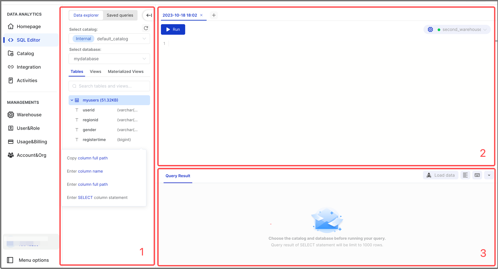

# Connect to CelerData Cloud

CelerData Cloud supports several different connection methods, including MySQL client, JDBC, and SQL Editor on the CelerData Cloud console.

## Connect via SQL Editor

CelerData Cloud provides a native SQL Editor on the console. You can use the SQL Editor to perform tasks that would normally be performed using SQL.

Follow these steps to connect to CelerData Cloud via SQL Editor:

1. Sign in to the CelerData Cloud console.
2. In the left-side navigation pane, choose **SQL Editor**.



SQL Editor consists of three areas:

- The **Data explorer** and **Saved queries** panels
- The Query Editor area
- The **Query Result** area

### Data explorer and Saved queries panels

On the **Data explorer** panel, you can:

- Select the catalog that hosts your data from the **Select catalog** drop-down list.
- Select the database that you want to use from the **Select database** drop-down list. You can select a database only after its parent catalog is selected.
- View and search for tables in the selected database.
- View the **Details** and **Definition** of a specific table by hovering on the table.
- Interact with a specific table by clicking the **More** (**...**) button next to the table.
- View the columns of a specific table by clicking the table.
- View the details of a specific column by hovering on the column.
- Interact with a specific column by clicking the **More** (**...**) button next to the column.
- View, search, and interact with views in the selected database.
- View, search, and interact with materialized views in the selected database.

On the **Saved queries** panel, you can:

- View and search for saved queries.
- Load a saved query script by clicking the query.
- Create a new query script by clicking the **Create a new query** button.
- Create a folder to manage your queries by clicking the **Create a new folder** button.
- Rename or delete a saved query by clicking the **More** (**...**) button next to the query.

### Query Editor area

In the Query Editor area, you can:

- Edit a query script in the editor.
- Select the warehouse that you want to use from the warehouse drop-down list on the top-right corner.
- Create a new query script by clicking the **+** button.
- Run a query script by clicking the **Run** button.

> **NOTE**
>
> Your query script is automatically saved when you edit it.

### Query Result area

In the **Query Result** area, you can:

- Check the query results and the **Query ID**, **Execution time**, **Rows returned**, and **Rows Total** of the query after it is completed.
- Download the query results as an **.xlsx** file by clicking the **Download** button after the query is completed.
- Load data from your cloud storage by clicking the **Load data** button.
- Format the SQL in the editor by clicking the **Format your SQL** button.
- Check the keyboard shortcuts the Query Editor supports by clicking the **Hot key** button.

Different information will be displayed in the result section during different phases of the query execution:

- When the query is running, the result section displays the amount of time that the query has taken.
- When the query is completed, the result section displays the results of the query.
- If the query fails, the result section will display the error message.

## Connect via MySQL client

To CelerData Cloud via MySQL client, you must have MySQL client (5.5 or later) installed on your machine.

Follow these steps to connect to CelerData Cloud via a MySQL client:

1. Launch a terminal, and run the following command:

   ```Bash
   # Replace <celerdata_cloud_endpoint> with the endpoint of your CelerData Cloud account.
   # Replace <account_id> with the ID of your CelerData Cloud account.
   # Replace <username> with the username you use to log in to CelerData Cloud.
   mysql -h <celerdata_cloud_endpoint> -P 3306 -u <account_id>.<username> -p
   ```

   > **TIP**
   >
   > You can copy the complete command string from your CelerData Cloud console by following these steps:
   >
   > 1. Log in to your CelerData Cloud console.
   > 2. On **Homepage**, click the **Help me connect** button on the bottom-right corner.
   > 3. On the **MySQL Client** tab, click the copy button to copy the command string.

2. Enter the password you use to log in to CelerData Cloud, and press **Enter**.

## Connect via JDBC

To CelerData Cloud via JDBC, you need to integrate the following configuration string into your code:

```Bash
# Replace <celerdata_cloud_endpoint> with the endpoint of your CelerData Cloud account.
# Replace <catalog> with the name of the catalog you want to connect to.
# Replace <database> with the name of the database you want to connect to.
# Replace <account_id> with the ID of your CelerData Cloud account.
# Replace <username> with the username you use to log in to CelerData Cloud.
# Replace <password> with the password you use to log in to CelerData Cloud.
jdbc:mysql://<celerdata_cloud_endpoint>:3306/<catalog>.<database>?user=<account_id>.<username>&password=<password>
```

> **TIP**
>
> You can copy the complete configuration string from your CelerData Cloud console by following these steps:
>
> 1. Log in to your CelerData Cloud console.
> 2. On **Homepage**, click the **Help me connect** button on the bottom-right corner.
> 3. On the **JDBC** tab, select the catalog and database from the drop-down lists.
> 4. Click the copy button to copy the command string, and replace `<password>` in the string with the password you use to log in to CelerData Cloud.

## Integrate CelerData Cloud with other applications

To integrate CelerData Cloud with other applications, you need to prepare the following connection properties:

- The endpoint, or the public host of your CelerData Cloud account.
- The query port `3306`.
- The username you use to log in to CelerData Cloud, in the format of `<account_id>.<username>`.
- The password you use to log in to CelerData Cloud.
- The database you want to connect to, in the format of `<catalog>.<database>`.
