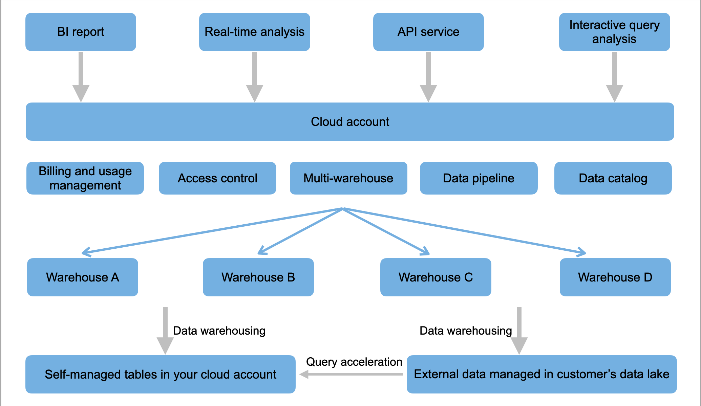

# What is CelerData Cloud?

CelerData Cloud is a fully-managed, blazingly fast data lake analytics platform built on top of StarRocks.

By taking advantage of an architecture that features separation of storage and compute, CelerData Cloud brings with users cost-effectiveness to manage compute resources for their SQL workloads.

With its out-of-the-box data analytics infrastructure, CelerData Cloud can provide timely insights to all stakeholders outside the enterprise. CelerData Cloud has brought many engineering breakthroughs to the market, delivering over 3x performance gains in standard benchmarks and up to 80% reductions in operating costs. A number of significant customers worldwide choose CelerData Cloud as their digital enterprise platform.

Also, CelerData Cloud can support a wide range of use cases within one platform:

- **Data lake analytics**

  You can directly query the data on your own data lake without data migration. CelerData Cloud supports all mainstream open-source data lake formats including [Apache Hive™](../query_data/hive_catalog.md), [Apache Hudi](../query_data/hudi_catalog.md), [Apache Iceberg](../query_data/iceberg_catalog.md), and [Apache Delta Lake](../query_data/deltalake_catalog.md).

- **Query** **acceleration**

  You can easily accelerate the analytics workloads on your data lake based on [asynchronous materialized views](../query_accelerate/Materialized_view.md).

- **Data warehousing**

  You can ingest data from external data sources into CelerData Cloud to support many more lower-latency and higher-concurrency data analysis scenarios.

The following figure shows the architecture of CelerData Cloud.

