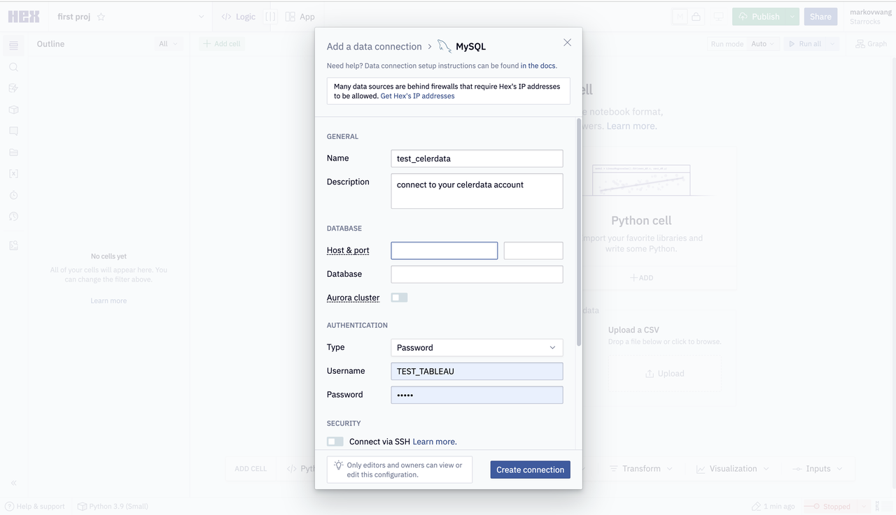

# Hex

Hex supports querying and visualizing both internal data and external data in CelerData.

## Prerequisites

Make sure that your CelerData Cloud account's inbound rules allow query requests from your Hex server.

## Integration

Add a data connection in Hex. Note that you must select MySQL as the connection type.

The parameters that you need to configure are described as follows:

- **Name**: the name of the data connection.
- **Host & port**: the account endpoint and query port of your CelerData Cloud account. An example query port is `9030`.
- **Database**: the data source that you want to access in your CelerData Cloud account. The value of this parameter is in the `<catalog_name>.<database_name>` format.
  - `catalog_name`: the name of the target catalog in your CelerData Cloud account. Both internal and external catalogs are supported.
  - `database_name`: the name of the target database in your CelerData Cloud account. Both internal and external databases are supported.
- **Type**: the authentication method that you want to use. Select **Password**.
- **User**: the username that is used to log in to your CelerData Cloud account, for example, `admin`.
- **Password**: the password that is used to log in to CelerData Cloud account.
