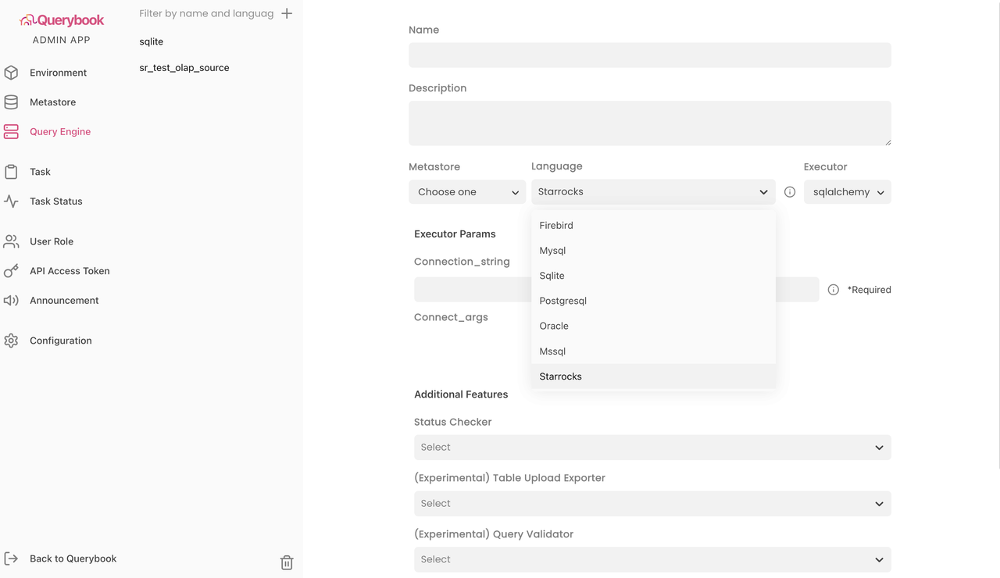

# Querybook

Querybook supports querying and visualizing both internal data and external data in CelerData.

## Prerequisites

### Installation

Make sure that you have finished the following preparations:

1. Clone and download the Querybook repository.

   ```SQL
   git clone git@github.com:pinterest/querybook.git
   cd querybook
   ```

2. Create a file named `local.txt` under the `requirements` folder in the project's root directory.

   ```SQL
   touch requirements/local.txt
   ```

3. Add the required packages.

   ```SQL
   echo -e "starrocks\nmysqlclient" > requirements/local.txt 
   ```

4. Start the container.

   ```SQL
   make
   ```

### Connectivity

Make sure that your CelerData Cloud account's inbound rules allow query requests from your Querybook server.

## Integration

Visit [https:///admin/query_engine/](https://localhost:10001/admin/query_engine/) and add a new query engine:



Take note of the following points:

- For **Language**, select **Starrocks**.
- For **Executor**, select **sqlalchemy**.
- For **Connection_string**, enter a URI in the StarRocks SQLAlchemy URI format as below:

  ```SQL
  starrocks://<User>:<Password>@<Host>:<Port>/<Catalog>.<Database>
  ```

  The parameters in the URI are described as follows:

  - `User`: the username that is used to log in to your CelerData Cloud account, for example, `admin`.
  - `Password`: the password that is used to log in to your CelerData Cloud account.
  - `Host`: the account endpoint of your CelerData Cloud account.
  - `Port`: the query port of your CelerData Cloud account, for example, `9030`.
  - `Catalog`: the target catalog in your CelerData Cloud account. Both internal and external catalogs are supported.
  - `Database`: the target database in your CelerData Cloud account. Both internal and external databases are supported.
