# Authenticate to AWS resources

CelerData Cloud supports using two authentication methods to integrate with AWS resources: assumed role-based authentication and IAM user-based authentication. This topic describes how to configure AWS credentials by using these authentication methods.

## Authentication methods

### Assumed role-based authentication (Recommended)

Your CelerData Cloud account can securely integrate with your AWS account by assuming an AWS IAM role. This requires you to create an IAM role and configure a trust relationship for it, so as to allow your CelerData Cloud account to assume this role. This way, you can access your data securely and reliably without the need to create a long-term plaintext key pair that consists of an access key ID (commonly referred to as "access key") and a secret access key (commonly referred to as "secret key").

### IAM user-based authentication

You need to create an AWS IAM user and embed the access key and secret key of the user into SQL commands. This way, your CelerData Cloud account can use the user's identity to access the cloud resources within your AWS account.

## Preparations

First, you need to create an IAM policy based on the type of cloud resource you want to access and the specific operation scenario within CelerData Cloud. A policy in AWS IAM declares a set of permissions on a specific AWS resource. After creating a policy, you need to attach it to an IAM role or user. As such, the IAM role or user is assigned the permissions declared in the policy to access the specified AWS resource.

> **NOTICE**
>
> To make these preparations, you must have permission to sign in to the [AWS IAM console](https://us-east-1.console.aws.amazon.com/iamv2/home#/home) and edit IAM users and roles.

For the IAM policy you will need to access a specific AWS resource, see the following sections:

- [Batch load data from AWS S3](../aws/aws_iam_policies.md#batch-load-data-from-aws-s3)
- [Read/write AWS S3](../aws/aws_iam_policies.md#readwrite-aws-s3)
- [Integrate with AWS Glue](../aws/aws_iam_policies.md#integrate-with-aws-glue)

### Preparation for assumed role-based authentication

#### Create a cross-account IAM role and configure a trust relationship for it

1. Sign in to the [AWS IAM console](https://us-east-1.console.aws.amazon.com/iamv2/home#/home).

2. In the left-side navigation pane, choose **Access management** > **Roles**.

3. On the **Roles** page, click **Create role**.

   The **Create role** wizard appears, helping you create an IAM role with three steps.

4. In the **Select trusted entity** step, select **Custom trust policy** for **Trusted entity type**.

   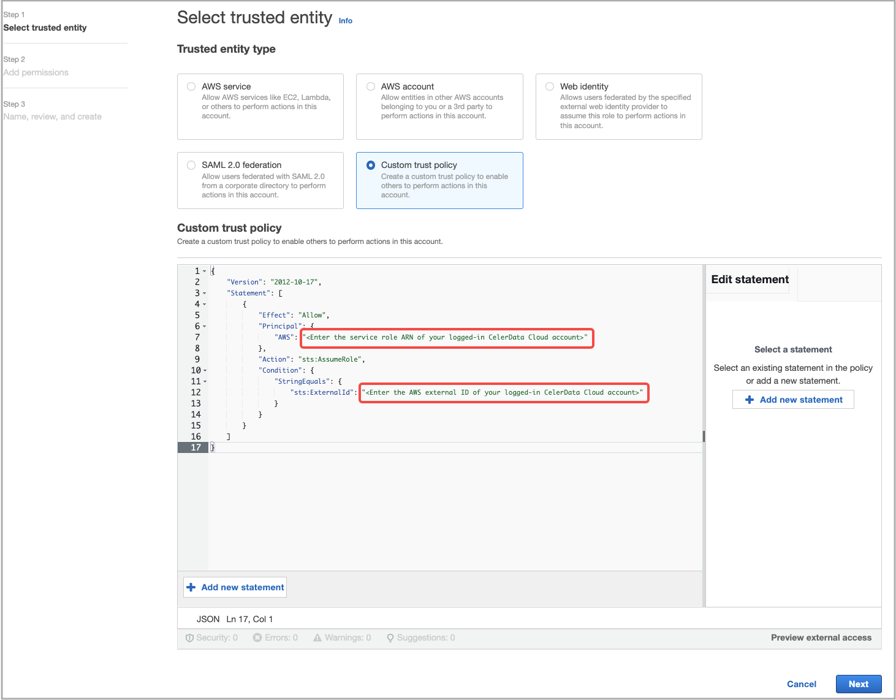

5. In the **Custom trust policy** edit box, configure a trust relationship. Then, click **Next**.

   Follow these steps to configure a trust relationship in the **Custom trust policy** edit box:

   a. Delete the existing JSON policy document, then copy the following JSON policy template and paste it to the edit box:

      ```SQL
      {
          "Version": "2012-10-17",
          "Statement": [
              {
                  "Effect": "Allow",
                  "Principal": {
                      "AWS": "<Enter the service role ARN of your logged-in CelerData Cloud account>"
                  },
                  "Action": "sts:AssumeRole",
                  "Condition": {
                      "StringEquals": {
                          "sts:ExternalId": "<Enter the AWS external ID of your logged-in CelerData Cloud account>"
                      }
                  }
              }
          ]
      }
      ```

   b. Configure the **Principal** and **ExternalId** elements in the JSON policy document as follows:

      - **Principal**: Enter the service role ARN of your logged-in CelerData Cloud account, for example, `arn:aws:iam::081976408565:role/caikfzy-vdk13478`.
      - **ExternalId**: Enter the AWS external ID of your logged-in CelerData Cloud account, for example, `fa6f62b0-d9f4-43ae-ac49-238bcca1a31a`.

      By configuring the trust relationship, you enable your logged-in CelerData Cloud account to assume the IAM role you are creating.

      You can obtain the service role ARN and AWS external ID of your logged-in CelerData Cloud account from the CelerData Cloud homepage, as shown in the following figure.

      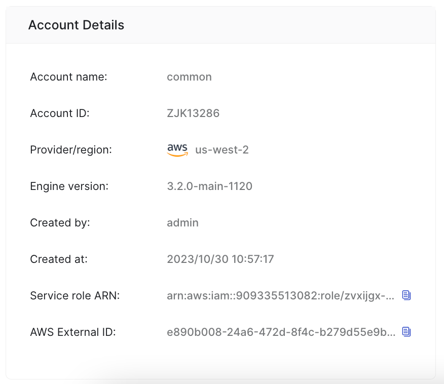

6. In the **Add permissions** step, find the [IAM policy](../aws/aws_iam_policies.md) you want to attach to the IAM role and select the check box preceding it.

   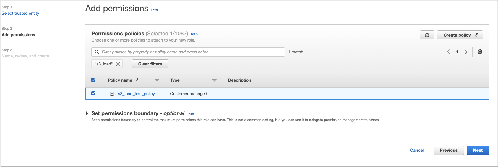

7. In the **Name, review, and create** step, enter a role name, for example, **s3_load_test_role**, optionally enter a role description or add tags, and then click **Create role**.

   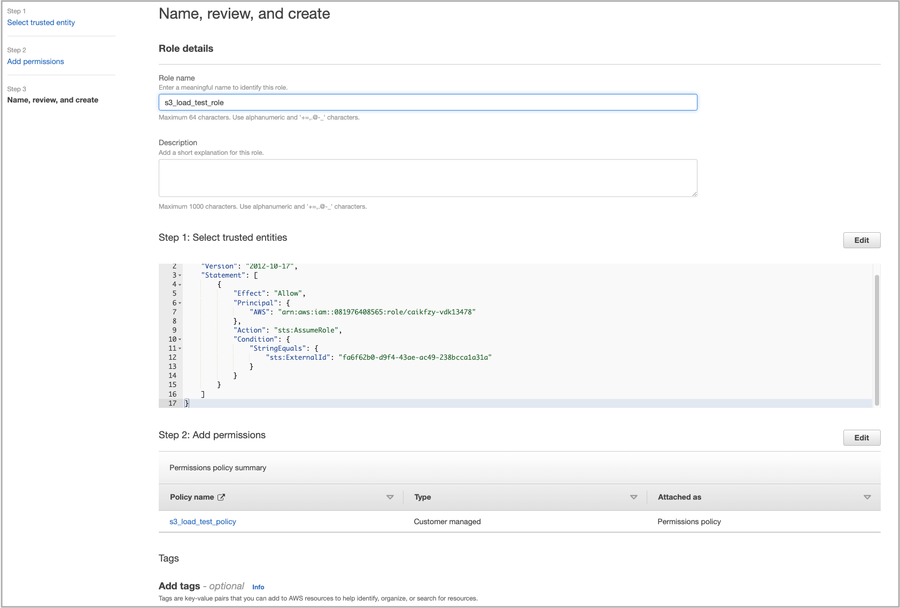

   You are then directed to the **Roles** page, where you can view the IAM role you just created.

8. On the **Roles** page, find the IAM role you just created and click its name.

9. On the role's details page, copy the role's ARN (for example, `arn:aws:iam::081976408565:role/s3_load_test_role`) and save the ARN to a location that you can access later. You will need to provide this ARN when you are registering the IAM role you just created with your CelerData Cloud account.

   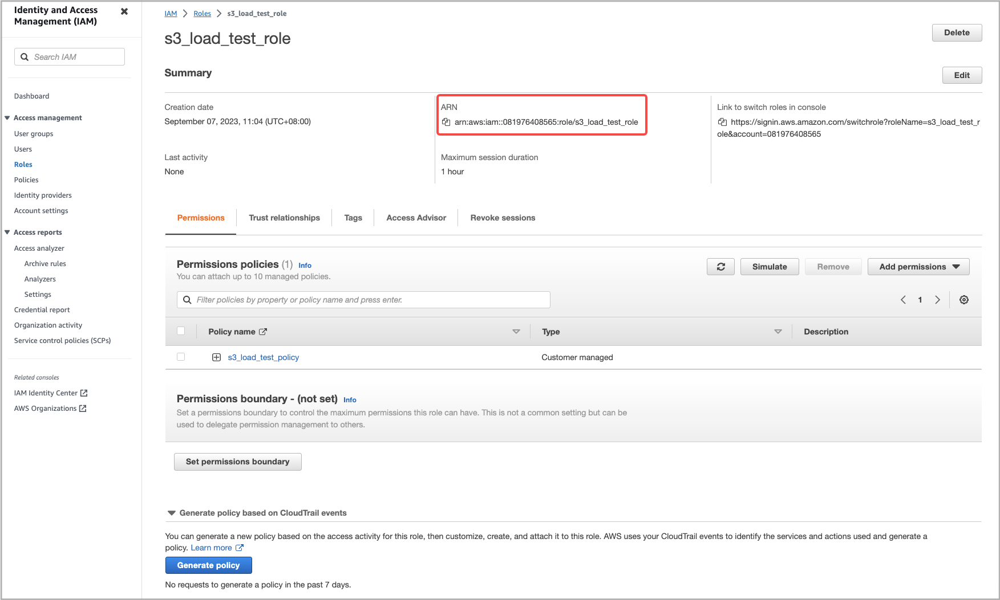

#### Register the IAM role with your CelerData Cloud account

By registering an IAM role in your CelerData Cloud account, you allow your CelerData Cloud account to assume the role, and thus your CelerData Cloud account is granted all resource access permissions included in the IAM policy attached to the role. Only an IAM role registered in your CelerData Cloud account can be used as a valid security credential for accessing the specified AWS resource.

To register your IAM role with your CelerData Cloud account, follow these steps:

1. Sign in to the CelerData Cloud console.

2. In the left-side navigation tree, choose **Integration**.

3. On the **View all** or **Cloud** tab of the page that appears, choose **AWS** **IAM**.

   > **NOTE**
   >
   > On the **View all** tab, you can view all integrations in your CelerData account. You can manage them as an account administrator.

4. On the page that appears, scroll down to the **Step 3 Register the** **IAM** **Role ARN in CelerData Account** section, enter the IAM role's ARN you have saved earlier, and then click **Register**.

   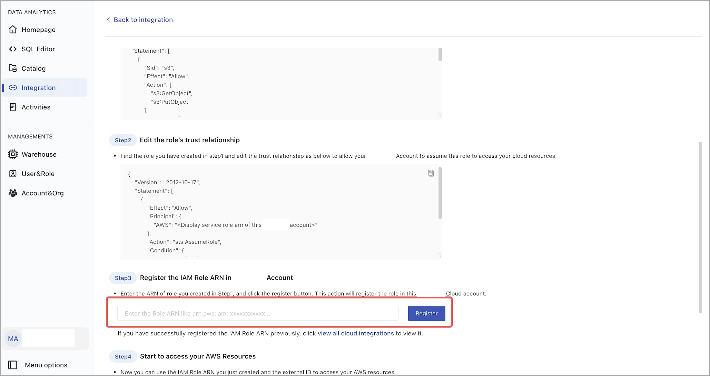

### Preparation for IAM user-based authentication

1. Sign in to the [AWS IAM console](https://us-east-1.console.aws.amazon.com/iamv2/home#/home).

2. In the left-side navigation pane, choose **Access management** > **Users**.

3. On the **Users** page, click **Create user**.

   The **Create user** wizard appears, helping you create an IAM user with three steps.

4. In the **Specify user details** step, enter a user name, for example, **s3_load_test_user**, and click **Next**.

   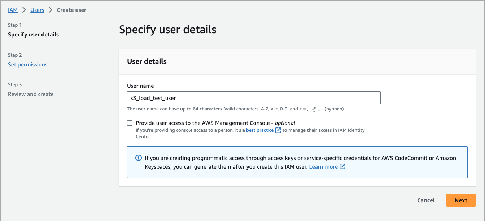

5. In the **Set permissions** step, select **Attach policies directly**. Find the [IAM policy](../aws/aws_iam_policies.md) you want to attach to the IAM role and select the check box preceding it. Then, click **Next**.

   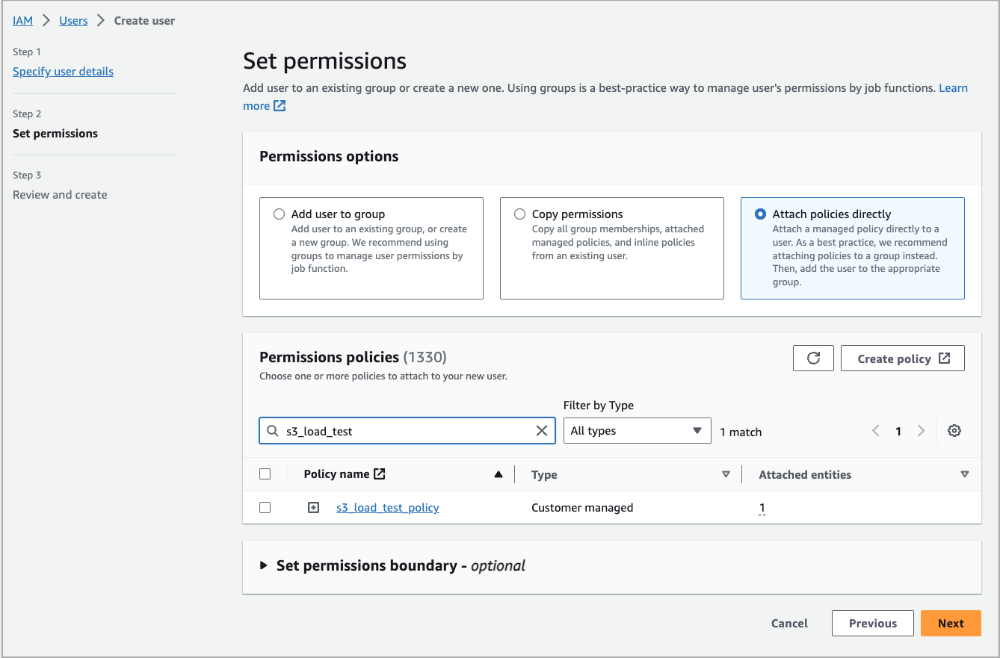

6. In the **Review and create** step, directly click **Create user**.

   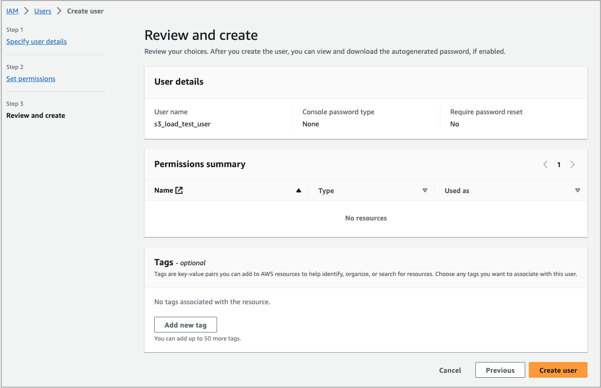

   You are then directed to the **Users** page, where you can view the IAM user you just created.

7. On the **Users** page, find the IAM user you just created and click its name.

8. On the user's details page, click **Create access key** to create an access key pair.

   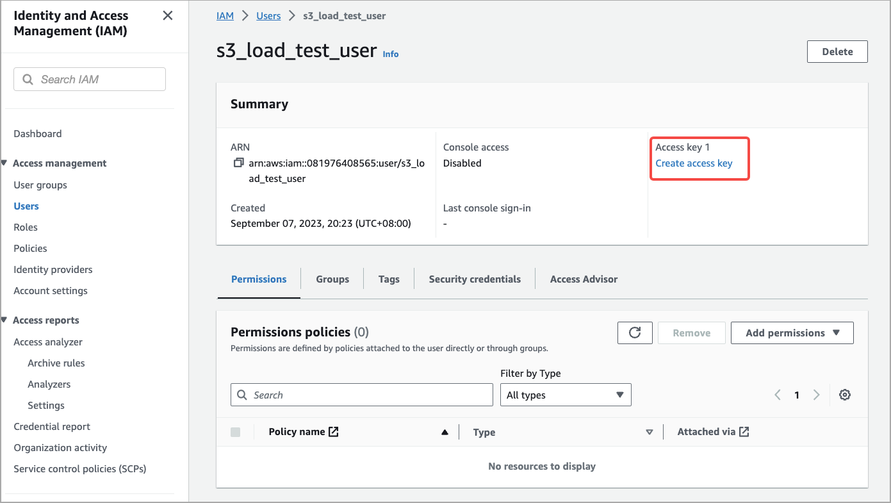

9. After the access key pair is generated, copy the access key and secret key and save them to a location that you can access later. You will need to embed the access key and secret key into SQL commands, thereby enabling access to cloud resources through the SQL commands.

   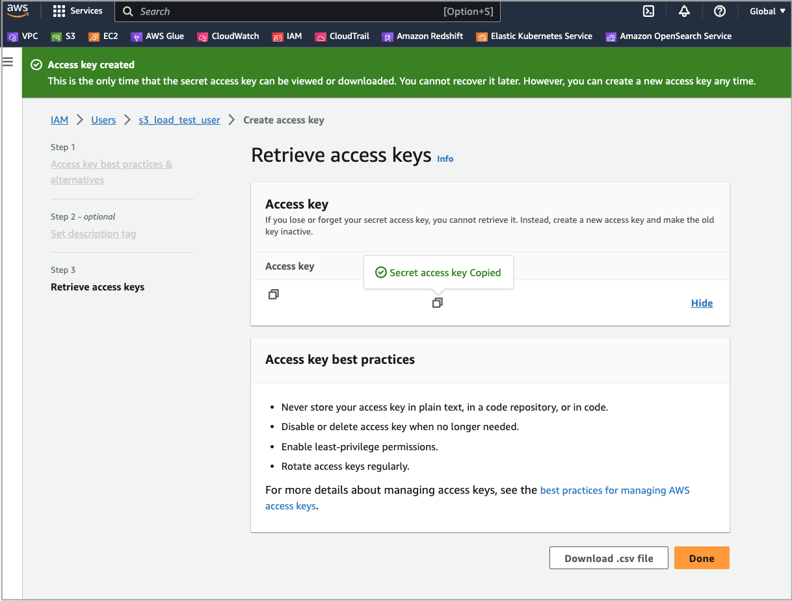

## Configure AWS credentials in SQL commands

### Authentication parameters for accessing AWS S3

#### IAM user-based authentication

Configure the following parameters in your SQL commands:

| **Parameter**               | **Description**                                              |
| --------------------------- | ------------------------------------------------------------ |
| aws.s3.use_instance_profile | Specifies whether to enable assumed role-based authentication. Valid values: `true` and `false`. Default value: `false`. To use IAM user-based authentication, set this parameter to `false`. |
| aws.s3.region               | The region in which your AWS S3 bucket resides. Example: `us-west-1`. |
| aws.s3.access_key           | The access key of the IAM user you just created.             |
| aws.s3.secret_key           | The secret key of the IAM user you just created.             |

#### Assumed role-based authentication

Configure the following parameters in your SQL commands:

| **Parameter**                       | **Description**                                              |
| ----------------------------------- | ------------------------------------------------------------ |
| aws.s3.use_aws_sdk_default_behavior | For authentication based on a cross-account IAM role, set this parameter to `true`. |
| aws.s3.external_id                  | Enter the AWS external ID of your logged-in CelerData Cloud account, for example, `fa6f62b0-d9f4-43ae-ac49-238bcca1a31a`. You can obtain the AWS external ID of your logged-in CelerData Cloud account from the CelerData Cloud homepage. |
| aws.s3.iam_role_arn                 | The ARN of the IAM role you just created.                    |

### Authentication parameters for accessing AWS Glue

#### IAM user-based authentication

Configure the following parameters in your SQL commands:

| **Parameter**                 | **Description**                                              |
| ----------------------------- | ------------------------------------------------------------ |
| aws.glue.use_instance_profile | Specifies whether to enable assumed role-based authentication. Valid values: `true` and `false`. Default value: `false`. To use IAM user-based authentication, set this parameter to `false`. |
| aws.glue.region               | The region in which your AWS Glue Data Catalog resides. Example: `us-west-1`. |
| aws.glue.access_key           | The access key of the IAM user you created.                  |
| aws.glue.secret_key           | The secret key of the IAM user you created.                  |

#### Assumed role-based authentication

Configure the following parameters in your SQL commands:

| **Parameter**                         | **Description**                                              |
| ------------------------------------- | ------------------------------------------------------------ |
| aws.glue.use_aws_sdk_default_behavior | For authentication based on a cross-account IAM role, set this parameter to `true`. |
| aws.glue.external_id                  | Enter the AWS external ID of your logged-in CelerData Cloud account, for example, `fa6f62b0-d9f4-43ae-ac49-238bcca1a31a`. You can obtain the AWS external ID of your logged-in CelerData Cloud account from the CelerData Cloud homepage. |
| aws.glue.iam_role_arn                 | The ARN of the IAM role you just created.                    |

## Integration examples

### Ingestion

CelerData Cloud supports bulk loads from AWS S3. See [Batch load data from AWS Cloud Storage](../loading/loading_from_s3.md).

This example assumes that you use assumed role-based authentication and that your source CSV data files have the same schema as your destination table and use commas (`,`) as their column separators.

Execute the following statement to load all your CSV files stored in the `input` folder of your AWS S3 bucket `bucket_s3` into `table1` which belongs to database `s3_load_test_database`:

```SQL
LOAD LABEL s3_load_test_database.s3_load_job_1001
(
    DATA INFILE("s3://bucket_s3/input/*")
    INTO TABLE table1
    COLUMNS TERMINATED BY ","
    (id, name, score)
)
WITH BROKER
(
    "aws.s3.use_aws_sdk_default_behavior" = "true",
    "aws.s3.region" = "us-west-2",
    "aws.s3.external_id" = "fa6f62b0-d9f4-43ae-ac49-238bcca1a31a",
    "aws.s3.iam_role_arn" = "arn:aws:iam::805976108162:role/s3_load_test_role"
);
```

### External catalog

CelerData Cloud supports the following types of catalogs:

- [Hive catalog](../query_data/hive_catalog.md)
- [Iceberg catalog](../query_data/iceberg_catalog.md)
- [Hudi catalog](../query_data/hudi_catalog.md)
- [Delta Lake catalog](../query_data/deltalake_catalog.md)

This example assumes that you use IAM user-based authentication to create a Hive catalog which uses AWS Glue as metastore to query data from your Hive cluster.

Execute the following statement to create a Hive catalog named `hive_catalog_glue`:

```SQL
CREATE EXTERNAL CATALOG hive_catalog_glue
PROPERTIES
(
    "type" = "hive",
    "hive.metastore.type" = "glue",
    "aws.glue.use_instance_profile" = "false",
    "aws.glue.access_key" = "******",
    "aws.glue.secret_key" = "******",
    "aws.glue.region" = "us-west-2",
    "aws.s3.use_instance_profile" = "false",
    "aws.s3.access_key" = "******",
    "aws.s3.secret_key" = "******",
    "aws.s3.region" = "us-west-2"
);
```
