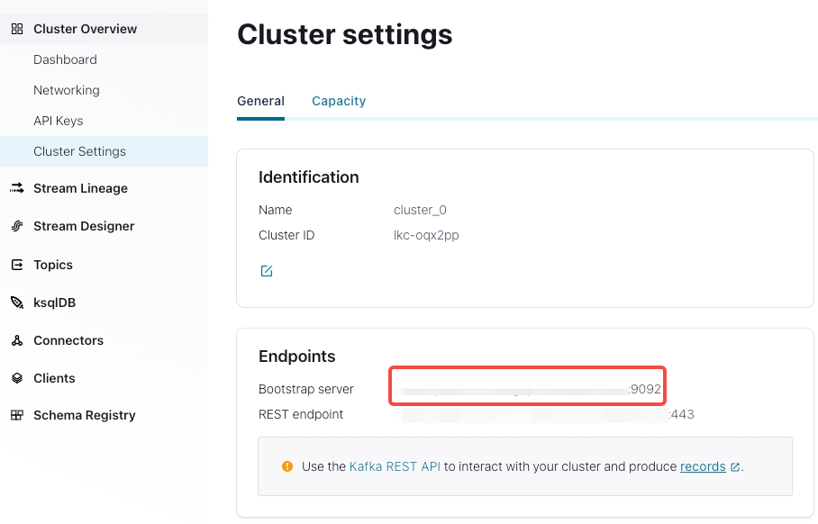
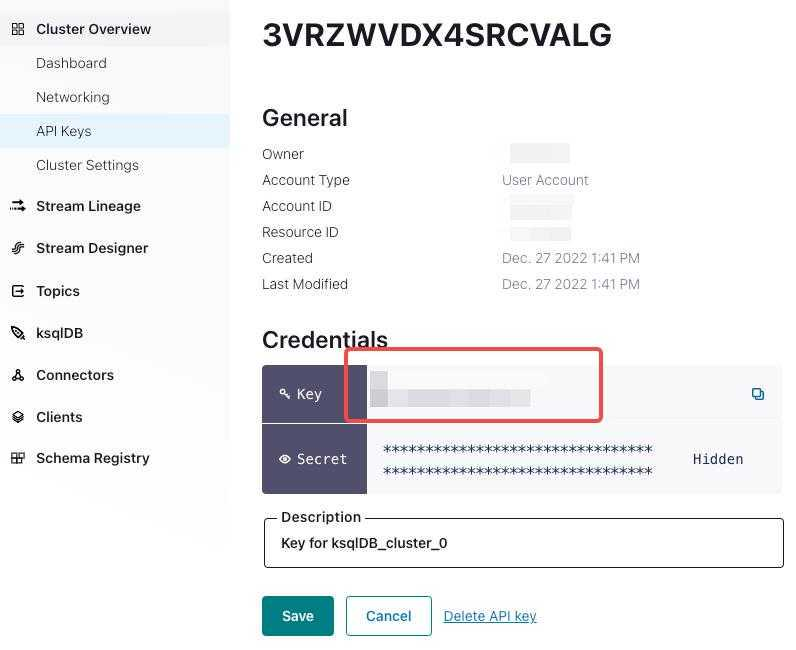

# Load streaming data from Confluent Cloud

This topic introduces how to create a Routine Load job to stream messages (events) from Confluent Cloud into CelerData, and familiarizes you with some basic concepts about Routine Load.

To continuously load messages of a stream into CelerData, you can store the message stream in a topic from an Apache Kafka® cluster in the Confluent Cloud, and create a Routine Load job to consume the messages. The Routine Load job persists in CelerData, generates a series of load tasks to consume the messages in all or some of the partitions in the topic, and loads the messages into CelerData.

A Routine Load job supports exactly-once delivery semantics to ensure the data loaded into CelerData is neither lost nor duplicated.

## Supported data file formats

Routine Load now supports consuming CSV, JSON, and AVRO formatted data in a topic from a Confluent Kafka cluster.

## Typical example

This section describes how to create a Routine Load job to consume JSON-formatted data in a Confluent Kafka cluster, and load the data into CelerData.

### Prepare a dataset

The sample dataset is generated in the topic `users` using the [Confluent Cloud's tutorial](https://docs.confluent.io/cloud/current/get-started/index.html). Each message is a JSON object that represents one row of data to be loaded.

> NOTE
>
> In your Confluent cluster, you can select the **Sample Data** connector plugin in the **Connectors** section. This plugin is used to generate JSON-formatted sample data into the `users` topic.

A sample message data is as follows:

```JSON
{
    "registertime": 1493987388929,
    "userid": "User_3",
    "regionid": "Region_8",
    "gender": "OTHER"
}
```

### Create a table

According to the keys of the JSON-formatted data, create the table `example_tbl2` in the database `example_db`.

```SQL
CREATE TABLE myusers2 (
    userid VARCHAR(50),
    regionid VARCHAR(50),
    gender VARCHAR(50),
    dt DATETIME
)
PARTITION BY date_trunc('day', dt);
```

### Submit a Routine Load job

Execute the following statement to submit a Routine Load job named `example_tbl2_ordertest2` to consume the messages in the topic `ordertest2` and load the data into the table `myusers`. The load task consumes the messages from the initial offset in the specified partitions of the topic.

```SQL
CREATE ROUTINE LOAD mydatabase.tutorials_users_test2 ON myusers2
COLUMNS(userid, regionid, gender, registertime, dt=from_unixtime(registertime/1000))
PROPERTIES (
    'format' ='json',
    'jsonpaths' = '["$.userid","$.regionid","$.gender", "$.registertime"]'
)
FROM KAFKA (
    'kafka_broker_list' = 'pkc-n98pk.us-west-2.aws.confluent.cloud:9092',
    'kafka_topic' = 'users',
    'property.kafka_default_offsets' = 'OFFSET_BEGINNING',
    'property.security.protocol' = 'SASL_SSL',
    'property.sasl.mechanism' = 'PLAIN',
    'property.sasl.username' = 'HALNAFT2X4IKVWYY',
    'property.sasl.password' = 'PF1L6aZ5kEXG5/q8heq5onDmLs6BeekC9X3pFWyuc+AZxw5DYUqBihJjXhKjFJw/'
);
```

**Configurations:**

- **Routine load job name**: specified as `users_test1`. There could be multiple load job on a table. Therefore, we recommend you name a load job with the corresponding Kafka topic and the time when the load job is submitted. It helps you distinguish the load job on each table.

- **CelerData table name**: specified as `example_tbl2`.

- **Kafka** **broker list, topic , encryption & authentication**

  - `kafka_broker_list`:  the bootstrap server of the Confluent cluster.  You can find it in `Cluster Overview > Cluster Settings`.
  

  - `kafka_topic`: the confluent cluster's topic to be consumed.

  - encryption & authentication:

    the security and authentication used by CelerData Cloud to connect the confluent cluster.

    ```SQL
    "property.security.protocol"="SASL_SSL",
    "property.sasl.mechanism"="PLAIN",
    "property.sasl.username"="",
    "property.sasl.password"=""
    ```

    - `property.security.protocol`: the protocol used to communicate with brokers. You can use `SASL_SSL`, because Confluent Cloud uses `SASL_SSL` as the default security protocol.

    - `property.sasl.mechanism`: You can use `PLAIN` which is a simple username/password authentication mechanism.

    - `property.sasl.username`: API key for the Confluent Cloud cluster. You can find it in `Cluster Overview > API Keys`.
    

    - `property.sasl.password`: API secret for the Confluent Cloud cluster. You can find it in the txt file that you download when creating the cluster.

- **Data format and related parameters**

  In the `PROPERTIES` clause,  you can use `"format"="json"` to specify the format of messages as JSON

  > NOTE
  >
  > - If the format of message to be loaded is CSV, Avro, and others, you can specify the format using `"format" = "CSV"` . See  refer to the xxx settings for additional format parameters.
  > - If each Kafka message is a JSON array containing multiple JSON objects, and you want to import each object within the array as a separate row of data, you need to set "strip_outer_array" to true. For specific details, please refer to xxx.

- **Data mapping and transformation**

  - You need to use the `jsonpaths` property and `COLUMNS` parameter to specify the mapping and transformation relationship between the JSON-formatted data and the CelerData table.
  - The property `jsonpaths` is used to extract the required keys from the JSON data.
  - The order of columns specified in the `COLUMNS` parameter must match the order of keys specified in the property `jsonpaths` , and the name of columns must match that of the CelerData table.aaƒ
  - Because the example needs to transform the `registertime` key to the DATE data type, and load the data into the `dt` column in the CelerData table, you need to use the from_unixtime function. The other keys are mapped to columns of the table `myusers` directly.

  For more information, see [CREATE ROUTINE LOAD](../sql-reference/sql-statements/data-manipulation/CREATE_ROUTINE_LOAD.md).

  > NOTE
  >
  > You do not need to specify the COLUMNS parameter if the names and number of the keys in the JSON data completely match those of columns in the CelerData table.

### Check a load job and task

**Check a load job**

Execute the [SHOW ROUTINE LOAD](../sql-reference/sql-statements/data-manipulation/SHOW_ROUTINE_LOAD.md) statement to check the status of the load job `example_tbl2_ordertest2`. CelerData returns the execution state `State`, the statistical information `Statistics` (including the total rows consumed and the total rows loaded) , and the progress `progress` of the load job.

If the state of the load job is automatically changed to **PAUSED**, the number of error rows may exceed the threshold. For detailed instructions on setting this threshold, see [CREATE ROUTINE LOAD](../sql-reference/sql-statements/data-manipulation/CREATE_ROUTINE_LOAD.md). You can check the files `ReasonOfStateChanged` and `ErrorLogUrls` to identify and troubleshoot the problem. After you fix the problem, you can then execute the [RESUME ROUTINE LOAD](../sql-reference/sql-statements/data-manipulation/RESUME_ROUTINE_LOAD.md) statement to resume the **PAUSED** load job.

If the state of the load job is **CANCELLED**, the load job may encounter an exception (for example, the table has been dropped). You can check the files `ReasonOfStateChanged` and `ErrorLogUrls` to identify and troubleshoot the problem. However, you cannot resume a **CANCELLED** load job.

```SQL
MySQL [example_db]> SHOW ROUTINE LOAD FOR example_tbl2_ordertest2 \G
*************************** 1. row ***************************
                  Id: 63013
                Name: example_tbl2_ordertest2
          CreateTime: 2022-08-10 17:09:00
           PauseTime: NULL
             EndTime: NULL
              DbName: default_cluster:example_db
           TableName: example_tbl2
               State: RUNNING
      DataSourceType: KAFKA
      CurrentTaskNum: 3
       JobProperties: {"partitions":"*","partial_update":"false","columnToColumnExpr":"commodity_id,customer_name,country,pay_time,pay_dt=from_unixtime(`pay_time`, '%Y%m%d'),price","maxBatchIntervalS":"20","whereExpr":"*","dataFormat":"json","timezone":"Asia/Shanghai","format":"json","json_root":"","strict_mode":"false","jsonpaths":"[\"$.commodity_id\",\"$.customer_name\",\"$.country\",\"$.pay_time\",\"$.price\"]","desireTaskConcurrentNum":"3","maxErrorNum":"0","strip_outer_array":"false","currentTaskConcurrentNum":"3","maxBatchRows":"200000"}
DataSourceProperties: {"topic":"ordertest2","currentKafkaPartitions":"0,1,2,3,4","brokerList":"<kafka_broker1_ip>:<kafka_broker1_port>,<kafka_broker2_ip>:<kafka_broker2_port>"}
    CustomProperties: {"security.protocol":"SASL_SSL","sasl.username":"******","sasl.mechanism":"PLAIN","kafka_default_offsets":"OFFSET_BEGINNING","sasl.password":"******"}
           Statistic: {"receivedBytes":230,"errorRows":0,"committedTaskNum":1,"loadedRows":2,"loadRowsRate":0,"abortedTaskNum":0,"totalRows":2,"unselectedRows":0,"receivedBytesRate":0,"taskExecuteTimeMs":522}
            Progress: {"0":"1","1":"OFFSET_ZERO","2":"OFFSET_ZERO","3":"OFFSET_ZERO","4":"OFFSET_ZERO"}
ReasonOfStateChanged: 
        ErrorLogUrls: 
            OtherMsg: 
```

> **CAUTION**
>
> You cannot check a load job that has stopped or has not yet started.

**Check a load task**

Execute the [SHOW ROUTINE LOAD TASK](../sql-reference/sql-statements/data-manipulation/SHOW_ROUTINE_LOAD_TASK.md) statement to check the load tasks of the load job `example_tbl2_ordertest2`, such as how many tasks are currently running, the topic partitions that are consumed and the consumption progress `DataSourceProperties`, and the corresponding Coordinator BE node `BeId`.

```SQL
MySQL [example_db]> SHOW ROUTINE LOAD TASK WHERE JobName = "example_tbl2_ordertest2" \G
*************************** 1. row ***************************
              TaskId: 18c3a823-d73e-4a64-b9cb-b9eced026753
               TxnId: -1
           TxnStatus: UNKNOWN
               JobId: 63013
          CreateTime: 2022-08-10 17:09:05
   LastScheduledTime: 2022-08-10 17:47:27
    ExecuteStartTime: NULL
             Timeout: 60
                BeId: -1
DataSourceProperties: {"1":0,"4":0}
             Message: there is no new data in kafka, wait for 20 seconds to schedule again
*************************** 2. row ***************************
              TaskId: f76c97ac-26aa-4b41-8194-a8ba2063eb00
               TxnId: -1
           TxnStatus: UNKNOWN
               JobId: 63013
          CreateTime: 2022-08-10 17:09:05
   LastScheduledTime: 2022-08-10 17:47:26
    ExecuteStartTime: NULL
             Timeout: 60
                BeId: -1
DataSourceProperties: {"2":0}
             Message: there is no new data in kafka, wait for 20 seconds to schedule again
*************************** 3. row ***************************
              TaskId: 1a327a34-99f4-4f8d-8014-3cd38db99ec6
               TxnId: -1
           TxnStatus: UNKNOWN
               JobId: 63013
          CreateTime: 2022-08-10 17:09:26
   LastScheduledTime: 2022-08-10 17:47:27
    ExecuteStartTime: NULL
             Timeout: 60
                BeId: -1
DataSourceProperties: {"0":2,"3":0}
             Message: there is no new data in kafka, wait for 20 seconds to schedule again
```

### Manage a load job

**Pause a load job**

You can execute the [PAUSE ROUTINE LOAD](../sql-reference/sql-statements/data-manipulation/PAUSE_ROUTINE_LOAD.md) statement to pause a load job. However, the load job has not stopped. You can execute the [RESUME ROUTINE LOAD](../sql-reference/sql-statements/data-manipulation/RESUME_ROUTINE_LOAD.md) statement to resume the load job. You can also check the status of the load job by using the [SHOW ROUTINE LOAD](../sql-reference/sql-statements/data-manipulation/SHOW_ROUTINE_LOAD.md) statement.

The following example pauses the load job `example_tbl2_ordertest2`:

```SQL
PAUSE ROUTINE LOAD FOR example_tbl2_ordertest2;
```

**Resume a load job**

You can execute the [RESUME ROUTINE LOAD](../sql-reference/sql-statements/data-manipulation/RESUME_ROUTINE_LOAD.md) statement to resume a paused load job. The load job will stay in the `NEED_SCHEDULE` state for a short period of time during which it is being re-scheduled, and then enter the `RUNNING` state after it is successfully re-scheduled. You can check the state of the load job by using the [SHOW ROUTINE LOAD](../sql-reference/sql-statements/data-manipulation/SHOW_ROUTINE_LOAD.md) statement.

The following example resumes the paused load job `example_tbl2_ordertest2`:

```SQL
RESUME ROUTINE LOAD FOR example_tbl2_ordertest2;
```

**Alter a load job**

Before altering a load job, you must pause it by using the [PAUSE ROUTINE LOAD](../sql-reference/sql-statements/data-manipulation/PAUSE_ROUTINE_LOAD.md) statement. Then you can execute the [ALTER ROUTINE LOAD](../sql-reference/sql-statements/data-manipulation/alter-routine-load.md) statement to alter the load job. After altering the load job, you can execute the [RESUME ROUTINE LOAD](../sql-reference/sql-statements/data-manipulation/RESUME_ROUTINE_LOAD.md) statement to resume it, and check the status of the load job by using the [SHOW ROUTINE LOAD](../sql-reference/sql-statements/data-manipulation/SHOW_ROUTINE_LOAD.md) statement.

**Stop a load job**

You can execute the [STOP ROUTINE LOAD](../sql-reference/sql-statements/data-manipulation/STOP_ROUTINE_LOAD.md) statement to stop a load job. And you cannot resume a stopped load job. You cannot check the state of a stopped load job by using the [SHOW ROUTINE LOAD](../sql-reference/sql-statements/data-manipulation/SHOW_ROUTINE_LOAD.md) statement.

The following example stops the load job `example_tbl2_ordertest2`:

```SQL
STOP ROUTINE LOAD FOR example_tbl2_ordertest2;
```

## FAQ

- **Issue description:** When you run the SHOW ROUTINE LOAD statement on a Routine Load job, the job reports an error `no partition in this topic` in the `ReasonOfStateChanged` field.

  ```Plaintext
  ErrorReason{errCode = 4, msg='Job failed to fetch all current partition with error [failed to send proxy request to TNetworkAddress(hostname:10.0.1.2, port:8060) err failed to send proxy request to TNetworkAddress(hostname:10.0.1.2, port:8060) err [no partition in this topic]]'}
  ```

  **Possible causes**:

  - The `kafka_topic` property is not correct. For example, the topic does not exist. Or the `kafka_partitions` property is not set correctly.

  - The connection related properties are not correct, for example the `kafka_broker_list`, `property.sasl.username`, `property.sasl.password`, which causes the failure to establish a connection.

- **Issue description:**  When you run the SHOW ROUTINE LOAD statement on a Routine Load job, the job reports an error `previous task aborted because of FindCoordinator response error: Group authorization failed.` in the `ReasonOfStateChanged` field.

  **Possible causes:** The permissions provided by the API Key are insufficient. You need to configure the Describe and Read acceses to consumer group and topic for this API Key.

- **Issue description:** When you run the SHOW ROUTINE LOAD statement on a Routine Load job, the job reports an error `failed to get partition meta: Local: Broker transport failure` in the `ReasonOfStateChanged` field.

  ```Plaintext
  ErrorReason{errCode = 4, msg='Job failed to fetch all current partition with error [failed to send proxy request to TNetworkAddress(hostname:10.0.1.2, port:8060) err failed to send proxy request to TNetworkAddress(hostname:10.0.1.2, port:8060) err [failed to get partition meta: Local: Broker transport failure]]'}
  ```

  **Possible causes:** SSL channel cannot be established.

  **Solutions:** You can perform troubleshooting by disabling the SSL certificate verification from the CelerData cluster to the Confluent Kafka cluster.

  - Make sure the Kafka broker list is correct.

  - Shut down the SSL channel temporarily by disabling the SSL certificate verification from CelerData to the Confluent Kafka cluster.

    ```Plaintext
    "property.enable.ssl.certificate.verification"="false"
    ```

    > **Notice**
    >
    > - **Disabling the SSL certificate verification is not safe, you must turn it off in your production environments.**
    > - You should generate a new pair of **temporary API keys** for the Confluent Kafka cluster as the `property.sasl.username` and `property.sasl.password` properties for security purposes, because the information like `property.sasl.username` and `property.sasl.password`  is not secure when the CelerData cluster connects to the Confluent Kafka cluster without using the SSL certificate verification.

  - If the Routine Load job then successfully loads data into CelerData, there may be some problems with the SSL certificate. For example, CelerData cannot find the CA root certificate automatically. In this situation, you can manually specify the CA root certificate for CelerData by adding the property below. For more information about the CA root certificate, see [librdkafka - INTRODUCTION.md # SSL](https://github.com/edenhill/librdkafka/blob/master/INTRODUCTION.md#SSL).

    ```SQL
    "property.ssl.ca.location"="/etc/ssl/certs/ca-bundle.crt"
    ```
