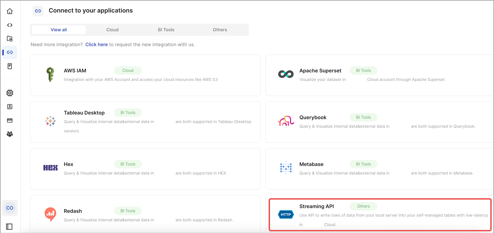
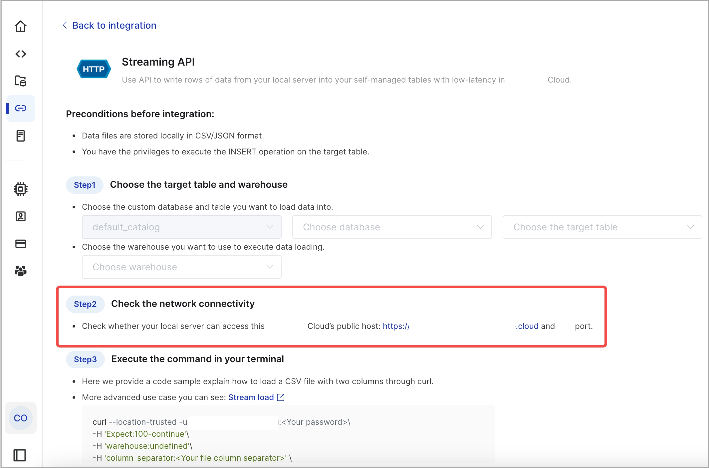
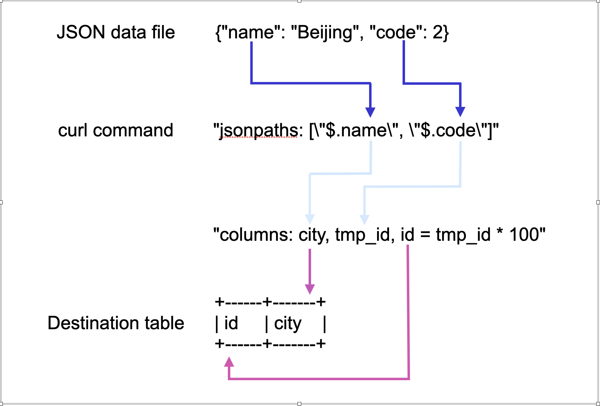

# Load data from a local file system

CelerData Cloud allows you to load data from a local file system by using [Stream Load](../sql-reference/sql-statements/data-manipulation/STREAM_LOAD.md).

Stream Load is an HTTPS-based synchronous loading method. After you submit a load job, CelerData Cloud synchronously runs the job, and returns the result of the job after the job finishes. You can determine whether the job is successful based on the job result.

Stream Load is suitable for loading of data less than 10 GB from a local file system.

## Supported formats

Supported file formats are CSV and JSON.

For CSV data, take note of the following points:

- You can use a UTF-8 string, such as a comma (,), tab, or pipe (|), whose length does not exceed 50 bytes as a text delimiter.
- Null values are denoted by using `\N`. For example, a data file consists of three columns, and a record from that data file holds data in the first and third columns but no data in the second column. In this situation, you need to use `\N` in the second column to denote a null value. This means the record must be compiled as `a,\N,b` instead of `a,,b`, because `a,,b` denotes that the second column of the record holds an empty string.

## Limits

- To use this feature, you must contact CelerData Cloud support team.
- Stream Load does not support loading the data of a CSV file that contains a JSON-formatted column.

## Before you begin

### Make source data ready

Make sure that the source data in your local file system is ready, and obtain the path in which the source data is stored.

In this topic, two sample data files are used as examples:

- A CSV file named `example1.csv`. The file consists of three columns, which represent the user ID, user name, and user score in sequence.

  ```Plain
  1,Lily,23
  2,Rose,23
  3,Alice,24
  4,Julia,25
  ```

- A JSON file named `example2.json`. The file consists of two columns, which represent city ID and city name in sequence.

  ```JSON
  {"name": "Beijing", "code": 2}
  ```

### Check privileges

You can load data into tables within CelerData Cloud only as a user who has the INSERT privilege on the tables. If you do not have the INSERT privilege, follow the instructions provided in [GRANT](../sql-reference/sql-statements/account-management/GRANT.md) to grant the INSERT privilege to the user that you use to connect to CelerData Cloud.

## Select the destination table and warehouse

1. Sign in to the CelerData Cloud console.

2. Choose **SQL Editor** in the left-side navigation bar. On the **Data Explorer** tab, select a catalog and then a database.

   In this topic, assume that you select a database named `mydatabase`. You can create this database by using the CREATE DATABASE statement:

   ```SQL
   CREATE DATABASE mydatabase;
   ```

3. Select a table.

   If you do not have a table in the database you have selected, you can create one by using the CREATE TABLE statement.

   In this topic, create two tables like below:

   - A Primary Key table named `table1`. The table consists of three columns: `id`, `name`, and `score`, of which `id` is the primary key.

     ```SQL
     CREATE TABLE `table1`
     (
         `id` int(11) NOT NULL COMMENT "user ID",
         `name` varchar(65533) NULL COMMENT "user name",
         `score` int(11) NOT NULL COMMENT "user score"
     )
     ENGINE=OLAP
     PRIMARY KEY(`id`)
     DISTRIBUTED BY HASH(`id`);
     ```

   - A Primary Key table named `table2`. The table consists of two columns: `id` and `city`, of which `id` is the primary key.

     ```SQL
     CREATE TABLE `table2`
     (
         `id` int(11) NOT NULL COMMENT "city ID",
         `city` varchar(65533) NULL COMMENT "city name"
     )
     ENGINE=OLAP
     PRIMARY KEY(`id`)
     DISTRIBUTED BY HASH(`id`);
     ```

   > **NOTE**
   >
   > CelerData Cloud can automatically set the number of buckets (`BUCKETS`) when you create a table or add a partition. You do not need to set the number of buckets by hand.

   In CelerData Cloud, some literals are used as reserved keywords by the SQL language. Do not directly use these keywords in SQL statements. If you want to use such a keyword in an SQL statement, enclose it in a pair of backticks (`). See [Keywords](../sql-reference/sql-statements/keywords.md).

4. Determine the warehouse to which you want to load data. The warehouse you select must be running. You will need to provide the warehouse name when you create a Stream Load job.

   For the examples in this topic, select `default_warehouse` as the destination warehouse.

## Check network connectivity

Choose **Integration** in the left-side navigation bar of the CelerData Cloud console. Then, find and click **Streaming API**.



On the **Streaming API** page, navigate to **Step 2**, where you can see the address and port of the public host for your CelerData Cloud.



Make sure that your local server can access the host address and port. You will need to provide the host address (`host_address`) and port (`host_port`) in the HTTPS line of the load command when you create a Stream Load job.

## Start a Stream Load

This section uses curl to explain how to run a Stream Load job in your local terminal to load CSV or JSON data.

The basic syntax is as follows:

```Shell
curl --location-trusted -u <account_id>.<username>:<password> \
    -H "Expect:100-continue" \
    -H "warehouse:<warehouse_name>" \
    # The parameter column_separator is used only for CSV data loading.
    -H "column_separator:<column_separator>" \
    # The parameter jsonpaths is used only for JSON data loading.
    -H "jsonpaths: [ \"<json_path1>\"[, \"<json_path2>\", ...] ]" \
    -H "columns:<column1_name>[, <column2_name>, ... ]" \
    -H "format: CSV | JSON" \
    -T <file_path> -XPUT \
    https://<host_address>:<host_port>/api/<database_name>/<table_name>/_stream_load
```

The load command mainly includes the following parts:

- HTTPS request header `Expect`: Specify its value as `100-continue`, as in `"Expect:100-continue"`.
- `<account_id>.<username>:<password>`: Specify the ID, username, and password of the account that you use to connect to CelerData Cloud.
- `warehouse`: Specify the destination warehouse. If you do not specify this parameter, the default warehouse named `default_warehouse` is used for the data loading. Make sure the destination warehouse is running. If the destination warehouse is not running, the data loading will fail.
- `column_separator`: Specify the characters that are used in the CSV data file to separate fields. The default value is `\t`, which indicates tab. If the CSV data file uses tabs to separate the fields in it, you do not need to specify this parameter.
- `jsonpaths`: Specify the names of the keys that you want to load from the JSON data file. You need to specify this parameter only when you load JSON data by using the matched mode. The value of this parameter is in JSON format. See [Configure column mapping for JSON data loading](../sql-reference/sql-statements/data-manipulation/STREAM_LOAD.md#configure-column-mapping-for-json-data-loading).
- `columns`: Specify the column mapping between the data file and the destination table.
- `format`: Specify the format of the data file.
- `file_path`: Specify the save path of the data file. You can optionally include the extension of the file name, and then you do not need to specify the `format` parameter.
- HTTPS line: This includes the method, which is `-XPUT`, and the URL that contains the path to the destination table in CelerData Cloud.

  The parameters in the URL are as follows:

  | Parameter          | Required | Description                                                  |
  | ------------------ | -------- | ------------------------------------------------------------ |
  | host_address       | Yes      | The address of the public host for your CelerData Cloud. For information about how to obtain the host address, see [Check network connectivity](#check-network-connectivity). |
  | host_port          | Yes      | The port of the public host for your CelerData Cloud. For information about how to obtain the host port, see [Check network connectivity](#check-network-connectivity). |
  | database_name      | Yes      | The name of the database to which the destination table belongs. |
  | table_name         | Yes      | The name of the destination table.                             |

For detailed syntax and parameter descriptions, see [STREAM LOAD](../sql-reference/sql-statements/data-manipulation/STREAM_LOAD.md).

### Load CSV data

To load the data of the CSV data file `example1.csv` into `table1`, run the following command:

```Shell
curl --location-trusted -u <account_id>.<username>:<password> \
    -H "Expect:100-continue" \
    -H "warehouse:default_warehouse" \
    -H "column_separator:," \
    -H "columns: id, name, score" \
    -T example1.csv -XPUT \
    https://<host_address>:<host_port>/api/mydatabase/table1/_stream_load
```

`example1.csv` consists of three columns, which are separated by commas (,) and can be mapped in sequence onto the `id`, `name`, and `score` columns of `table1`. Therefore, you need to use the `column_separator` parameter to specify the comma (,) as the column separator. You also need to use the `columns` parameter to temporarily name the three columns of `example1.csv` as `id`, `name`, and `score`, which are mapped in sequence onto the three columns of `table1`.

For more information about column mapping, see [Configure column mapping for CSV data loading](../sql-reference/sql-statements/data-manipulation/STREAM_LOAD.md#configure-column-mapping-for-csv-data-loading).

### Load JSON data

To load the data of the JSON data file `example2.json` into `table2`, run the following command:

```Shell
curl -v --location-trusted -u <account_id>.<username>:<password> \
    -H "strict_mode: true" \
    -H "Expect:100-continue" \
    -H "warehouse:default_warehouse" \
    -H "format: json" \
    -H "jsonpaths: [\"$.name\", \"$.code\"]" \
    -H "columns: city,tmp_id, id = tmp_id * 100" \
    -T example2.json -XPUT \
    https://<host_address>:<host_port>/api/mydatabase/table2/_stream_load
```

`example2.json` consists of two keys, `name` and `code`, which are mapped onto the `id` and `city` columns of `table2`, as shown in the following figure.



The mappings shown in the preceding figure are described as follows:

- CelerData Cloud extracts the `name` and `code` keys of `example2.json` and maps them onto the `name` and `code` fields declared in the `jsonpaths` parameter.
- CelerData Cloud extracts the `name` and `code` fields declared in the `jsonpaths` parameter and **maps them in sequence** onto the `city` and `tmp_id` fields declared in the `columns` parameter.
- CelerData Cloud extracts the `city` and `tmp_id` fields declared in the `columns` parameter and **maps them by name** onto the `city` and `id` columns of `table2`.

> NOTE
>
> In the preceding example, the value of `code` in `example2.json` is multiplied by 100 before it is loaded into the `id` column of `table2`.

For more information about column mapping, see [Configure column mapping for JSON data loading](../sql-reference/sql-statements/data-manipulation/STREAM_LOAD.md#configure-column-mapping-for-json-data-loading).

## Check Stream Load progress

After a Stream Load job is complete, CelerData Cloud returns the result of the job in JSON format. For more information, see the "Return value" section in [STREAM LOAD](../sql-reference/sql-statements/data-manipulation/STREAM_LOAD.md).

Stream Load does not allow you to query the result of a load job by using the SHOW LOAD statement.

## Cancel a Stream Load job

Stream Load does not allow you to cancel a load job. If a load job times out or encounters errors, CelerData Cloud automatically cancels the job.
