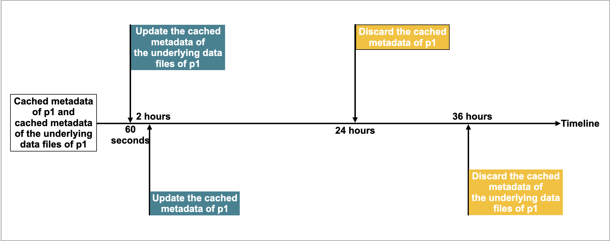

# Hive catalog

A Hive catalog is an external catalog that enables you to query data from Apache Hive™ without ingestion. You can access tables and their nested views with your Hive catalogs. To ensure successful SQL workloads on your Hive cluster, CelerData must be able to access the storage system and metastore of your Hive cluster. CelerData supports the following storage systems and metastores:

- Object storage like AWS S3

- Metastore like Hive metastore or AWS Glue

## Usage notes

- The file formats of Hive that CelerData supports are Parquet, ORC, and CSV:

  - Parquet files support the following compression formats: SNAPPY, LZO, LZ4, ZSTD, GZIP, and NO_COMPRESSION.
  - ORC files support the following compression formats: ZLIB, SNAPPY, LZO, LZ4, ZSTD, and NO_COMPRESSION.
  - CSV files support the LZO compression format.

- The data types of Hive that CelerData does not support are INTERVAL, BINARY. Additionally, CelerData does not support the MAP and STRUCT data types for CSV-formatted Hive tables.
- You can only use Hive catalogs to **query data**. You cannot use Hive catalogs to drop, delete, or insert data into your Hive cluster.

## Create a Hive catalog

### Syntax

```SQL
CREATE EXTERNAL CATALOG <catalog_name>
[COMMENT <comment>]
PROPERTIES
(
    "type" = "hive",
    GeneralParams,
    MetastoreParams,
    StorageCredentialParams,
    MetadataUpdateParams
)
```

### Parameters

#### catalog_name

The name of the Hive catalog. The naming conventions are as follows:

- The name can contain letters, digits (0-9), and underscores (_). It must start with a letter.
- The name is case-sensitive and cannot exceed 1023 characters in length.

#### comment

The description of the Hive catalog. This parameter is optional.

#### type

The type of your data source. Set the value to `hive`.

#### GeneralParams

A set of general parameters.

The following table describes the parameters you can configure in `GeneralParams`.

| Parameter                | Required | Description                                                  |
| ------------------------ | -------- | ------------------------------------------------------------ |
| enable_recursive_listing | No       | Specifies whether CelerData reads data from a table and its partitions and from the subdirectories within the physical locations of the table and its partitions. Valid values: `true` and `false`. Default value: `false`. The value `true` specifies to recursively list subdirectories, and the value `false` specifies to ignore subdirectories. |

#### MetastoreParams

A set of parameters about how CelerData integrates with the metastore of your data source.

##### Hive metastore

If you choose **Hive metastore** as the metastore of your data source, check that CelerData can access the host of your Hive metastore.

> **NOTE**
>
> In normal cases, you can take one of the following actions to enable integration between CelerData and your Hive metastore:
>
> - Deploy CelerData and your Hive metastore on the same VPC.
> - Configure a VPC peering connection between the VPC hosting CelerData and the VPC hosting your Hive metastore.

Then, check the configurations of the security group of your Hive metastore to ensure that its inbound rules allow inbound traffic from CelerData's security group and that its port range covers the default port 9083.

```SQL
"hive.metastore.type" = "hive",
"hive.metastore.uris" = "<hive_metastore_uri>"
```

The following table describes the parameter you need to configure in `MetastoreParams`.

| **Parameter**       | **Required** | **Description**                                              |
| ------------------- | ------------ | ------------------------------------------------------------ |
| hive.metastore.type | Yes          | The type of metastore that you use for your Hive cluster. Set the value to `hive`. |
| hive.metastore.uris | Yes          | The URI of your Hive metastore. Format: `thrift://<metastore_IP_address>:<metastore_port>`.<br />If high availability (HA) is enabled for your Hive metastore, you can specify multiple metastore URIs and separate them with commas (,), for example, `"thrift://<metastore_IP_address_1>:<metastore_port_1>","thrift://<metastore_IP_address_2>:<metastore_port_2>","thrift://<metastore_IP_address_3>:<metastore_port_3>"`. |

##### AWS Glue

If you choose AWS Glue as the metastore of your data source, which is supported only when you choose AWS S3 as storage, take one of the following actions:

- To choose the instance profile-based authentication method, configure `MetastoreParams` as follows:

  ```SQL
  "hive.metastore.type" = "glue",
  "aws.glue.use_instance_profile" = "true",
  "aws.glue.region" = "<aws_glue_region>"
  ```

- To choose the assumed role-based authentication method, configure `MetastoreParams` as follows:

  ```SQL
  "hive.metastore.type" = "glue",
  "aws.glue.use_instance_profile" = "true",
  "aws.glue.iam_role_arn" = "<iam_role_arn>",
  "aws.glue.region" = "<aws_glue_region>"
  ```

- To choose the IAM user-based authentication method, configure `MetastoreParams` as follows:

  ```SQL
  "hive.metastore.type" = "glue",
  "aws.glue.use_instance_profile" = "false",
  "aws.glue.access_key" = "<iam_user_access_key>",
  "aws.glue.secret_key" = "<iam_user_secret_key>",
  "aws.glue.region" = "<aws_s3_region>"
  ```

The following table describes the parameters you need to configure in `MetastoreParams`.

| Parameter                     | Required | Description                                                  |
| ----------------------------- | -------- | ------------------------------------------------------------ |
| hive.metastore.type           | Yes      | The type of metastore that you use for your Hive cluster. Set the value to `glue`. |
| aws.glue.use_instance_profile | Yes      | Specifies whether to enable the instance profile-based authentication method and the assumed role-based authentication. Valid values: `true` and `false`. Default value: `false`. |
| aws.glue.iam_role_arn         | No       | The ARN of the IAM role that has privileges on your AWS Glue Data Catalog. If you use the assumed role-based authentication method to access AWS Glue, you must specify this parameter. |
| aws.glue.region               | Yes      | The region in which your AWS Glue Data Catalog resides. Example: `us-west-1`. |
| aws.glue.access_key           | No       | The access key of your AWS IAM user. If you use the IAM user-based authentication method to access AWS Glue, you must specify this parameter. |
| aws.glue.secret_key           | No       | The secret key of your AWS IAM user. If you use the IAM user-based authentication method to access AWS Glue, you must specify this parameter. |

For information about how to choose an method for accessing AWS Glue and how to configure an access control policy in the AWS IAM Console, see [Authentication parameters for accessing AWS Glue](../integration/authenticate_to_aws#authentication-parameters-for-accessing-aws-glue).

#### StorageCredentialParams

A set of parameters about how CelerData integrates with your object storage.

##### AWS S3

If you choose AWS S3 as storage for your Hive cluster, take one of the following actions:

- To choose the instance profile-based authentication method, configure `StorageCredentialParams` as follows:

  ```SQL
  "aws.s3.use_instance_profile" = "true",
  "aws.s3.region" = "<aws_s3_region>"
  ```

- To choose the assumed role-based authentication method, configure `StorageCredentialParams` as follows:

  ```SQL
  "aws.s3.use_instance_profile" = "true",
  "aws.s3.iam_role_arn" = "<iam_role_arn>",
  "aws.s3.region" = "<aws_s3_region>"
  ```

- To choose the IAM user-based authentication method, configure `StorageCredentialParams` as follows:

  ```SQL
  "aws.s3.use_instance_profile" = "false",
  "aws.s3.access_key" = "<iam_user_access_key>",
  "aws.s3.secret_key" = "<iam_user_secret_key>",
  "aws.s3.region" = "<aws_s3_region>"
  ```

The following table describes the parameters you need to configure in `StorageCredentialParams`.

| Parameter                   | Required | Description                                                  |
| --------------------------- | -------- | ------------------------------------------------------------ |
| aws.s3.use_instance_profile | Yes      | Specifies whether to enable the instance profile-based authentication method and the assumed role-based authentication method. Valid values: `true` and `false`. Default value: `false`. |
| aws.s3.iam_role_arn         | No       | The ARN of the IAM role that has privileges on your AWS S3 bucket. If you use the assumed role-based authentication method to access AWS S3, you must specify this parameter.  |
| aws.s3.region               | Yes      | The region in which your AWS S3 bucket resides. Example: `us-west-1`. |
| aws.s3.access_key           | No       | The access key of your IAM user. If you use the IAM user-based authentication method to access AWS S3, you must specify this parameter. |
| aws.s3.secret_key           | No       | The secret key of your IAM user. If you use the IAM user-based authentication method to access AWS S3, you must specify this parameter. |

For information about how to choose an authentication method for accessing AWS S3 and how to configure an access control policy in AWS IAM Console, see [Authentication parameters for accessing AWS S3](../integration/authenticate_to_aws#authentication-parameters-for-accessing-aws-s3).

#### MetadataUpdateParams

A set of parameters about how CelerData updates the cached metadata of Hive. This parameter set is optional.

CelerData implements the automatic asynchronous update policy by default.

In most cases, you can ignore `MetadataUpdateParams` and do not need to tune the policy parameters in it, because the default values of these parameters already provide you with an out-of-the-box performance.

However, if the frequency of data updates in Hive is high, you can tune these parameters to further optimize the performance of automatic asynchronous updates.

> **NOTE**
>
> In most cases, if your Hive data is updated at a granularity of 1 hour or less, the data update frequency is considered high.

| Parameter                              | Required | Description                                                  |
|----------------------------------------| -------- | ------------------------------------------------------------ |
| enable_metastore_cache                 | No       | Specifies whether CelerData caches the metadata of Hive tables. Valid values: `true` and `false`. Default value: `true`. The value `true` enables the cache, and the value `false` disables the cache. |
| enable_remote_file_cache               | No       | Specifies whether CelerData caches the metadata of the underlying data files of Hive tables or partitions. Valid values: `true` and `false`. Default value: `true`. The value `true` enables the cache, and the value `false` disables the cache. |
| metastore_cache_refresh_interval_sec   | No       | The time interval at which CelerData asynchronously updates the metadata of Hive tables or partitions cached in itself. Unit: seconds. Default value: `7200`, which is 2 hours. |
| remote_file_cache_refresh_interval_sec | No       | The time interval at which CelerData asynchronously updates the metadata of the underlying data files of Hive tables or partitions cached in itself. Unit: seconds. Default value: `60`. |
| metastore_cache_ttl_sec                | No       | The time interval at which CelerData automatically discards the metadata of Hive tables or partitions cached in itself. Unit: seconds. Default value: `86400`, which is 24 hours. |
| remote_file_cache_ttl_sec              | No       | The time interval at which CelerData automatically discards the metadata of the underlying data files of Hive tables or partitions cached in itself. Unit: seconds. Default value: `129600`, which is 36 hours. |

For more information, see the "[Understand automatic asynchronous update](#appendix-understand-automatic-asynchronous-update)" section of this topic.

## View Hive catalogs

You can use [SHOW CATALOGS](../sql-reference/sql-statements/data-manipulation/SHOW_CATALOGS.md) to query all catalogs in your CelerData cloud account:

```SQL
SHOW CATALOGS;
```

You can also use [SHOW CREATE CATALOG](../sql-reference/sql-statements/data-manipulation/SHOW_CREATE_CATALOG.md) to query the creation statement of an external catalog. The following example queries the creation statement of a Hive catalog named `hive_catalog_glue`:

```SQL
SHOW CREATE CATALOG hive_catalog_glue;
```

## Switch to a Hive Catalog and a database in it

You can use one of the following methods to switch to a Hive catalog and a database in it:

- Use [SET CATALOG](../sql-reference/sql-statements/data-definition/SET_CATALOG.md) to specify a Hive catalog in the current session, and then use [USE](../sql-reference/sql-statements/data-definition/USE.md) to specify an active database:

  ```SQL
  -- Switch to a specified catalog in the current session:
  SET CATALOG <catalog_name>
  -- Specify the active database in the current session:
  USE <db_name>
  ```

- Directly use [USE](../sql-reference/sql-statements/data-definition/USE.md) to switch to a Hive catalog and a database in it:

  ```SQL
  USE <catalog_name>.<db_name>
  ```

## Drop a Hive catalog

You can use [DROP CATALOG](../sql-reference/sql-statements/data-definition/DROP_CATALOG.md) to drop an external catalog.

The following example drops a Hive catalog named `hive_catalog_glue`:

```SQL
DROP Catalog hive_catalog_glue;
```

## View the schema of a Hive table

You can use one of the following syntaxes to view the schema of a Hive table:

- View schema

  ```SQL
  DESC[RIBE] <catalog_name>.<database_name>.<table_name>
  ```

- View schema and location from the CREATE statement

  ```SQL
  SHOW CREATE TABLE <catalog_name>.<database_name>.<table_name>
  ```

## Query a Hive table

1. Use [SHOW DATABASES](../sql-reference/sql-statements/data-manipulation/SHOW_DATABASES.md) to view the databases in your Hive cluster.

   ```SQL
   SHOW DATABASES <catalog_name>;
   ```

2. Use [SET CATALOG](../sql-reference/sql-statements/data-definition/SET_CATALOG.md) to switch to the destination catalog in the current session:

   ```SQL
   SET CATALOG <catalog_name>;
   ```

   Then, use [USE](../sql-reference/sql-statements/data-definition/USE.md) to specify the active database in the current session:

   ```SQL
   USE <db_name>;
   ```

   Or, you can use [USE](../sql-reference/sql-statements/data-definition/USE.md) to directly specify the active database in the destination catalog:

   ```SQL
   USE <catalog_name>.<db_name>;
    ```

3. Use [SELECT](../sql-reference/sql-statements/data-manipulation/SELECT.md) to query the destination table in the specified database:

   ```SQL
   SELECT count(*) FROM <table_name> LIMIT 10
   ```

## Grant privileges on Hive tales and views

You can use the [GRANT](../sql-reference/sql-statements/account-management/GRANT.md) statement to grant the privileges on all tables or views within a Hive catalog to a specific role.

- Grant a role the privilege to query all tables within a Hive catalog:

  ```SQL
  GRANT SELECT ON ALL TABLES IN ALL DATABASES TO ROLE <role_name>
  ```

- Grant a role the privilege to query all views within a Hive catalog:

  ```SQL
  GRANT SELECT ON ALL VIEWS IN ALL DATABASES TO ROLE <role_name>
  ```

For example, use the following commands to create a role named `hive_role_table`, switch to the Hive catalog `hive_catalog`, and then grant the role `hive_role_table` the privilege to query all tables and views within the Hive catalog `hive_catalog`:

```SQL
-- Create a role named hive_role_table.
CREATE ROLE hive_role_table;

-- Switch to the Hive catalog hive_catalog.
SET CATALOG hive_catalog;

-- Grant the role hive_role_table the privilege to query all tables within the Hive catalog hive_catalog.
GRANT SELECT ON ALL TABLES IN ALL DATABASES TO ROLE hive_role_table;

-- Grant the role hive_role_table the privilege to query all views within the Hive catalog hive_catalog.
GRANT SELECT ON ALL VIEWS IN ALL DATABASES TO ROLE hive_role_table;
```

## Create a Hive database

Similar to the internal catalog of CelerData, if you have the CREATE DATABASE privilege on a Hive catalog, you can use the [CREATE DATABASE](../sql-reference/sql-statements/data-definition/CREATE_DATABASE.md) statement to create a database in that Hive catalog. This feature is supported from v3.2 onwards.

> **NOTE**
>
> You can grant and revoke privileges by using [GRANT](../sql-reference/sql-statements/account-management/GRANT.md) and [REVOKE](../sql-reference/sql-statements/account-management/REVOKE.md).

[Switch to a Hive catalog](#switch-to-a-hive-catalog-and-a-database-in-it), and then use the following statement to create a Hive database in that catalog:

```SQL
CREATE DATABASE <database_name>
[PROPERTIES ("location" = "<prefix>://<path_to_database>/<database_name.db>")]
```

The `location` parameter specifies the file path in which you want to create the database.

- When you use Hive metastore as the metastore of your Hive cluster, the `location` parameter defaults to `<warehouse_location>/<database_name.db>`, which is supported by Hive metastore if you do not specify that parameter at database creation.
- When you use AWS Glue as the metastore of your Hive cluster, the `location` parameter does not have a default value, and therefore you must specify that parameter at database creation.

The `prefix` varies based on the storage system you use:

| **Storage system**                                         | **`Prefix`** **value**                                       |
| ---------------------------------------------------------- | ------------------------------------------------------------ |
| AWS S3                                                     | `s3`                                                         |

## Drop a Hive database

Similar to the internal databases of CelerData, if you have the DROP privilege on a Hive database, you can use the [DROP DATABASE](../sql-reference/sql-statements/data-definition/DROP_DATABASE.md) statement to drop that Hive database. This feature is supported from v3.2 onwards. You can only drop empty databases.

> **NOTE**
>
> You can grant and revoke privileges by using [GRANT](../sql-reference/sql-statements/account-management/GRANT.md) and [REVOKE](../sql-reference/sql-statements/account-management/REVOKE.md).

When you drop a Hive database, the database's file path on your cloud storage will not be dropped along with the database.

[Switch to a Hive catalog](#switch-to-a-hive-catalog-and-a-database-in-it), and then use the following statement to drop a Hive database in that catalog:

```SQL
DROP DATABASE <database_name>
```

## Create a Hive table

Similar to the internal databases of CelerData, if you have the CREATE TABLE privilege on a Hive database, you can use the [CREATE TABLE](../sql-reference/sql-statements/data-definition/CREATE_TABLE.md) or [CREATE TABLE AS SELECT (CTAS)](../sql-reference/sql-statements/data-definition/CREATE_TABLE_AS_SELECT.md) statement to create a managed table in that Hive database. This feature is supported from v3.2 onwards.

> **NOTE**
>
> You can grant and revoke privileges by using [GRANT](../sql-reference/sql-statements/account-management/GRANT.md) and [REVOKE](../sql-reference/sql-statements/account-management/REVOKE.md).

[Switch to a Hive catalog and a database in it](#switch-to-a-hive-catalog-and-a-database-in-it), and then use the following syntax to create a Hive managed table in that database.

### Syntax

```SQL
CREATE TABLE [IF NOT EXISTS] [database.]table_name
(column_definition1[, column_definition2, ...
partition_column_definition1,partition_column_definition2...])
[partition_desc]
[PROPERTIES ("key" = "value", ...)]
[AS SELECT query]
```

### Parameters

#### column_definition

The syntax of `column_definition` is as follows:

```SQL
col_name col_type [COMMENT 'comment']
```

The following table describes the parameters.

| Parameter | Description                                                  |
| --------- | ------------------------------------------------------------ |
| col_name  | The name of the column.                                      |
| col_type  | The data type of the column. The following data types are supported: TINYINT, SMALLINT, INT, BIGINT, FLOAT, DOUBLE, DECIMAL, DATE, DATETIME, CHAR, VARCHAR[(length)], ARRAY, MAP, and STRUCT. The LARGEINT, HLL, and BITMAP data types are not supported. |

> **NOTICE**
>
> All non-partition columns must use `NULL` as the default value. This means that you must specify `DEFAULT "NULL"` for each of the non-partition columns in the table creation statement. Additionally, partition columns must be defined following non-partition columns and cannot use `NULL` as the default value.

#### partition_desc

The syntax of `partition_desc` is as follows:

```SQL
PARTITION BY (par_col1[, par_col2...])
```

Currently CelerData only supports identity transforms, which means that CelerData creates a partition for each unique partition value.

> **NOTICE**
>
> Partition columns must be defined following non-partition columns. Partition columns support all data types excluding FLOAT, DOUBLE, DECIMAL, and DATETIME and cannot use `NULL` as the default value. Additionally, the sequence of the partition columns declared in `partition_desc` must be consistent with the sequence of the columns defined in `column_definition`.

#### PROPERTIES

You can specify the table attributes in the `"key" = "value"` format in `properties`.

The following table describes a few key properties.

| **Property**      | **Description**                                              |
| ----------------- | ------------------------------------------------------------ |
| location          | The file path in which you want to create the managed table. When you use HMS as metastore, you do not need to specify the `location` parameter, because CelerData will create the table in the default file path of the current Hive catalog. When you use AWS Glue as metadata service:<ul><li>If you have specified the `location` parameter for the database in which you want to create the table, you do not need to specify the `location` parameter for the table. As such, the table defaults to the file path of the database to which it belongs. </li><li>If you have not specified the `location` for the database in which you want to create the table, you must specify the `location` parameter for the table.</li></ul> |
| file_format       | The file format of the managed table. Only the Parquet format is supported. Default value: `parquet`. |
| compression_codec | The compression algorithm used for the managed table. The supported compression algorithms are SNAPPY, GZIP, ZSTD, and LZ4. Default value: `gzip`. |

### Examples

1. Create a non-partitioned table named `unpartition_tbl`. The table consists of two columns, `id` and `score`, as shown below:

   ```SQL
   CREATE TABLE unpartition_tbl
   (
       id int,
       score double
   );
   ```

2. Create a partitioned table named `partition_tbl_1`. The table consists of three columns, `action`, `id`, and `dt`, of which `id` and `dt` are defined as partition columns, as shown below:

   ```SQL
   CREATE TABLE partition_tbl_1
   (
       action varchar(20),
       id int,
       dt date
   )
   PARTITION BY (id,dt);
   ```

3. Query an existing table named `partition_tbl_1`, and create a partitioned table named `partition_tbl_2` based on the query result of `partition_tbl_1`. For `partition_tbl_2`, `id` and `dt` are defined as partition columns, as shown below:

   ```SQL
   CREATE TABLE partition_tbl_2
   PARTITION BY (k1, k2)
   AS SELECT * from partition_tbl_1;
   ```

## Sink data to a Hive table

Similar to the internal tables of CelerData, if you have the INSERT privilege on a Hive table (which can be a managed table or an external table), you can use the [INSERT](../sql-reference/sql-statements/data-manipulation/INSERT.md) statement to sink the data of a CelerData table to that Hive table (currently only Parquet-formatted Hive tables are supported). This feature is supported from v3.2 onwards. Sinking data to external tables is disabled by default. To sink data to external tables, you must set the [system variable `ENABLE_WRITE_HIVE_EXTERNAL_TABLE`](../reference/System_variable.md) to `true`.

> **NOTE**
>
> You can grant and revoke privileges by using [GRANT](../sql-reference/sql-statements/account-management/GRANT.md) and [REVOKE](../sql-reference/sql-statements/account-management/REVOKE.md).

[Switch to a Hive catalog and a database in it](#switch-to-a-hive-catalog-and-a-database-in-it), and then use the following syntax to sink the data of CelerData table to a Parquet-formatted Hive table in that database.

### Syntax

```SQL
INSERT {INTO | OVERWRITE} <table_name>
[ (column_name [, ...]) ]
{ VALUES ( { expression | DEFAULT } [, ...] ) [, ...] | query }

-- If you want to sink data to specified partitions, use the following syntax:
INSERT {INTO | OVERWRITE} <table_name>
PARTITION (par_col1=<value> [, par_col2=<value>...])
{ VALUES ( { expression | DEFAULT } [, ...] ) [, ...] | query }
```

> **NOTICE**
>
> Partition columns do not allow `NULL` values. Therefore, you must make sure that no empty values are loaded into the partition columns of the Hive table.

### Parameters

| Parameter   | Description                                                  |
| ----------- | ------------------------------------------------------------ |
| INTO        | To append the data of the CelerData table to the Hive table. |
| OVERWRITE   | To overwrite the existing data of the Hive table with the data of the CelerData table. |
| column_name | The name of the destination column to which you want to load data. You can specify one or more columns. If you specify multiple columns, separate them with commas (`,`). You can only specify columns that actually exist in the Hive table, and the destination columns that you specify must include the partition columns of the Hive table. The destination columns you specify are mapped one on one in sequence to the columns of the CelerData table, regardless of what the destination column names are. If no destination columns are specified, the data is loaded into all columns of the Hive table. If a non-partition column of the CelerData table cannot be mapped to any column of the Hive table, CelerData writes the default value `NULL` to the Hive table column. If the INSERT statement contains a query statement whose returned column types differ from the data types of the destination columns, CelerData performs an implicit conversion on the mismatched columns. If the conversion fails, a syntax parsing error will be returned. |
| expression  | Expression that assigns values to the destination column.    |
| DEFAULT     | Assigns a default value to the destination column.           |
| query       | Query statement whose result will be loaded into the Hive table. It can be any SQL statement supported by CelerData. |
| PARTITION   | The partitions into which you want to load data. You must specify all partition columns of the Hive table in this property. The partition columns that you specify in this property can be in a different sequence than the partition columns that you have defined in the table creation statement. If you specify this property, you cannot specify the `column_name` property. |

### Examples

1. Insert three data rows into the `partition_tbl_1` table:

   ```SQL
   INSERT INTO partition_tbl_1
   VALUES
       ("buy", 1, "2023-09-01"),
       ("sell", 2, "2023-09-02"),
       ("buy", 3, "2023-09-03");
   ```

2. Insert the result of a SELECT query, which contains simple computations, into the `partition_tbl_1` table:

   ```SQL
   INSERT INTO partition_tbl_1 (id, action, dt) SELECT 1+1, 'buy', '2023-09-03';
   ```

3. Insert the result of a SELECT query, which reads data from the `partition_tbl_1` table, into the same table:

   ```SQL
   INSERT INTO partition_tbl_1 SELECT 'buy', 1, date_add(dt, INTERVAL 2 DAY)
   FROM partition_tbl_1
   WHERE id=1;
   ```

4. Insert the result of a SELECT query into the partitions that meet two conditions, `dt='2023-09-01'` and `id=1`, of the `partition_tbl_2` table:

   ```SQL
   INSERT INTO partition_tbl_2 SELECT 'order', 1, '2023-09-01';
   ```

   Or

   ```SQL
   INSERT INTO partition_tbl_2 partition(dt='2023-09-01',id=1) SELECT 'order';
   ```

5. Overwrite all `action` column values in the partitions that meet two conditions, `dt='2023-09-01'` and `id=1`, of the `partition_tbl_1` table with `close`:

   ```SQL
   INSERT OVERWRITE partition_tbl_1 SELECT 'close', 1, '2023-09-01';
   ```

   Or

   ```SQL
   INSERT OVERWRITE partition_tbl_1 partition(dt='2023-09-01',id=1) SELECT 'close';
   ```

## Drop a Hive table

Similar to the internal tables of CelerData, if you have the DROP privilege on a Hive table, you can use the [DROP TABLE](../sql-reference/sql-statements/data-definition/DROP_TABLE.md) statement to drop that Hive table. This feature is supported from v3.1 onwards. Note that currently CelerData supports dropping only managed tables of Hive.

> **NOTE**
>
> You can grant and revoke privileges by using [GRANT](../sql-reference/sql-statements/account-management/GRANT.md) and [REVOKE](../sql-reference/sql-statements/account-management/REVOKE.md).

When you drop a Hive table, you must specify the `FORCE` keyword in the DROP TABLE statement. After the operation is complete, the table's file path is retained, but the table's data on your cloud storage is all dropped along with the table. Exercise caution when you perform this operation to drop a Hive table.

[Switch to a Hive catalog and a database in it](#switch-to-a-hive-catalog-and-a-database-in-it), and then use the following statement to drop a Hive table in that database.

```SQL
DROP TABLE <table_name> FORCE
```

## Examples

Suppose your Hive cluster uses Hive metastore as metastore and AWS S3 as object storage and you use the instance profile-based authentication method to access your AWS S3 bucket located in the `us-west-2` region. In this situation, you can run the following command to create a catalog named `hive_catalog_hms` to access your Hive data:

```SQL
CREATE EXTERNAL CATALOG hive_catalog_hms
PROPERTIES
(
 "type" = "hive",
 "hive.metastore.uris" = "thrift://xx.xx.xx.xx:9083",
 "aws.s3.use_instance_profile" = "true",
 "aws.s3.region" = "us-west-2"
);
```

Suppose your Hive cluster uses AWS Glue as metastore and AWS S3 as object storage and you use the assumed role-based authentication method to access your AWS S3 bucket located in the `us-west-1` region. In this situation, you can run the following command to create a catalog named `hive_catalog_glue` to access your Hive data:

```SQL
CREATE EXTERNAL CATALOG hive_catalog_glue
PROPERTIES
(
 "type" = "hive",
 "hive.metastore.type" = "glue",
 "aws.glue.use_instance_profile" = "true",
 "aws.glue.iam_role_arn" = "arn:aws:iam::51234343412:role/role_name_in_aws_iam",
 "aws.glue.region" = "us-west-1",
 "aws.s3.use_instance_profile" = "true",
 "aws.s3.iam_role_arn" = "arn:aws:iam::51234343412:role/role_name_in_aws_iam",
 "aws.s3.region" = "us-west-1"
);
```

## Synchronize metadata updates

By default, CelerData caches the metadata of Hive and automatically updates the metadata in asynchronous mode to deliver better performance. Additionally, after some schema changes or table updates are made on a Hive table, you can also use [REFRESH EXTERNAL TABLE](../sql-reference/sql-statements/data-definition/REFRESH_EXTERNAL_TABLE.md) to update its metadata, thereby ensuring that CelerData can obtain up-to-date metadata at its earliest opportunity and generate appropriate execution plans:

```SQL
REFRESH EXTERNAL TABLE <table_name>
```

## Appendix: Understand automatic asynchronous update

Automatic asynchronous update is the default policy that CelerData uses to update the metadata in Hive catalogs.

By default (namely, when the `enable_metastore_cache` and `enable_remote_file_cache` parameters are both set to `true`), if a query hits a partition of a Hive table, CelerData automatically caches the metadata of the partition and the metadata of the underlying data files of the partition. The cached metadata is updated by using the lazy update policy.

For example, there is a Hive table named `table2`, which has four partitions: `p1`, `p2`, `p3`, and `p4`. A query hits `p1`, and CelerData caches the metadata of `p1` and the metadata of the underlying data files of `p1`. Assume that the default time intervals to update and discard the cached metadata are as follows:

- The time interval (specified by the `metastore_cache_refresh_interval_sec` parameter) to asynchronously update the cached metadata of `p1` is 2 hours.
- The time interval (specified by the `remote_file_cache_refresh_interval_sec` parameter) to asynchronously update the cached metadata of the underlying data files of `p1` is 60 seconds.
- The time interval (specified by the `metastore_cache_ttl_sec` parameter) to automatically discard the cached metadata of `p1` is 24 hours.
- The time interval (specified by the `remote_file_cache_ttl_sec` parameter) to automatically discard the cached metadata of the underlying data files of `p1` is 36 hours.

The following figure shows the time intervals on a timeline for easier understanding.



Then CelerData updates or discards the metadata in compliance with the following rules:

- If another query hits `p1` again and the current time from the last update is less than 60 seconds, CelerData does not update the cached metadata of `p1` or the cached metadata of the underlying data files of `p1`.
- If another query hits `p1` again and the current time from the last update is more than 60 seconds, CelerData updates the cached metadata of the underlying data files of `p1`.
- If another query hits `p1` again and the current time from the last update is more than 2 hours, CelerData updates the cached metadata of `p1`.
- If `p1` has not been accessed within 24 hours from the last update, CelerData discards the cached metadata of `p1`. The metadata will be cached at the next query.
- If `p1` has not been accessed within 36 hours from the last update, CelerData discards the cached metadata of the underlying data files of `p1`. The metadata will be cached at the next query.
