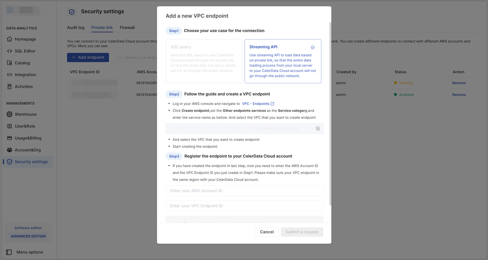
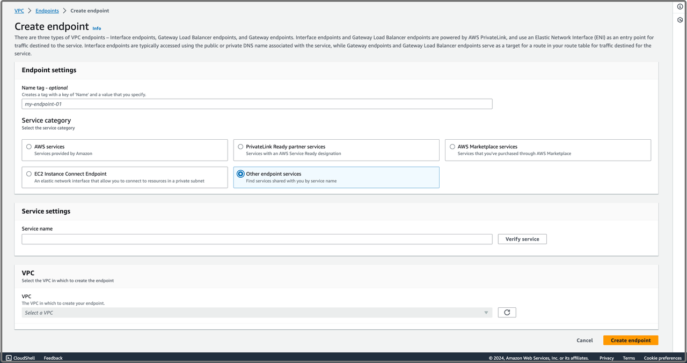
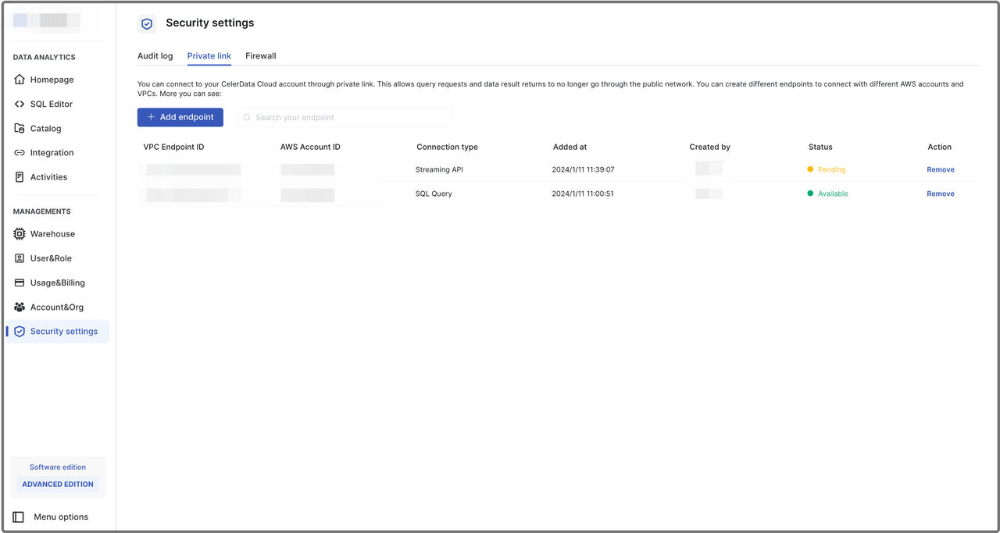
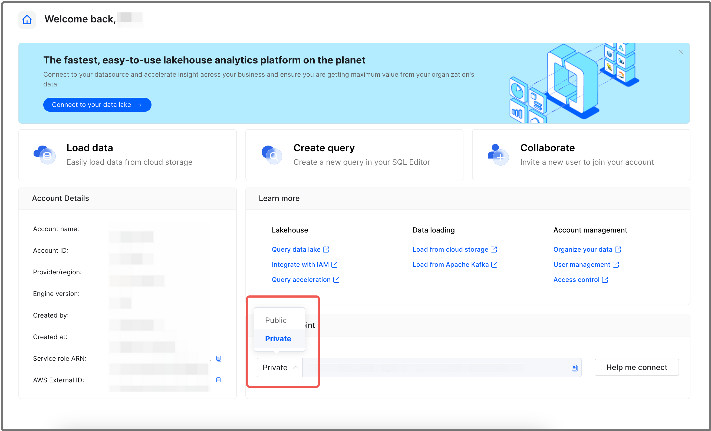
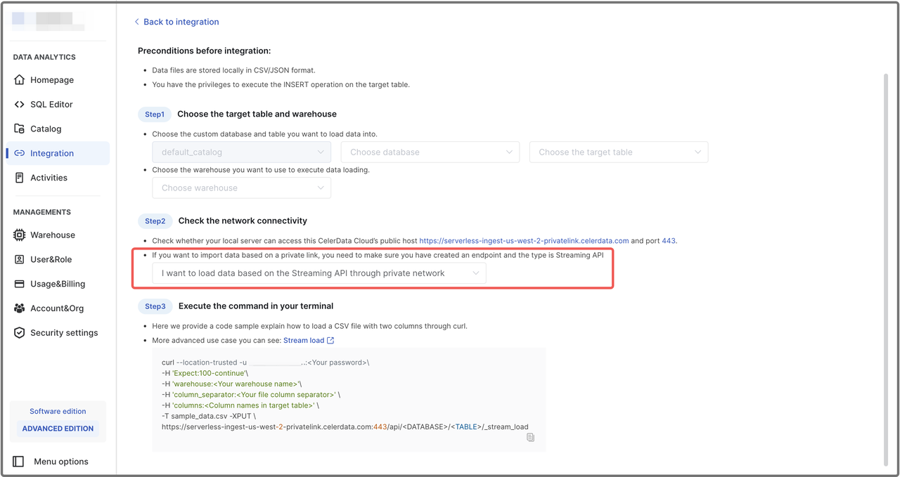

# Connect to CelerData Cloud with a Private Link

By default, network traffic is transmitted between CelerData Cloud and clients over public networks. Such scenarios include:

- Clients submit query requests to and receive results from CelerData Cloud.
- Clients load data from local file systems to CelerData Cloud using Streaming API.

In addition to the public network solution, CelerData Cloud also supports connections via private links from your AWS VPC. You can create an endpoint for your VPC and add it to your CelerData Cloud account to create a private link. Please note that this solution only applies to the scenario where your clients reside in the same cloud service region that hosts your CelerData Cloud service.

> **NOTE**
>
> - Only users with the `security_admin` role can create and manage private links.
> - The private links of a CelerData Cloud account are accessible to all users within the account.
> - Each CelerData Cloud account can add FIVE VPC endpoints at most.

## Create a private link

Follow these steps to create a private link:

1. Sign in to the CelerData Cloud console.

2. In the left-side navigation pane, choose **Security settings**.

3. On the **Private link** tab of the **Security Settings** page, click **Add endpoint**.

   

4. In the **add a new VPC endpoint** dialog box, follow the wizard to submit the request to add a VPC endpoint.

   ###  Step 1: Choose your use case for the connection

   In this step, choose the use case for your private link connection.

   - If you want to use the private link to transmit query requests and results, choose **SQL query**.

   - If you want to use the private link to load data to CelerData Cloud using Streaming API, choose **Streaming API**.

   ###  Step 2: Follow the guide and create a VPC endpoint

   Follow these procedures to create a VPC endpoint in your AWS VPC:

   1. Click the copy icon next to the service name field to copy the service name of your CelerData Cloud, and save the service name for later use.

   2. Click the **VPC - Endpoints** link on the wizard, and you will be redirected to the [AWS VPC console](https://console.aws.amazon.com/vpc/) in the AWS region where your CelerData Cloud account is located. Please make sure you have access to the console. Sign in to the console as a user with administrator privileges.

      > **WARNING**
      >
      > Do not change the AWS region. Make sure that the VPC endpoint you want to create is located in the same region as your CelerData account.

   3. In the left-side navigation pane, choose **Endpoints** to display the **Endpoints** page.

   4. Click **Create endpoint** to display the **Create endpoint** page.

   5. In the **Endpoint settings** section, optionally enter a name tag for the endpoint you want to create, and select **Other endpoint services** as the **Service category**.

   6. In the **Service settings** section, paste the service name you previously copied from the CelerData Cloud console to the **Service name** field, and click **Verify service** to verify the service name.

      

   7. In the **VPC** section, select the VPC for which you want to create the endpoint from the **Select a VPC** drop-down list. You can use the default settings for the rest of the fields.

   8. Click **Create endpoint** to create the endpoint.

   9. On the **Endpoints** page, search for and click the VPC endpoint you have created.

   10. On the page that displays, click the copy icon in the **Endpoint ID** field to copy the ID of VPC endpoint you have created, and save it for later use.

   ###  Step 3: Register the endpoint to your CelerData Cloud account

   In this step, you need to register the VPC endpoint you have created for CelerData Cloud by following these procedures:

   1. Enter the ID of your AWS account in which you created the VPC endpoint in the **Enter your AWS Account ID** field.

   2. Paste the ID of the VPC endpoint you have copied from the AWS VPC console to the **Enter your VPC Endpoint ID** field.

5. Click **Submit a request**.

   The CelerData Cloud Support team will review your request as soon as possible.

   Once the status of the endpoint becomes **Available**, you can use it for a private link.

   

## Connect via a private link

You can use private links for CelerData Cloud connection to query data or load local data files with Streaming API.

### Query data via a private link

Follow these procedures to query data via a private link:

1. Sign in to the CelerData Cloud console.
2. In the **Endpoint** section of the **Homepage**, select **Private** from the drop-down list, and click the copy button to copy the private endpoint. You can then use the private endpoint for connection.

> **NOTE**
>
> Before submitting query requests, make sure the client you use is within the VPC for which you have created the endpoint for the private link, and the use case type is **SQL query**.

### Load data with Streaming API via a private link

To load local data files with Streaming API via a private link, follow the instructions provided in [Load data from a local file system](../loading/loading_from_local). When checking the network connectivity, select **I want to load data based on the Streaming API through private network**.

> **NOTE**
>
> Before submitting loading tasks, make sure the client you use is within the VPC for which you have created the endpoint for the private link, and the use case type is **Streaming API**.

## Manage private links

You can delete an existing private link by following these procedures:

1. Sign in to the CelerData Cloud console.

2. In the left-side navigation pane, choose **Security settings**.

3. On the **Private link** tab of the **Security Settings** page, find the VPC endpoint you want to delete, and click **Remove** in the **Action** field.

4. In the dialog box that appears, click **Delete**.

   After deleting the VPC endpoint record from your CelerData Cloud account, you can safely delete the corresponding VPC endpoint from your [AWS VPC console](https://console.aws.amazon.com/vpc/).

   > **WARNING**
   >
   > Do not delete the VPC endpoint you created for CelerData Cloud from your AWS VPC console before you delete the corresponding record from your CelerData Cloud account. Otherwise, the private link will be inaccessible.

