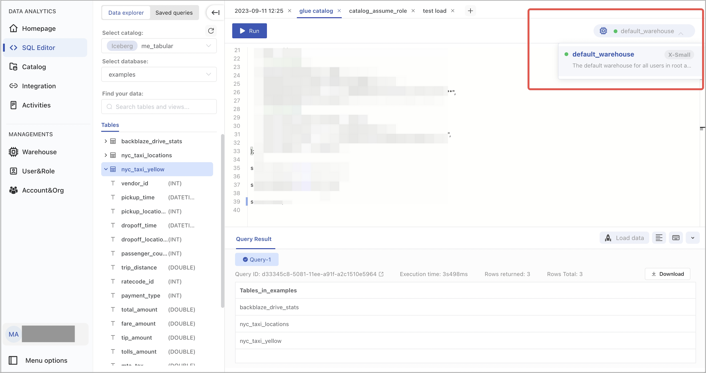

# Manage warehouses

## Concept

A warehouse in CelerData Cloud is a physical cluster of multiple compute nodes that provide you with the required compute resources, such as CPU, memory, and temporary storage, to perform query, ingestion, and data processing tasks on data stored in remote storage. You can resize a warehouse based on your workloads, and use different warehouses to isolate your workloads from different data analysis scenarios.


For each organization, the root account (namely, the initial account created when you first sign up for CelerData Cloud) is provided with a built-in warehouse named `default_warehouse`, which is automatically created by CelerData Cloud and cannot be deleted. If no warehouse is explicitly specified, all DML workloads will be routed to the `default_warehouse`. The `default_warehouse` has no access control and can be used by all users within the root account.

However, no `default_warehouse` is provided for the other accounts created later within the organization. Users who log in by using these accounts must create and work with their own warehouses.

## Access control

Users with the `cluster_admin` role can create new warehouses and delete, suspend, or resume existing warehouses through the GUI, and can use all warehouses available within their logged-in account.

By default, users without the `cluster_admin` role can only use the built-in warehouse `default_warehouse` provided in the root account and have no access to other warehouses. If they want to use any other warehouse, they must be granted the USAGE privilege on that warehouse through the following SQL command:

```SQL
GRANT USAGE ON WAREHOUSE <WAREHOUSE_NAME> to <USER_NAME>;
```

Only users with the `user_admin` role can grant or revoke privileges in the CelerData Cloud account. See [Manage privileges](../security/data_access_control/manage_users.md#manage-privileges).

## Use warehouses

### Set warehouse

The way you specify a warehouse varies depending on the method you use to interact with CelerData Cloud.

- In SQL Editor, select a warehouse that is in the running state as shown below:

  

- In SQL command, specify a warehouse as shown below:

  ```SQL
  SET WAREHOUSE = <WAREHOUSE_NAME>
  ```

- When logging in to your CelerData Cloud account through JDBC, specify a warehouse by writing the connection string as shown below:

  ```SQL
  jdbc.url=jdbc:mysql://xxxx.xx.xx.xx/dbName?sessionVariables=warehouse=<WAREHOUSE_NAME>
  ```

### View current warehouse

You can run the following SQL command to view the current warehouse:

```SQL
show variables like "%warehouse%";
```

## Manage warehouses

### Create a warehouse

Each new CelerData Cloud account has a built-in warehouse named **default_warehouse**. But the other accounts created later have no warehouses. That means users must create their own warehouse from scratch.

To create a warehouse, follow these steps:

1. Sign in to the CelerData Cloud console.
2. In the left-side navigation pane, choose **Warehouse**.
3. On the page that appears, click **Add warehouse**.
4. In the dialog box that appears, configure the following parameters and click **Create**:

   - **Warehouse name**: Enter a name for the warehouse. Each warehouse name must be unique within your CelerData Cloud account.
   - **Description**: Optionally enter a description for the warehouse. The description helps you manage multiple warehouses easily.
   - **Warehouse size**: Select a size for the warehouse. Each warehouse size represents a specific amount of compute resources. We recommend that you choose the **X-Small** or **Small** size for testing purposes and choose the **Medium** size or above for production purposes.

   

Creating a warehouse takes approximately 2 minutes.

After a warehouse is successfully created, CelerData Cloud will start to charge you for the runtime of this warehouse at a rate of 4 credits per hour. For example, if a medium-sized warehouse keeps running for 2.5 hours, CelerData Cloud will charge you 4 x 2.5 credits.

### Resize a warehouse

If the size of your warehouse causes a performance bottleneck for your workloads, you can scale up your warehouse as needed. Note that scaling a warehouse takes approximately 2 minutes. During the scaling process, queries submitted to your warehouse will still be run on the original warehouse size until the scaling process is completed.

To resize a warehouse, follow these steps:

1. Sign in to the CelerData Cloud console.
2. In the left-side navigation pane, choose **Warehouse**.
3. On the page that appears, find the warehouse you want to resize, then click the more icon and select **Edit warehouse**.

   

4. In the dialog box that appears, select a new size for the warehouse and click **Edit**.

   

### Suspend and resume a warehouse

Because the continuous runtime of a warehouse will bring you continuous costs. Therefore, if you only run your workloads occasionally, you can suspend your warehouse to save unnecessary costs and resume it manually on demand.

After you suspend a warehouse, CelerData Cloud stops charging you for this warehouse until this warehouse is resumed again.

To suspend or resume a warehouse, follow these steps:

1. Sign in to the CelerData Cloud console.
2. In the left-side navigation pane, choose **Warehouse**.
3. On the page that appears, find the warehouse you want to suspend or resume, then click the more icon and select **Suspend** or **Resume**.
4. In the message that appears, click **Confirm**.


### Delete a warehouse

If you no longer need a warehouse, you can delete it. This will release all compute resources provisioned to the warehouse, stop billing, and forcibly terminate any SQL queries running on the warehouse.

To delete a warehouse, follow these steps:

1. Sign in to the CelerData Cloud console.
2. In the left-side navigation pane, choose **Warehouse**.
3. On the page that appears, find the warehouse you want to delete, then click the more icon and select **Delete**.
4. In the message that appears, click **Confirm**.
